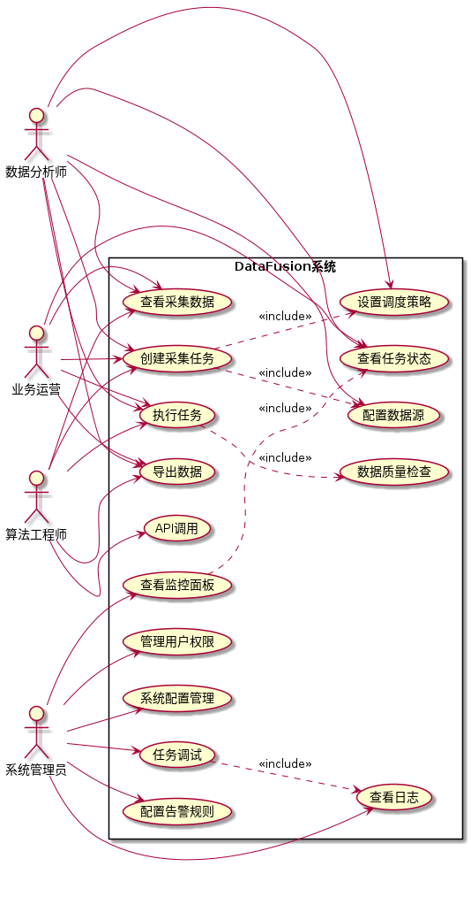
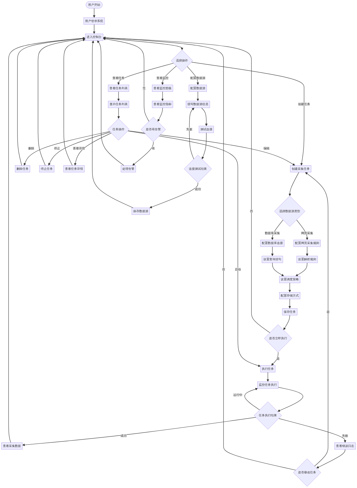
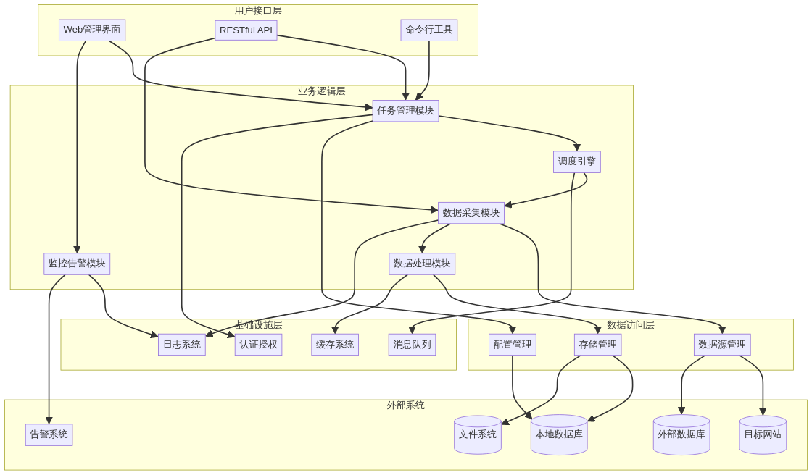
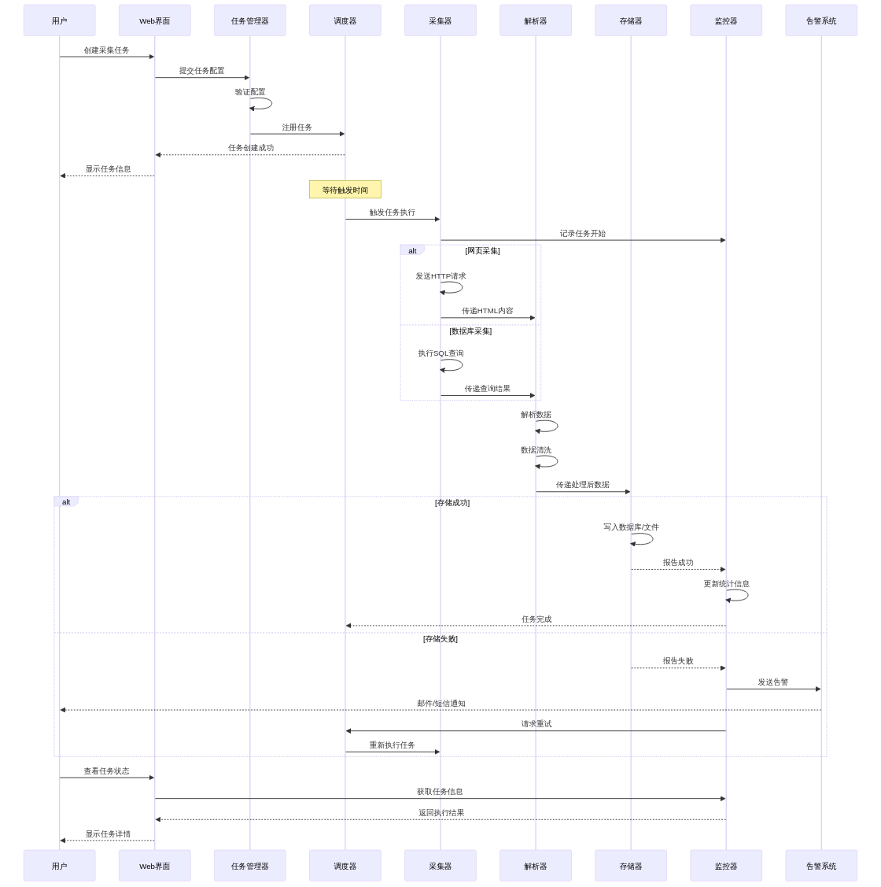
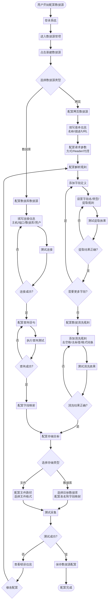
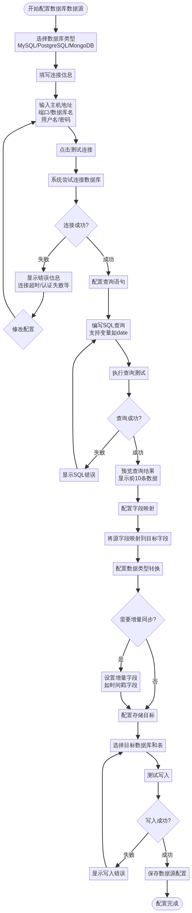
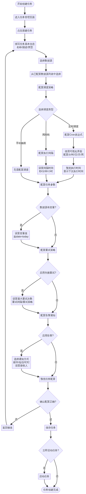
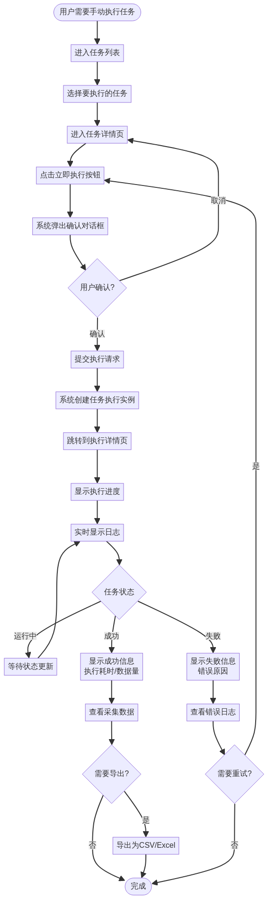
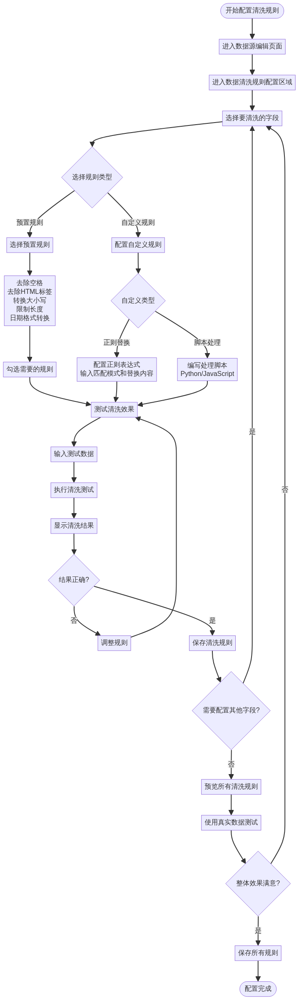

# DataFusion 产品需求文档 (PRD)

## 文档信息

| 项目 | 内容 |
| :--- | :--- |
| **产品名称** | DataFusion 数据获取子系统用户需求说明书 |
| **文档版本** | v2.0 |
| **编写日期** | 2025-10-23 |
| **作者** | zzy |
| **文档类型** | 产品需求文档 (Product Requirements Document) |
| **目标读者** | 产品经理、项目经理、系统架构师、开发工程师、测试工程师 |

## 1. 产品概述

### 1.1. 产品定位

**DataFusion** 是"丁香园数据采集及分析系统"的数据获取子系统，专注于从多种异构数据源（网站、数据库）高效、可靠地采集数据，并将其转储到本地存储或目标数据库中。该系统旨在为上层的数据分析、业务决策和人工智能应用提供稳定、高质量的数据基础。

### 1.2. 产品价值

在数据驱动的时代，企业对数据的依赖日益增强。**DataFusion** 通过提供一个统一的数据获取平台，解决了以下核心问题：

*   **数据源分散:** 业务数据分散在不同的网站、数据库中，缺乏统一的获取渠道。
*   **采集效率低:** 手动采集或简单脚本采集效率低下，难以应对大规模、高频次的数据需求。
*   **数据质量差:** 缺乏统一的数据清洗和校验机制，导致数据质量参差不齐。
*   **运维成本高:** 缺乏自动化的任务调度和监控，需要大量人工介入。

通过 **DataFusion**，企业可以：

*   **提升数据获取效率:** 自动化的任务调度和并发采集，大幅提升数据获取速度。
*   **保障数据质量:** 内置的数据清洗、校验和去重机制，确保数据的准确性和完整性。
*   **降低运维成本:** 完善的监控告警和自动重试机制，减少人工干预。
*   **支持业务创新:** 为数据分析、机器学习等上层应用提供源源不断的高质量数据。

### 1.3. 目标用户

| 用户角色 | 职责描述 | 核心诉求 |
| :--- | :--- | :--- |
| **数据分析师** | 负责数据分析和报表制作 | 需要定期获取最新的业务数据，用于分析和决策支持 |
| **算法工程师** | 负责机器学习模型训练 | 需要大量的训练数据，要求数据格式统一、质量可控 |
| **业务运营** | 负责业务数据的日常管理 | 需要定期同步合作方或外部数据源的数据 |
| **系统管理员** | 负责系统的运维和监控 | 需要确保数据采集的稳定性，及时发现和处理异常 |
| **开发工程师** | 负责系统的开发和集成 | 需要通过 API 调用数据采集功能，集成到自己的应用中 |

## 2. dataFusion总体设计

### 2.1. 系统定位

**DataFusion** 是一个通用的数据获取平台，负责从异构数据源（包括网站、数据库等）采集、清洗、转换和存储数据。它作为数据供应链的起点，为上层的数据分析、业务决策和人工智能应用提供稳定、可靠的数据基础。

### 2.2. 主要特性

**DataFusion** 系统的核心能力在于“数据获取”，其主要职责包括：

*   **数据采集：** 支持从多种数据源（网页、数据库）获取数据。
*   **数据处理：** 对采集到的原始数据进行解析、清洗、转换和格式化。
*   **数据存储：** 将处理后的数据持久化到本地文件系统或结构化数据库中。
*   **任务调度：** 提供灵活的任务调度和管理功能，支持定时、周期性和手动触发等多种方式。
*   **监控告警：** 对数据采集的全过程进行实时监控，并能在出现异常时及时告警。

### 2.3. 用户故事

为了更好地理解系统的应用场景和用户需求，我们定义了以下典型的用户故事：

#### 2.3.1. 用户故事

| 角色 | 场景 | 用户故事 |
| :--- | :--- | :--- |
| 数据分析师 | 需要获取某行业网站的最新动态 | 我希望能够配置一个采集任务，每天自动从指定的行业网站上抓取最新的文章列表和内容，并存入我们的数据库，以便我进行后续的舆情分析。 |
| 业务运营 | 需要定期从合作方数据库同步数据 | 我希望能够设置一个定时任务，每天凌晨将合作方提供的产品销售数据从他们的MySQL数据库同步到我们的数据仓库中，以便我们进行销售数据分析和报表制作。 |
| 算法工程师 | 需要大量的训练数据 | 我需要从多个公开数据源网站采集大量的图片和文本数据，用于训练我的机器学习模型。我希望系统能够支持并发采集，并能对数据进行简单的清洗和格式化。 |
| 系统管理员 | 需要保证数据采集的稳定性 | 我希望能够实时监控所有采集任务的运行状态，当出现采集失败或数据异常时，系统能自动重试，并在多次重试失败后通过邮件或短信通知我，以便我及时介入处理。 |

#### 2.3.2. 用例图

下图展示了 **DataFusion** 系统的主要用例以及不同角色的用户如何与系统交互：



#### 2.3.3. 用户交互流程

下图展示了用户与 **DataFusion** 系统的典型交互流程：



## 3. 主要功能和核心使用场景
### 3.1. 系统特性
#### 3.1.1. 功能特性

| 模块 | 功能点 | 详细描述 | 优先级 |
| :--- | :--- | :--- | :--- |
| **数据采集** | 网页数据采集 | 支持从静态和动态网页中提取结构化数据，支持配置User-Agent、Cookie、代理等。 | 高 |
| | 数据库直连 | 支持连接主流的关系型数据库（MySQL, PostgreSQL）和非关系型数据库（MongoDB），通过SQL或API获取数据。 | 高 |
| | 采集任务管理 | 提供可视化的界面，用于创建、配置、启动、停止和删除采集任务。 | 高 |
| | 目标页面数据展示 | 提供可视化的界面，用于将解析到目标页面中的数据和结构进行展示。 | 高 |
| | 采集存储配置 | 提供可视化的界面，用于将解析到的目标页面中的数据与目标存储中的数据进行映射，将解析到的页面数据映射为json、数据库的表的字段等。 | 高 |
| | 采集方式 | 支持RPA、API等多种采集方式，采集方式可配置。采集任务根据配置的采集方式进行采集。 | 高 |
| | 自动采集和手动采集 | 可以通过对采集任务的定时策略自动执行，也可以手动运行采集任务做实时采集。 | 高 |
| **数据处理** | 数据解析 | 支持解析HTML、JSON、XML、CSV等多种数据格式，并能通过XPath、CSS选择器、正则表达式等方式提取字段。 | 高 |
| | 数据清洗 | 提供基础的数据清洗功能，如去除HTML标签、处理特殊字符、转换数据类型等。 | 中 |
| | 数据转换 | 支持将采集到的数据转换成统一的格式，便于存储和分析。 | 中 |
| | 增量更新 | 对于固定页面中内容的抓取，能够每次计算差异，仅有差异的情况下更新和存储变化信息。 | 中 |
| | 全量更新 | 对于固定页面中内容的抓取，不计算差异，默认使用获取的数据更新目标存储数据。 | 中 |
| | 展示和修正 | 对于已经清洗过的存储数据，支持页面显示，并进行手动修正。 | 中 |
| | 清洗规则 | 设置数据清洗规则，对每个字段都可以进行数据不同的清洗方式，不同的清洗内容。如，日期格式统一、干扰信息去除、专业内容替换、枚举类型标准化等 | 中 |
| | 自动清洗 | 在做数据采集的时候，采集任务关联清洗规则，在采集的时候自动完成清洗并存储目标数据。 | 中 |
| | 手动清洗 | 可以手动执行清洗规则，实现对数据的手动清洗。 | 中 |
| **数据存储** | 本地文件存储 | 支持将数据以JSON、CSV等格式存储到本地文件系统。 | 高 |
| | 数据库存储 | 支持将数据写入MySQL、PostgreSQL、MongoDB等数据库。默认使用数据库存储。 | 高 |
| **任务调度** | 调度策略 | 支持定时、周期性（按秒、分、时、天、周、月）、手动触发等多种调度策略。 | 高 |
| | 并发控制 | 支持配置任务的并发数，防止对目标网站或数据库造成过大压力。 | 高 |
| | 任务优先级 | 支持设置任务的优先级，确保核心任务优先执行。 | 中 |

#### 3.1.2. 辅助特性

| 模块 | 功能点 | 详细描述 | 优先级 |
| :--- | :--- | :--- | :--- |
| **监控告警** | 任务监控 | 实时监控采集任务的运行状态（成功、失败、运行中）、采集数据量、运行时长等。 | 高 |
| | 系统监控 | 监控系统自身的资源使用情况，如CPU、内存、磁盘、网络等。 | 中 |
| | 告警通知 | 当任务失败、数据异常或系统资源超限时，支持通过邮件、短信、钉钉等方式发送告警通知。 | 高 |
| **配置管理** | 数据源管理 | 统一管理所有数据源的连接信息，支持加密存储敏感信息。 | 高 |
| | 采集规则管理 | 对采集规则进行版本管理，支持规则的导入导出。 | 中 |
| **API和文档** | RESTful API | 提供丰富的RESTful API，用于以编程方式管理和执行采集任务。 | 高 |
| | API认证 | 支持通过API Key或OAuth2等方式对API调用进行认证和授权。 | 高 |
| | 文档 | 提供完善的文档使用文档和demo示例、运维指南等。 | 中 |
| | MCP支持 | 提供标准的MCP实现，其他系统可以使用MCP的方式使用系统提供的数据。 | 中 |
| **安全与权限** | 用户认证 | 提供用户登录和身份认证功能。 | 高 |
| | 权限管理 | 支持基于角色的权限控制，不同角色的用户拥有不同的操作权限。 | 高 |
| | 第三方对接 | 支持基于Oauth协议对接已有的用户系统实现单点登录。 | 高 |
| | 登录管理 | 支持第三方用户登录和本地用户登录，本地用户中admin具备最高权限；区分本地用户和第三方用户。 | 高 |

#### 3.1.3. 逻辑架构

**DataFusion** 系统采用分层架构设计，各模块之间的关系如下图所示：



系统分为四个主要层次：**用户接口层**提供多种交互方式，**业务逻辑层**实现核心功能，**数据访问层**管理数据源和存储，**基础设施层**提供通用服务支持。

### 3.2. 主要场景

#### 3.2.1. 数据采集总体任务执行流程

下图展示了一个完整的数据采集任务从创建到执行的时序流程：



该流程涵盖了任务的创建、调度、执行、监控和异常处理等关键环节，确保数据采集的可靠性和可追溯性。

#### 3.2.2. 场景一：配置网页数据源并采集

##### 3.2.2.1. 场景描述

数据分析师小王需要每天从某医药行业资讯网站采集最新的文章列表和内容，用于舆情分析。该网站的文章列表页面结构固定，每篇文章包含标题、发布时间、作者、正文等信息。

##### 3.2.2.2. 用户目标

*   配置一个网页数据源，指定目标网站的 URL 和采集规则。
*   对采集到的 HTML 内容进行结构化解析，提取所需字段。
*   将解析后的数据存入本地数据库，便于后续分析。

##### 3.2.2.3. 操作流程



**步骤说明：**
1. **进入数据源管理页面**
   - 用户登录系统后，点击左侧菜单"数据源管理"。
2. **创建新数据源**
   - 点击"新建数据源"按钮。
   - 选择数据源类型为"网页"。
3. **填写基本信息**
   - **数据源名称:** 输入有意义的名称，如"医药资讯网-文章列表"。
   - **描述:** 简要描述该数据源的用途。
   - **目标 URL:** 输入要采集的网页地址，支持使用变量（如日期）。
4. **配置采集规则**
   - **请求方式:** 选择 GET 或 POST。
   - **请求头:** 配置 User-Agent、Cookie 等（可选）。
   - **代理设置:** 如需使用代理，填写代理地址（可选）。
5. **配置解析规则（结构化分析）**
   系统提供可视化的字段映射配置界面：
   | 字段名称 | 字段类型 | 提取规则 | 示例值 |
   | :--- | :--- | :--- | :--- |
   | title | 字符串 | CSS选择器: `.article-title` | "2025年医药行业发展趋势" |
   | publish_time | 日期时间 | XPath: `//span[@class='time']/text()` | "2025-10-23 10:30:00" |
   | author | 字符串 | 正则表达式: `作者：(.+)` | "张三" |
   | content | 文本 | CSS选择器: `.article-content` | "正文内容..." |
   
   **操作说明：**
   - 点击"添加字段"按钮，逐个定义需要提取的字段。
   - 对于每个字段，指定字段名、数据类型和提取规则。
   - 系统支持三种提取方式：CSS 选择器、XPath、正则表达式。
   - 可以点击"测试"按钮，实时预览提取结果。

6. **配置数据清洗规则（可选）**   
   对提取到的数据进行清洗处理：
   | 字段 | 清洗规则 |
   | :--- | :--- |
   | title | 去除首尾空格、去除 HTML 标签 |
   | publish_time | 转换为标准日期格式 `YYYY-MM-DD HH:mm:ss` |
   | content | 去除 HTML 标签、去除特殊字符、限制长度 10000 字符 |
7. **配置存储目标**
   - **存储类型:** 选择"数据库"或"文件"。
   - **目标数据库:** 从已配置的数据库连接中选择。
   - **目标表:** 输入表名，如 `medical_articles`。
   - **字段映射:** 将解析出的字段映射到目标表的列。
8. **测试连接和解析**
   - 点击"测试采集"按钮，系统会立即执行一次采集。
   - 在测试结果区域，展示采集到的原始 HTML、解析后的结构化数据。
   - 用户可以根据测试结果调整解析规则。
9. **保存数据源配置**
   - 确认无误后，点击"保存"按钮。
   - 系统提示"数据源创建成功"。

##### 3.2.2.4. 界面示意

**数据源配置页面：**

```
┌─────────────────────────────────────────────────────────────┐
│ 新建数据源 - 网页                                            │
├─────────────────────────────────────────────────────────────┤
│ 基本信息                                                     │
│   数据源名称: [医药资讯网-文章列表_____________]             │
│   描述:       [每日采集医药行业最新资讯______]               │
│   目标 URL:   [https://example.com/articles?date={date}]    │
│                                                              │
│ 请求配置                                                     │
│   请求方式:   ◉ GET  ○ POST                                 │
│   User-Agent: [Mozilla/5.0 ...]                             │
│   Cookie:     [可选___________________________]             │
│                                                              │
│ 解析规则（结构化分析）                    [+ 添加字段]       │
│ ┌────────────────────────────────────────────────────────┐ │
│ │ 字段名    │ 类型   │ 提取方式      │ 规则              │ │
│ ├────────────────────────────────────────────────────────┤ │
│ │ title     │ 字符串 │ CSS选择器     │ .article-title    │ │
│ │ pub_time  │ 日期   │ XPath         │ //span[@class...  │ │
│ │ content   │ 文本   │ CSS选择器     │ .article-content  │ │
│ └────────────────────────────────────────────────────────┘ │
│                                                              │
│ 数据清洗规则                              [+ 添加规则]       │
│   title:    ☑ 去除空格  ☑ 去除HTML标签                      │
│   content:  ☑ 去除HTML标签  ☑ 限制长度(10000字符)           │
│                                                              │
│ 存储配置                                                     │
│   存储类型:   ◉ 数据库  ○ 文件                              │
│   目标数据库: [MySQL-本地数据库 ▼]                          │
│   目标表:     [medical_articles_____________]               │
│                                                              │
│              [测试采集]  [取消]  [保存]                      │
└─────────────────────────────────────────────────────────────┘
```

##### 3.2.2.5. 验收标准

*   用户能够成功创建网页数据源配置。
*   系统能够正确解析网页内容，提取指定字段。
*   测试采集功能能够实时展示采集和解析结果。
*   数据能够成功存入目标数据库。

---

#### 3.2.3. 场景二：配置数据库数据源并同步

##### 3.2.3.1. 场景描述

业务运营小李需要每天凌晨从合作方的 MySQL 数据库中同步产品销售数据，导入到本地的数据仓库中进行分析。

##### 3.2.3.2. 用户目标

*   配置一个数据库类型的数据源，连接到合作方的数据库。
*   编写 SQL 查询语句，获取指定的数据。
*   将查询结果映射到本地数据库的目标表。

##### 3.2.3.3. 操作流程



**步骤说明：**

1. **进入数据源管理页面**
   - 点击"数据源管理" → "新建数据源"。

2. **选择数据库类型**
   - 数据源类型选择"数据库"。
   - 数据库类型选择"MySQL"。

3. **填写连接信息**
   - **数据源名称:** "合作方-产品销售数据"
   - **主机地址:** `partner-db.example.com`
   - **端口:** `3306`
   - **数据库名:** `sales_db`
   - **用户名:** `readonly_user`
   - **密码:** `******`（加密存储）

4. **测试连接**
   - 点击"测试连接"按钮。
   - 系统尝试连接数据库，显示连接状态。

5. **配置查询语句**
   
   ```sql
   SELECT 
       product_id,
       product_name,
       sales_amount,
       sales_date,
       region
   FROM sales_records
   WHERE sales_date >= '{start_date}' 
     AND sales_date < '{end_date}'
   ```
   
   - 支持使用变量，如 `{start_date}`, `{end_date}`。
   - 点击"执行查询"按钮，预览查询结果。

6. **配置字段映射**
   
   | 源字段 | 目标字段 | 数据类型转换 |
   | :--- | :--- | :--- |
   | product_id | product_id | INT → INT |
   | product_name | product_name | VARCHAR → VARCHAR |
   | sales_amount | amount | DECIMAL → DECIMAL |
   | sales_date | date | DATE → DATE |
   | region | region_name | VARCHAR → VARCHAR |

7. **配置增量同步（可选）**
   - **增量字段:** 选择 `sales_date`。
   - **增量方式:** 每次只同步上次同步时间之后的数据。

8. **保存配置**
   - 点击"保存"按钮，完成数据源配置。

##### 3.2.3.4. 验收标准

*   能够成功连接到外部数据库。
*   SQL 查询能够正确执行并返回结果。
*   字段映射配置正确，数据类型转换无误。
*   支持增量同步，避免重复采集。

---

#### 3.2.4. 场景三：创建定时采集任务

##### 3.2.4.1. 场景描述

配置好数据源后，数据分析师小王需要创建一个定时任务，每天早上 8 点自动执行采集，将最新的文章数据导入数据库。

##### 3.2.4.2. 用户目标

*   基于已配置的数据源，创建一个定时采集任务。
*   设置任务的调度策略（定时、周期性）。
*   配置任务失败后的重试策略。

##### 3.2.4.3. 操作流程



**步骤说明：**

1. **进入任务管理页面**
   - 点击"任务管理" → "新建任务"。

2. **填写任务基本信息**
   - **任务名称:** "每日医药资讯采集"
   - **描述:** "每天早上 8 点采集医药资讯网的最新文章"
   - **任务类型:** 选择"数据采集"

3. **选择数据源**
   - 从下拉列表中选择之前配置的数据源："医药资讯网-文章列表"。

4. **配置调度策略**
   
   **调度类型：**
   - ◉ 定时调度（Cron 表达式）
   - ○ 周期性调度（按固定间隔）
   - ○ 手动触发
   
   **Cron 表达式：** `0 0 8 * * ?`（每天早上 8 点）
   
   系统提供可视化的 Cron 配置界面：
   
   ```
   ┌─────────────────────────────────────────┐
   │ 调度配置                                 │
   ├─────────────────────────────────────────┤
   │ 分钟:  [0___]  小时:  [8___]            │
   │ 日期:  [*___]  月份:  [*___]            │
   │ 星期:  [?___]                            │
   │                                          │
   │ 预览: 每天 08:00 执行                    │
   │ 下次执行时间: 2025-10-24 08:00:00       │
   └─────────────────────────────────────────┘
   ```

5. **配置任务参数（可选）**
   
   如果数据源配置中使用了变量，需要在此设置变量值：
   
   | 变量名 | 变量值 |
   | :--- | :--- |
   | date | `{today}` (系统内置变量，表示当天日期) |

6. **配置重试策略**
   - **失败重试:** ☑ 启用
   - **最大重试次数:** `3`
   - **重试间隔:** `5` 分钟
   - **重试策略:** 指数退避（第一次 5 分钟，第二次 10 分钟，第三次 20 分钟）

7. **配置告警通知**
   - **任务失败通知:** ☑ 启用
   - **通知方式:** ☑ 邮件  ☑ 短信
   - **通知接收人:** `xiaowang@example.com`

8. **保存并启动任务**
   - 点击"保存并启动"按钮。
   - 系统提示"任务创建成功，下次执行时间：2025-10-24 08:00:00"。

##### 3.2.4.4. 任务状态监控

任务创建后，用户可以在"任务列表"页面查看任务状态：

```
┌──────────────────────────────────────────────────────────────────┐
│ 任务列表                                [+ 新建任务]              │
├──────────────────────────────────────────────────────────────────┤
│ 任务名称             │ 状态   │ 下次执行时间       │ 操作       │
├──────────────────────────────────────────────────────────────────┤
│ 每日医药资讯采集     │ 运行中 │ 2025-10-24 08:00  │ [查看][编辑]│
│ 合作方销售数据同步   │ 已暂停 │ -                 │ [启动][编辑]│
└──────────────────────────────────────────────────────────────────┘
```

##### 3.2.4.5. 验收标准

*   能够成功创建定时采集任务。
*   调度策略配置正确，任务能够按时执行。
*   重试策略生效，失败后能够自动重试。
*   告警通知能够正常发送。

---

#### 3.2.5. 场景四：手动执行采集任务

##### 3.2.5.1. 场景描述

在定时任务之外，用户有时需要立即执行一次数据采集，例如在调试阶段或需要获取实时数据时。

##### 3.2.5.2. 用户目标

*   手动触发一次任务执行。
*   实时查看任务执行进度和日志。

##### 3.2.5.3. 操作流程



**步骤说明：**

1. **进入任务详情页面**
   - 在任务列表中，点击任务名称进入详情页。

2. **点击"立即执行"按钮**
   - 系统弹出确认对话框："确认立即执行任务'每日医药资讯采集'？"
   - 点击"确认"。

3. **查看执行进度**
   
   系统跳转到"任务执行详情"页面，实时展示执行进度：
   
   ```
   ┌─────────────────────────────────────────────────────────┐
   │ 任务执行详情                                             │
   ├─────────────────────────────────────────────────────────┤
   │ 任务名称: 每日医药资讯采集                               │
   │ 执行 ID:  run-20251023-143052                           │
   │ 状态:     运行中                                         │
   │ 开始时间: 2025-10-23 14:30:52                           │
   │                                                          │
   │ 执行进度:                                                │
   │   [████████████████░░░░░░░░░░] 60%                      │
   │                                                          │
   │ 实时日志:                                                │
   │ ┌──────────────────────────────────────────────────┐   │
   │ │ [14:30:52] INFO  开始执行任务                     │   │
   │ │ [14:30:53] INFO  连接数据源成功                   │   │
   │ │ [14:30:54] INFO  发送 HTTP 请求...                │   │
   │ │ [14:30:55] INFO  接收到响应，大小: 125KB          │   │
   │ │ [14:30:56] INFO  开始解析数据...                  │   │
   │ │ [14:30:57] INFO  解析完成，提取到 50 条记录       │   │
   │ │ [14:30:58] INFO  开始数据清洗...                  │   │
   │ │ [14:30:59] INFO  清洗完成，有效记录 48 条         │   │
   │ │ [14:31:00] INFO  开始写入数据库...                │   │
   │ └──────────────────────────────────────────────────┘   │
   │                                                          │
   │                                    [停止任务] [刷新]    │
   └─────────────────────────────────────────────────────────┘
   ```

4. **查看执行结果**
   
   任务执行完成后，页面显示执行结果：
   
   ```
   状态: ✓ 成功
   结束时间: 2025-10-23 14:31:05
   执行耗时: 13 秒
   采集数据量: 48 条
   ```

###### 3.2.5.4. 验收标准

*   能够手动触发任务执行。
*   执行进度和日志能够实时展示。
*   执行结果准确，数据成功写入目标存储。

---

#### 3.2.6. 场景五：查看已采集数据

##### 3.2.6.1. 场景描述

任务执行完成后，用户需要查看采集到的数据，确认数据的完整性和准确性。

##### 3.2.6.2. 用户目标

*   查看某次任务执行采集到的数据。
*   支持数据的筛选、排序和导出。

##### 3.2.6.3. 操作流程

**步骤说明：**

1. **进入任务执行历史页面**
   - 在任务详情页，点击"执行历史"标签。

2. **选择一次执行记录**
   - 点击某次执行记录的"查看数据"按钮。

3. **查看采集数据**
   
   系统展示该次执行采集到的数据：
   
   ```
   ┌──────────────────────────────────────────────────────────────┐
   │ 采集数据查看                                  [导出CSV]      │
   ├──────────────────────────────────────────────────────────────┤
   │ 执行 ID: run-20251023-143052                                 │
   │ 数据量: 48 条                                                 │
   │                                                               │
   │ 筛选: 标题 [_______] 日期 [2025-10-23 ▼]  [搜索]            │
   │                                                               │
   │ ┌────┬──────────────────┬────────────┬──────────────────┐  │
   │ │ ID │ 标题              │ 发布时间    │ 作者              │  │
   │ ├────┼──────────────────┼────────────┼──────────────────┤  │
   │ │ 1  │ 2025年医药行业... │ 2025-10-23 │ 张三              │  │
   │ │ 2  │ 新药研发进展...   │ 2025-10-23 │ 李四              │  │
   │ │ 3  │ 医保政策解读...   │ 2025-10-22 │ 王五              │  │
   │ │... │ ...              │ ...        │ ...              │  │
   │ └────┴──────────────────┴────────────┴──────────────────┘  │
   │                                                               │
   │                                          [上一页] 1/5 [下一页]│
   └──────────────────────────────────────────────────────────────┘
   ```

4. **查看数据详情**
   - 点击某条数据，弹出详情窗口，展示完整的字段内容。

5. **导出数据**
   - 点击"导出 CSV"按钮，将数据下载到本地。

##### 3.2.6.4. 验收标准

*   能够查看任务执行采集到的数据。
*   支持数据的筛选和分页。
*   支持数据导出为 CSV 格式。

---

#### 3.2.7. 场景六：修正已采集数据

##### 3.2.7.1. 场景描述

在查看采集数据时，用户发现某些数据存在错误（如解析错误、字段缺失），需要对数据进行修正或重新采集。

##### 3.2.7.2. 用户目标

*   对单条或多条采集数据进行手动修正。
*   标记错误数据，触发重新采集。

##### 3.2.7.3. 操作流程

**步骤说明：**

1. **进入数据查看页面**
   - 在采集数据列表中，发现某条数据的"标题"字段为空。

2. **编辑数据**
   - 点击该条数据的"编辑"按钮。
   - 在弹出的编辑窗口中，手动填写或修改字段值。
   - 点击"保存"，数据更新成功。

3. **标记为错误数据**
   - 如果数据无法手动修正，可以勾选该条数据。
   - 点击"标记为错误"按钮。
   - 系统将该数据标记为"待重新采集"。

4. **重新采集**
   - 在任务详情页，点击"重新采集错误数据"按钮。
   - 系统针对标记为错误的数据，重新执行采集和解析。

##### 3.2.7.4. 验收标准

*   能够手动编辑采集到的数据。
*   能够标记错误数据并触发重新采集。
*   重新采集后，数据能够正确更新。

---

#### 3.2.8. 场景七：配置数据清洗规则

##### 3.2.8.1. 场景描述

在数据采集过程中，原始数据往往包含大量噪音（如 HTML 标签、特殊字符、空格等），需要通过数据清洗规则对数据进行标准化处理。

##### 3.2.8.2. 用户目标

*   为数据源配置数据清洗规则。
*   支持常见的清洗操作（去除标签、格式转换、正则替换等）。

##### 3.2.8.3. 操作流程



**步骤说明：**

1. **进入数据源编辑页面**
   - 在数据源列表中，点击某个数据源的"编辑"按钮。

2. **进入"数据清洗规则"配置区域**
   
   系统提供可视化的规则配置界面：
   
   ```
   ┌─────────────────────────────────────────────────────────┐
   │ 数据清洗规则                          [+ 添加规则]       │
   ├─────────────────────────────────────────────────────────┤
   │ 字段: title                                              │
   │   ☑ 去除首尾空格                                         │
   │   ☑ 去除 HTML 标签                                       │
   │   ☑ 转换为小写                                           │
   │                                                          │
   │ 字段: content                                            │
   │   ☑ 去除 HTML 标签                                       │
   │   ☑ 去除特殊字符 (保留: 中文、英文、数字、标点)          │
   │   ☑ 限制长度: [10000] 字符                               │
   │   ☑ 正则替换: 将 [\s+] 替换为 [ ]                        │
   │                                                          │
   │ 字段: publish_time                                       │
   │   ☑ 日期格式转换: 从 [YYYY年MM月DD日] 转为 [YYYY-MM-DD] │
   │                                                          │
   │                                    [测试] [保存]         │
   └─────────────────────────────────────────────────────────┘
   ```

3. **添加自定义清洗规则**
   
   对于复杂的清洗需求，系统支持自定义规则：
   
   - **规则类型:** 选择"正则替换"、"脚本处理"等。
   - **规则表达式:** 输入正则表达式或脚本代码。
   - **测试数据:** 输入测试数据，点击"测试"查看处理结果。

4. **保存清洗规则**
   - 点击"保存"按钮，规则生效。
   - 后续的数据采集将自动应用这些清洗规则。

##### 3.2.8.4. 验收标准

*   能够为字段配置常见的清洗规则。
*   支持自定义清洗规则（正则、脚本）。
*   清洗规则能够正确应用到采集数据上。

---

#### 3.2.9. 场景八:配置采集方式

##### 3.2.9.1. 场景描述

在医疗健康行业数据采集场景中,不同数据源的获取方式存在显著差异。部分数据源提供标准化的API接口,可以直接调用获取结构化数据;而另一部分数据源（如医药资讯网站、医院公示信息平台等）没有开放API,需要通过RPA（机器人流程自动化）技术模拟用户操作进行数据采集。系统需要支持灵活配置不同的采集方式,以适应各类数据源的特点。

##### 3.2.9.2. 用户目标

*   为数据源选择合适的采集方式。
*   支持通过API接口直接获取数据。
*   支持通过RPA方式采集无API接口的网站数据。
*   支持扩展其他采集方式以满足特殊需求。

##### 3.2.9.3. 操作流程

**步骤说明：**

1. **进入数据源配置页面**
   - 在"采集方式"配置区域，选择合适的采集方式。

2. **选择采集方式**

   系统提供多种采集方式：

   - ◉ RPA采集（适用于网页数据源）
   - ○ API采集（适用于提供接口的数据源）
   - ○ 其他方式（预留扩展）

3. **配置RPA采集**

   如果选择"RPA采集"，需要配置以下参数：

   ```
   ┌─────────────────────────────────────────────────────┐
   │ RPA采集配置                                          │
   ├─────────────────────────────────────────────────────┤
   │ 浏览器类型: [Chrome ▼]                               │
   │ ☑ 启用无头模式（Headless）                          │
   │ ☑ 启用 JavaScript 执行                              │
   │ ☑ 加载图片                                          │
   │ 页面加载超时: [30] 秒                                │
   │                                                      │
   │ 页面等待策略:                                        │
   │   ○ 等待页面加载完成（load事件）                     │
   │   ◉ 等待DOM渲染完成（DOMContentLoaded）             │
   │   ○ 等待网络空闲                                     │
   │                                                      │
   │ 自定义操作脚本（可选）:                              │
   │ ┌─────────────────────────────────────────────────┐ │
   │ │ // 示例：模拟登录操作                            │ │
   │ │ await page.type('#username', 'user');          │ │
   │ │ await page.type('#password', 'pass');          │ │
   │ │ await page.click('#login-btn');                │ │
   │ │ await page.waitForNavigation();                │ │
   │ │                                                  │ │
   │ │ // 示例：模拟滚动加载                            │ │
   │ │ await page.evaluate(() => {                    │ │
   │ │   window.scrollTo(0, document.body.scrollHeight);│ │
   │ │ });                                              │ │
   │ │ await new Promise(r => setTimeout(r, 2000));   │ │
   │ └─────────────────────────────────────────────────┘ │
   │                                                      │
   │ 代理设置（可选）:                                    │
   │   代理服务器: [_________________________]            │
   │   端口: [____]                                       │
   │                                                      │
   │                                    [测试] [保存]     │
   └─────────────────────────────────────────────────────┘
   ```

4. **配置API采集**

   如果选择"API采集"：

   ```
   ┌─────────────────────────────────────────────────────┐
   │ API采集配置                                          │
   ├─────────────────────────────────────────────────────┤
   │ API地址: [https://api.example.com/v1/data______]    │
   │ 请求方式: [GET ▼]                                    │
   │                                                      │
   │ 认证方式:                                            │
   │   ◉ API Key                                         │
   │   ○ OAuth 2.0                                       │
   │   ○ Basic Auth                                      │
   │   ○ 无需认证                                        │
   │                                                      │
   │ API Key配置:                                         │
   │   Header名称: [Authorization________________]       │
   │   Key值: [Bearer xxxxxxxxxxxxxxxx___________]       │
   │                                                      │
   │ 请求参数:                          [+ 添加参数]      │
   │ ┌─────────────────────────────────────────────────┐ │
   │ │ 参数名      │ 参数值           │ 参数类型        │ │
   │ ├─────────────────────────────────────────────────┤ │
   │ │ page        │ 1               │ Query          │ │
   │ │ size        │ 100             │ Query          │ │
   │ │ date        │ {today}         │ Query          │ │
   │ └─────────────────────────────────────────────────┘ │
   │                                                      │
   │ 响应数据格式: [JSON ▼]                               │
   │ 数据路径: [data.items___________]（JSONPath表达式） │
   │                                                      │
   │ 分页配置（可选）:                                    │
   │   ☑ 启用分页                                        │
   │   分页参数: [page_____]                             │
   │   每页大小: [100]                                    │
   │   最大页数: [10] (0表示不限制)                       │
   │                                                      │
   │                                    [测试] [保存]     │
   └─────────────────────────────────────────────────────┘
   ```

5. **配置其他采集方式**

   系统预留"其他方式"选项,支持通过插件机制扩展新的采集方式：

   - 点击"配置插件"按钮。
   - 从已注册的采集插件列表中选择。
   - 根据插件要求配置相应参数。
   - 系统加载插件并验证配置有效性。

6. **测试采集方式**
   - 点击"测试"按钮，系统使用配置的采集方式执行一次测试采集。
   - 在测试结果区域查看：
     * 连接状态（成功/失败）
     * 响应时间
     * 采集到的原始数据预览
     * 错误信息（如有）
   - 根据测试结果调整配置参数。

7. **保存配置**
   - 确认测试通过后，点击"保存"按钮。
   - 系统提示"采集方式配置成功"。
   - 后续的采集任务将使用此配置的采集方式执行。

##### 3.2.9.4. 验收标准

*   能够选择并配置不同的采集方式（RPA、API）。
*   RPA采集能够正确处理需要JavaScript渲染的动态网页。
*   RPA采集支持自定义操作脚本,可实现登录、点击、滚动等复杂交互。
*   API采集能够正确配置认证方式和请求参数。
*   API采集支持分页数据的自动获取。
*   测试功能能够验证采集方式配置的有效性。
*   系统支持通过插件方式扩展新的采集方式。

---

## 4. 具体需求

### 4.1. 功能需求列表

基于上述使用场景，系统需要实现以下功能：

| 功能模块 | 功能点 | 优先级 | 说明 |
| :--- | :--- | :---: | :--- |
| **数据源管理** | 创建/编辑/删除数据源 | P0 | 支持网页、数据库两种类型 |
| | 数据源连接测试 | P0 | 验证数据源配置的正确性 |
| | 数据源列表查看 | P0 | 展示所有已配置的数据源 |
| | 数据源导入/导出 | P1 | 支持配置的批量导入导出 |
| | 页面展示 | P0 | 可视化解析和展示页面数据及结构 |
| **结构化分析** | 字段提取规则配置 | P0 | 支持 CSS 选择器、XPath、正则表达式 |
| | 实时预览提取结果 | P0 | 在配置时实时测试提取效果 |
| | 字段类型定义 | P0 | 支持字符串、数字、日期等类型 |
| | 字段映射配置 | P0 | 将源字段映射到目标字段 |
| **数据清洗** | 预置清洗规则 | P0 | 去空格、去标签、格式转换等 |
| | 自定义清洗规则 | P1 | 支持正则替换、脚本处理 |
| | 清洗规则测试 | P0 | 实时测试清洗效果 |
| | 数据去重 | P0 | 基于指定字段进行去重 |
| | 清洗规则管理 | P1 | 配置字段级清洗规则，支持日期格式统一、干扰信息去除、专业内容替换、枚举类型标准化等 |
| | 自动清洗 | P1 | 采集任务关联清洗规则，在采集时自动完成清洗并存储目标数据 |
| | 手动清洗执行 | P1 | 支持手动执行清洗规则，对已存储数据进行清洗 |
| **数据处理** | 数据转换 | P1 | 将采集到的数据转换成统一格式，便于存储和分析 |
| | 增量更新策略 | P1 | 对固定页面内容抓取时计算差异，仅在有差异时更新和存储变化信息 |
| | 全量更新策略 | P1 | 对固定页面内容抓取时不计算差异，默认使用获取的数据全量更新目标存储 |
| **数据存储** | 本地文件存储 | P0 | 支持将数据以JSON、CSV等格式存储到本地文件系统 |
| | 数据库存储 | P0 | 支持将数据写入MySQL、PostgreSQL、MongoDB等数据库，默认使用数据库存储 |
| | 存储目标配置 | P0 | 配置数据存储位置、格式和字段映射关系 |
| **任务管理** | 创建/编辑/删除任务 | P0 | 基于数据源创建采集任务 |
| | 任务启动/停止 | P0 | 控制任务的运行状态 |
| | 任务列表查看 | P0 | 展示所有任务及其状态 |
| | 任务详情查看 | P0 | 查看任务配置和执行历史 |
| | 手动立即执行 | P0 | 支持手动触发任务立即执行一次，用于调试或实时采集 |
| **任务调度** | 定时调度（Cron） | P0 | 支持 Cron 表达式配置 |
| | 周期性调度 | P0 | 按固定间隔执行(按秒、分、时、天、周、月) |
| | 手动触发 | P0 | 立即执行一次任务 |
| | 调度策略可视化配置 | P1 | 提供友好的 Cron 配置界面 |
| | 并发控制 | P0 | 支持配置任务的并发数，防止对目标网站或数据库造成过大压力 |
| | 任务优先级 | P1 | 支持设置任务的优先级，确保核心任务优先执行 |
| **任务执行** | 实时进度展示 | P0 | 展示任务执行进度和状态 |
| | 实时日志输出 | P0 | 展示任务执行的详细日志 |
| | 失败自动重试 | P0 | 支持配置重试次数和间隔 |
| | 任务超时控制 | P1 | 超时自动终止任务 |
| **数据查看** | 采集数据列表 | P0 | 查看某次执行采集到的数据 |
| | 数据筛选/排序 | P0 | 支持按字段筛选和排序 |
| | 数据详情查看 | P0 | 查看单条数据的完整内容 |
| | 数据导出 | P0 | 导出为 CSV、Excel 等格式 |
| **数据修正** | 手动编辑数据 | P1 | 对采集数据进行手动修正 |
| | 标记错误数据 | P1 | 标记需要重新采集的数据 |
| | 重新采集 | P1 | 针对错误数据重新执行采集 |
| **采集方式** | RPA采集 | P0 | 支持动态网页采集，可配置浏览器类型、等待策略、自定义脚本(登录、点击、滚动等) |
| | API采集 | P0 | 支持多种认证方式(API Key、OAuth2.0、Basic Auth)、请求参数配置、分页自动获取 |
| | 采集方式扩展 | P1 | 通过插件机制扩展新的采集方式，无需修改核心代码 |
| **配置管理** | 数据源配置管理 | P0 | 统一管理所有数据源的连接信息，支持加密存储敏感信息 |
| | 采集规则版本管理 | P1 | 对采集规则进行版本管理，支持规则的导入导出 |
| **监控告警** | 任务执行监控 | P0 | 监控任务成功率、耗时等指标 |
| | 系统资源监控 | P1 | 监控 CPU、内存、磁盘等 |
| | 告警通知 | P0 | 支持邮件、短信、钉钉等通知方式 |
| | 监控面板 | P1 | 可视化展示监控指标 |
| **安全与权限** | 用户认证 | P0 | 提供用户登录和身份认证功能 |
| | 权限管理 | P1 | 支持基于角色的权限控制(RBAC)，不同角色拥有不同操作权限 |
| | 操作审计日志 | P1 | 记录用户的操作历史，便于追溯和审计 |
| | 第三方OAuth对接 | P0 | 支持基于OAuth协议对接已有的用户系统实现单点登录(SSO) |
| | 用户类型管理 | P0 | 支持第三方用户登录和本地用户登录，本地用户中admin具备最高权限，区分本地用户和第三方用户 |
| **API和文档** | RESTful API | P0 | 提供丰富的RESTful API，用于以编程方式管理和执行采集任务 |
| | API 认证 | P0 | 支持通过API Key或OAuth2等方式对API调用进行认证和授权 |
| | API 文档 | P0 | 提供完善的Swagger/OpenAPI文档 |
| | MCP协议支持 | P1 | 提供标准的MCP实现，其他系统可以使用MCP的方式使用系统提供的数据 |
| | 使用文档和示例 | P1 | 提供完善的使用文档、demo示例、运维指南等 |

**优先级说明：**
- **P0:** 核心功能，必须实现
- **P1:** 重要功能，建议实现
- **P2:** 增强功能，可选实现

---

### 4.2. 非功能性需求

#### 4.2.1. 性能需求

| 指标 | 目标值 | 说明 |
| :--- | :--- | :--- |
| **并发采集能力** | 支持 100+ 并发任务 | 系统应能同时执行至少 100 个采集任务 |
| **单任务吞吐量** | 1000+ 条/分钟 | 单个采集任务应能达到每分钟处理 1000 条以上数据 |
| **API 响应时间** | < 500ms (P95) | 95% 的 API 请求响应时间应小于 500 毫秒 |
| **页面加载时间** | < 2s | Web 界面的页面加载时间应小于 2 秒 |
| **数据库写入性能** | 10000+ 条/秒 | 批量写入数据库的性能应达到每秒 10000 条以上 |

#### 4.2.2. 可靠性需求

| 指标 | 目标值 | 说明 |
| :--- | :--- | :--- |
| **系统可用性** | ≥ 99.9% | 年度系统可用时间应达到 99.9% 以上（允许停机时间 < 8.76 小时/年） |
| **数据不丢失** | 100% | 采集到的数据在任何情况下都不能丢失 |
| **任务成功率** | ≥ 95% | 在目标网站正常的情况下，任务执行成功率应达到 95% 以上 |
| **故障恢复时间** | < 5 分钟 | 系统故障后应能在 5 分钟内自动恢复 |

#### 4.2.3. 可扩展性需求

| 指标 | 目标值 | 说明 |
| :--- | :--- | :--- |
| **水平扩展** | 支持 | 通过增加 Worker 节点，系统处理能力应能线性提升 |
| **数据源类型扩展** | 插件化 | 新增数据源类型应通过插件方式实现，无需修改核心代码 |
| **存储目标扩展** | 插件化 | 新增存储目标应通过插件方式实现，无需修改核心代码 |
| **最大任务数** | 10000+ | 系统应能管理至少 10000 个采集任务 |

#### 4.2.4. 安全性需求

| 需求 | 说明 |
| :--- | :--- |
| **数据传输加密** | 所有外部通信必须使用 HTTPS/TLS 加密 |
| **敏感信息加密存储** | 数据库密码、API Key 等敏感信息必须加密存储 |
| **用户认证** | 所有操作必须经过用户认证 |
| **权限控制** | 基于角色的权限控制（RBAC），不同角色拥有不同操作权限 |
| **防注入攻击** | 防止 SQL 注入、XSS 等常见攻击 |
| **操作审计** | 记录所有用户操作，便于追溯和审计 |

#### 4.2.5. 可维护性需求

| 需求 | 说明 |
| :--- | :--- |
| **详细日志** | 记录详细的系统运行日志和任务执行日志，日志级别可配置 |
| **错误码规范** | 定义统一的错误码体系，便于快速定位问题 |
| **监控指标** | 暴露丰富的监控指标，支持 Prometheus 采集 |
| **健康检查** | 提供健康检查接口，便于负载均衡器和监控系统调用 |
| **文档完善** | 提供完整的部署文档、使用文档、API 文档和故障排查文档 |
| **代码规范** | 遵循统一的代码规范，代码注释完整 |

#### 4.2.6. 兼容性需求

| 需求 | 说明 |
| :--- | :--- |
| **浏览器兼容** | Web 界面应兼容 Chrome、Firefox、Safari、Edge 等主流浏览器的最新两个版本 |
| **数据库兼容** | 支持 MySQL 5.7+、PostgreSQL 10+、MongoDB 4.0+ |
| **操作系统兼容** | 支持在 Linux (Ubuntu 20.04+, CentOS 7+) 上部署 |
| **容器平台兼容** | 支持 Kubernetes 1.20+ 版本 |

#### 4.2.7. 可用性需求

| 需求 | 说明 |
| :--- | :--- |
| **界面友好** | 界面设计应简洁、直观，符合用户使用习惯 |
| **操作便捷** | 常用操作应在 3 步以内完成 |
| **错误提示** | 操作失败时应给出明确的错误提示和解决建议 |
| **帮助文档** | 关键功能应提供在线帮助文档或操作指引 |
| **响应式设计** | Web 界面应支持不同屏幕尺寸的设备 |

---

## 5. 附录

### 5.1. 术语表

| 术语 | 说明 |
| :--- | :--- |
| **数据源** | 数据的来源，可以是网站、数据库、API 接口等 |
| **采集规则** | 定义如何从数据源中提取数据的规则集合，包括提取规则和清洗规则 |
| **结构化分析** | 将非结构化或半结构化的数据（如 HTML）转换为结构化数据的过程 |
| **数据清洗** | 对原始数据进行处理，去除噪音、纠正错误、统一格式的过程 |
| **定时任务** | 按照预设的时间或周期自动执行的任务 |
| **增量采集** | 只采集自上次采集以来新增或变更的数据，避免重复采集 |
| **Cron 表达式** | 用于定义定时任务执行时间的表达式，如 `0 0 8 * * ?` 表示每天早上 8 点 |
| **Worker 节点** | 负责执行数据采集任务的计算节点 |
| **Master 节点** | 负责任务调度和管理的控制节点 |
| **插件** | 用于扩展系统功能的独立模块，如自定义采集插件、解析插件等 |

### 5.2. 参考资料

*   [Cron 表达式语法](https://en.wikipedia.org/wiki/Cron)
*   [CSS 选择器参考](https://www.w3.org/TR/selectors/)
*   [XPath 语法](https://www.w3.org/TR/xpath/)
*   [正则表达式教程](https://www.regular-expressions.info/)

---

**文档版本:** v2.0  
**编写日期:** 2025-10-23  
**作者:** zzy  
**文档类型:** 产品需求文档 (PRD)

