# DataFusion 系统技术设计文档

## 1. 引言

### 1.1. 文档目的

本文档是 **DataFusion** 系统设计的详细技术说明，旨在为开发和实施团队提供明确的指导。文档基于《DataFusion 系统需求分析文档》，将需求转化为具体的技术实现方案。

本文档的主要目标包括：

*   定义系统的整体架构和设计原则。
*   详细描述各核心组件和模块的设计。
*   明确关键技术选型和实现细节。
*   为后续的开发、测试和部署工作提供清晰、统一的蓝图。

### 1.2. 系统概述

**DataFusion** 是一个专注于数据获取的子系统，旨在提供一个稳定、高效、可扩展的数据采集和处理平台。它通过模块化的设计，支持从多种异构数据源（网页、数据库等）获取数据，并经过统一处理后存入指定的存储系统，为上层应用提供高质量的数据支持。

### 1.3. 设计原则

为了构建一个生产级的系统，**DataFusion** 的设计遵循以下核心原则：

*   **高可用性 (High Availability):** 系统采用分布式、无单点故障的设计，确保在硬件或软件发生故障时服务不中断。
*   **可扩展性 (Scalability):** 系统的各个组件均支持水平扩展，能够通过增加计算资源来线性提升处理能力，应对未来业务增长带来的数据量挑战。
*   **高可靠性 (Reliability):** 具备完善的数据校验、异常处理和失败重试机制，确保数据的完整性和一致性，做到数据不丢失、不重复。
*   **模块化与插件化 (Modularity & Pluggability):** 核心功能（如数据源、解析器、存储器）采用插件化架构，降低模块间的耦合度，便于独立开发、测试、部署和扩展。
*   **可维护性 (Maintainability):** 遵循清晰的代码规范，提供完善的日志、监控和文档，简化系统的日常运维和问题排查。
*   **安全性 (Security):** 在数据传输、存储和访问等各个环节实施严格的安全措施，保护敏感信息，防止未授权访问和攻击。

## 2. 系统总体设计

### 2.1. 总体架构设计

**DataFusion** 采用 **前后端分离 + Master-Worker** 模式的分布式架构。该架构实现了用户界面、API服务、任务调度、任务执行的清晰分层，保证了资源的有效利用和系统的弹性伸缩。


**核心架构层次：**

*   **用户层:** 包括Web浏览器、第三方应用、命令行工具，通过Nginx接入层访问系统。

*   **接入层 (Nginx):**
    - 提供HTTPS加密和负载均衡
    - 托管Web UI静态资源（Vue.js前端应用）
    - 将API请求（`/api/*`）路由到API网关

*   **前端层 (Web UI):**
    - 采用Vue.js + Element Plus构建的SPA（单页应用）
    - 静态资源通过Nginx托管并缓存
    - 浏览器加载后通过AJAX调用API网关的RESTful API（`/api/v1/*`）
    - 与API网关之间采用标准的前后端分离架构

*   **应用服务层 (API网关 + Master集群):**
    - **API网关:** 系统的统一API入口，负责：
      - JWT Token / API Key 认证
      - RBAC权限校验
      - OAuth 2.0 / LDAP 单点登录集成
      - 请求路由和负载均衡（将请求分发到Master节点）
      - 全局限流控制
    - **Master节点集群:** 任务的调度中心，每个Master节点内部包含以下核心业务服务：
      - **任务管理服务:** 提供任务的增删改查、启动、停止等操作接口
      - **调度引擎:** 根据调度策略触发任务执行，将任务推送到消息队列
      - **监控告警服务:** 从Prometheus/ELK获取监控数据，根据告警规则评估并触发告警通知（邮件/短信/钉钉/企业微信）
      - **配置管理服务:** 管理系统配置、数据源配置、清洗规则等
      - Master节点通过etcd进行服务注册与发现，实现高可用
      - Master节点是系统的"大脑"，但不直接参与繁重的数据采集工作

*   **Worker节点集群 (执行单元):** 负责执行由Master节点下发的具体采集任务，每个Worker节点内部包含：
    - **采集器 (Collector):** 从任务队列获取任务，执行具体的数据采集工作
    - **处理器 (Processor):** 对采集到的原始数据进行清洗、转换、验证
    - **存储器 (Storage):** 将处理后的数据存储到目标数据库或文件系统
    - Worker节点可以动态地增加或减少，以适应不同的负载需求

*   **基础设施层:** 提供数据库（PostgreSQL）、缓存（Redis）、消息队列（RabbitMQ）、服务发现（etcd）等基础服务，以及完整的监控和日志体系：
    - **监控体系:** Prometheus（指标采集） + Grafana（可视化展示）
    - **日志体系:** ELK Stack（日志采集/存储/分析） + Kibana（日志查询）
    - 各业务服务主动上报指标到Prometheus、日志到ELK
    - Monitor服务从Prometheus和ELK获取数据进行告警评估

**架构特点：**

*   **前后端分离:** Web UI与API网关解耦，前端可独立开发、部署和升级
*   **统一API网关:** 所有外部访问（Web UI、第三方应用、CLI）统一通过API网关，便于实现认证、鉴权、限流等横切关注点
*   **服务注册与发现:** Master和Worker节点通过etcd进行服务注册与发现，实现了节点间的解耦和动态感知
*   **任务队列:** Master与Worker之间通过RabbitMQ消息队列进行任务的异步分发和结果的回传，提升了系统的吞吐量和鲁棒性
*   **水平扩展:** Master节点和Worker节点均可水平扩展，满足不同规模的业务需求

### 2.2. 技术选型

为了实现上述设计目标，我们选择了以下成熟、开源的技术栈：

| 领域 | 技术选型 | 理由 |
| :--- | :--- | :--- |
| **后端语言** | Go, Python | **Go** 用于开发高性能的 Master 和 Worker 核心服务，其并发模型和性能非常适合 I/O 密集型的数据采集场景。**Python** 用于编写灵活的采集脚本和解析插件，利用其丰富的第三方库生态。 |
| **Web 框架** | Gin (Go), FastAPI (Python) | **Gin** 是一个高性能的 Go Web 框架，用于构建核心 API 服务。**FastAPI** 用于快速开发 Python 插件的 API 接口。 |
| **前端框架** | Vue.js + Element Plus | 成熟的前端技术栈，拥有丰富的组件库和活跃的社区，能够快速构建现代化的管理界面。 |
| **RPA引擎** | Puppeteer / Playwright | **Puppeteer** 是Chrome官方支持的无头浏览器自动化库，性能稳定。**Playwright** 是微软推出的跨浏览器自动化库，支持Chrome/Firefox/Safari。两者均支持JavaScript脚本执行、页面等待策略、代理配置等RPA核心功能。 |
| **HTTP客户端** | resty (Go) | 高性能的Go HTTP客户端库，支持丰富的认证方式（API Key、OAuth2.0、Basic Auth）、请求/响应中间件、超时控制等，是实现API采集的理想选择。 |
| **JSONPath解析** | gjson (Go) | 高性能的Go JSON解析库，支持复杂的JSONPath表达式，用于从API响应中提取目标数据。 |
| **清洗规则引擎** | expr (Go) | 快速、安全的表达式引擎，支持自定义函数和变量，用于实现灵活的数据清洗规则DSL。 |
| **数据库** | PostgreSQL, MongoDB | **PostgreSQL** 用于存储任务配置、调度信息、用户信息、清洗规则、字段映射等结构化数据。**MongoDB** 作为可选的数据存储目标，适合存储非结构化的采集结果。 |
| **消息队列** | RabbitMQ / Kafka | 用于 Master 和 Worker 之间的任务分发和状态通信，实现异步解耦和削峰填谷。RabbitMQ支持任务优先级队列，适合实现任务优先级调度。 |
| **服务注册/发现**| etcd / Consul | 用于 Master 和 Worker 节点的动态注册和发现，是实现分布式架构的关键组件。 |
| **缓存** | Redis | 用于缓存热点数据、任务状态、清洗规则等，提升系统响应速度。支持限流（令牌桶算法）实现并发控制。 |
| **MCP SDK** | MCP Go SDK | Model Context Protocol官方Go SDK，用于实现标准的MCP Server，对外提供工具（Tools）和资源（Resources）访问能力。 |
| **OAuth库** | golang-jwt, oauth2 (Go) | **golang-jwt** 用于JWT Token的生成和验证。**oauth2** 是Go官方OAuth2.0客户端库，支持多种OAuth流程，用于实现第三方SSO集成。 |
| **容器化** | Docker | 将所有服务打包成标准的 Docker 镜像，实现环境的隔离和一致性。 |
| **容器编排** | Kubernetes (K8s) | 用于自动化部署、扩展和管理容器化应用，是实现高可用和弹性伸缩的最佳实践。 |
| **监控** | Prometheus + Grafana | 开源的监控和可视化解决方案，能够提供强大的系统和服务监控能力。 |
| **日志** | ELK Stack (Elasticsearch, Logstash, Kibana) | 集中式的日志收集、存储和查询方案，便于问题排查和系统审计。 |

### 2.3. 部署架构

系统支持两种部署方式，以适应不同规模和场景的需求。两种方式下的服务副本数均可根据实际需求灵活配置。

#### 2.3.1. 部署方式对比

| 对比项 | Docker Compose部署 | Kubernetes + Helm部署 |
|--------|-------------------|---------------------|
| 适用场景 | 开发测试、小规模生产 | 中大规模生产环境 |
| 部署复杂度 | 低，快速部署 | 中，需要K8s集群 |
| 高可用性 | 需手动配置 | 自动故障恢复 |
| 弹性伸缩 | 手动调整副本数 | 支持HPA自动扩缩容 |
| 运维成本 | 低 | 中 |
| 推荐规模 | <100任务，1-5台服务器 | >100任务，集群化部署 |

#### 2.3.2. Docker Compose部署方案

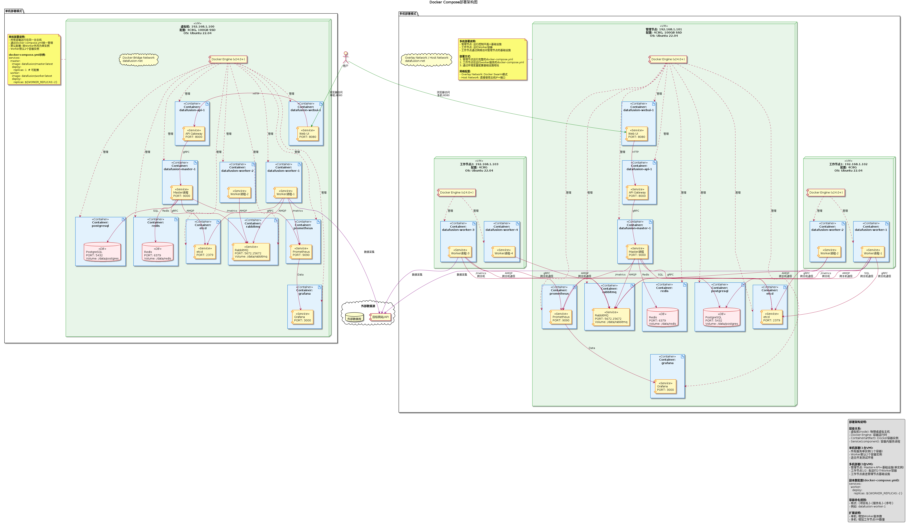

Docker Compose部署方式适用于开发测试环境和小规模生产场景，提供快速部署能力。

##### 2.3.2.1. 单机部署架构

所有服务部署在单台主机上，适合开发测试和演示环境。

**服务组成与默认配置:**
*   Web UI: 1-2副本（可配置）
*   API Gateway: 1-3副本（可配置）
*   Master服务: 3副本（可配置）
*   Worker服务: 1-10副本（可配置，根据任务量调整）
*   PostgreSQL: 1副本
*   Redis: 1副本
*   RabbitMQ: 1副本
*   etcd: 1副本
*   Prometheus: 1副本
*   Grafana: 1副本

**资源要求:**
*   最低配置: 2C4G, 50GB磁盘
*   推荐配置: 4C8G, 100GB SSD
*   高负载配置: 8C16G, 200GB SSD

**服务通信:**
*   使用Docker bridge网络实现服务间通信
*   通过服务名进行DNS解析
*   端口映射: Web UI(8080), API Gateway(8000), Grafana(3000)等

**数据持久化:**
*   数据库数据: `/data/postgres`
*   Redis数据: `/data/redis`
*   日志文件: `/var/log/datafusion`
*   配置文件: `/etc/datafusion`

##### 2.3.2.2. 多机分布式部署架构

适用于需要一定高可用性但不具备K8s条件的小规模生产环境。

**节点角色划分（可根据实际情况调整）:**

**管理节点（1-2台）:**
*   Master服务: 3副本（可配置）
*   API Gateway: 2-3副本（可配置）
*   Web UI: 1-2副本（可配置）
*   etcd: 1副本（多机可部署3副本集群）

**基础设施节点（1-3台）:**
*   PostgreSQL: 1主1从（可配置）
*   Redis: 单机或3节点Cluster（可配置）
*   RabbitMQ: 1-3节点（可配置）

**Worker节点（可扩展）:**
*   Worker服务: 每节点1-5副本（可配置）
*   根据任务量动态增减节点

**跨主机通信:**
*   方式1: Docker Swarm overlay网络
*   方式2: 主机网络 + 环境变量配置服务地址

**高可用配置（可选）:**
*   PostgreSQL: 主从复制
*   Redis: Sentinel或Cluster模式
*   RabbitMQ: 镜像队列
*   etcd: 3节点集群

**副本数配置方式:**
```yaml
# docker-compose.yml 示例
services:
  master:
    image: datafusion/master:latest
    deploy:
      replicas: ${MASTER_REPLICAS:-3}  # 可通过环境变量配置，默认3

  worker:
    image: datafusion/worker:latest
    deploy:
      replicas: ${WORKER_REPLICAS:-5}  # 可通过环境变量配置，默认5

  api-gateway:
    image: datafusion/api-gateway:latest
    deploy:
      replicas: ${API_REPLICAS:-2}  # 可通过环境变量配置，默认2
```

**部署步骤:**
1.  准备服务器环境（Docker 20.10+, Docker Compose 2.0+）
2.  配置网络连通性和防火墙规则
3.  根据需求调整配置文件中的副本数参数
4.  依次启动各节点服务
5.  验证服务健康状态和集群连通性

#### 2.3.3. Kubernetes + Helm部署方案

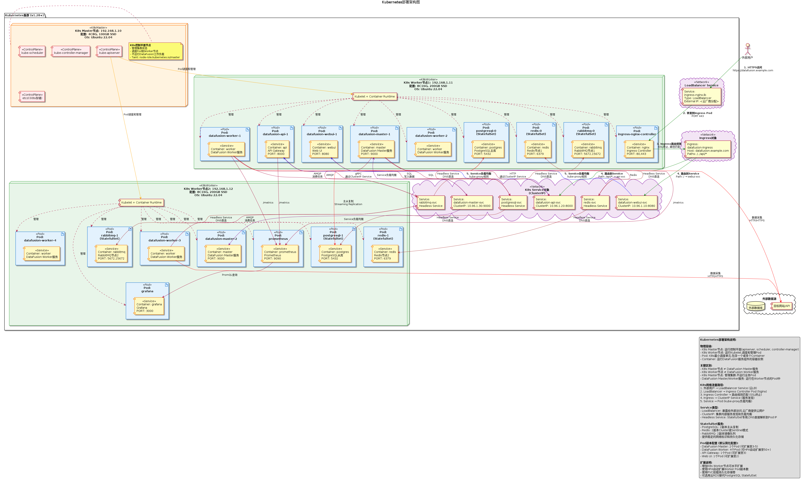

Kubernetes部署方式提供企业级的高可用、自动伸缩和运维能力，推荐用于生产环境。

##### 2.3.3.1. 集群化部署架构

**命名空间划分:**
*   `datafusion-app`: 应用服务层
*   `datafusion-infra`: 基础设施层
*   `datafusion-monitor`: 监控服务层

**无状态服务（Deployment）及默认副本配置:**
*   Web UI: 2副本（可配置）
*   API Gateway: 3副本（可配置）
*   Master: 3副本（可配置）
*   Worker: 5副本，支持HPA自动扩展至50副本（可配置min/max）

**有状态服务（StatefulSet）:**
*   etcd: 3副本（可配置）
*   RabbitMQ: 3副本（可配置）
*   Redis: 6副本Cluster模式（可配置）
*   PostgreSQL: 可使用云RDS或StatefulSet部署1主1从（可配置）

**资源配置（默认值，可调整）:**
*   Master: request 1C2G, limit 2C4G
*   Worker: request 2C4G, limit 4C8G
*   API Gateway: request 1C2G, limit 2C4G
*   Web UI: request 0.5C1G, limit 1C2G

##### 2.3.3.2. Helm Chart配置

**副本数配置（values.yaml）:**
```yaml
# 副本数配置
replicaCount:
  master: 3              # Master副本数，可配置
  apiGateway: 3          # API Gateway副本数，可配置
  webui: 2               # Web UI副本数，可配置
  worker:
    min: 5               # Worker最小副本数，可配置
    max: 50              # Worker最大副本数，可配置（HPA）

# 弹性伸缩配置
autoscaling:
  enabled: true          # 是否启用HPA
  minReplicas: 5         # 最小副本数，可配置
  maxReplicas: 50        # 最大副本数，可配置
  targetCPUUtilizationPercentage: 70     # CPU使用率目标，可配置
  targetMemoryUtilizationPercentage: 80  # 内存使用率目标，可配置

# 资源配置（可根据实际情况调整）
resources:
  master:
    requests:
      cpu: 1000m
      memory: 2Gi
    limits:
      cpu: 2000m
      memory: 4Gi
  worker:
    requests:
      cpu: 2000m
      memory: 4Gi
    limits:
      cpu: 4000m
      memory: 8Gi
```

**多环境配置示例:**
*   `values-dev.yaml`: 开发环境（最小副本数，降低资源配置）
*   `values-prod.yaml`: 生产环境（完整副本数，完整资源配置）

**部署命令:**
```bash
# 使用默认配置部署
helm install datafusion ./datafusion-chart

# 自定义副本数部署
helm install datafusion ./datafusion-chart \
  --set replicaCount.master=5 \
  --set replicaCount.worker.min=10 \
  --set replicaCount.worker.max=100

# 使用环境配置文件部署
helm install datafusion ./datafusion-chart \
  --values values-prod.yaml
```

##### 2.3.3.3. 核心特性

**集群化部署:**
*   所有无状态服务（Master, API, WebUI, Worker）以多副本形式部署
*   通过K8s的Deployment和Service实现负载均衡和故障转移
*   副本数可通过Helm values灵活配置

**有状态服务:**
*   数据库、消息队列、etcd等使用StatefulSet部署
*   或直接使用云厂商托管服务（推荐）
*   支持PVC持久化存储，数据可靠性高

**弹性伸缩:**
*   Worker节点支持HPA (Horizontal Pod Autoscaler)
*   根据CPU/内存使用率或自定义指标（如任务队列长度）自动扩缩容
*   最小/最大副本数可在values.yaml中配置

**滚动更新:**
*   支持零停机滚动更新
*   可配置更新策略（maxSurge, maxUnavailable）
*   快速回滚能力

**配置管理:**
*   使用K8s的ConfigMap和Secret管理应用配置和敏感信息
*   通过Helm统一管理多环境配置
*   配置变更自动触发Pod重启（可选）

#### 2.3.4. 部署方式选择建议

**选择Docker Compose的场景:**
*   ✅ 开发测试环境
*   ✅ 快速POC验证
*   ✅ 小规模生产（<100任务，1-5台服务器）
*   ✅ 无Kubernetes基础设施
*   ✅ 运维团队对Docker熟悉，对K8s不熟悉

**选择Kubernetes + Helm的场景:**
*   ✅ 中大规模生产环境（>100任务）
*   ✅ 需要高可用和自动故障恢复
*   ✅ 任务量波动大，需要弹性伸缩
*   ✅ 已有K8s集群基础设施
*   ✅ 需要滚动更新和快速回滚能力
*   ✅ 多环境管理需求（dev/staging/prod）

#### 2.3.5. 副本数配置原则

**默认配置说明:**
*   文档中提供的副本数为推荐的默认值
*   实际部署时应根据业务规模和资源情况灵活调整
*   两种部署方式均支持通过配置文件调整副本数

**配置调整建议:**

**小规模场景（<50任务）:**
*   Master: 1-3副本
*   Worker: 1-5副本
*   API Gateway: 1-2副本

**中等规模（50-200任务）:**
*   Master: 3副本
*   Worker: 5-20副本
*   API Gateway: 2-3副本

**大规模场景（>200任务）:**
*   Master: 3-5副本
*   Worker: 20-50副本（配置HPA）
*   API Gateway: 3-5副本

**性能监控指标:**
*   根据CPU/内存使用率动态调整
*   关注任务队列长度和处理延迟
*   Worker利用率保持在70-80%最佳

## 3. 模块设计

### 3.1. 核心场景时序图

为了更清晰地展示系统在关键场景下的交互流程，本节提供了完整的技术时序图。这些时序图覆盖了从数据采集、任务管理、数据处理到系统集成的全部核心场景，每个时序图都详细描述了组件间的交互细节、数据流转路径和异常处理逻辑，为开发团队提供清晰的实现指导。

时序图按功能分为四大类：
- **数据采集场景**：涵盖网页RPA采集、数据库同步、API采集和智能字段识别
- **任务管理场景**：包括任务创建、调度执行、手动触发和失败重试
- **数据处理场景**：覆盖数据清洗、查询导出和错误修正
- **系统集成场景**：支持MCP协议集成和移动端监控

#### 3.1.1. 数据采集场景

数据采集是DataFusion的核心能力，本节展示四种主要数据采集方式的完整技术流程。

##### 3.1.1.1. 网页数据源配置与RPA采集流程

**场景描述**

用户通过Web UI配置一个网页数据源，系统使用RPA技术（Playwright/Puppeteer）进行测试采集，验证配置正确性。此场景涵盖从用户提交配置、系统启动无头浏览器、渲染目标网页、提取数据、到返回测试结果的完整流程。

**参与组件**
- Web UI (Vue.js)
- API Gateway  (Gin/Go)
- Master节点 - 数据源管理服务
- PostgreSQL (配置存储)
- RabbitMQ (任务队列)
- Worker节点 - RPA采集器
- Playwright/Puppeteer (无头浏览器引擎)
- Target Website (目标网站)

**时序图**

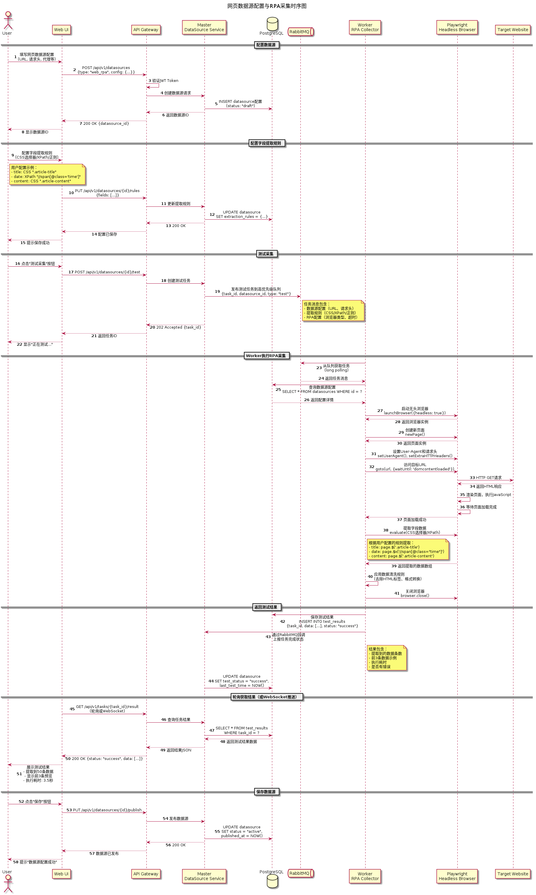

**关键技术点**

1. **异步测试执行**
   - 测试采集任务通过RabbitMQ高优先级队列异步执行
   - 前端通过轮询或WebSocket获取实时结果
   - 超时时间默认30秒，可配置

2. **RPA引擎选型**
   - 优先使用Playwright（支持多浏览器、重试机制更强）
   - Puppeteer作为备选（稳定性好、社区成熟）
   - 支持Headless模式（生产环境）和Headed模式（调试）

3. **数据提取引擎**
   - CSS选择器：使用Chromium内置选择器引擎（最快）
   - XPath：使用浏览器原生xpath解析器
   - 正则表达式：在提取结果上二次处理
   - 支持组合使用（先CSS定位容器，再XPath提取细节）

4. **错误处理**
   - 页面加载超时：重试3次，指数退避（5s, 10s, 20s）
   - 元素未找到：记录警告，继续执行其他字段提取
   - 浏览器崩溃：重启浏览器实例，重新执行
   - 网络错误：检测代理可用性，切换备用代理

5. **性能优化**
   - 禁用图片加载（可选，节省带宽）
   - 禁用CSS/字体加载（可选，加速渲染）
   - 使用浏览器缓存（同一域名多次访问）
   - Worker节点池化管理（预启动浏览器实例）

6. **安全性考虑**
   - Cookie加密存储在PostgreSQL
   - 代理认证信息使用AES加密
   - 限制目标URL白名单（防止SSRF攻击）
   - 资源配额控制（单次采集最大内存/CPU使用）

---

##### 3.1.1.2. 数据库数据源配置与同步流程

**场景描述**

用户通过Web UI配置一个数据库数据源（MySQL/PostgreSQL/Oracle等），系统测试数据库连接，执行SQL查询获取数据，并配置字段映射和增量同步策略。此场景展示了从连接测试、查询预览、字段映射到保存配置的完整流程。

**参与组件**
- Web UI (Vue.js)
- API Gateway (Gin/Go)
- Master节点 - 数据源管理服务
- PostgreSQL (配置存储)
- RabbitMQ (任务队列)
- Worker节点 - 数据库采集器
- Source Database (源数据库：MySQL/PostgreSQL/Oracle等)

**时序图**

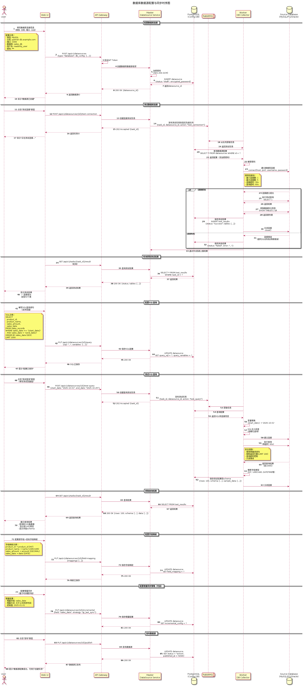

**关键技术点**

1. **连接池管理**
   - 使用成熟的连接池库（Go: `database/sql` 内置连接池）
   - 配置合理的连接数（最小1，最大5-10，根据负载调整）
   - 连接超时控制（连接超时30s，查询超时60s，可配置）
   - 连接空闲回收（空闲超过10分钟自动关闭）
   - 连接健康检查（Ping测试，失败自动重连）

2. **SQL注入防护**
   - 必须使用参数化查询/预编译语句（Prepared Statement）
   - 禁止直接拼接SQL字符串
   - 变量替换前进行类型检查和转义
   - 限制SQL语句类型（只允许SELECT，禁止DDL/DML）
   - 查询结果行数限制（测试时最多100行）

3. **增量同步算法**
   - **基于时间戳**：`WHERE update_time > last_sync_time`
   - **基于自增ID**：`WHERE id > last_max_id`
   - **基于删除标记**：`WHERE deleted_at IS NULL OR deleted_at > last_sync_time`
   - 首次同步支持指定初始值
   - 断点续传（记录上次同步位置到Redis）
   - 避免数据重复（使用UPSERT或主键冲突检查）

4. **大数据量处理**
   - 分批查询（每批1000-10000行，可配置）
   - 使用数据库游标（Cursor）流式读取
   - 避免一次性加载全部数据到内存
   - 支持LIMIT/OFFSET分页（注意性能问题）
   - 更优：基于索引字段的范围查询（`id > last_id LIMIT 10000`）

5. **跨数据库兼容性**
   - 抽象统一的数据库接口
   - 针对不同数据库类型的驱动：
     - MySQL: `go-sql-driver/mysql`
     - PostgreSQL: `lib/pq`
     - Oracle: `godror`
     - SQL Server: `denisenkom/go-mssqldb`
   - 处理不同数据库的SQL方言差异
   - 统一的数据类型映射（DB类型 → Go类型）

6. **安全性考虑**
   - 数据库密码AES-256-GCM加密存储
   - 密钥管理（使用环境变量或密钥管理服务）
   - 只使用只读账号（限制数据库权限）
   - 网络隔离（Worker通过VPN/专线访问源数据库）
   - 敏感数据脱敏（可选，如手机号、身份证号）
   - 审计日志（记录所有数据库操作）

#### 3.1.1.3. API数据源配置与采集流程

**场景描述**：用户配置RESTful API数据源，系统测试API调用并提取数据。支持多种认证方式（API Key、OAuth 2.0、Basic Auth）、JSONPath数据提取、多种分页策略和速率限制配置。

**参与组件**：
- Web UI（前端界面）
- API Gateway（网关服务）
- Master - DataSource Service（数据源管理服务）
- PostgreSQL（配置存储）
- RabbitMQ（消息队列）
- Worker - API Collector（API采集Worker）
- HTTP Client（resty库）
- Target API（目标API服务）

**时序图**：


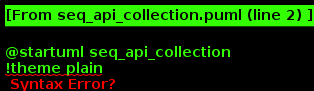

**关键技术点**：

1. **HTTP客户端选型**
   - Go语言使用resty库（基于net/http封装）
   - 支持连接池、超时控制、自动重试
   - 支持中间件（日志、指标、链路追踪）
   - 支持HTTP/2和连接复用

2. **OAuth 2.0流程实现**
   - 支持Client Credentials流程（服务端应用）
   - 支持Authorization Code流程（需要用户授权）
   - Token自动刷新（在过期前60秒主动刷新）
   - Token存储到Redis（支持分布式Worker共享）
   - PKCE扩展支持（增强安全性）

3. **JSONPath解析引擎**
   - 使用gjson库（高性能、零内存分配）
   - 支持复杂路径：`$.data.items[?(@.status=='active')].id`
   - 支持数组过滤和条件筛选
   - Schema自动推断（基于首批数据）
   - 类型转换（字符串→数字、时间戳→日期）

4. **分页策略自动检测**
   - 分析响应结构（total、page、next_cursor等字段）
   - 检测Link Header（RFC 5988）
   - 自动推断分页参数名称
   - 支持混合分页（第一页Page-based，后续Cursor-based）
   - 防止无限循环（最大页数限制、去重检测）

5. **Rate Limiting遵守**
   - 解析标准Rate Limit头（X-RateLimit-*、Retry-After）
   - Token Bucket算法（本地速率控制）
   - 分布式限流（Redis + Lua脚本）
   - 429错误自动重试（指数退避）
   - 动态速率调整（根据剩余配额）
   - 多租户隔离（不同数据源独立限流）

6. **响应Schema自动推断**
   - 分析首批数据推断字段类型
   - 支持嵌套JSON扁平化
   - 检测数组字段（需要展开）
   - 字段重命名建议（遵循命名规范）
   - 数据质量评估（空值率、重复率）
   - 生成数据字典（字段名、类型、示例、描述）

#### 3.1.1.4. 页面DOM解析与智能字段识别流程

**场景描述**：用户输入目标网页URL，系统自动渲染页面、解析DOM结构，并使用AI引擎智能识别数据字段（如标题、日期、作者、内容等），生成推荐的CSS选择器或XPath表达式，大幅简化数据源配置流程。

**参与组件**：
- Web UI（前端界面）
- API Gateway（网关服务）
- Master - DataSource Service（数据源管理服务）
- PostgreSQL（配置存储）
- RabbitMQ（消息队列）
- Worker - RPA Engine（RPA执行引擎）
- Playwright（无头浏览器）
- AI Field Recognizer（字段识别引擎）
- Target Website（目标网站）

**时序图**：

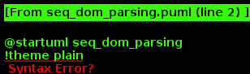

**关键技术点**：

1. **DOM树序列化**
   - 保留完整结构（标签、属性、文本、层级关系）
   - 过滤不相关信息（script、style、注释）
   - 压缩存储（去除空白、使用简写属性名）
   - 支持增量更新（仅序列化变化部分）
   - 数据结构优化（使用数组索引代替对象引用）

2. **重复模式识别算法**
   - LCS（最长公共子序列）计算结构相似度
   - 同级元素聚类分析（K-means或DBSCAN）
   - 结构指纹生成（基于标签序列、class组合）
   - 容错机制（允许部分字段缺失或顺序变化）
   - 性能优化（使用布隆过滤器预筛选、剪枝策略）

3. **字段类型推断**
   - 基于HTML语义标签（time、address、article等）
   - 基于class/id命名规则（title、price、author等）
   - 基于文本模式匹配（正则表达式库）
   - 基于元素属性（datetime、href、src等）
   - 可选：轻量级NLP模型（字段语义理解）
   - 类型优先级排序（语义标签 > 属性 > class > 文本模式）

4. **CSS选择器自动生成**
   - 生成最短唯一路径（避免过长选择器）
   - 优先使用语义化class/id（提高可读性和稳定性）
   - 避免使用绝对位置（nth-child(7)），优先使用相对位置
   - 支持复杂选择器（属性选择器、伪类、组合选择器）
   - 健壮性测试（在DOM子集上验证选择器唯一性）
   - 备选方案生成（提供2-3个候选选择器）

5. **置信度评分**
   - 多维度评分模型（结构一致性、字段数量、类型匹配度）
   - 权重可配置（根据实际效果调整）
   - 阈值分级（高/中/低置信度）
   - 人工反馈学习（记录用户调整，优化模型）
   - A/B测试（对比不同算法效果）

6. **可视化编辑器**
   - 页面截图高亮识别区域（使用不同颜色标记不同字段）
   - 点击元素直接生成选择器（类似浏览器DevTools）
   - 实时预览提取结果（所见即所得）
   - 选择器语法校验和提示
   - 支持拖拽调整字段顺序
   - 历史记录和撤销/重做功能

---

#### 3.1.2. 任务管理场景

任务管理是DataFusion的调度核心，本节展示任务从创建、调度、执行到失败处理的完整技术流程。

##### 3.1.2.1. 定时任务创建与调度流程

**场景描述**

用户通过Web UI创建一个定时任务，配置Cron表达式（如每天早上8点执行），系统验证配置、持久化任务信息、注册到调度器并计算下次执行时间。此场景展示了从任务配置、参数验证、分布式调度注册到状态同步的完整流程。

**参与组件**
- Web UI (Vue.js)
- API Gateway (Gin/Go)
- Master节点 - 任务管理服务
- PostgreSQL (任务配置存储)
- Scheduler Engine (调度引擎)
- Redis (状态缓存)
- etcd (分布式锁与服务发现)

**时序图**

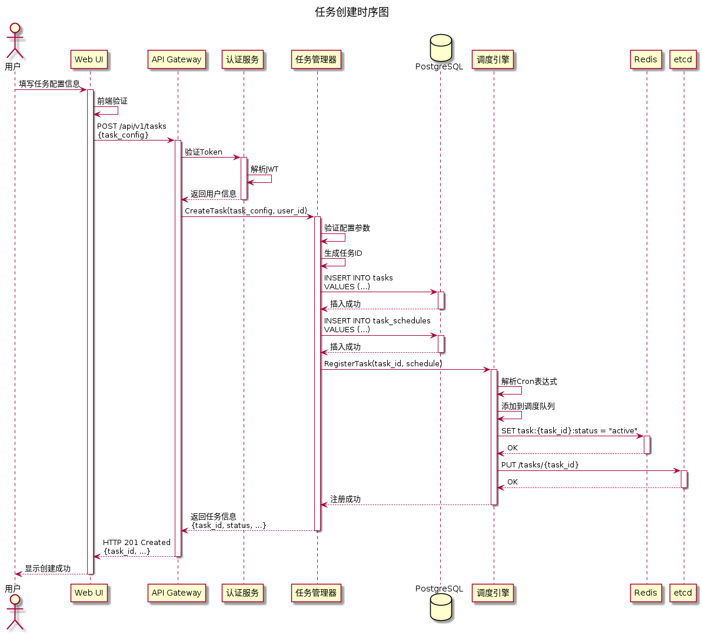

**关键技术点**

1. **Cron表达式解析与验证**
   - 使用Go语言的`robfig/cron`库解析标准Cron表达式
   - 支持秒级精度（6字段格式：秒 分 时 日 月 周）
   - 前端可视化编辑器（分钟/小时/日期/月份/星期选择器）
   - 实时预览下次执行时间（计算未来5次执行时间）
   - 时区支持（存储UTC时间，显示本地时区）
   - 特殊表达式处理（@daily, @hourly等快捷方式）

2. **etcd分布式锁机制**
   - 防止多个调度器节点重复调度同一任务
   - 使用etcd的lease机制实现锁（TTL=10秒）
   - 锁的key格式：`/locks/scheduler/{task_id}`
   - 获取锁失败时的重试策略（最多3次，间隔1秒）
   - 锁的自动续约（调度完成前每5秒续约）
   - 锁的优雅释放（调度完成后主动删除）

3. **调度器状态机**
   - 状态转换：idle → validating → scheduling → scheduled
   - 每个状态的职责明确（验证、加锁、计算、注册）
   - 异常状态处理（validating失败回退到idle）
   - 状态持久化到Redis（支持调度器故障恢复）
   - 状态可观测性（Prometheus指标暴露）

4. **优先级队列实现**
   - 内存数据结构：最小堆（heap），按next_run_time排序
   - 动态调整（任务新增/删除/更新时重新排序）
   - O(log n)时间复杂度的插入和删除
   - 队列头部检查（每秒轮询一次）
   - 支持百万级任务规模

5. **分布式环境下的状态同步**
   - Redis存储任务运行时状态（快速读写）
   - etcd存储任务配置和调度节点信息（强一致性）
   - PostgreSQL存储任务元数据（持久化）
   - 三层存储各司其职（性能、一致性、持久化平衡）
   - 数据最终一致性保证（异步同步机制）

6. **高可用调度架构**
   - 多个调度器节点部署（主备模式）
   - 主节点通过etcd选举产生（lease竞争）
   - 备节点实时监听主节点心跳（etcd watch机制）
   - 主节点故障时备节点自动接管（lease过期触发）
   - 平滑切换（30秒内完成故障转移）
   - 避免任务丢失（主节点故障时任务状态已持久化）

---

##### 3.1.2.2. 任务执行流程

**场景描述**

调度器根据任务配置的Cron表达式，到达执行时间后将任务推送到RabbitMQ优先级队列，Worker节点消费消息并执行完整的数据采集流程（采集→处理→存储），最后上报执行结果。此场景展示了从任务调度、Worker消费、数据处理到结果反馈的完整流程。

**参与组件**
- Scheduler Engine (调度引擎)
- RabbitMQ Priority Queue (优先级队列)
- Worker Node (工作节点)
- Collector Engine (采集引擎)
- Data Processor (数据处理器)
- Storage Engine (存储引擎)
- PostgreSQL (任务执行记录)
- Target DB/Storage (目标存储)
- Monitor Service (监控服务)
- Redis (状态缓存)

**时序图**

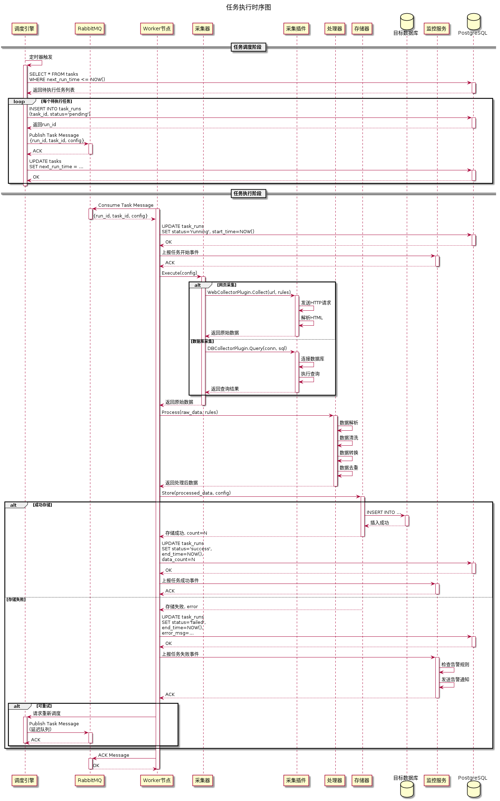

**关键技术点**

1. **RabbitMQ优先级队列设计**
   - 队列声明时设置`x-max-priority=10`参数
   - 优先级分配策略：
     - 手动触发任务：priority=10（最高）
     - 定时任务：priority=5（中等）
     - 重试任务：priority=3（较低）
     - 补采任务：priority=1（最低）
   - 消费端按优先级顺序消费（高优先级优先）
   - 注意：优先级队列会略微降低吞吐量（约10-15%）

2. **Worker健康检查机制**
   - Worker启动时向Redis注册（key: `worker:{worker_id}:heartbeat`）
   - 每10秒发送心跳包（SETEX TTL=30秒）
   - 心跳内容包含：timestamp, CPU使用率, 内存使用率, 执行中任务数
   - 监控服务定期扫描（每30秒）检测离线Worker
   - 离线Worker的任务重新入队（设置为pending状态）
   - Worker优雅关闭（SIGTERM信号处理，完成当前任务后退出）

3. **任务状态机管理**
   - 状态流转：pending → running → success/failed/retry_pending
   - 每次状态变更同时更新PostgreSQL和Redis
   - PostgreSQL保证持久化，Redis提供快速查询
   - 使用数据库事务保证状态一致性
   - 支持状态回滚（Worker崩溃时）
   - 僵尸任务检测（running状态超过30分钟自动标记为failed）

4. **实时状态推送**
   - Worker通过Monitor服务推送状态变更事件
   - Monitor维护WebSocket连接池
   - 状态推送到订阅了该任务的所有连接
   - 事件类型：task_start, task_progress, task_success, task_failed
   - 消息格式：JSON（包含run_id, status, progress, error等字段）
   - 推送失败处理（WebSocket断开时从连接池移除）

5. **资源配额管理**
   - Worker级别限制（最大并发任务数，默认5）
   - 任务级别限制（最大执行时间，默认30分钟）
   - 数据量限制（单次采集最大记录数，默认10万条）
   - 内存限制（单个任务最大内存使用，默认2GB）
   - 超限处理：
     - 超时：强制终止任务，标记为failed
     - 数据量过大：分批处理或拒绝执行
     - 内存超限：触发GC或OOM Killer

6. **失败恢复策略**
   - 采集失败：记录错误，进入重试流程（见3.1.2.4）
   - 处理失败：保留原始数据，仅处理阶段重试
   - 存储失败：回滚事务，整个任务重试
   - Worker崩溃：任务状态恢复为pending，重新入队
   - 数据库不可用：任务暂存到Redis，数据库恢复后补写
   - 降级策略：严重故障时跳过非关键步骤（如日志记录）

---

##### 3.1.2.3. 手动触发任务执行流程

**场景描述**

用户在Web UI的任务详情页面点击"立即执行"按钮，系统进行权限验证、任务状态检查、并发控制检查后，将任务以最高优先级推送到队列，Worker立即消费并执行，执行过程中通过WebSocket实时推送日志和状态到前端页面。

**参与组件**
- Web UI (Vue.js)
- WebSocket Server (实时通信)
- API Gateway (Gin/Go)
- Master节点 - 任务管理服务
- PostgreSQL (任务执行记录)
- Redis (状态缓存与WebSocket连接管理)
- RabbitMQ Priority Queue (高优先级队列)
- Worker Node (工作节点)
- Monitor Service (监控与推送服务)

**时序图**

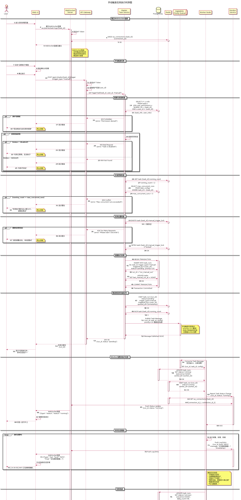

**关键技术点**

1. **WebSocket实时推送架构**
   - 前端页面进入时建立WebSocket连接（`ws://server/task-logs/{task_id}`）
   - 连接信息存储到Redis Set（key: `ws_connections:{task_id}`）
   - Worker通过Monitor服务推送日志和状态
   - Monitor查询Redis获取相关连接，批量推送
   - 支持多个用户同时查看同一任务的实时日志
   - 连接管理：超时断开（30分钟）、自动重连（客户端实现）

2. **任务去重机制**
   - 防止用户重复点击（前端按钮禁用5秒）
   - 后端防抖动锁（Redis SETEX `task:{task_id}:manual_trigger_lock` 5秒）
   - 检查任务是否已在队列中（查询Redis pending状态）
   - 检查任务是否正在执行（查询Redis running状态）
   - 幂等性保证（相同run_id的消息仅处理一次）

3. **高优先级队列机制**
   - 手动触发任务优先级设置为10（最高）
   - RabbitMQ按优先级排序消息
   - Worker优先消费高优先级消息
   - 确保手动任务秒级响应（通常3-5秒内开始执行）
   - 避免定时任务阻塞手动任务

4. **并发控制检查**
   - 任务级别并发限制（每个任务最大并发数，默认3）
   - Redis计数器（key: `task:{task_id}:running_count`）
   - 原子操作（INCR/DECR保证并发安全）
   - 超限时返回409 Conflict错误
   - 前端友好提示："任务执行数已达上限(2/3)，请稍后再试"
   - 执行完成后自动减少计数（无论成功或失败）

5. **实时日志流处理**
   - Worker执行过程中产生日志事件
   - 日志级别：DEBUG, INFO, WARNING, ERROR
   - 典型日志消息：
     - "开始执行任务"
     - "连接数据源成功"
     - "发送HTTP请求..."
     - "解析完成，提取到50条记录"
     - "数据清洗完成，有效记录48条"
     - "写入数据库成功"
   - 日志推送频率控制（避免过于频繁，最多每秒10条）
   - 日志持久化（存储到PostgreSQL或Elasticsearch，可配置）

6. **权限验证与审计**
   - JWT Token验证（从Authorization Header提取）
   - 用户角色检查（RBAC权限模型）
   - 权限矩阵：
     - Admin：可执行所有任务
     - Owner：可执行自己创建的任务
     - Viewer：仅可查看任务，不可执行
   - 操作审计日志（记录谁在何时执行了哪个任务）
   - 审计信息包含：user_id, task_id, run_id, ip_address, user_agent, timestamp
   - 审计日志保留90天

---

##### 3.1.2.4. 任务失败重试与告警流程

**场景描述**

任务执行失败后，系统根据配置的重试策略（指数退避算法）计算延迟时间，将任务推送到延迟队列进行重试。同时，监控服务根据告警规则（如连续失败3次、24小时内失败5次）评估是否触发告警，并通过邮件、短信、钉钉、企业微信等多渠道发送通知。

**参与组件**
- Worker Node (工作节点)
- PostgreSQL (任务执行记录与重试策略)
- Redis (失败统计与告警去重)
- Monitor Service (监控服务)
- Alert Manager (告警管理器)
- Rule Engine (规则引擎)
- RabbitMQ Delay Queue (延迟队列)
- Email Gateway (邮件网关)
- SMS Gateway (短信网关)
- DingTalk Bot (钉钉机器人)
- WeChat Work Bot (企业微信机器人)

**时序图**

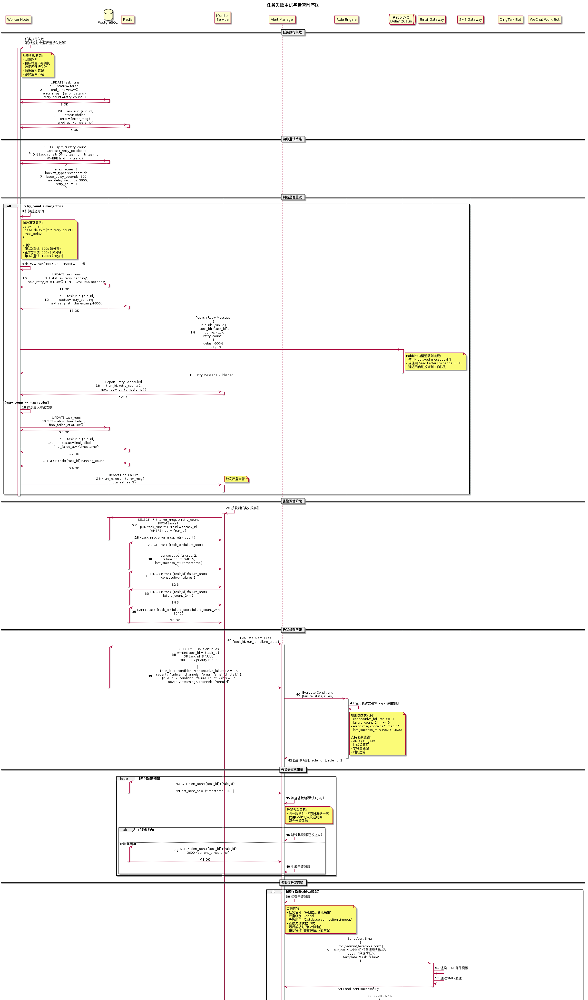

**关键技术点**

1. **指数退避算法**
   - 公式：`delay = min(base_delay * 2^retry_count, max_delay)`
   - 参数配置：
     - base_delay: 基础延迟时间（默认300秒，5分钟）
     - max_delay: 最大延迟时间（默认3600秒，60分钟）
     - max_retries: 最大重试次数（默认3次）
   - 实际延迟示例：
     - 第1次重试：300 * 2^0 = 300秒（5分钟）
     - 第2次重试：300 * 2^1 = 600秒（10分钟）
     - 第3次重试：300 * 2^2 = 1200秒（20分钟）
   - 避免重试风暴（所有失败任务同时重试）
   - 支持自定义退避策略（线性、固定间隔、斐波那契数列等）

2. **重试策略配置**
   - 数据库表：`task_retry_policies`
   - 字段：task_id, max_retries, backoff_type, base_delay_seconds, max_delay_seconds
   - 支持任务级别配置（不同任务不同策略）
   - 支持全局默认策略
   - 可配置重试条件（仅特定错误类型重试，如网络超时）
   - 不可重试错误：配置错误、权限错误、数据格式错误
   - 可重试错误：网络超时、目标服务不可用、数据库连接失败

3. **告警规则引擎**
   - 使用表达式引擎（Go语言`expr`库）动态评估规则
   - 支持的条件表达式：
     - `consecutive_failures >= 3`（连续失败次数）
     - `failure_count_24h >= 5`（24小时内失败次数）
     - `error_msg contains "timeout"`（错误消息匹配）
     - `last_success_at < now() - 3600`（最后成功时间）
   - 支持复杂逻辑：AND、OR、NOT
   - 规则优先级（高优先级规则先匹配）
   - 规则动态加载（从数据库读取，支持热更新）
   - 规则测试功能（创建规则前可测试表达式）

4. **多渠道告警通知**
   - **邮件通知**：
     - SMTP协议发送
     - 支持HTML模板（包含样式、图表）
     - 模板引擎：Go template
     - 支持批量发送（多个收件人）
     - 发送失败重试（最多3次）
   - **短信通知**：
     - 集成阿里云SMS、腾讯云SMS
     - 短信模板审核（运营商要求）
     - 短信内容限制（70字符以内）
     - 发送频率限制（避免骚扰，同一任务1小时最多1条）
   - **钉钉机器人**：
     - Webhook方式
     - 支持Markdown格式
     - 支持@指定人员
     - 支持链接跳转（查看详情、立即重试）
   - **企业微信机器人**：
     - 类似钉钉机器人
     - 支持卡片消息
     - 支持应用内通知

5. **告警去重与限流**
   - 防止告警风暴（同一规则短时间内重复触发）
   - Redis存储告警发送记录（key: `alert_sent:{task_id}:{rule_id}`）
   - 静默期机制（默认1小时内同一规则只发送一次）
   - 告警聚合（5分钟内多个任务失败，聚合为一条告警）
   - 告警升级（连续失败次数达到阈值时提升告警级别）
   - 告警恢复通知（任务从失败恢复为成功时发送恢复通知）

6. **降级与熔断策略**
   - **降级**：
     - 连续失败5次：降低执行频率（Cron从"每小时"改为"每4小时"）
     - 自动降级需人工审核
   - **熔断**：
     - 连续失败10次：自动暂停任务（status='paused'）
     - 发送Critical级别告警
     - 需人工介入恢复（检查问题并手动启用）
   - **数据源级别熔断**：
     - 同一数据源的多个任务同时失败
     - 标记数据源为不可用（datasource.status='unavailable'）
     - 暂停该数据源关联的所有任务
     - 定期健康检查（每10分钟）
     - 数据源恢复后自动恢复任务

---

#### 3.1.3. 数据处理场景

这类场景涵盖数据采集后的处理、查询、导出和数据质量管理。用户可以配置清洗规则对原始数据进行预处理，查询和导出采集结果，或标记错误数据触发重新采集。

##### 3.1.3.1. 数据清洗规则配置与执行流程

**场景描述**：用户为数据源配置清洗规则（如去除HTML标签、格式化日期、数据类型转换等），系统在采集时自动应用规则。用户可先在测试模式下预览清洗效果，确认无误后保存，Worker在后续采集中会自动应用这些规则。

**参与组件**：Web UI、Gateway、Master (Cleaner Service)、PostgreSQL、Redis、RabbitMQ、Worker、Data Processor

**时序图**

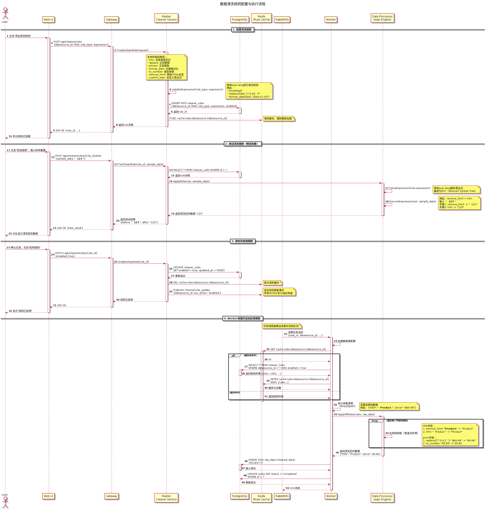

**关键技术点**：

1. **清洗规则DSL（expr-lang）**：
   - 使用Go的`expr-lang`库实现灵活的表达式引擎
   - 支持内置函数（trim、replace、extract、format_date等）
   - 语法校验确保表达式安全可执行
   - 示例：`trim(replace(field, '[^A-Za-z0-9]', ''))`

2. **管道式处理（Pipeline）**：
   - 同一字段可配置多条规则，按顺序串联执行
   - 前一条规则的输出作为后一条规则的输入
   - 规则优先级：数据类型转换 > 格式化 > 内容清洗
   - 支持短路机制：规则执行失败时记录警告但不中断流程

3. **规则缓存与热更新**：
   - Redis缓存规则列表，TTL=3600秒（1小时）
   - 规则变更时清除缓存并发布Pub/Sub事件
   - Worker订阅`channel:rule_update`频道，接收到事件立即刷新缓存
   - 避免每次采集都查询数据库，提升性能

4. **测试模式与预览**：
   - 用户可输入样本数据测试清洗效果
   - 实时预览清洗前后对比，支持多条规则串联测试
   - 确认无误后再启用，降低配置错误风险
   - 测试结果不持久化，仅用于UI显示

5. **错误处理与回退**：
   - 表达式执行失败时记录详细错误日志（字段名、规则、原始值）
   - 采用宽松策略：清洗失败保留原始值，不阻塞采集任务
   - 记录清洗失败统计（PostgreSQL的`cleaner_errors`表）
   - 支持全局开关：`cleaner.fail_strategy=skip/stop`

6. **性能优化**：
   - 表达式编译结果缓存（编译一次，多次执行）
   - 支持批量清洗：一次处理1000条数据，减少函数调用开销
   - 异步清洗模式：先存储原始数据，后台异步应用规则（可选）
   - 监控清洗耗时，超过阈值（100ms）触发告警

---

##### 3.1.3.2. 数据查询与导出流程

**场景描述**：用户在Web界面查询已采集的数据，应用筛选条件（如时间范围、关键词搜索）、排序和分页，查看结果后可选择导出为CSV格式。系统采用流式导出避免内存溢出，生成临时文件后返回下载链接，定时清理过期文件。

**参与组件**：Web UI、Gateway、Master (Query Service)、PostgreSQL、Redis、Object Storage (MinIO)、Async Task Queue

**时序图**

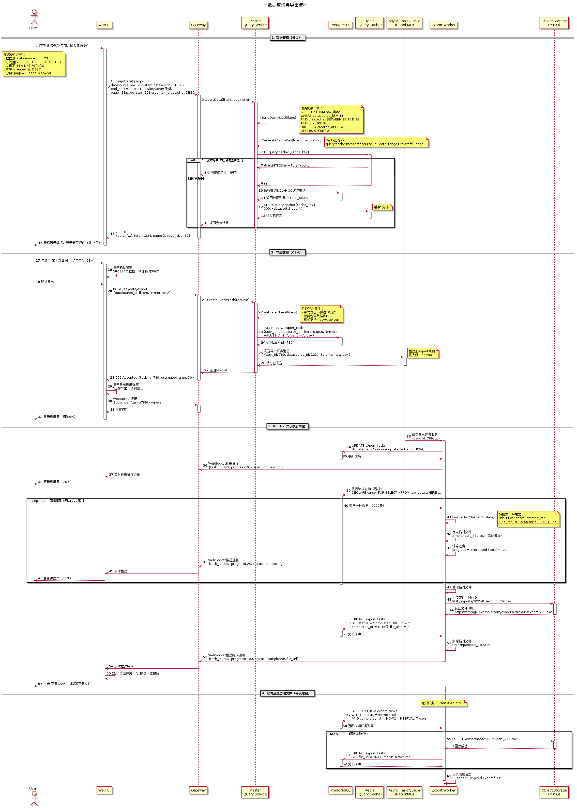

**关键技术点**：

1. **高效分页查询**：
   - 使用`LIMIT/OFFSET`实现分页，但`OFFSET`较大时性能下降
   - 优化方案：使用游标分页（Cursor-based Pagination）
   - 示例：`WHERE id > last_id ORDER BY id LIMIT 50`（避免OFFSET）
   - COUNT查询优化：先从Redis缓存读取，5分钟更新一次
   - 索引优化：为常用筛选字段（datasource_id、created_at）创建复合索引

2. **流式导出（Streaming Export）**：
   - 使用PostgreSQL游标（DECLARE CURSOR）避免一次性加载所有数据
   - 分批读取（每批1000条），边读边写临时文件，内存占用恒定
   - 临时文件路径：`/tmp/export_{task_id}.csv`，导出完成后删除
   - 支持断点续传：任务失败时记录已导出行数，重试时从断点继续
   - 大文件压缩：超过10MB自动压缩为`.csv.gz`格式

3. **异步任务队列**：
   - 导出任务推送到RabbitMQ的`export`队列，避免阻塞HTTP请求
   - 返回`202 Accepted`和`task_id`，前端轮询或WebSocket获取进度
   - Worker池：启动3个Export Worker并发处理导出任务
   - 任务优先级：手动触发导出 > 定时导出
   - 超时控制：单个导出任务最长执行10分钟，超时则标记失败

4. **WebSocket实时进度推送**：
   - 前端建立WebSocket连接订阅`/tasks/{task_id}/progress`
   - Worker每处理1000条数据推送一次进度更新
   - 推送内容：`{progress: 25, processed: 250, total: 1000, eta: '15s'}`
   - 连接断开重连机制：前端每5秒重试，最多重试3次
   - 进度计算：`progress = (processed_rows / total_rows) * 100`

5. **临时文件清理机制**：
   - 导出文件保留7天，过期自动删除（节省存储空间）
   - 定时任务：每天凌晨执行清理（Cron表达式：`0 0 * * *`）
   - 清理流程：查询`export_tasks`表 → 删除MinIO文件 → 更新状态为`expired`
   - 用户下载后可选择"立即删除"，释放存储空间
   - 异常处理：MinIO删除失败时记录日志，不中断清理流程

6. **查询缓存策略**：
   - Redis缓存查询结果，TTL=300秒（5分钟）
   - 缓存Key：`query:cache:md5(datasource_id+filters+page)`
   - 数据更新时清除相关缓存：`DEL query:cache:datasource:{id}:*`
   - 热点数据预热：常用查询结果预加载到缓存
   - 缓存击穿防护：使用分布式锁（Redis `SETNX`），避免并发查询DB

---

##### 3.1.3.3. 错误数据标记与重新采集流程

**场景描述**：用户在数据查看页面发现某些数据异常（如字段为空、格式错误、内容不完整），可以标记为错误数据并触发重新采集。系统会创建补采任务，Worker重新访问数据源获取最新数据，更新原有记录，保留历史版本用于审计。

**参与组件**：Web UI、Gateway、Master (Data Manager)、PostgreSQL、Redis、RabbitMQ、Worker、Data Collector

**时序图**

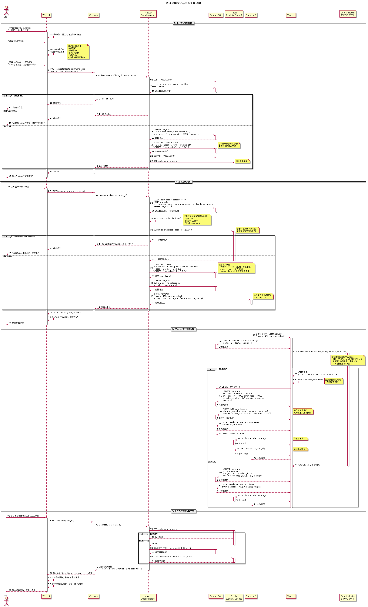

**关键技术点**：

1. **数据版本管理**：
   - 每次重新采集后`version`字段自增（初始为1）
   - `data_history`表保存所有历史版本快照（JSON格式）
   - 支持版本对比：前端可并排显示v1 vs v2差异
   - 支持版本回滚：管理员可回滚到任意历史版本（需审批）
   - 历史数据保留策略：默认保留30天，超过后自动归档

2. **幂等性保证（分布式锁）**：
   - 使用Redis `SETNX`设置分布式锁，Key为`lock:recollect:{data_id}`
   - 锁有效期5分钟，防止Worker崩溃导致死锁
   - 同一数据同时只能有一个补采任务执行
   - 任务完成后显式释放锁（`DEL lock:recollect:{data_id}`）
   - 锁冲突时返回`409 Conflict`，前端提示用户"正在处理"

3. **高优先级队列**：
   - 补采任务使用RabbitMQ的`x-priority`参数设置优先级（1-10）
   - 补采任务优先级=10（最高），常规采集任务优先级=5
   - Worker优先消费高优先级消息，确保快速响应用户操作
   - 队列配置：`x-max-priority: 10`（声明队列时设置）
   - 避免饥饿：高优先级任务过多时，定期插入普通任务

4. **数据源标识符提取**：
   - 不同数据源类型需要不同的标识符来定位原始数据：
     - **网页RPA**：存储原始URL（`source_identifier='https://example.com/product/123'`）
     - **数据库**：存储主键值（`source_identifier='id=123'`）
     - **API**：存储Resource ID（`source_identifier='/api/products/123'`）
   - 标识符存储在`raw_data.source_identifier`字段
   - 重新采集时使用标识符精确定位数据源

5. **错误原因分类与统计**：
   - 预定义错误原因枚举：`field_missing`、`format_error`、`incomplete`、`collect_failed`、`other`
   - 用户可选择原因并填写备注，便于分析常见问题
   - 后台统计各数据源的错误率：`error_rate = error_count / total_count`
   - 错误率超过阈值（10%）触发告警，提示检查数据源配置
   - Dashboard展示错误热力图：按数据源、时间维度聚合

6. **事务一致性**：
   - 使用PostgreSQL事务确保操作原子性：
     - 更新`raw_data`状态 + 插入`data_history` + 更新`tasks`状态
   - 任何步骤失败都会回滚，避免数据不一致
   - 使用`SELECT ... FOR UPDATE`行锁，防止并发修改
   - 事务隔离级别：`READ COMMITTED`（PostgreSQL默认）
   - 死锁检测：PostgreSQL自动检测并回滚一个事务

---

#### 3.1.4. 系统集成场景

这类场景涵盖DataFusion与外部系统的集成能力，包括通过MCP协议为AI应用提供数据服务，以及通过移动端应用实现随时随地的任务监控和管理。这些集成能力扩展了系统的应用范围，使DataFusion不仅是数据采集平台，也是企业数据服务的基础设施。

##### 3.1.4.1. MCP协议资源发现与数据查询流程

**场景描述**：AI应用通过MCP（Model Context Protocol）协议连接到DataFusion，首先调用`resources/list`接口发现所有可用的数据源资源，然后使用`data/query`接口查询符合条件的采集数据。查询支持过滤、分页和字段选择，返回标准化的JSON格式数据，并包含完整的元信息和Schema描述。系统使用Redis缓存查询结果，提升频繁查询的响应速度。

**参与组件**：AI Application、MCP Gateway (Go MCP SDK)、Master (MCP Service)、PostgreSQL、Redis (Query Cache)、Resource Manager

**时序图**

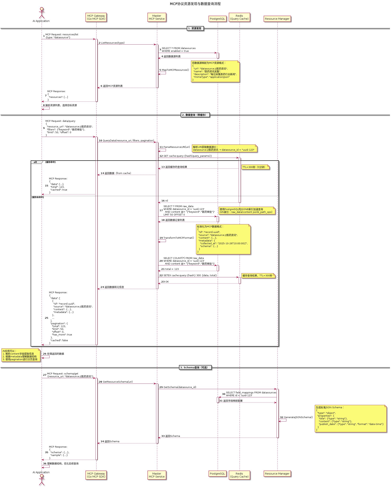

**关键技术点**：

1. **MCP Go SDK集成（Anthropic规范）**：
   - 基于Anthropic的MCP规范实现服务端：https://github.com/anthropics/mcp-golang
   - 实现标准接口：`resources/list`、`data/query`、`schema/get`
   - 支持JSON-RPC 2.0协议通信
   - 提供错误码标准化：参考MCP规范的错误码定义（-32700至-32000）
   - 兼容主流MCP客户端：LangChain MCP、Semantic Kernel等

2. **resources/list资源发现接口**：
   - 返回所有启用的数据源列表（`enabled = true`）
   - 资源URI格式：`datasource://{datasource_name}`
   - 提供资源元信息：名称、描述、MIME类型、更新时间
   - 支持type过滤：`datasource`、`task`、`collection`
   - 分页支持：`limit`和`offset`参数

3. **data/query标准化查询接口**：
   - 查询参数：
     - `resource_uri`：资源标识符（必填）
     - `filters`：过滤条件（JSON对象，支持JSONB查询）
     - `fields`：返回字段列表（可选，不指定则返回全部字段）
     - `limit`/`offset`：分页参数（默认50条/页，最大1000条）
     - `sort`：排序字段和方向（如`collected_at:desc`）
   - 返回格式：
     - `data`：数据记录数组，每条记录包含`id`、`source`、`content`、`metadata`
     - `pagination`：分页信息（total、limit、offset、has_more）
     - `cached`：是否来自缓存

4. **数据映射层（Task → MCP Resource）**：
   - 数据源（datasource）映射为MCP Resource
   - 采集任务（task）映射为MCP Resource（可选）
   - 数据记录（raw_data）映射为MCP Data对象
   - 统一资源标识符（URI）：`{type}://{identifier}`
   - 自动生成资源描述：从数据源配置中提取name和description

5. **查询缓存策略（Redis）**：
   - 缓存Key生成：`cache:query:{hash(resource_uri + filters + pagination)}`
   - 使用SHA256哈希确保Key唯一性
   - TTL设置：300秒（5分钟）
   - 缓存内容：JSON格式的查询结果（data + pagination）
   - 缓存失效：数据源更新时主动清除相关缓存
   - 缓存穿透保护：空结果也缓存（TTL=60秒）

6. **JSON Schema自动推断**：
   - 从`field_mappings`配置生成JSON Schema
   - 支持常见数据类型：string、number、boolean、object、array
   - 提供字段描述和示例值
   - 支持嵌套对象和数组结构
   - Schema版本管理：记录schema_version字段
   - 提供sample数据：返回1-3条样本记录帮助AI理解数据结构

##### 3.1.4.2. MCP数据订阅与实时推送流程

**场景描述**：AI应用通过WebSocket连接到MCP Gateway，使用`data/subscribe`接口订阅特定数据源的更新事件。订阅配置包括资源URI、过滤条件（如关键词、时间范围）、推送策略（批量大小、最大延迟）。Worker完成数据采集后，会发布事件到RabbitMQ，Subscription Manager消费事件并匹配所有相关订阅，将新数据通过WebSocket实时推送给AI应用。订阅支持心跳续期和主动取消。

**参与组件**：AI Application、MCP Gateway (WebSocket)、Master (Subscription Manager)、Redis (Subscription Store)、PostgreSQL、RabbitMQ (Event Stream)、Worker、WebSocket Server

**时序图**

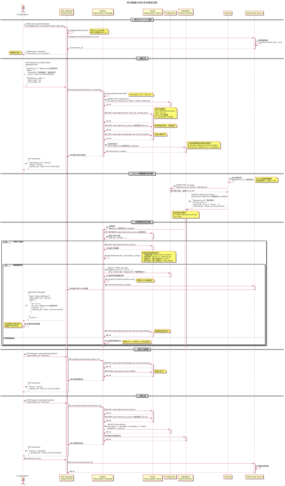

**关键技术点**：

1. **data/subscribe订阅管理**：
   - WebSocket连接建立：`wss://datafusion.com/mcp/ws?token={api_key}`
   - 订阅请求参数：
     - `resource_uri`：订阅的资源标识符
     - `filters`：推送过滤条件（keywords、date_range、custom_filters）
     - `notification_config`：推送配置（batch_size、max_delay、priority）
   - 返回subscription_id：用于后续管理（续期、取消）
   - 订阅生命周期：创建 → 活跃 → 暂停 → 取消
   - 支持一个客户端创建多个订阅

2. **Redis订阅存储（Hash + TTL）**：
   - 主存储：`HSET subscriptions:active {subscription_id} {config_json}`
   - 资源索引：`SADD subscriptions:by_resource:{resource_name} {subscription_id}`
   - 客户端索引：`SADD subscriptions:by_client:{client_id} {subscription_id}`
   - 心跳记录：`HSET subscriptions:heartbeat {subscription_id} {timestamp}`
   - TTL管理：订阅默认24小时过期，通过心跳续期
   - 最后推送时间：`HSET subscriptions:last_push {subscription_id} {timestamp}`

3. **推送条件匹配引擎**：
   - 关键词匹配：使用PostgreSQL的全文搜索（`@@ to_tsquery`）
   - 时间范围过滤：`collected_at >= since AND collected_at <= until`
   - 自定义过滤器：支持JSONB路径查询（`content @> filter_json`）
   - 批量策略：累计达到batch_size条数据后推送
   - 延迟策略：距离上次推送超过max_delay秒后推送（即使未达到batch_size）
   - 优先级支持：high优先级订阅立即推送（忽略batch_size）

4. **WebSocket连接池管理**：
   - 连接映射：`connections[client_id] = WebSocketConnection`
   - 连接验证：JWT Token验证，提取client_id
   - 心跳检测：每30秒ping/pong检查连接活跃度
   - 断线重连：客户端重连时恢复订阅（基于subscription_id）
   - 连接限制：单个客户端最多10个并发连接
   - 优雅关闭：连接关闭时自动暂停订阅（保留24小时）

5. **订阅心跳与自动清理**：
   - 心跳接口：`subscription/heartbeat {subscription_id}`
   - 心跳间隔：建议5分钟一次
   - 超时清理：超过1小时无心跳的订阅自动暂停
   - 垃圾回收：超过24小时的暂停订阅自动删除
   - 后台任务：每小时扫描一次`subscriptions:heartbeat`，清理过期订阅
   - 清理通知：通过WebSocket发送`subscription.expired`事件

6. **推送限流（Rate Limiting）**：
   - 令牌桶算法：每个订阅独立限流
   - 默认速率：最多每秒推送10条消息
   - Burst支持：允许短时间内推送最多50条消息
   - Redis实现：`HSET rate_limit:sub:{id} tokens {count}`
   - 限流响应：超过限制时延迟推送，记录到队列（FIFO）
   - 监控告警：限流触发时记录日志，Dashboard展示限流统计

##### 3.1.4.3. 移动端任务监控与推送通知流程

**场景描述**：用户在移动App上登录后，系统注册设备Token（Firebase FCM用于Android，APNs用于iOS）。当采集任务失败时，Alert Manager根据告警规则判断是否需要推送通知，通过Redis去重检查（1小时内相同任务不重复推送），然后调用FCM/APNs发送推送通知。用户点击通知后，App通过Deep Link跳转到任务详情页，查看失败原因并可快速重试任务（发送到高优先级队列）。

**参与组件**：Mobile User、Mobile App (iOS/Android)、Push Service (FCM/APNs)、Gateway、Master (Device Manager)、PostgreSQL、Redis (Push Dedup)、RabbitMQ、Worker、Monitor、Alert Manager

**时序图**

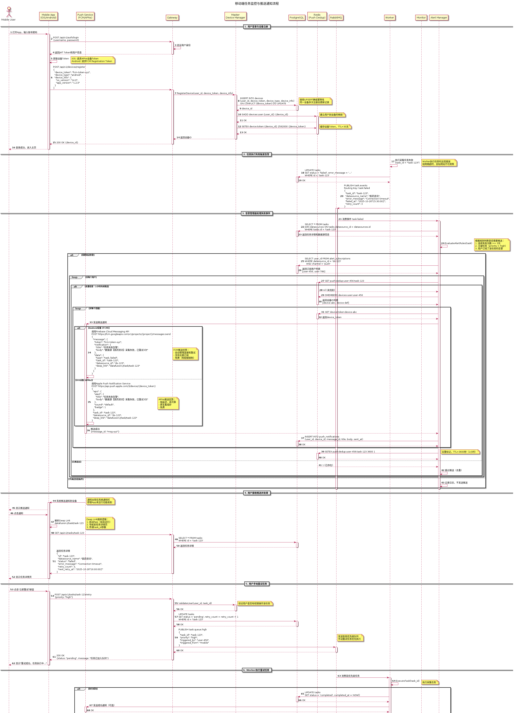

**关键技术点**：

1. **设备Token注册与管理**：
   - 注册接口：`POST /api/v1/devices/register`
   - 请求参数：
     - `device_token`：FCM Registration Token或APNs Device Token
     - `device_type`：android或ios
     - `device_info`：操作系统版本、App版本、设备型号等
   - 幂等性保证：使用`ON CONFLICT (device_token) DO UPDATE`
   - 用户设备映射：`SADD devices:user:{user_id} {device_id}`
   - Token缓存：`SETEX device:token:{device_id} 2592000 {token}`（TTL=30天）
   - Token刷新：App启动时检查Token变化，变化则重新注册

2. **Firebase Cloud Messaging (Android)**：
   - API端点：`https://fcm.googleapis.com/v1/projects/{project}/messages:send`
   - 认证方式：OAuth 2.0服务账号（service account JSON）
   - 消息格式：
     - `notification`：标题、正文、图标、声音
     - `data`：自定义数据（task_id、datasource_id、deep_link）
     - `android`：Android特定配置（优先级、TTL）
   - 优势：自动管理连接重试、支持主题订阅、免费使用
   - 限制：每分钟最多600,000条消息（可申请提额）

3. **Apple Push Notification Service (iOS)**：
   - API端点：`https://api.push.apple.com/3/device/{device_token}`
   - 认证方式：Token-based认证（.p8密钥文件）或Certificate-based认证（.p12证书）
   - 消息格式：
     - `aps.alert`：标题、正文
     - `aps.sound`：通知声音
     - `aps.badge`：App图标角标数字
     - 自定义字段：task_id、datasource_id、deep_link
   - 优势：低延迟（通常<1秒）、高可靠、原生集成好
   - 限制：消息大小最多4KB

4. **Deep Link跳转（datafusion://）**：
   - URL Scheme：`datafusion://task/{task_id}`
   - 支持的路径：
     - `datafusion://task/{task_id}`：跳转到任务详情页
     - `datafusion://datasource/{datasource_id}`：跳转到数据源详情页
     - `datafusion://alert/{alert_id}`：跳转到告警详情页
   - iOS实现：在`AppDelegate`中处理`application(_:open:options:)`
   - Android实现：在`AndroidManifest.xml`配置`<intent-filter>`，Activity中解析Intent
   - Web回退：如果App未安装，Deep Link重定向到Web页面

5. **推送消息去重（Redis）**：
   - 去重Key：`push:dedup:{user_id}:{task_id}`
   - TTL设置：3600秒（1小时）
   - 去重逻辑：发送推送前检查Key是否存在，存在则跳过
   - 去重范围：同一任务、同一用户、1小时内
   - 目的：避免短时间内重复推送相同任务失败通知
   - 例外：优先级为critical的告警不去重

6. **快速重试机制（高优先级队列）**：
   - 重试接口：`POST /api/v1/tasks/{task_id}/retry`
   - 权限验证：确认用户有权限操作该任务
   - 优先级队列：发送到`task.queue.high`，Worker优先消费
   - 任务状态更新：`status = 'pending'`，`retry_count++`
   - 审计日志：记录`triggered_by`（用户ID）和`triggered_from`（mobile）
   - WebSocket实时推送：如果用户保持前台运行，实时推送任务状态变化
   - 成功通知（可选）：任务执行成功后可选择发送成功推送

---

### 3.2. 核心模块设计

以下是系统的核心模块详细设计，各模块职责分明，通过定义好的接口进行协作。


#### 3.2.1. 任务管理模块 (Task Manager)

这是系统的核心控制模块，负责任务的全生命周期管理。

*   **功能:** 提供任务的增删改查、启动、停止等操作接口。维护任务的元数据，包括任务类型、数据源配置、采集规则、调度策略、存储方式等。
*   **实现:** 基于 Go 开发，通过 RESTful API 对外提供服务。任务元数据持久化到 PostgreSQL 数据库。

#### 3.2.2. 调度引擎模块 (Scheduler)

负责根据任务配置的调度策略，准时地触发任务执行。

*   **功能:** 解析任务的 Cron 表达式或定时配置，在指定时间生成待执行的任务实例，并将其推送到任务队列中。
*   **实现:** 基于 Go 开发，可使用 `robfig/cron` 等库实现定时调度。调度器会从数据库加载任务配置，并将待执行任务信息发送到 RabbitMQ。

##### 3.2.2.1. 并发控制机制

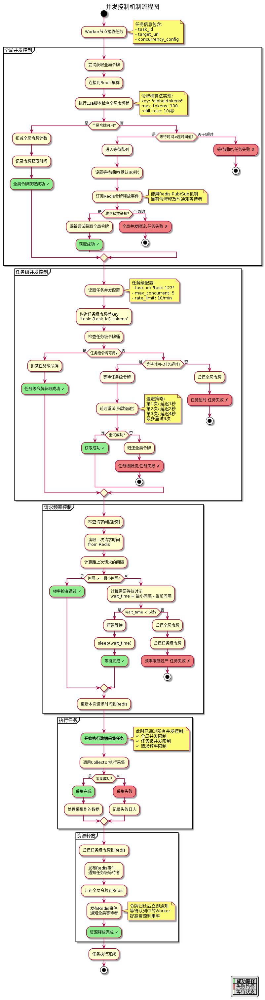

为了防止对目标网站或数据库造成过大压力，系统实现了多层次的并发控制：

1. **全局并发限制**
   *   使用Redis实现分布式令牌桶算法（Token Bucket）
   *   配置全局最大并发任务数（默认100）
   *   Worker节点在获取任务前先从Redis获取令牌
   *   任务执行完成后归还令牌

2. **任务级并发限制**
   *   每个采集任务可配置独立的并发数限制
   *   针对特定数据源的请求频率控制
   *   支持配置请求间隔（如每秒最多5个请求）

3. **技术实现**
   ```go
   type ConcurrencyController struct {
       redis      *redis.Client
       globalLimit int
       taskLimits  map[string]int
   }

   func (c *ConcurrencyController) AcquireToken(taskID string, timeout time.Duration) bool {
       // 先检查全局限制
       if !c.acquireGlobalToken(timeout) {
           return false
       }
       // 再检查任务级限制
       return c.acquireTaskToken(taskID, timeout)
   }
   ```

##### 3.2.2.2. 任务优先级队列

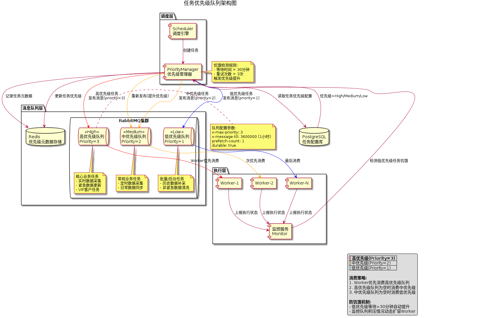

支持为不同任务设置优先级，确保核心业务任务优先执行：

1. **优先级定义**
   *   高优先级（High）: 优先级值 3
   *   中优先级（Medium）: 优先级值 2
   *   低优先级（Low）: 优先级值 1

2. **队列实现**
   *   使用RabbitMQ的优先级队列（Priority Queue）
   *   队列声明时设置`x-max-priority`参数为3
   *   发布消息时设置`priority`属性

3. **调度策略**
   *   优先级相同时按FIFO顺序执行
   *   高优先级任务可抢占Worker空闲资源
   *   避免低优先级任务饿死：当低优先级任务等待超过阈值时自动提升优先级

4. **技术实现**
   ```go
   // 声明优先级队列
   args := amqp.Table{"x-max-priority": 3}
   ch.QueueDeclare("task_queue", true, false, false, false, args)

   // 发布任务时设置优先级
   ch.Publish("", "task_queue", false, false, amqp.Publishing{
       Priority:    task.Priority, // 1, 2, or 3
       ContentType: "application/json",
       Body:        taskJSON,
   })
   ```

#### 3.2.3. 数据采集模块 (Collector)

这是 Worker 节点的核心，负责执行具体的数据采集工作。

*   **功能:** 从任务队列中获取任务，根据任务类型调用相应的采集插件。支持RPA采集、API采集、数据库采集等多种方式。
*   **实现:** 采用插件化架构。核心框架由 Go 实现，负责与 Master 通信、管理插件生命周期。具体的采集逻辑封装在独立的插件中（可由 Python 或 Go 编写），通过 gRPC 或标准输入输出与主框架通信。

##### 3.2.3.1. RPA采集技术方案

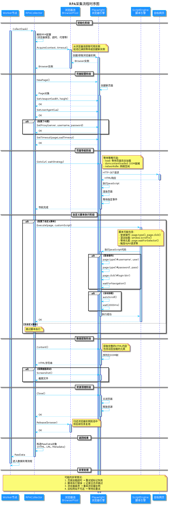

针对需要模拟用户操作的动态网页采集场景，系统提供完整的RPA解决方案：

1. **浏览器引擎选型**
   *   **Puppeteer**: 使用Node.js进程启动Headless Chrome，通过DevTools Protocol控制
   *   **Playwright**: 支持多浏览器（Chrome/Firefox/Safari），更强大的等待和重试机制
   *   推荐使用Playwright作为主要引擎，Puppeteer作为备选

2. **配置参数设计**
   ```json
   {
     "collection_method": "rpa",
     "rpa_config": {
       "browser_type": "chromium",          // chromium, firefox, webkit
       "headless": true,                    // 是否启用无头模式
       "enable_javascript": true,           // 是否执行JavaScript
       "load_images": true,                 // 是否加载图片
       "page_load_timeout": 30000,          // 页面加载超时（毫秒）
       "wait_strategy": "domcontentloaded", // load, domcontentloaded, networkidle
       "viewport": {
         "width": 1920,
         "height": 1080
       },
       "user_agent": "Mozilla/5.0...",
       "proxy": {
         "server": "http://proxy.example.com:8080",
         "username": "user",
         "password": "pass"
       },
       "custom_script": "await page.type('#username', 'user'); await page.click('#login');"
     }
   }
   ```

3. **自定义脚本执行引擎**
   *   脚本语言：JavaScript（Playwright/Puppeteer原生支持）
   *   沙箱执行：使用V8 isolates隔离执行环境
   *   内置工具函数：
     - `page.waitForSelector(selector, timeout)`: 等待元素出现
     - `page.type(selector, text)`: 模拟键盘输入
     - `page.click(selector)`: 模拟鼠标点击
     - `page.screenshot()`: 截图调试
     - `autoScroll()`: 自动滚动到页面底部

4. **技术实现**
   ```go
   type RPACollector struct {
       browserPool *BrowserPool  // 浏览器实例池
       scriptEngine *ScriptEngine
   }

   func (r *RPACollector) Collect(task *Task) (*RawData, error) {
       ctx, cancel := context.WithTimeout(context.Background(), task.RPAConfig.PageLoadTimeout)
       defer cancel()

       // 从浏览器池获取实例
       browser, err := r.browserPool.Acquire(ctx)
       if err != nil {
           return nil, err
       }
       defer r.browserPool.Release(browser)

       // 创建页面
       page, err := browser.NewPage()
       defer page.Close()

       // 设置代理、User-Agent等
       if err := r.setupPage(page, task.RPAConfig); err != nil {
           return nil, err
       }

       // 导航到目标URL
       if err := page.Goto(task.URL, playwright.PageGotoOptions{
           WaitUntil: task.RPAConfig.WaitStrategy,
           Timeout:   task.RPAConfig.PageLoadTimeout,
       }); err != nil {
           return nil, err
       }

       // 执行自定义脚本
       if task.RPAConfig.CustomScript != "" {
           if err := r.scriptEngine.Execute(page, task.RPAConfig.CustomScript); err != nil {
               return nil, err
           }
       }

       // 获取页面内容
       html, err := page.Content()
       return &RawData{HTML: html, URL: task.URL}, err
   }
   ```

##### 3.2.3.2. API采集技术方案

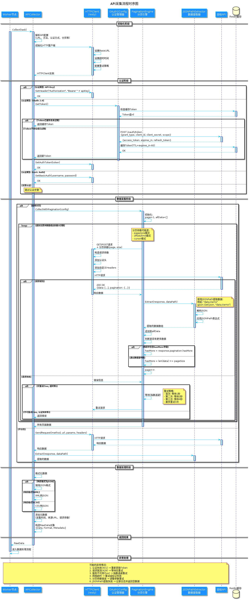

针对提供标准API接口的数据源，系统实现了完整的HTTP客户端框架：

1. **HTTP客户端设计**
   *   使用resty库，支持重试、超时、中间件等高级特性
   *   连接池复用：保持长连接，减少握手开销
   *   请求并发控制：使用worker pool限制并发数

2. **认证机制实现**

   **API Key认证**
   ```go
   // Header方式
   client.SetHeader("Authorization", "Bearer " + apiKey)
   client.SetHeader("X-API-Key", apiKey)

   // Query参数方式
   resp, err := client.R().
       SetQueryParam("api_key", apiKey).
       Get(url)
   ```

   **OAuth 2.0认证**
   ```go
   // Client Credentials Flow
   type OAuth2Config struct {
       ClientID     string
       ClientSecret string
       TokenURL     string
       Scopes       []string
   }

   func (o *OAuth2Config) GetToken() (*Token, error) {
       resp, err := client.R().
           SetFormData(map[string]string{
               "grant_type":    "client_credentials",
               "client_id":     o.ClientID,
               "client_secret": o.ClientSecret,
               "scope":         strings.Join(o.Scopes, " "),
           }).
           Post(o.TokenURL)
       // 解析token并缓存
   }
   ```

   **Basic Auth认证**
   ```go
   client.SetBasicAuth(username, password)
   ```

3. **分页处理引擎**
   ```go
   type PaginationConfig struct {
       Enabled      bool
       PageParam    string  // "page" or "offset"
       SizeParam    string  // "size" or "limit"
       PageSize     int
       MaxPages     int     // 0表示不限制
   }

   func (a *APICollector) CollectWithPagination(config *PaginationConfig) ([]*RawData, error) {
       var allData []*RawData
       page := 1

       for {
           data, hasMore, err := a.fetchPage(page, config)
           if err != nil {
               return nil, err
           }
           allData = append(allData, data)

           if !hasMore || (config.MaxPages > 0 && page >= config.MaxPages) {
               break
           }
           page++
       }
       return allData, nil
   }
   ```

4. **JSONPath数据提取**
   ```go
   import "github.com/tidwall/gjson"

   func ExtractByJSONPath(jsonData string, path string) (interface{}, error) {
       result := gjson.Get(jsonData, path)
       if !result.Exists() {
           return nil, fmt.Errorf("path not found: %s", path)
       }
       return result.Value(), nil
   }

   // 示例：提取data.items数组
   items := gjson.Get(jsonData, "data.items").Array()
   ```

5. **配置参数设计**
   ```json
   {
     "collection_method": "api",
     "api_config": {
       "url": "https://api.example.com/v1/data",
       "method": "GET",
       "auth_type": "api_key",          // api_key, oauth2, basic, none
       "auth_config": {
         "api_key": "xxxxxx",
         "header_name": "Authorization",
         "prefix": "Bearer "
       },
       "parameters": [
         {"name": "page", "value": "1", "type": "query"},
         {"name": "size", "value": "100", "type": "query"},
         {"name": "date", "value": "{today}", "type": "query"}
       ],
       "headers": {
         "Accept": "application/json",
         "User-Agent": "DataFusion/1.0"
       },
       "response_format": "json",
       "data_path": "data.items",       // JSONPath表达式
       "pagination": {
         "enabled": true,
         "page_param": "page",
         "size_param": "size",
         "page_size": 100,
         "max_pages": 10
       },
       "timeout": 30000,
       "retry": {
         "max_attempts": 3,
         "backoff": "exponential"
       }
     }
   }
   ```

##### 3.2.3.3. 采集器插件架构

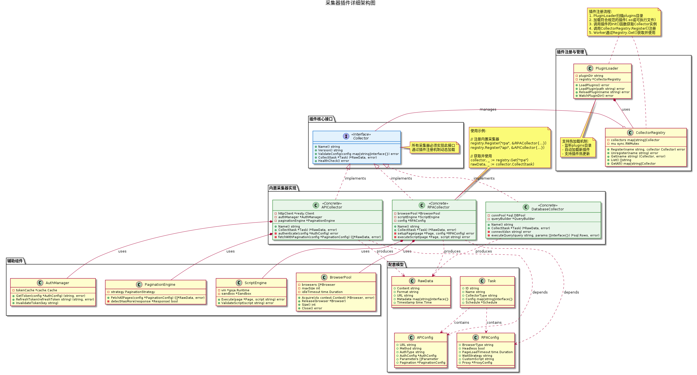

1. **采集器接口定义**
   ```go
   type Collector interface {
       // 采集器名称和版本
       Name() string
       Version() string

       // 验证配置
       ValidateConfig(config map[string]interface{}) error

       // 执行采集
       Collect(task *Task) (*RawData, error)

       // 健康检查
       HealthCheck() error
   }
   ```

2. **插件注册机制**
   ```go
   type CollectorRegistry struct {
       collectors map[string]Collector
       mu         sync.RWMutex
   }

   func (r *CollectorRegistry) Register(name string, collector Collector) error {
       r.mu.Lock()
       defer r.mu.Unlock()

       if _, exists := r.collectors[name]; exists {
           return fmt.Errorf("collector %s already registered", name)
       }
       r.collectors[name] = collector
       return nil
   }

   func (r *CollectorRegistry) Get(name string) (Collector, error) {
       r.mu.RLock()
       defer r.mu.RUnlock()

       collector, exists := r.collectors[name]
       if !exists {
           return nil, fmt.Errorf("collector %s not found", name)
       }
       return collector, nil
   }
   ```

3. **内置采集器**
   *   `rpa_collector`: RPA浏览器采集器
   *   `api_collector`: API HTTP采集器
   *   `database_collector`: 数据库查询采集器

4. **自定义插件开发**
   *   实现Collector接口
   *   编译为Go plugin或独立可执行文件
   *   放置在指定的plugins目录
   *   系统启动时自动加载和注册

#### 3.2.4. 数据处理模块 (Processor)

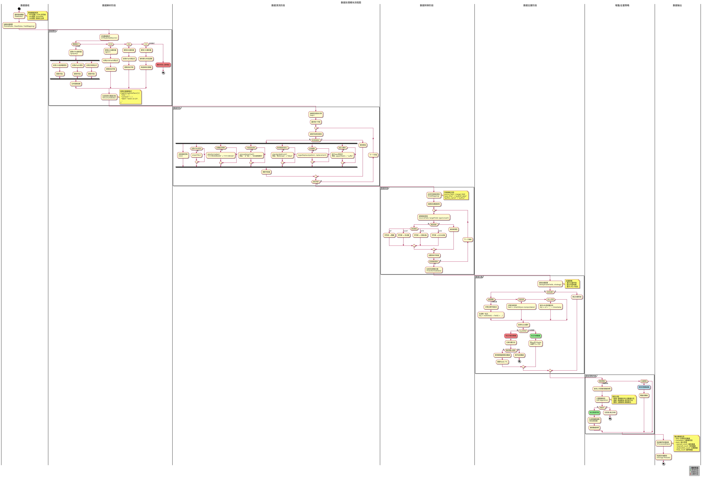

对采集到的原始数据进行结构化处理。

*   **功能:** 调用解析插件，对原始数据（HTML, JSON, XML 等）进行解析，提取目标字段。执行数据清洗、格式转换、去重等操作。
*   **实现:** 同样采用插件化设计。解析规则（如 XPath, CSS Selector, 正则表达式）作为任务配置的一部分，由解析插件加载并执行。

#### 3.2.5. 数据存储模块 (Storage)

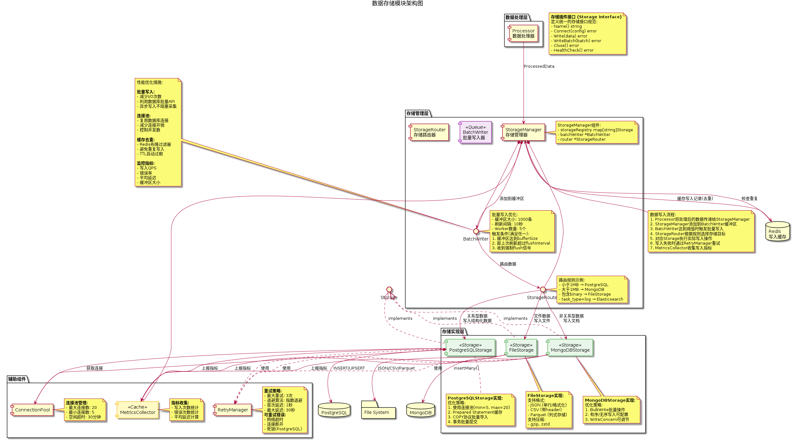

将处理干净的数据持久化到目标存储中。

*   **功能:** 将结构化数据写入到配置的目标存储系统。
*   **实现:** 采用插件化架构，支持多种存储目标。每个插件负责与一种特定的存储系统（如 PostgreSQL, MongoDB, CSV 文件）进行交互。

#### 3.2.6. 监控告警模块 (Monitor & Alerter)

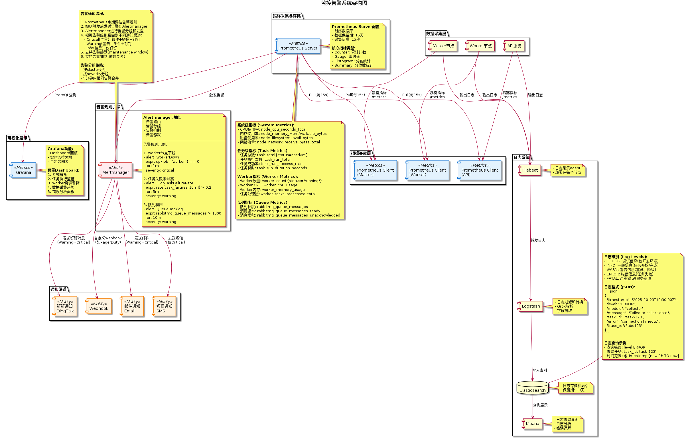

保障系统的稳定运行和问题的及时发现。

*   **功能:** 收集系统和任务的运行指标（Metrics），如任务成功率、采集耗时、数据量、节点资源使用率等。当指标超过预设阈值时，触发告警。
*   **实现:** 各个模块通过 Prometheus 客户端库暴露指标。Prometheus Server 定期抓取这些指标。Grafana 用于指标的可视化展示。Alertmanager 负责根据告警规则发送通知。

#### 3.2.7. Worker 内部流程

Worker 节点是数据采集的执行单元，其内部流程如下图所示：

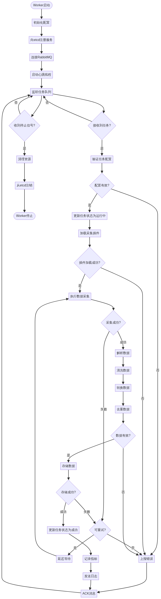

#### 3.2.8. 插件架构

为了实现系统的可扩展性，**DataFusion** 采用了插件化架构设计。核心功能模块（采集器、解析器、存储器）均通过插件接口进行扩展：

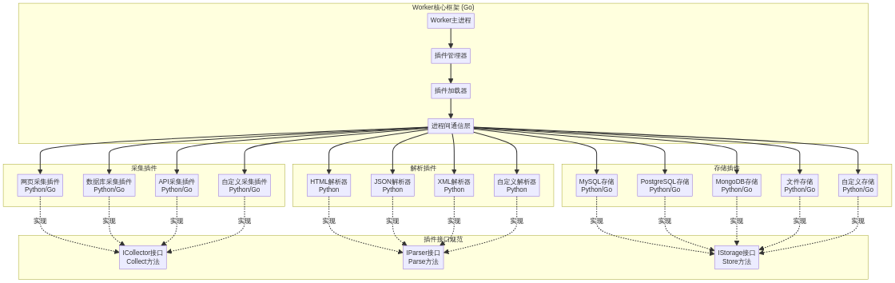

插件系统的设计使得开发者可以方便地扩展新的数据源类型、解析规则和存储目标，而无需修改核心代码。

### 3.3. 核心类设计

系统的核心业务逻辑通过以下类和接口进行建模：

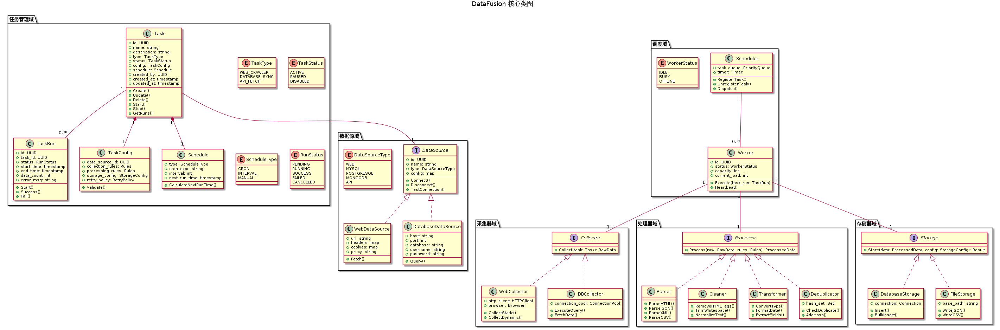

类图展示了系统的主要领域模型，包括任务管理域、数据源域、采集器域、处理器域、存储器域和调度域。各个类之间通过清晰的接口和依赖关系进行协作，体现了面向对象设计的封装、继承和多态原则。

### 3.4. 数据库设计

系统的核心业务数据将存储在 PostgreSQL 数据库中。以下是 E-R 设计：

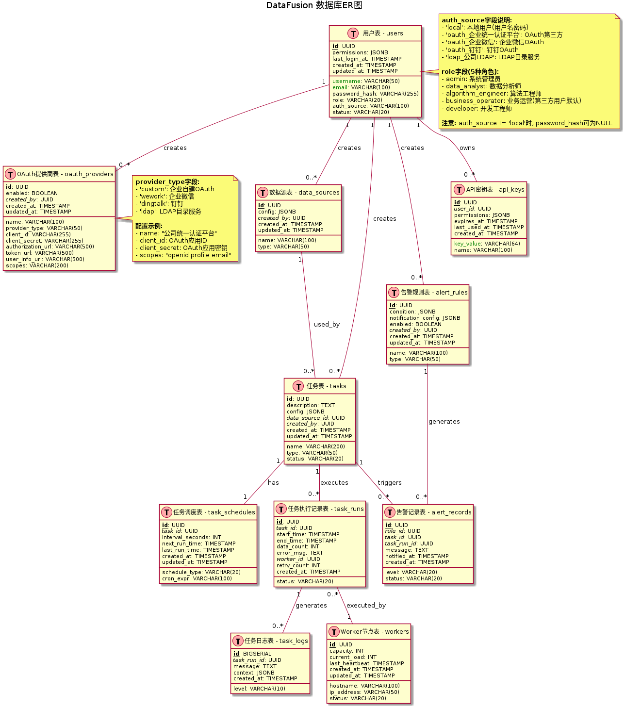

**核心实体:**

*   **`users`:** 用户表，存储用户信息和角色。支持本地用户和第三方OAuth/LDAP用户。
    - `auth_source`: 认证来源标识，取值如 'local'(本地)、'oauth_企业统一认证平台'(OAuth)、'ldap_公司LDAP'(LDAP)
    - `role`: 用户角色，支持5种角色：admin(系统管理员)、data_analyst(数据分析师)、algorithm_engineer(算法工程师)、business_operator(业务运营，第三方用户默认)、developer(开发工程师)
    - `permissions`: JSONB格式的权限配置，用于细粒度权限控制
    - `password_hash`: 密码哈希，仅本地用户需要，第三方用户可为NULL
    - `last_login_at`: 最后登录时间，用于会话管理和安全审计

*   **`oauth_providers`:** OAuth提供商配置表，存储企业SSO和LDAP配置信息。
    - `provider_type`: 提供商类型，支持 'custom'(企业自建OAuth)、'wework'(企业微信)、'dingtalk'(钉钉)、'ldap'(LDAP目录服务)
    - `client_id/client_secret`: OAuth应用凭证
    - `authorization_url/token_url/user_info_url`: OAuth协议端点
    - `scopes`: OAuth授权范围，如 "openid profile email"
    - `enabled`: 是否启用该提供商

*   **`data_sources`:** 数据源表，管理数据库、API 等连接信息。

*   **`tasks`:** 核心任务表，存储任务的定义和元数据。

*   **`task_schedules`:** 任务调度配置表。

*   **`task_runs`:** 任务执行历史记录表。

*   **`task_logs`:** 任务执行的详细日志。

*   **`api_keys`:** API密钥表，用于外部系统通过API Key方式调用。
    - `key_value`: API密钥字符串（64位随机字符）
    - `permissions`: JSONB格式的API权限配置
    - `expires_at`: 密钥过期时间
    - `last_used_at`: 最后使用时间，用于审计

*   **`workers`:** Worker节点表，记录Worker节点的状态和负载信息。

*   **`alert_rules`:** 告警规则表，配置系统告警规则。

*   **`alert_records`:** 告警记录表，记录触发的告警事件。

### 3.5. 安全设计

#### 3.5.1. 认证与授权


*   **用户认证:** 支持多种认证方式：
    - **本地用户认证:** 采用用户名密码+JWT机制。用户登录后获取有效期为24小时的Token，后续请求在HTTP Header的`Authorization`字段中携带。
    - **OAuth 2.0 SSO:** 支持与企业统一认证平台、企业微信、钉钉等OAuth提供商集成，实现单点登录。
    - **LDAP认证:** 支持企业LDAP目录服务集成，使用企业域账号登录。
    - 认证方式通过`users.auth_source`字段标识，OAuth/LDAP用户默认分配`business_operator`角色。

*   **API 认证:** 对于第三方系统的 API 调用，采用 API Key 认证。每个 API Key 关联到特定用户，并可配置权限范围和过期时间。

*   **权限控制:** 基于 RBAC (Role-Based Access Control) 模型。系统预定义5种用户角色，不同角色拥有不同的操作权限：

| 角色 | 角色标识 | 权限范围 | 典型场景 |
|------|---------|---------|---------|
| 系统管理员 | `admin` | 所有权限，包括用户管理、系统配置、OAuth提供商配置 | 系统运维人员 |
| 数据分析师 | `data_analyst` | 任务查看、数据查看、报表导出 | 数据分析人员 |
| 算法工程师 | `algorithm_engineer` | 任务管理、数据管理、数据源管理 | 算法建模人员 |
| 业务运营 | `business_operator` | 任务查看、任务执行、数据查看（**OAuth/LDAP用户默认角色**） | 业务运营人员 |
| 开发工程师 | `developer` | API调用、任务管理、插件开发 | 系统集成开发人员 |

#### 3.5.2. 数据安全

*   **敏感信息加密:** 数据库连接密码、API Key 等敏感信息在存储时使用 AES-256 算法加密，密钥通过环境变量或密钥管理服务（如 K8s Secret）注入。
*   **传输加密:** 所有外部通信（Web UI、API 调用）强制使用 HTTPS/TLS 1.3。
*   **SQL 注入防护:** 所有数据库操作使用参数化查询，禁止拼接 SQL 语句。
*   **XSS 防护:** 前端对所有用户输入进行转义和过滤。

### 3.6. 监控与运维

#### 3.6.1. 监控指标

系统需要监控的关键指标包括：

| 类别 | 指标名称 | 说明 |
| :--- | :--- | :--- |
| **任务指标** | `task_total` | 任务总数 |
| | `task_run_total` | 任务执行总次数 |
| | `task_run_success_rate` | 任务执行成功率 |
| | `task_run_duration_seconds` | 任务执行耗时（直方图） |
| | `task_data_count` | 任务采集数据量 |
| **系统指标** | `worker_count` | Worker 节点数量 |
| | `worker_cpu_usage` | Worker CPU 使用率 |
| | `worker_memory_usage` | Worker 内存使用率 |
| | `queue_length` | 任务队列长度 |
| | `api_request_total` | API 请求总数 |
| | `api_request_duration_seconds` | API 请求耗时 |

#### 3.6.2. 日志规范

*   **日志级别:** DEBUG, INFO, WARN, ERROR, FATAL
*   **日志格式:** 统一采用 JSON 格式，包含时间戳、级别、模块、消息、上下文等字段
*   **日志收集:** 所有服务的日志通过 Filebeat 收集并发送到 Elasticsearch
*   **日志保留:** 生产环境日志保留 30 天，归档后保留 1 年

#### 3.6.3. 告警规则

| 告警名称 | 触发条件 | 级别 | 通知方式 |
| :--- | :--- | :--- | :--- |
| Worker 节点下线 | Worker 心跳超时 > 1 分钟 | 严重 | 邮件 + 短信 |
| 任务失败率过高 | 近 10 分钟任务失败率 > 20% | 警告 | 邮件 |
| 任务队列积压 | 队列长度 > 1000 | 警告 | 邮件 |
| 磁盘空间不足 | 磁盘使用率 > 85% | 严重 | 邮件 + 短信 |
| 数据库连接失败 | 数据库连接失败 | 严重 | 邮件 + 短信 + 钉钉 |

#### 3.6.4. 运维工具

系统需要提供以下运维工具和命令：

*   `datafusion-cli task list`: 列出所有任务
*   `datafusion-cli task run <task_id>`: 手动触发任务
*   `datafusion-cli task logs <task_run_id>`: 查看任务日志
*   `datafusion-cli worker list`: 列出所有 Worker 节点
*   `datafusion-cli health check`: 系统健康检查
*   `datafusion-cli diagnose connectivity`: 诊断目标网站可访问性
*   `datafusion-cli diagnose database`: 诊断数据库连接状态

## 4. API 设计

系统提供一套完整的 RESTful API，支持第三方系统集成、自动化管理和企业SSO对接。所有API采用统一的设计规范、认证机制和错误处理体系。

### 4.1. API 设计原则

*   **RESTful风格:** 使用标准HTTP方法（GET、POST、PUT、DELETE），资源路径清晰明确
*   **版本控制:** API路径包含版本号 `/api/v1/`，保证向后兼容
*   **统一响应格式:** 所有API返回统一的JSON格式，包含code、message、data字段
*   **幂等性保证:** PUT和DELETE操作保证幂等性，POST操作提供幂等性key机制
*   **分页规范:** 列表查询统一使用 `page`、`page_size` 参数
*   **过滤排序:** 支持通用的 `filter`、`sort`、`order` 查询参数
*   **国际化支持:** 错误消息支持多语言，通过 `Accept-Language` Header控制

### 4.2. 全局统一响应格式

所有API响应遵循以下JSON格式：

```json
{
  "code": 10000,
  "message": "Success",
  "data": {
    // 业务数据
  },
  "request_id": "req-abc123-def456",
  "timestamp": "2025-10-24T10:30:00Z"
}
```

**字段说明:**
*   `code`: 业务状态码（5位数字），见4.3节错误码表
*   `message`: 状态描述信息，支持国际化
*   `data`: 业务数据，成功时包含实际返回数据，失败时可能包含错误详情
*   `request_id`: 请求追踪ID，用于日志排查和问题定位
*   `timestamp`: 响应时间戳，ISO 8601格式

### 4.3. 全局错误码系统

系统采用5位数字编码体系，按模块划分错误码段：

#### 4.3.1. 通用错误码 (10000-10999)

| 错误码 | 含义 | HTTP状态码 | 说明 |
|-------|------|-----------|------|
| 10000 | Success | 200 | 请求成功 |
| 10001 | Bad Request | 400 | 请求参数错误 |
| 10002 | Invalid JSON | 400 | JSON格式错误 |
| 10003 | Missing Required Field | 400 | 缺少必填字段 |
| 10004 | Invalid Field Type | 400 | 字段类型错误 |
| 10005 | Invalid Field Value | 400 | 字段值非法 |
| 10006 | Field Length Exceeded | 400 | 字段长度超限 |
| 10007 | Resource Not Found | 404 | 资源不存在 |
| 10008 | Resource Already Exists | 409 | 资源已存在 |
| 10009 | Internal Server Error | 500 | 服务器内部错误 |
| 10010 | Service Unavailable | 503 | 服务暂时不可用 |
| 10011 | Database Error | 500 | 数据库错误 |
| 10012 | Cache Error | 500 | 缓存服务错误 |
| 10013 | Message Queue Error | 500 | 消息队列错误 |
| 10014 | Request Timeout | 408 | 请求超时 |
| 10015 | Rate Limit Exceeded | 429 | 请求频率超限 |

#### 4.3.2. 认证授权错误码 (11000-11999)

| 错误码 | 含义 | HTTP状态码 | 说明 |
|-------|------|-----------|------|
| 11000 | Unauthorized | 401 | 未认证 |
| 11001 | Invalid Token | 401 | Token无效 |
| 11002 | Token Expired | 401 | Token已过期 |
| 11003 | Invalid API Key | 401 | API Key无效 |
| 11004 | API Key Expired | 401 | API Key已过期 |
| 11005 | Invalid Username or Password | 401 | 用户名或密码错误 |
| 11006 | Account Disabled | 403 | 账号已禁用 |
| 11007 | Account Locked | 423 | 账号已锁定 |
| 11008 | Forbidden | 403 | 无权限 |
| 11009 | Insufficient Permissions | 403 | 权限不足 |
| 11010 | OAuth Authorization Failed | 401 | OAuth授权失败 |
| 11011 | OAuth Provider Not Found | 404 | OAuth提供商不存在 |
| 11012 | OAuth Provider Disabled | 403 | OAuth提供商已禁用 |
| 11013 | OAuth Token Exchange Failed | 500 | OAuth令牌交换失败 |
| 11014 | LDAP Authentication Failed | 401 | LDAP认证失败 |
| 11015 | LDAP Server Unreachable | 503 | LDAP服务器不可达 |
| 11016 | LDAP Configuration Error | 500 | LDAP配置错误 |
| 11017 | Password Reset Required | 403 | 需要重置密码 |
| 11018 | MFA Required | 403 | 需要多因素认证 |

#### 4.3.3. 任务管理错误码 (12000-12999)

| 错误码 | 含义 | HTTP状态码 | 说明 |
|-------|------|-----------|------|
| 12000 | Task Not Found | 404 | 任务不存在 |
| 12001 | Task Already Exists | 409 | 任务已存在 |
| 12002 | Task Name Invalid | 400 | 任务名称非法 |
| 12003 | Task Config Invalid | 400 | 任务配置非法 |
| 12004 | Task Type Unsupported | 400 | 任务类型不支持 |
| 12005 | Task Status Invalid | 400 | 任务状态非法 |
| 12006 | Task Cannot Be Modified | 409 | 任务不可修改 |
| 12007 | Task Cannot Be Deleted | 409 | 任务不可删除 |
| 12008 | Task Running | 409 | 任务正在运行 |
| 12009 | Task Schedule Invalid | 400 | 调度配置非法 |
| 12010 | Cron Expression Invalid | 400 | Cron表达式非法 |
| 12011 | Task Dependency Cycle | 400 | 任务依赖循环 |
| 12012 | Task Quota Exceeded | 429 | 任务数量超限 |

#### 4.3.4. 数据源管理错误码 (13000-13999)

| 错误码 | 含义 | HTTP状态码 | 说明 |
|-------|------|-----------|------|
| 13000 | DataSource Not Found | 404 | 数据源不存在 |
| 13001 | DataSource Already Exists | 409 | 数据源已存在 |
| 13002 | DataSource Type Unsupported | 400 | 数据源类型不支持 |
| 13003 | DataSource Config Invalid | 400 | 数据源配置非法 |
| 13004 | DataSource Connection Failed | 500 | 数据源连接失败 |
| 13005 | DataSource Authentication Failed | 401 | 数据源认证失败 |
| 13006 | DataSource Cannot Be Deleted | 409 | 数据源不可删除(被任务引用) |
| 13007 | Database Connection String Invalid | 400 | 数据库连接串非法 |
| 13008 | API Endpoint Unreachable | 503 | API端点不可达 |

#### 4.3.5. 任务执行错误码 (14000-14999)

| 错误码 | 含义 | HTTP状态码 | 说明 |
|-------|------|-----------|------|
| 14000 | Task Run Not Found | 404 | 任务执行记录不存在 |
| 14001 | Task Execution Failed | 500 | 任务执行失败 |
| 14002 | Data Collection Failed | 500 | 数据采集失败 |
| 14003 | Data Parsing Failed | 500 | 数据解析失败 |
| 14004 | Data Storage Failed | 500 | 数据存储失败 |
| 14005 | Worker Not Available | 503 | Worker不可用 |
| 14006 | Worker Queue Full | 503 | Worker队列已满 |
| 14007 | Task Timeout | 408 | 任务执行超时 |
| 14008 | Target Website Unreachable | 503 | 目标网站不可达 |
| 14009 | Target Website Blocked | 403 | 目标网站已封禁 |
| 14010 | Plugin Not Found | 404 | 插件不存在 |
| 14011 | Plugin Execution Failed | 500 | 插件执行失败 |

#### 4.3.6. 用户管理错误码 (15000-15999)

| 错误码 | 含义 | HTTP状态码 | 说明 |
|-------|------|-----------|------|
| 15000 | User Not Found | 404 | 用户不存在 |
| 15001 | User Already Exists | 409 | 用户已存在 |
| 15002 | Username Invalid | 400 | 用户名非法 |
| 15003 | Email Invalid | 400 | 邮箱格式非法 |
| 15004 | Password Too Weak | 400 | 密码强度不足 |
| 15005 | Old Password Incorrect | 400 | 原密码错误 |
| 15006 | User Cannot Be Deleted | 409 | 用户不可删除(有关联资源) |
| 15007 | Role Invalid | 400 | 角色非法 |
| 15008 | Cannot Modify Third Party User | 403 | 不可修改第三方用户 |

#### 4.3.7. 监控告警错误码 (16000-16999)

| 错误码 | 含义 | HTTP状态码 | 说明 |
|-------|------|-----------|------|
| 16000 | Alert Rule Not Found | 404 | 告警规则不存在 |
| 16001 | Alert Rule Invalid | 400 | 告警规则非法 |
| 16002 | Alert Notification Failed | 500 | 告警通知发送失败 |
| 16003 | Metric Query Failed | 500 | 指标查询失败 |

### 4.4. 认证与授权 API

#### 4.4.1. 本地用户登录

**接口:** `POST /api/v1/auth/login`

**描述:** 使用用户名密码登录，获取JWT Token

**请求体:**
```json
{
  "username": "admin",
  "password": "password123"
}
```

**响应:**
```json
{
  "code": 10000,
  "message": "Login successful",
  "data": {
    "access_token": "eyJhbGciOiJIUzI1NiIsInR5cCI6IkpXVCJ9...",
    "refresh_token": "eyJhbGciOiJIUzI1NiIsInR5cCI6IkpXVCJ9...",
    "token_type": "Bearer",
    "expires_in": 86400,
    "user": {
      "id": "uuid-123",
      "username": "admin",
      "email": "admin@example.com",
      "role": "admin",
      "auth_source": "local",
      "permissions": ["*"]
    }
  }
}
```

**错误码:** 11005, 11006, 11007

#### 4.4.2. OAuth 2.0 单点登录

**接口1:** `GET /api/v1/auth/oauth/authorize`

**描述:** 获取OAuth授权URL，重定向用户到第三方登录页面

**查询参数:**
*   `provider`: OAuth提供商名称（企业统一认证平台、企业微信、钉钉）
*   `redirect_uri`: 授权回调地址（可选）

**响应:**
```json
{
  "code": 10000,
  "message": "Success",
  "data": {
    "authorization_url": "https://oauth.example.com/authorize?client_id=xxx&redirect_uri=xxx&state=xxx",
    "state": "random-state-string"
  }
}
```

**接口2:** `GET /api/v1/auth/oauth/callback`

**描述:** OAuth授权回调处理，交换access_token并创建会话

**查询参数:**
*   `code`: OAuth授权码
*   `state`: 状态参数（防CSRF）

**响应:** 同6.4.1本地登录响应格式

**新用户处理:**
*   首次登录自动创建用户记录
*   `auth_source` 设置为 `oauth_提供商名称`
*   `role` 默认设置为 `business_operator`
*   `password_hash` 设置为NULL

**错误码:** 11010, 11011, 11012, 11013

#### 4.4.3. LDAP 认证登录

**接口:** `POST /api/v1/auth/ldap/login`

**描述:** 使用企业LDAP账号登录

**请求体:**
```json
{
  "username": "zhangsan",
  "password": "ldap_password",
  "ldap_provider": "公司LDAP"
}
```

**响应:** 同6.4.1本地登录响应格式

**新用户处理:**
*   首次LDAP登录自动创建用户记录
*   `auth_source` 设置为 `ldap_公司LDAP`
*   从LDAP获取用户属性（email、cn等）
*   `role` 默认设置为 `business_operator`

**错误码:** 11014, 11015, 11016

#### 4.4.4. Token 刷新

**接口:** `POST /api/v1/auth/refresh`

**请求体:**
```json
{
  "refresh_token": "eyJhbGciOiJIUzI1NiIsInR5cCI6IkpXVCJ9..."
}
```

**响应:**
```json
{
  "code": 10000,
  "message": "Token refreshed",
  "data": {
    "access_token": "new_access_token",
    "refresh_token": "new_refresh_token",
    "expires_in": 86400
  }
}
```

**错误码:** 11001, 11002

#### 4.4.5. 退出登录

**接口:** `POST /api/v1/auth/logout`

**请求头:** `Authorization: Bearer {access_token}`

**响应:**
```json
{
  "code": 10000,
  "message": "Logout successful"
}
```

**说明:**
*   仅清除DataFusion会话，不登出企业SSO
*   Token加入黑名单直到过期

#### 4.4.6. API Key 创建

**接口:** `POST /api/v1/auth/api-keys`

**描述:** 创建API密钥，用于系统集成

**请求头:** `Authorization: Bearer {access_token}`

**请求体:**
```json
{
  "name": "生产环境集成",
  "permissions": ["tasks:read", "tasks:execute"],
  "expires_in_days": 365
}
```

**响应:**
```json
{
  "code": 10000,
  "message": "API Key created",
  "data": {
    "id": "uuid-789",
    "key_value": "df_prod_1a2b3c4d5e6f7g8h9i0j...",
    "name": "生产环境集成",
    "permissions": ["tasks:read", "tasks:execute"],
    "expires_at": "2026-10-24T10:30:00Z",
    "created_at": "2025-10-24T10:30:00Z"
  }
}
```

**权限控制:** 仅 `admin` 和 `developer` 角色可创建

**错误码:** 11009

#### 4.4.7. API Key 认证

**使用方式:** 在HTTP Header中携带API Key

```
X-API-Key: df_prod_1a2b3c4d5e6f7g8h9i0j...
```

**错误码:** 11003, 11004

### 4.5. 用户管理 API

#### 4.5.1. 获取用户列表

**接口:** `GET /api/v1/users`

**查询参数:**
*   `page`: 页码，默认1
*   `page_size`: 每页数量，默认20，最大100
*   `role`: 角色过滤，支持多个（逗号分隔）
*   `auth_source`: 认证来源过滤（local, oauth_*, ldap_*）
*   `status`: 状态过滤（active, disabled）
*   `keyword`: 关键词搜索（用户名、邮箱）
*   `sort`: 排序字段（created_at, last_login_at）
*   `order`: 排序方向（asc, desc）

**响应:**
```json
{
  "code": 10000,
  "message": "Success",
  "data": {
    "total": 156,
    "page": 1,
    "page_size": 20,
    "items": [
      {
        "id": "uuid-123",
        "username": "zhangsan",
        "email": "zhangsan@company.com",
        "role": "business_operator",
        "auth_source": "oauth_企业统一认证平台",
        "status": "active",
        "last_login_at": "2025-10-24T09:15:00Z",
        "created_at": "2025-10-01T10:00:00Z"
      }
    ]
  }
}
```

**权限控制:** 仅 `admin` 角色可访问

#### 4.5.2. 获取用户详情

**接口:** `GET /api/v1/users/{id}`

**响应:**
```json
{
  "code": 10000,
  "message": "Success",
  "data": {
    "id": "uuid-123",
    "username": "zhangsan",
    "email": "zhangsan@company.com",
    "role": "business_operator",
    "auth_source": "oauth_企业统一认证平台",
    "permissions": ["tasks:read", "tasks:execute"],
    "status": "active",
    "last_login_at": "2025-10-24T09:15:00Z",
    "created_at": "2025-10-01T10:00:00Z",
    "updated_at": "2025-10-24T09:15:00Z"
  }
}
```

**权限控制:** `admin` 可查看所有用户，其他角色仅可查看自己

**错误码:** 15000

#### 4.5.3. 创建用户（本地用户）

**接口:** `POST /api/v1/users`

**请求体:**
```json
{
  "username": "lisi",
  "email": "lisi@example.com",
  "password": "SecurePass123!",
  "role": "data_analyst",
  "auth_source": "local"
}
```

**响应:**
```json
{
  "code": 10000,
  "message": "User created",
  "data": {
    "id": "uuid-456",
    "username": "lisi",
    "email": "lisi@example.com",
    "role": "data_analyst",
    "auth_source": "local",
    "status": "active",
    "created_at": "2025-10-24T10:30:00Z"
  }
}
```

**权限控制:** 仅 `admin` 角色可创建

**错误码:** 15001, 15002, 15003, 15004, 15007

#### 4.5.4. 更新用户信息

**接口:** `PUT /api/v1/users/{id}`

**请求体:**
```json
{
  "email": "newemail@example.com",
  "role": "algorithm_engineer",
  "status": "disabled"
}
```

**响应:** 同6.5.2用户详情格式

**权限控制:**
*   `admin` 可更新所有用户
*   普通用户仅可更新自己的email
*   不可修改第三方用户的role（auth_source != 'local'）

**错误码:** 15000, 15003, 15007, 15008

#### 4.5.5. 删除用户

**接口:** `DELETE /api/v1/users/{id}`

**响应:**
```json
{
  "code": 10000,
  "message": "User deleted"
}
```

**权限控制:** 仅 `admin` 角色可删除

**业务规则:**
*   不可删除自己
*   不可删除有关联资源的用户（创建的任务、数据源等）

**错误码:** 15000, 15006

#### 4.5.6. 修改密码

**接口:** `POST /api/v1/users/{id}/change-password`

**请求体:**
```json
{
  "old_password": "OldPass123!",
  "new_password": "NewPass456!"
}
```

**响应:**
```json
{
  "code": 10000,
  "message": "Password changed"
}
```

**权限控制:**
*   用户可修改自己的密码
*   `admin` 可重置他人密码（不需要old_password）

**业务规则:**
*   仅本地用户（auth_source='local'）可修改密码
*   第三方用户在源系统修改密码

**错误码:** 15000, 15005, 15004, 15008

### 4.6. OAuth 提供商管理 API

#### 4.6.1. 获取OAuth提供商列表

**接口:** `GET /api/v1/oauth/providers`

**响应:**
```json
{
  "code": 10000,
  "message": "Success",
  "data": {
    "items": [
      {
        "id": "uuid-oauth1",
        "name": "企业统一认证平台",
        "provider_type": "custom",
        "enabled": true,
        "scopes": "openid profile email",
        "created_at": "2025-09-01T10:00:00Z"
      },
      {
        "id": "uuid-oauth2",
        "name": "企业微信",
        "provider_type": "wework",
        "enabled": true,
        "created_at": "2025-09-01T10:00:00Z"
      }
    ]
  }
}
```

**权限控制:** `admin` 可查看完整配置，其他角色仅看到name和enabled

#### 4.6.2. 创建OAuth提供商

**接口:** `POST /api/v1/oauth/providers`

**请求体:**
```json
{
  "name": "钉钉",
  "provider_type": "dingtalk",
  "client_id": "dingoa1234567890",
  "client_secret": "secret_abcdefg",
  "authorization_url": "https://oapi.dingtalk.com/connect/oauth2/sns_authorize",
  "token_url": "https://oapi.dingtalk.com/sns/gettoken",
  "user_info_url": "https://oapi.dingtalk.com/sns/getuserinfo",
  "scopes": "snsapi_login",
  "enabled": true
}
```

**响应:** 同6.6.1列表项格式

**权限控制:** 仅 `admin` 角色

**错误码:** 11011

#### 4.6.3. 更新OAuth提供商

**接口:** `PUT /api/v1/oauth/providers/{id}`

**请求体:** 同6.6.2创建请求体

**权限控制:** 仅 `admin` 角色

**错误码:** 11011

#### 4.6.4. 删除OAuth提供商

**接口:** `DELETE /api/v1/oauth/providers/{id}`

**权限控制:** 仅 `admin` 角色

**业务规则:** 不可删除有关联用户的提供商

**错误码:** 11011

### 4.7. 任务管理 API

#### 4.7.1. 创建任务

**接口:** `POST /api/v1/tasks`

**请求体:**
```json
{
  "name": "采集某电商平台商品数据",
  "description": "每日定时采集商品价格和库存",
  "type": "rpa",
  "data_source_id": "uuid-ds-001",
  "config": {
    "collection_method": "rpa",
    "url": "https://example.com/products",
    "rpa_config": {
      "browser_type": "chromium",
      "headless": true,
      "wait_strategy": "domcontentloaded"
    },
    "parse_rules": {
      "title": "css:.product-title",
      "price": "css:.product-price"
    }
  },
  "schedule": {
    "type": "cron",
    "cron_expr": "0 2 * * *"
  },
  "priority": 2,
  "retry_config": {
    "max_retries": 3,
    "retry_interval": 300
  }
}
```

**响应:**
```json
{
  "code": 10000,
  "message": "Task created",
  "data": {
    "id": "uuid-task-001",
    "name": "采集某电商平台商品数据",
    "type": "rpa",
    "status": "active",
    "created_at": "2025-10-24T10:30:00Z",
    "next_run_time": "2025-10-25T02:00:00Z"
  }
}
```

**权限控制:** `admin`, `algorithm_engineer`, `developer`

**错误码:** 12002, 12003, 12004, 12009, 12010, 12012

#### 4.7.2. 获取任务列表

**接口:** `GET /api/v1/tasks`

**查询参数:**
*   `page`, `page_size`: 分页参数
*   `type`: 任务类型过滤（rpa, api, database）
*   `status`: 状态过滤（active, paused, disabled）
*   `data_source_id`: 数据源过滤
*   `created_by`: 创建人过滤
*   `keyword`: 关键词搜索（任务名称）
*   `sort`: 排序（created_at, next_run_time, last_run_time）
*   `order`: asc/desc

**响应:**
```json
{
  "code": 10000,
  "message": "Success",
  "data": {
    "total": 48,
    "page": 1,
    "page_size": 20,
    "items": [
      {
        "id": "uuid-task-001",
        "name": "采集某电商平台商品数据",
        "type": "rpa",
        "status": "active",
        "schedule": {
          "type": "cron",
          "cron_expr": "0 2 * * *",
          "next_run_time": "2025-10-25T02:00:00Z"
        },
        "last_run": {
          "status": "success",
          "start_time": "2025-10-24T02:00:00Z",
          "data_count": 1523
        },
        "created_by": "zhangsan",
        "created_at": "2025-10-01T10:00:00Z"
      }
    ]
  }
}
```

**权限控制:** 所有角色可访问

#### 4.7.3. 获取任务详情

**接口:** `GET /api/v1/tasks/{id}`

**响应:**
```json
{
  "code": 10000,
  "message": "Success",
  "data": {
    "id": "uuid-task-001",
    "name": "采集某电商平台商品数据",
    "description": "每日定时采集商品价格和库存",
    "type": "rpa",
    "status": "active",
    "data_source_id": "uuid-ds-001",
    "data_source_name": "电商平台数据源",
    "config": {
      "collection_method": "rpa",
      "url": "https://example.com/products",
      "rpa_config": { /* ... */ },
      "parse_rules": { /* ... */ }
    },
    "schedule": {
      "type": "cron",
      "cron_expr": "0 2 * * *",
      "next_run_time": "2025-10-25T02:00:00Z",
      "last_run_time": "2025-10-24T02:00:00Z"
    },
    "priority": 2,
    "retry_config": {
      "max_retries": 3,
      "retry_interval": 300
    },
    "statistics": {
      "total_runs": 23,
      "success_runs": 21,
      "failed_runs": 2,
      "success_rate": 0.913,
      "avg_duration": 45.2,
      "total_data_count": 35029
    },
    "created_by": "zhangsan",
    "created_at": "2025-10-01T10:00:00Z",
    "updated_at": "2025-10-24T10:00:00Z"
  }
}
```

**权限控制:** 所有角色可访问

**错误码:** 12000

#### 4.7.4. 更新任务

**接口:** `PUT /api/v1/tasks/{id}`

**请求体:** 同6.7.1创建任务（可部分更新）

**响应:** 同6.7.3任务详情

**权限控制:** `admin`, `algorithm_engineer`, `developer`, 以及任务创建者

**业务规则:**
*   运行中的任务不可修改配置
*   修改schedule会重新计算next_run_time

**错误码:** 12000, 12003, 12006

#### 4.7.5. 删除任务

**接口:** `DELETE /api/v1/tasks/{id}`

**响应:**
```json
{
  "code": 10000,
  "message": "Task deleted"
}
```

**权限控制:** `admin`, 以及任务创建者

**业务规则:**
*   运行中的任务不可删除
*   删除任务会同时删除关联的执行记录和日志

**错误码:** 12000, 12007

#### 4.7.6. 手动触发任务

**接口:** `POST /api/v1/tasks/{id}/run`

**请求体（可选）:**
```json
{
  "priority": 3,
  "force": false
}
```

**响应:**
```json
{
  "code": 10000,
  "message": "Task triggered",
  "data": {
    "task_run_id": "uuid-run-001",
    "task_id": "uuid-task-001",
    "status": "pending",
    "created_at": "2025-10-24T10:35:00Z"
  }
}
```

**权限控制:** `admin`, `business_operator`, `algorithm_engineer`

**业务规则:**
*   `force=true` 可强制触发运行中的任务（创建新实例）
*   手动触发的任务优先级可覆盖默认值

**错误码:** 12000, 12008, 14006

#### 4.7.7. 暂停/恢复任务

**接口:** `POST /api/v1/tasks/{id}/pause` / `POST /api/v1/tasks/{id}/resume`

**响应:**
```json
{
  "code": 10000,
  "message": "Task paused",
  "data": {
    "id": "uuid-task-001",
    "status": "paused",
    "updated_at": "2025-10-24T10:40:00Z"
  }
}
```

**权限控制:** `admin`, `algorithm_engineer`, 以及任务创建者

**错误码:** 12000

#### 4.7.8. 获取任务执行历史

**接口:** `GET /api/v1/tasks/{id}/runs`

**查询参数:**
*   `page`, `page_size`: 分页参数
*   `status`: 状态过滤（pending, running, success, failed, timeout）
*   `start_time_from`, `start_time_to`: 时间范围过滤

**响应:**
```json
{
  "code": 10000,
  "message": "Success",
  "data": {
    "total": 23,
    "page": 1,
    "page_size": 20,
    "items": [
      {
        "id": "uuid-run-023",
        "task_id": "uuid-task-001",
        "status": "success",
        "start_time": "2025-10-24T02:00:00Z",
        "end_time": "2025-10-24T02:00:47Z",
        "duration": 47.3,
        "data_count": 1523,
        "worker_id": "worker-01",
        "retry_count": 0
      },
      {
        "id": "uuid-run-022",
        "task_id": "uuid-task-001",
        "status": "failed",
        "start_time": "2025-10-23T02:00:00Z",
        "end_time": "2025-10-23T02:02:15Z",
        "duration": 135.2,
        "error_msg": "Target website unreachable: connection timeout",
        "worker_id": "worker-02",
        "retry_count": 3
      }
    ]
  }
}
```

**权限控制:** 所有角色可访问

**错误码:** 12000

#### 4.7.9. 获取任务执行详情

**接口:** `GET /api/v1/task-runs/{run_id}`

**响应:**
```json
{
  "code": 10000,
  "message": "Success",
  "data": {
    "id": "uuid-run-023",
    "task_id": "uuid-task-001",
    "task_name": "采集某电商平台商品数据",
    "status": "success",
    "start_time": "2025-10-24T02:00:00Z",
    "end_time": "2025-10-24T02:00:47Z",
    "duration": 47.3,
    "data_count": 1523,
    "worker_id": "worker-01",
    "worker_hostname": "datafusion-worker-1",
    "retry_count": 0,
    "error_msg": null,
    "stages": [
      {
        "stage": "collection",
        "status": "success",
        "duration": 32.5,
        "message": "Collected 1523 raw records"
      },
      {
        "stage": "processing",
        "status": "success",
        "duration": 8.7,
        "message": "Parsed and cleaned 1523 records"
      },
      {
        "stage": "storage",
        "status": "success",
        "duration": 6.1,
        "message": "Stored 1523 records to database"
      }
    ],
    "created_at": "2025-10-24T02:00:00Z"
  }
}
```

**权限控制:** 所有角色可访问

**错误码:** 14000

#### 4.7.10. 获取任务执行日志

**接口:** `GET /api/v1/task-runs/{run_id}/logs`

**查询参数:**
*   `level`: 日志级别过滤（DEBUG, INFO, WARN, ERROR）
*   `limit`: 返回条数限制，默认100，最大1000

**响应:**
```json
{
  "code": 10000,
  "message": "Success",
  "data": {
    "logs": [
      {
        "timestamp": "2025-10-24T02:00:00.123Z",
        "level": "INFO",
        "message": "Task execution started",
        "context": {
          "task_id": "uuid-task-001",
          "worker_id": "worker-01"
        }
      },
      {
        "timestamp": "2025-10-24T02:00:32.456Z",
        "level": "INFO",
        "message": "Data collection completed",
        "context": {
          "records_collected": 1523,
          "duration_ms": 32500
        }
      },
      {
        "timestamp": "2025-10-24T02:00:47.789Z",
        "level": "INFO",
        "message": "Task execution completed successfully",
        "context": {
          "total_duration_ms": 47300,
          "data_count": 1523
        }
      }
    ]
  }
}
```

**权限控制:** 所有角色可访问

**错误码:** 14000

#### 4.7.11. 实时日志流（WebSocket）

**接口:** `WebSocket /api/v1/task-runs/{run_id}/logs/stream`

**连接头:** `Authorization: Bearer {access_token}`

**消息格式:**
```json
{
  "timestamp": "2025-10-24T02:00:32.456Z",
  "level": "INFO",
  "message": "Processing record 500/1523",
  "context": {
    "progress": 0.328
  }
}
```

**权限控制:** 所有角色可访问

**说明:**
*   WebSocket连接持续到任务执行完成
*   支持过滤level参数

#### 4.7.12. 停止任务执行

**接口:** `POST /api/v1/task-runs/{run_id}/stop`

**响应:**
```json
{
  "code": 10000,
  "message": "Task run stopped",
  "data": {
    "id": "uuid-run-023",
    "status": "stopped",
    "stopped_at": "2025-10-24T02:01:00Z"
  }
}
```

**权限控制:** `admin`, `algorithm_engineer`, 以及任务创建者

**错误码:** 14000

### 4.8. 数据源管理 API

#### 4.8.1. 创建数据源

**接口:** `POST /api/v1/datasources`

**请求体（数据库类型）:**
```json
{
  "name": "生产环境MySQL",
  "type": "mysql",
  "config": {
    "host": "db.example.com",
    "port": 3306,
    "database": "ecommerce",
    "username": "datafusion",
    "password": "encrypted_password",
    "ssl_enabled": true,
    "connection_pool_size": 10
  },
  "description": "生产环境主数据库"
}
```

**请求体（API类型）:**
```json
{
  "name": "OpenAPI数据源",
  "type": "api",
  "config": {
    "base_url": "https://api.example.com",
    "auth_type": "bearer",
    "auth_token": "api_token_xyz",
    "headers": {
      "User-Agent": "DataFusion/1.0"
    },
    "timeout": 30
  }
}
```

**响应:**
```json
{
  "code": 10000,
  "message": "DataSource created",
  "data": {
    "id": "uuid-ds-001",
    "name": "生产环境MySQL",
    "type": "mysql",
    "status": "active",
    "created_at": "2025-10-24T10:30:00Z"
  }
}
```

**权限控制:** `admin`, `algorithm_engineer`, `developer`

**错误码:** 13001, 13002, 13003

#### 4.8.2. 获取数据源列表

**接口:** `GET /api/v1/datasources`

**查询参数:**
*   `type`: 类型过滤（mysql, postgresql, api, mongodb等）
*   `status`: 状态过滤（active, disabled）
*   `keyword`: 关键词搜索

**响应:**
```json
{
  "code": 10000,
  "message": "Success",
  "data": {
    "total": 8,
    "items": [
      {
        "id": "uuid-ds-001",
        "name": "生产环境MySQL",
        "type": "mysql",
        "status": "active",
        "task_count": 5,
        "last_test_time": "2025-10-24T09:00:00Z",
        "last_test_status": "success",
        "created_by": "admin",
        "created_at": "2025-09-01T10:00:00Z"
      }
    ]
  }
}
```

**权限控制:** 所有角色可访问

#### 4.8.3. 获取数据源详情

**接口:** `GET /api/v1/datasources/{id}`

**响应:**
```json
{
  "code": 10000,
  "message": "Success",
  "data": {
    "id": "uuid-ds-001",
    "name": "生产环境MySQL",
    "type": "mysql",
    "config": {
      "host": "db.example.com",
      "port": 3306,
      "database": "ecommerce",
      "username": "datafusion",
      "password": "******",
      "ssl_enabled": true,
      "connection_pool_size": 10
    },
    "description": "生产环境主数据库",
    "status": "active",
    "task_count": 5,
    "created_by": "admin",
    "created_at": "2025-09-01T10:00:00Z",
    "updated_at": "2025-10-20T15:30:00Z"
  }
}
```

**权限控制:**
*   `admin`, `algorithm_engineer`, `developer` 可查看完整配置
*   其他角色仅可查看基本信息，config中的敏感字段（password）脱敏

**错误码:** 13000

#### 4.8.4. 更新数据源

**接口:** `PUT /api/v1/datasources/{id}`

**请求体:** 同6.8.1创建数据源

**响应:** 同6.8.3数据源详情

**权限控制:** `admin`, `algorithm_engineer`, 以及数据源创建者

**错误码:** 13000, 13003

#### 4.8.5. 删除数据源

**接口:** `DELETE /api/v1/datasources/{id}`

**响应:**
```json
{
  "code": 10000,
  "message": "DataSource deleted"
}
```

**权限控制:** `admin`, 以及数据源创建者

**业务规则:** 被任务引用的数据源不可删除

**错误码:** 13000, 13006

#### 4.8.6. 测试数据源连接

**接口:** `POST /api/v1/datasources/{id}/test`

**响应:**
```json
{
  "code": 10000,
  "message": "Connection test successful",
  "data": {
    "status": "success",
    "latency_ms": 45.3,
    "message": "Connected to MySQL 8.0.35",
    "tested_at": "2025-10-24T10:45:00Z"
  }
}
```

**错误响应示例:**
```json
{
  "code": 13004,
  "message": "DataSource connection failed",
  "data": {
    "status": "failed",
    "error": "dial tcp 192.168.1.100:3306: connect: connection refused",
    "tested_at": "2025-10-24T10:45:00Z"
  }
}
```

**权限控制:** `admin`, `algorithm_engineer`, `developer`

**错误码:** 13000, 13004, 13005

### 4.9. 监控与统计 API

#### 4.9.1. 系统概览

**接口:** `GET /api/v1/monitoring/overview`

**响应:**
```json
{
  "code": 10000,
  "message": "Success",
  "data": {
    "tasks": {
      "total": 48,
      "active": 42,
      "paused": 6,
      "running": 3
    },
    "task_runs": {
      "today": {
        "total": 156,
        "success": 148,
        "failed": 8,
        "success_rate": 0.949
      },
      "last_24h": {
        "total": 178,
        "success": 168,
        "failed": 10,
        "success_rate": 0.944
      }
    },
    "workers": {
      "total": 5,
      "online": 5,
      "offline": 0,
      "avg_cpu_usage": 0.45,
      "avg_memory_usage": 0.62
    },
    "data_collection": {
      "today_count": 125690,
      "yesterday_count": 118234,
      "growth_rate": 0.063
    },
    "queue": {
      "pending_tasks": 12,
      "avg_wait_time_seconds": 8.5
    }
  }
}
```

**权限控制:** 所有角色可访问

#### 4.9.2. Worker节点列表

**接口:** `GET /api/v1/monitoring/workers`

**响应:**
```json
{
  "code": 10000,
  "message": "Success",
  "data": {
    "items": [
      {
        "id": "worker-01",
        "hostname": "datafusion-worker-1",
        "ip_address": "192.168.1.11",
        "status": "online",
        "capacity": 10,
        "current_load": 3,
        "cpu_usage": 0.52,
        "memory_usage": 0.68,
        "tasks_processed_today": 35,
        "last_heartbeat": "2025-10-24T10:50:00Z",
        "uptime_seconds": 86400
      }
    ]
  }
}
```

**权限控制:** 所有角色可访问

#### 4.9.3. 任务统计数据

**接口:** `GET /api/v1/monitoring/tasks/{id}/statistics`

**查询参数:**
*   `time_range`: 时间范围（7d, 30d, 90d）
*   `metric`: 指标类型（run_count, success_rate, duration, data_count）

**响应:**
```json
{
  "code": 10000,
  "message": "Success",
  "data": {
    "task_id": "uuid-task-001",
    "time_range": "7d",
    "metrics": [
      {
        "date": "2025-10-24",
        "run_count": 1,
        "success_count": 1,
        "failed_count": 0,
        "success_rate": 1.0,
        "avg_duration": 47.3,
        "data_count": 1523
      },
      {
        "date": "2025-10-23",
        "run_count": 1,
        "success_count": 0,
        "failed_count": 1,
        "success_rate": 0.0,
        "avg_duration": 135.2,
        "data_count": 0
      }
    ]
  }
}
```

**权限控制:** 所有角色可访问

**错误码:** 12000

#### 4.9.4. Prometheus指标导出

**接口:** `GET /api/v1/metrics`

**格式:** Prometheus文本格式

**响应示例:**
```
# HELP datafusion_tasks_total Total number of tasks
# TYPE datafusion_tasks_total gauge
datafusion_tasks_total{status="active"} 42
datafusion_tasks_total{status="paused"} 6

# HELP datafusion_task_runs_total Total number of task runs
# TYPE datafusion_task_runs_total counter
datafusion_task_runs_total{status="success"} 1234
datafusion_task_runs_total{status="failed"} 56

# HELP datafusion_task_run_duration_seconds Task run duration
# TYPE datafusion_task_run_duration_seconds histogram
datafusion_task_run_duration_seconds_bucket{le="30"} 245
datafusion_task_run_duration_seconds_bucket{le="60"} 456
datafusion_task_run_duration_seconds_bucket{le="+Inf"} 500

# HELP datafusion_workers_online Number of online workers
# TYPE datafusion_workers_online gauge
datafusion_workers_online 5
```

**权限控制:** 公开访问（或通过API Key认证）

### 4.10. 通用规范

#### 4.10.1. 分页规范

所有列表接口统一使用以下分页参数：

*   `page`: 页码，从1开始，默认1
*   `page_size`: 每页数量，默认20，最大100

响应格式：
```json
{
  "code": 10000,
  "data": {
    "total": 156,
    "page": 1,
    "page_size": 20,
    "total_pages": 8,
    "has_next": true,
    "has_prev": false,
    "items": [ /* ... */ ]
  }
}
```

#### 4.10.2. 过滤和排序

*   **过滤:** 使用查询参数，支持精确匹配和模糊搜索
    - `status=active`: 精确匹配
    - `keyword=商品`: 模糊搜索（搜索name、description字段）
    - `role=admin,developer`: 多值匹配（逗号分隔）

*   **排序:** 使用 `sort` 和 `order` 参数
    - `sort=created_at&order=desc`: 按创建时间降序
    - `sort=name&order=asc`: 按名称升序

#### 4.10.3. 请求频率限制

根据用户类型设置不同的请求频率限制：

| 用户类型 | 限制 | 说明 |
|---------|------|------|
| 未认证请求 | 100次/小时 | 公开接口（如OAuth授权URL获取） |
| 普通用户 | 1000次/小时 | JWT Token认证 |
| API Key | 5000次/小时 | API Key认证 |
| 管理员 | 10000次/小时 | admin角色 |

超出限制返回：
```json
{
  "code": 10015,
  "message": "Rate limit exceeded",
  "data": {
    "limit": 1000,
    "remaining": 0,
    "reset_at": "2025-10-24T11:00:00Z"
  }
}
```

HTTP响应头包含限流信息：
```
X-RateLimit-Limit: 1000
X-RateLimit-Remaining: 245
X-RateLimit-Reset: 1729767600
```

#### 4.10.4. CORS跨域支持

API支持CORS跨域请求，允许的域名在系统配置中管理。

响应头示例：
```
Access-Control-Allow-Origin: https://app.example.com
Access-Control-Allow-Methods: GET, POST, PUT, DELETE, OPTIONS
Access-Control-Allow-Headers: Authorization, Content-Type, X-API-Key
Access-Control-Max-Age: 86400
```

#### 4.10.5. API版本控制

*   当前版本: `v1`
*   路径格式: `/api/v1/`
*   版本升级策略:
    - v1版本持续维护，保证向后兼容
    - 引入不兼容变更时发布v2版本
    - v1和v2同时提供服务至少6个月

#### 4.10.6. 时区和时间格式

*   所有时间字段使用UTC时区
*   时间格式: ISO 8601 (`2025-10-24T10:30:00Z`)
*   前端根据用户所在时区显示本地时间

#### 4.10.7. 幂等性设计

*   **GET、PUT、DELETE:** 天然幂等
*   **POST:** 支持幂等性Key机制

幂等性POST请求示例：
```http
POST /api/v1/tasks
Idempotency-Key: client-generated-uuid-123

{
  "name": "新任务"
}
```

相同Idempotency-Key的重复请求返回首次请求的结果，不会重复创建资源。

#### 4.10.8. 批量操作

部分接口支持批量操作，通过请求体数组实现：

```http
POST /api/v1/tasks/batch-delete

{
  "task_ids": ["uuid-1", "uuid-2", "uuid-3"]
}
```

响应包含每个操作的结果：
```json
{
  "code": 10000,
  "message": "Batch operation completed",
  "data": {
    "success_count": 2,
    "failed_count": 1,
    "results": [
      {"id": "uuid-1", "status": "success"},
      {"id": "uuid-2", "status": "success"},
      {"id": "uuid-3", "status": "failed", "error": "Task is running"}
    ]
  }
}
```

## 5. 性能优化

### 5.1. 采集性能优化

*   **连接池复用:** 对于数据库采集，使用连接池避免频繁创建连接。
*   **并发控制:** 根据目标网站的承载能力，合理设置并发数，避免被封禁。
*   **增量采集:** 对于支持增量的数据源，记录上次采集的时间戳或游标，只获取新增数据。
*   **缓存机制:** 对于不常变化的数据（如配置、规则），使用 Redis 缓存，减少数据库访问。

### 5.2. 存储性能优化

*   **批量写入:** 采集到的数据先缓存在内存中，达到一定数量（如 1000 条）或时间间隔（如 10 秒）后批量写入数据库。
*   **异步写入:** 数据存储操作异步执行，不阻塞采集流程。
*   **分库分表:** 对于数据量特别大的场景，可以对目标数据库进行分库分表设计。

### 5.3. 系统性能优化

*   **负载均衡:** 通过 Nginx 或 K8s Service 实现 API 和 Master 节点的负载均衡。
*   **资源限制:** 为每个 Pod 设置合理的 CPU 和内存限制，防止资源耗尽。
*   **弹性伸缩:** 根据任务队列长度或 CPU 使用率自动调整 Worker 节点数量。

## 6. 开发规范

### 6.1. 代码规范

*   **Go 代码:** 遵循 [Effective Go](https://go.dev/doc/effective_go) 和 [Uber Go Style Guide](https://github.com/uber-go/guide/blob/master/style.md)
*   **Python 代码:** 遵循 [PEP 8](https://peps.python.org/pep-0008/)
*   **代码审查:** 所有代码必须经过至少一名其他开发者的 Code Review 后才能合并

### 6.2. 测试规范

*   **单元测试:** 核心业务逻辑的单元测试覆盖率 > 80%
*   **集成测试:** 对关键流程（任务创建、执行、存储）编写集成测试
*   **性能测试:** 在正式发布前进行压力测试，确保满足性能指标

### 6.3. 版本管理

*   **分支策略:** 采用 Git Flow 模型，主要分支包括 `main`（生产）、`develop`（开发）、`feature/*`（特性）、`hotfix/*`（热修复）
*   **版本号:** 遵循语义化版本 (Semantic Versioning)，格式为 `MAJOR.MINOR.PATCH`

## 7. 总结

本文档详细描述了 **DataFusion** 系统的技术设计方案，涵盖了系统架构、模块设计、数据库设计、部署架构、安全设计、监控运维等各个方面。该设计方案基于成熟的技术栈和最佳实践，能够满足生产环境对高可用、高性能、高可靠的要求。

在后续的开发过程中，团队应严格遵循本文档的设计原则和规范，确保系统的质量和可维护性。同时，随着业务的发展和技术的演进，本文档也应该持续更新和完善。

---

**文档版本:** v1.0  
**编写日期:** 2025-10-23  
**作者:** zzy

