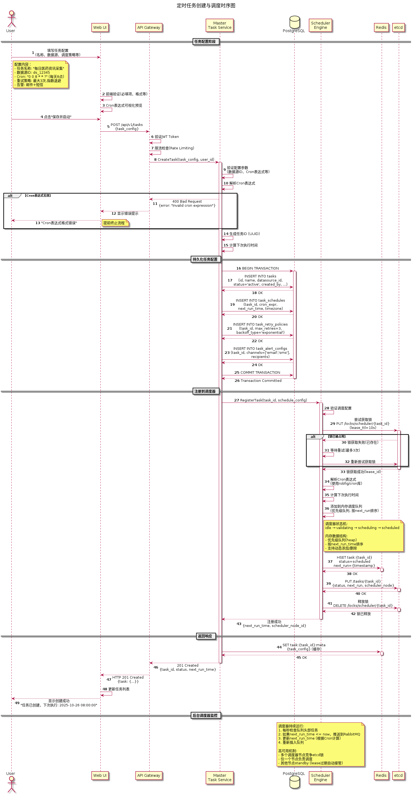
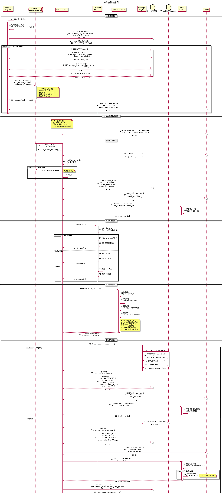

# DataFusion 系统技术设计文档

## 1. 引言

### 1.1. 文档目的

本文档是 **DataFusion** 系统设计的详细技术说明，旨在为开发和实施团队提供明确的指导。文档基于《DataFusion 系统需求分析文档》，将需求转化为具体的技术实现方案。

本文档的主要目标包括：

*   定义系统的整体架构和设计原则。
*   详细描述各核心组件和模块的设计。
*   明确关键技术选型和实现细节。
*   为后续的开发、测试和部署工作提供清晰、统一的蓝图。

### 1.2. 系统概述

**DataFusion** 是一个专注于数据获取的子系统，旨在提供一个稳定、高效、可扩展的数据采集和处理平台。它通过模块化的设计，支持从多种异构数据源（网页、数据库等）获取数据，并经过统一处理后存入指定的存储系统，为上层应用提供高质量的数据支持。

### 1.3. 设计原则

为了构建一个生产级的系统，**DataFusion** 的设计遵循以下核心原则：

*   **高可用性 (High Availability):** 系统采用分布式、无单点故障的设计，确保在硬件或软件发生故障时服务不中断。
*   **可扩展性 (Scalability):** 系统的各个组件均支持水平扩展，能够通过增加计算资源来线性提升处理能力，应对未来业务增长带来的数据量挑战。
*   **高可靠性 (Reliability):** 具备完善的数据校验、异常处理和失败重试机制，确保数据的完整性和一致性，做到数据不丢失、不重复。
*   **模块化与插件化 (Modularity & Pluggability):** 核心功能（如数据源、解析器、存储器）采用插件化架构，降低模块间的耦合度，便于独立开发、测试、部署和扩展。
*   **可维护性 (Maintainability):** 遵循清晰的代码规范，提供完善的日志、监控和文档，简化系统的日常运维和问题排查。
*   **安全性 (Security):** 在数据传输、存储和访问等各个环节实施严格的安全措施，保护敏感信息，防止未授权访问和攻击。

## 2. 系统总体设计

### 2.1. 总体架构设计

**DataFusion** 采用 **前后端分离 + Master-Worker** 模式的分布式架构。该架构实现了用户界面、API服务、任务调度、任务执行的清晰分层，保证了资源的有效利用和系统的弹性伸缩。


**核心架构层次：**

*   **用户层:** 包括Web浏览器、第三方应用、命令行工具，通过Nginx接入层访问系统。

*   **接入层 (Nginx):**
    - 提供HTTPS加密和负载均衡
    - 托管Web UI静态资源（Vue.js前端应用）
    - 将API请求（`/api/*`）路由到API网关

*   **前端层 (Web UI):**
    - 采用Vue.js + Element Plus构建的SPA（单页应用）
    - 静态资源通过Nginx托管并缓存
    - 浏览器加载后通过AJAX调用API网关的RESTful API（`/api/v1/*`）
    - 与API网关之间采用标准的前后端分离架构

*   **应用服务层 (API网关 + Master集群):**
    - **API网关:** 系统的统一API入口，负责：
      - JWT Token / API Key 认证
      - RBAC权限校验
      - OAuth 2.0 / LDAP 单点登录集成
      - 请求路由和负载均衡（将请求分发到Master节点）
      - 全局限流控制
    - **Master节点集群:** 任务的调度中心，每个Master节点内部包含以下核心业务服务：
      - **任务管理服务:** 提供任务的增删改查、启动、停止等操作接口
      - **调度引擎:** 根据调度策略触发任务执行，将任务推送到消息队列
      - **监控告警服务:** 从Prometheus/ELK获取监控数据，根据告警规则评估并触发告警通知（邮件/短信/钉钉/企业微信）
      - **配置管理服务:** 管理系统配置、数据源配置、清洗规则等
      - Master节点通过etcd进行服务注册与发现，实现高可用
      - Master节点是系统的"大脑"，但不直接参与繁重的数据采集工作

*   **Worker节点集群 (执行单元):** 负责执行由Master节点下发的具体采集任务，每个Worker节点内部包含：
    - **采集器 (Collector):** 从任务队列获取任务，执行具体的数据采集工作
    - **处理器 (Processor):** 对采集到的原始数据进行清洗、转换、验证
    - **存储器 (Storage):** 将处理后的数据存储到目标数据库或文件系统
    - Worker节点可以动态地增加或减少，以适应不同的负载需求

*   **基础设施层:** 提供数据库（PostgreSQL）、缓存（Redis）、消息队列（RabbitMQ）、服务发现（etcd）等基础服务，以及完整的监控和日志体系：
    - **监控体系:** Prometheus（指标采集） + Grafana（可视化展示）
    - **日志体系:** ELK Stack（日志采集/存储/分析） + Kibana（日志查询）
    - 各业务服务主动上报指标到Prometheus、日志到ELK
    - Monitor服务从Prometheus和ELK获取数据进行告警评估

**架构特点：**

*   **前后端分离:** Web UI与API网关解耦，前端可独立开发、部署和升级
*   **统一API网关:** 所有外部访问（Web UI、第三方应用、CLI）统一通过API网关，便于实现认证、鉴权、限流等横切关注点
*   **服务注册与发现:** Master和Worker节点通过etcd进行服务注册与发现，实现了节点间的解耦和动态感知
*   **任务队列:** Master与Worker之间通过RabbitMQ消息队列进行任务的异步分发和结果的回传，提升了系统的吞吐量和鲁棒性
*   **水平扩展:** Master节点和Worker节点均可水平扩展，满足不同规模的业务需求

### 2.2. 架构及技术选型

#### 2.2.1. 架构选型

在实现DataFusion数据采集和融合系统时,需要在系统架构层面做出合理选择。本节对候选架构方案进行对比分析,并给出最终的架构选型决策。

##### 2.2.1.1. 候选架构方案

基于数据采集系统的特点(周期性任务、批量处理、异步执行、状态管理、高并发),我们考察了以下四种架构实现方案:

**方案一:云原生架构(Kubernetes Operator模式)**

将Kubernetes不仅作为容器编排平台,更作为开发框架。核心特点:
- 使用Kubernetes的声明式方式和Operator作为开发模式
- 用户请求转化为自定义资源(CR),Controller管理数据采集服务的状态
- 利用Kubernetes的list-watch机制实现消息传递和状态管理
- 复用Kubernetes的ETCD、Service、ConfigMap等原生能力

**方案二:传统微服务架构**

将Kubernetes仅作为容器编排工具,系统组件的选型和通信自行维护。核心特点:
- 自行选择和维护消息队列(RabbitMQ/Kafka)
- 自行维护状态存储和管理(PostgreSQL/Redis)
- 自行编写管理面和控制面逻辑
- 每个功能模块拆分为独立微服务,通过REST API或gRPC通信

**方案三:事件驱动架构(Event-Driven Architecture)**

系统组件通过事件进行异步通信,采用消息队列解耦。核心特点:
- 所有组件间交互都通过事件完成
- 生产者发布事件到消息队列,消费者订阅并处理事件
- 支持事件溯源(Event Sourcing)和CQRS模式
- 天然支持异步处理和高并发场景

**方案四:混合架构(微服务 + 事件驱动)**

结合微服务的模块化和事件驱动的异步特性。核心特点:
- 用户交互、查询操作使用同步REST API
- 任务执行、数据处理等耗时操作使用异步事件驱动
- Master节点提供RESTful API,Worker通过消息队列异步通信
- 兼顾系统的响应性和吞吐量

##### 2.2.1.2. 架构方案对比分析

从四个关键维度对候选架构方案进行对比:

**对比维度一:开发与运维成本**

| 架构方案 | 开发周期 | 开发复杂度 | 运维成本(100任务规模) | 人才要求 |
|---------|---------|-----------|---------------------|---------|
| Kubernetes Operator | 3-4个月(团队有K8s经验)<br>6-9个月(团队K8s经验不足) | 高(需掌握Operator开发) | 1人 + $1500-2000/月 | 需要K8s+Operator专家 |
| 传统微服务 | 3-4个月 | 中等 | 1.5人 + $1500-2500/月 | 常规微服务技能 |
| 事件驱动架构 | 4-6个月 | 中高(异步编程复杂) | 1.5人 + $1800-2800/月 | 需要异步编程经验 |
| 混合架构 | 4-5个月 | 中高 | 1.5人 + $1800-2800/月 | 微服务+消息队列 |

**对比维度二:系统可用性与自动化**

| 架构方案 | 系统可用性 | 故障恢复时间 | 自动扩缩容 | 版本升级回滚 |
|---------|-----------|-------------|-----------|-------------|
| Kubernetes Operator | 99.9% | 30秒-2分钟(自动) | ✅ 原生HPA支持 | ✅ 自动回滚 |
| 传统微服务 | 99.5% | 5-10分钟(人工) | ⚠️ 需自己实现 | ⚠️ 需自己实现 |
| 事件驱动架构 | 99.5% | 3-5分钟(半自动) | ⚠️ 基于队列长度 | ⚠️ 需自己实现 |
| 混合架构 | 99.5% | 5-10分钟(半自动) | ⚠️ 部分自动化 | ⚠️ 需自己实现 |

**对比维度三:可扩展性与灵活性**

| 架构方案 | 水平扩展能力 | 扩展速度 | 新增数据源成本 | 技术栈灵活性 |
|---------|------------|---------|---------------|-------------|
| Kubernetes Operator | ★★★★★ | 5-10分钟 | 1-2天(修改CRD) | ★★★☆☆ |
| 传统微服务 | ★★★★☆ | 10-15分钟 | 1-3天(新增服务) | ★★★★★ |
| 事件驱动架构 | ★★★★★ | 3-5分钟 | 1-2天(新增消费者) | ★★★★☆ |
| 混合架构 | ★★★★★ | 5-10分钟 | 1-3天 | ★★★★★ |

**对比维度四:长期成本(5年TCO)**

| 架构方案 | 初期开发 | 代码维护 | 运维人力 | 5年总成本 |
|---------|---------|---------|---------|----------|
| Kubernetes Operator | 3-4个月 | 低(复用K8s) | 1人 | **约$120K** ✅ |
| 传统微服务 | 3-4个月 | 高(自维护) | 1.5人 | 约$180K |
| 事件驱动架构 | 4-6个月 | 中等 | 1.5人 | 约$170K |
| 混合架构 | 4-5个月 | 中高 | 1.5人 | 约$180K |

##### 2.2.1.3. 架构选型决策

**最终选择: Kubernetes Operator模式**

综合考虑团队Kubernetes技术栈经验、系统高度自动化运维需求、以及长期成本优化目标,我们选择 **Kubernetes Operator模式** 作为DataFusion系统的核心架构。

**选型理由:**

1. **团队技术栈匹配**:团队具备丰富的Kubernetes经验,有2人以上掌握Operator开发,开发周期可控制在3-4个月,风险可控。

2. **高度自动化运维**:复用Kubernetes原生的自愈、健康检查、自动扩缩容、滚动更新等能力,系统可用性从99.5%提升到99.9%,故障恢复时间缩短80%(从5-10分钟降至30秒-2分钟)。

3. **简化系统架构**:复用Kubernetes的ETCD(状态存储)、list-watch(消息传递)、Service(服务发现)、ConfigMap(配置管理)等机制,减少约80%基础设施代码,降低维护复杂度。

4. **长期成本优势**:虽然初期开发需要3-4个月,但长期运维成本降低40%(1人 vs 1.5人),5年TCO节省约$60K($120K vs $180K)。

5. **云原生生态集成**:无缝集成Prometheus监控、Helm包管理、RBAC权限控制、Istio服务网格等云原生生态工具,避免重复造轮子。

**注意事项:**

⚠️ **技术复杂度**:Reconcile循环逻辑复杂,需要处理并发协调和幂等性,调试难度较高。
- **应对**: 建立完善的单元测试和集成测试体系,使用Jaeger追踪Reconcile流程。

⚠️ **CRD版本管理**:CRD字段变更需要careful设计,需要实现Conversion Webhook支持向后兼容。
- **应对**: 前期充分设计评审,保持API向后兼容,实现Conversion Webhook。

⚠️ **团队依赖风险**:至少需要2人深度掌握Operator开发,避免关键人员离职导致项目停滞。
- **应对**: 完善的代码注释和文档,定期知识分享和培训,建立技术传承机制。

##### 2.2.1.4. Kubernetes Operator模式设计要点

基于Kubernetes Operator模式,系统架构设计的核心要点如下:

**1. 自定义资源(CRD)设计**

定义以下核心CRD,通过声明式API管理数据采集全生命周期:

**(1) CollectionTask (采集任务)**

```yaml
apiVersion: datafusion.io/v1
kind: CollectionTask
metadata:
  name: daily-product-scraping
  namespace: datafusion
spec:
  # 数据源引用
  dataSourceRef:
    name: ecommerce-website

  # 调度配置
  schedule:
    cron: "0 2 * * *"
    timezone: "Asia/Shanghai"

  # 采集配置
  collector:
    type: web-rpa  # web-rpa, api, database
    replicas: 3    # 并发采集实例数
    resources:
      requests:
        memory: "512Mi"
        cpu: "500m"
      limits:
        memory: "1Gi"
        cpu: "1"

  # 数据处理配置
  processor:
    cleaningRules:
      - name: price-normalization
      - name: duplicate-removal
    transformRules:
      - name: field-mapping

  # 存储配置
  storage:
    target: postgresql
    database: products_db
    table: products

  # 自动扩缩容配置
  autoScaling:
    enabled: true
    minReplicas: 2
    maxReplicas: 20
    metrics:
      - type: Custom
        custom:
          metric:
            name: task_queue_length
          target:
            type: AverageValue
            averageValue: "100"

status:
  phase: Running  # Pending, Running, Succeeded, Failed
  lastScheduleTime: "2025-11-25T02:00:00Z"
  lastSuccessTime: "2025-11-25T02:15:30Z"
  statistics:
    totalRuns: 150
    successfulRuns: 148
    failedRuns: 2
    totalRecords: 1500000
```

**(2) DataSource (数据源定义)**

```yaml
apiVersion: datafusion.io/v1
kind: DataSource
metadata:
  name: ecommerce-website
spec:
  type: web-rpa
  connection:
    url: "https://example.com/products"
    authentication:
      type: cookie
      secretRef:
        name: ecommerce-auth
  rpaConfig:
    browserType: chromium
    headless: true
    waitStrategy:
      type: networkIdle
      timeout: 30s
  selectors:
    productList: ".product-item"
    productName: "h2.title"
    price: "span.price"
    stock: "div.inventory"
```

**(3) CleaningRule (数据清洗规则)**

```yaml
apiVersion: datafusion.io/v1
kind: CleaningRule
metadata:
  name: price-normalization
spec:
  targetField: price
  rules:
    - type: regex
      pattern: "[^0-9.]"
      replacement: ""
    - type: convert
      targetType: float
    - type: validate
      condition: "value > 0 && value < 1000000"
```

**2. Controller职责划分**

**(1) CollectionTaskController**
- 监听CollectionTask资源变化
- 根据schedule配置创建CronJob或Job
- 为每个Job创建对应的Worker Pod
- 监控Job执行状态并更新CollectionTask.status
- 处理失败重试和告警通知
- 实现自动扩缩容逻辑

**(2) DataSourceController**
- 验证DataSource配置的合法性
- 测试数据源连通性
- 管理Secret引用的认证信息
- 更新数据源状态(Available/Unavailable)

**(3) CleaningRuleController**
- 验证清洗规则语法
- 将规则编译为可执行的表达式
- 将规则注入到ConfigMap供Worker使用
- 支持规则热更新

**3. Reconcile循环逻辑**

```go
func (r *CollectionTaskReconciler) Reconcile(ctx context.Context, req ctrl.Request) (ctrl.Result, error) {
    // 1. 获取CollectionTask资源
    var task datafusionv1.CollectionTask
    if err := r.Get(ctx, req.NamespacedName, &task); err != nil {
        return ctrl.Result{}, client.IgnoreNotFound(err)
    }

    // 2. 根据schedule创建或更新CronJob
    if task.Spec.Schedule.Cron != "" {
        if err := r.reconcileCronJob(ctx, &task); err != nil {
            return ctrl.Result{}, err
        }
    }

    // 3. 管理Worker Pod副本数
    if err := r.reconcileWorkerPods(ctx, &task); err != nil {
        return ctrl.Result{}, err
    }

    // 4. 处理自动扩缩容
    if task.Spec.AutoScaling.Enabled {
        if err := r.reconcileHPA(ctx, &task); err != nil {
            return ctrl.Result{}, err
        }
    }

    // 5. 更新status
    return ctrl.Result{}, r.updateStatus(ctx, &task)
}
```

**4. 实施路线图**

```
Phase 1: 基础框架搭建 (1周)
├─ 使用kubebuilder初始化Operator项目
├─ 定义CRD(CollectionTask、DataSource、CleaningRule)
├─ 设计API版本和字段结构
└─ 配置RBAC权限和Webhook

Phase 2: 核心Controller开发 (8-10周)
├─ 实现CollectionTaskController Reconcile逻辑
├─ 实现DataSourceController和CleaningRuleController
├─ 开发Admission Webhook(Validation)
├─ 实现自动扩缩容逻辑
├─ 编写单元测试和集成测试
└─ 构建Docker镜像和Helm Chart

Phase 3: Worker组件开发 (4-6周,可与Phase 2并行)
├─ 开发Web RPA采集器(基于Puppeteer/Playwright)
├─ 开发API采集器(基于resty)
├─ 开发数据库采集器
├─ 实现数据处理和清洗引擎
└─ 实现数据存储模块

Phase 4: 测试和优化 (2-3周)
├─ 功能测试和端到端测试
├─ 压力测试和性能调优
├─ 故障注入测试(Chaos Engineering)
├─ 文档编写和部署指南
└─ 生产环境试运行

总开发周期: 3-4个月
```

**5. 关键风险和缓解策略**

| 风险类别 | 具体风险 | 影响 | 缓解措施 |
|---------|---------|------|---------|
| **技术风险** | CRD设计不合理,频繁变更 | 高 | 前期充分设计评审;实现Conversion Webhook;保持API向后兼容 |
| | Reconcile逻辑bug导致资源泄漏 | 高 | 完善的单元测试和集成测试;实现资源清理finalizer |
| | Operator性能瓶颈 | 中 | 使用缓存减少API Server请求;优化Reconcile逻辑 |
| **团队风险** | 关键人员离职 | 高 | 至少2人掌握Operator开发;完善文档;定期知识分享 |
| | K8s经验不足 | 中 | 安排培训;引入顾问;从简单功能开始迭代 |

**缓解策略总结:**
1. **MVP优先**:先实现核心功能(CollectionTask),验证可行性后再扩展
2. **充分测试**:建立完善的测试体系,包括单元测试、集成测试、混沌工程
3. **监控告警**:完善的Metrics和日志,快速发现和定位问题
4. **应急预案**:准备回滚方案,关键功能保留手动操作入口
5. **知识传承**:完善的文档、代码注释、定期培训


#### 2.2.2. 技术选型

为了实现上述设计目标,我们选择了以下成熟、开源的技术栈:

| 领域 | 技术选型 | 理由 |
| :--- | :--- | :--- |
| **后端语言** | Go, Python | **Go** 用于开发高性能的 Master 和 Worker 核心服务，其并发模型和性能非常适合 I/O 密集型的数据采集场景。**Python** 用于编写灵活的采集脚本和解析插件，利用其丰富的第三方库生态。 |
| **Web 框架** | Gin (Go), FastAPI (Python) | **Gin** 是一个高性能的 Go Web 框架，用于构建核心 API 服务。**FastAPI** 用于快速开发 Python 插件的 API 接口。 |
| **前端框架** | Vue.js + Element Plus | 成熟的前端技术栈，拥有丰富的组件库和活跃的社区，能够快速构建现代化的管理界面。 |
| **RPA引擎** | Puppeteer / Playwright | **Puppeteer** 是Chrome官方支持的无头浏览器自动化库，性能稳定。**Playwright** 是微软推出的跨浏览器自动化库，支持Chrome/Firefox/Safari。两者均支持JavaScript脚本执行、页面等待策略、代理配置等RPA核心功能。 |
| **HTTP客户端** | resty (Go) | 高性能的Go HTTP客户端库，支持丰富的认证方式（API Key、OAuth2.0、Basic Auth）、请求/响应中间件、超时控制等，是实现API采集的理想选择。 |
| **JSONPath解析** | gjson (Go) | 高性能的Go JSON解析库，支持复杂的JSONPath表达式，用于从API响应中提取目标数据。 |
| **清洗规则引擎** | expr (Go) | 快速、安全的表达式引擎，支持自定义函数和变量，用于实现灵活的数据清洗规则DSL。 |
| **数据库** | PostgreSQL, MongoDB | **PostgreSQL** 用于存储任务配置、调度信息、用户信息、清洗规则、字段映射等结构化数据。**MongoDB** 作为可选的数据存储目标，适合存储非结构化的采集结果。 |
| **消息队列** | RabbitMQ / Kafka | 用于 Master 和 Worker 之间的任务分发和状态通信，实现异步解耦和削峰填谷。RabbitMQ支持任务优先级队列，适合实现任务优先级调度。 |
| **服务注册/发现**| etcd / Consul | 用于 Master 和 Worker 节点的动态注册和发现，是实现分布式架构的关键组件。 |
| **缓存** | Redis | 用于缓存热点数据、任务状态、清洗规则等，提升系统响应速度。支持限流（令牌桶算法）实现并发控制。 |
| **MCP SDK** | MCP Go SDK | Model Context Protocol官方Go SDK，用于实现标准的MCP Server，对外提供工具（Tools）和资源（Resources）访问能力。 |
| **OAuth库** | golang-jwt, oauth2 (Go) | **golang-jwt** 用于JWT Token的生成和验证。**oauth2** 是Go官方OAuth2.0客户端库，支持多种OAuth流程，用于实现第三方SSO集成。 |
| **容器化** | Docker | 将所有服务打包成标准的 Docker 镜像，实现环境的隔离和一致性。 |
| **容器编排** | Kubernetes (K8s) | 用于自动化部署、扩展和管理容器化应用，是实现高可用和弹性伸缩的最佳实践。 |
| **监控** | Prometheus + Grafana | 开源的监控和可视化解决方案，能够提供强大的系统和服务监控能力。 |
| **日志** | ELK Stack (Elasticsearch, Logstash, Kibana) | 集中式的日志收集、存储和查询方案，便于问题排查和系统审计。 |

### 2.3. 部署架构

系统支持两种部署方式，以适应不同规模和场景的需求。两种方式下的服务副本数均可根据实际需求灵活配置。

#### 2.3.1. 部署方式对比

| 对比项 | Docker Compose部署 | Kubernetes + Helm部署 |
|--------|-------------------|---------------------|
| 适用场景 | 开发测试、小规模生产 | 中大规模生产环境 |
| 部署复杂度 | 低，快速部署 | 中，需要K8s集群 |
| 高可用性 | 需手动配置 | 自动故障恢复 |
| 弹性伸缩 | 手动调整副本数 | 支持HPA自动扩缩容 |
| 运维成本 | 低 | 中 |
| 推荐规模 | <100任务，1-5台服务器 | >100任务，集群化部署 |

#### 2.3.2. Docker Compose部署方案


Docker Compose部署方式适用于开发测试环境和小规模生产场景，提供快速部署能力。

##### 2.3.2.1. 单机部署架构

所有服务部署在单台主机上，适合开发测试和演示环境。

**服务组成与默认配置:**
*   Web UI: 1-2副本（可配置）
*   API Gateway: 1-3副本（可配置）
*   Master服务: 3副本（可配置）
*   Worker服务: 1-10副本（可配置，根据任务量调整）
*   PostgreSQL: 1副本
*   Redis: 1副本
*   RabbitMQ: 1副本
*   etcd: 1副本
*   Prometheus: 1副本
*   Grafana: 1副本

**资源要求:**
*   最低配置: 2C4G, 50GB磁盘
*   推荐配置: 4C8G, 100GB SSD
*   高负载配置: 8C16G, 200GB SSD

**服务通信:**
*   使用Docker bridge网络实现服务间通信
*   通过服务名进行DNS解析
*   端口映射: Web UI(8080), API Gateway(8000), Grafana(3000)等

**数据持久化:**
*   数据库数据: `/data/postgres`
*   Redis数据: `/data/redis`
*   日志文件: `/var/log/datafusion`
*   配置文件: `/etc/datafusion`

##### 2.3.2.2. 多机分布式部署架构

适用于需要一定高可用性但不具备K8s条件的小规模生产环境。

**节点角色划分（可根据实际情况调整）:**

**管理节点（1-2台）:**
*   Master服务: 3副本（可配置）
*   API Gateway: 2-3副本（可配置）
*   Web UI: 1-2副本（可配置）
*   etcd: 1副本（多机可部署3副本集群）

**基础设施节点（1-3台）:**
*   PostgreSQL: 1主1从（可配置）
*   Redis: 单机或3节点Cluster（可配置）
*   RabbitMQ: 1-3节点（可配置）

**Worker节点（可扩展）:**
*   Worker服务: 每节点1-5副本（可配置）
*   根据任务量动态增减节点

**跨主机通信:**
*   方式1: Docker Swarm overlay网络
*   方式2: 主机网络 + 环境变量配置服务地址

**高可用配置（可选）:**
*   PostgreSQL: 主从复制
*   Redis: Sentinel或Cluster模式
*   RabbitMQ: 镜像队列
*   etcd: 3节点集群

**副本数配置方式:**
```yaml
# docker-compose.yml 示例
services:
  master:
    image: datafusion/master:latest
    deploy:
      replicas: ${MASTER_REPLICAS:-3}  # 可通过环境变量配置，默认3

  worker:
    image: datafusion/worker:latest
    deploy:
      replicas: ${WORKER_REPLICAS:-5}  # 可通过环境变量配置，默认5

  api-gateway:
    image: datafusion/api-gateway:latest
    deploy:
      replicas: ${API_REPLICAS:-2}  # 可通过环境变量配置，默认2
```

**部署步骤:**
1.  准备服务器环境（Docker 20.10+, Docker Compose 2.0+）
2.  配置网络连通性和防火墙规则
3.  根据需求调整配置文件中的副本数参数
4.  依次启动各节点服务
5.  验证服务健康状态和集群连通性

#### 2.3.3. Kubernetes + Helm部署方案


Kubernetes部署方式提供企业级的高可用、自动伸缩和运维能力，推荐用于生产环境。

##### 2.3.3.1. 集群化部署架构

**命名空间划分:**
*   `datafusion-app`: 应用服务层
*   `datafusion-infra`: 基础设施层
*   `datafusion-monitor`: 监控服务层

**无状态服务（Deployment）及默认副本配置:**
*   Web UI: 2副本（可配置）
*   API Gateway: 3副本（可配置）
*   Master: 3副本（可配置）
*   Worker: 5副本，支持HPA自动扩展至50副本（可配置min/max）

**有状态服务（StatefulSet）:**
*   etcd: 3副本（可配置）
*   RabbitMQ: 3副本（可配置）
*   Redis: 6副本Cluster模式（可配置）
*   PostgreSQL: 可使用云RDS或StatefulSet部署1主1从（可配置）

**资源配置（默认值，可调整）:**
*   Master: request 1C2G, limit 2C4G
*   Worker: request 2C4G, limit 4C8G
*   API Gateway: request 1C2G, limit 2C4G
*   Web UI: request 0.5C1G, limit 1C2G

##### 2.3.3.2. Helm Chart配置

**副本数配置（values.yaml）:**
```yaml
# 副本数配置
replicaCount:
  master: 3              # Master副本数，可配置
  apiGateway: 3          # API Gateway副本数，可配置
  webui: 2               # Web UI副本数，可配置
  worker:
    min: 5               # Worker最小副本数，可配置
    max: 50              # Worker最大副本数，可配置（HPA）

# 弹性伸缩配置
autoscaling:
  enabled: true          # 是否启用HPA
  minReplicas: 5         # 最小副本数，可配置
  maxReplicas: 50        # 最大副本数，可配置
  targetCPUUtilizationPercentage: 70     # CPU使用率目标，可配置
  targetMemoryUtilizationPercentage: 80  # 内存使用率目标，可配置

# 资源配置（可根据实际情况调整）
resources:
  master:
    requests:
      cpu: 1000m
      memory: 2Gi
    limits:
      cpu: 2000m
      memory: 4Gi
  worker:
    requests:
      cpu: 2000m
      memory: 4Gi
    limits:
      cpu: 4000m
      memory: 8Gi
```

**多环境配置示例:**
*   `values-dev.yaml`: 开发环境（最小副本数，降低资源配置）
*   `values-prod.yaml`: 生产环境（完整副本数，完整资源配置）

**部署命令:**
```bash
# 使用默认配置部署
helm install datafusion ./datafusion-chart

# 自定义副本数部署
helm install datafusion ./datafusion-chart \
  --set replicaCount.master=5 \
  --set replicaCount.worker.min=10 \
  --set replicaCount.worker.max=100

# 使用环境配置文件部署
helm install datafusion ./datafusion-chart \
  --values values-prod.yaml
```

##### 2.3.3.3. 核心特性

**集群化部署:**
*   所有无状态服务（Master, API, WebUI, Worker）以多副本形式部署
*   通过K8s的Deployment和Service实现负载均衡和故障转移
*   副本数可通过Helm values灵活配置

**有状态服务:**
*   数据库、消息队列、etcd等使用StatefulSet部署
*   或直接使用云厂商托管服务（推荐）
*   支持PVC持久化存储，数据可靠性高

**弹性伸缩:**
*   Worker节点支持HPA (Horizontal Pod Autoscaler)
*   根据CPU/内存使用率或自定义指标（如任务队列长度）自动扩缩容
*   最小/最大副本数可在values.yaml中配置

**滚动更新:**
*   支持零停机滚动更新
*   可配置更新策略（maxSurge, maxUnavailable）
*   快速回滚能力

**配置管理:**
*   使用K8s的ConfigMap和Secret管理应用配置和敏感信息
*   通过Helm统一管理多环境配置
*   配置变更自动触发Pod重启（可选）

#### 2.3.4. 部署方式选择建议

**选择Docker Compose的场景:**
*   ✅ 开发测试环境
*   ✅ 快速POC验证
*   ✅ 小规模生产（<100任务，1-5台服务器）
*   ✅ 无Kubernetes基础设施
*   ✅ 运维团队对Docker熟悉，对K8s不熟悉

**选择Kubernetes + Helm的场景:**
*   ✅ 中大规模生产环境（>100任务）
*   ✅ 需要高可用和自动故障恢复
*   ✅ 任务量波动大，需要弹性伸缩
*   ✅ 已有K8s集群基础设施
*   ✅ 需要滚动更新和快速回滚能力
*   ✅ 多环境管理需求（dev/staging/prod）

#### 2.3.5. 副本数配置原则

**默认配置说明:**
*   文档中提供的副本数为推荐的默认值
*   实际部署时应根据业务规模和资源情况灵活调整
*   两种部署方式均支持通过配置文件调整副本数

**配置调整建议:**

**小规模场景（<50任务）:**
*   Master: 1-3副本
*   Worker: 1-5副本
*   API Gateway: 1-2副本

**中等规模（50-200任务）:**
*   Master: 3副本
*   Worker: 5-20副本
*   API Gateway: 2-3副本

**大规模场景（>200任务）:**
*   Master: 3-5副本
*   Worker: 20-50副本（配置HPA）
*   API Gateway: 3-5副本

**性能监控指标:**
*   根据CPU/内存使用率动态调整
*   关注任务队列长度和处理延迟
*   Worker利用率保持在70-80%最佳

## 3. 模块设计

### 3.1. 核心场景时序图

为了更清晰地展示系统在关键场景下的交互流程，本节提供了完整的技术时序图。这些时序图覆盖了从数据采集、任务管理、数据处理到系统集成的全部核心场景，每个时序图都详细描述了组件间的交互细节、数据流转路径和异常处理逻辑，为开发团队提供清晰的实现指导。

时序图按功能分为四大类：
- **数据采集场景**：涵盖网页RPA采集、数据库同步、API采集和智能字段识别
- **任务管理场景**：包括任务创建、调度执行、手动触发和失败重试
- **数据处理场景**：覆盖数据清洗、查询导出和错误修正
- **系统集成场景**：支持MCP协议集成和移动端监控

#### 3.1.1. 数据采集场景

数据采集是DataFusion的核心能力，本节展示四种主要数据采集方式的完整技术流程。

##### 3.1.1.1. 网页数据源配置与RPA采集流程

**场景描述**

用户通过Web UI配置一个网页数据源，系统使用RPA技术（Playwright/Puppeteer）进行测试采集，验证配置正确性。此场景涵盖从用户提交配置、系统启动无头浏览器、渲染目标网页、提取数据、到返回测试结果的完整流程。

**参与组件**
- Web UI (Vue.js)
- API Gateway  (Gin/Go)
- Master节点 - 数据源管理服务
- PostgreSQL (配置存储)
- RabbitMQ (任务队列)
- Worker节点 - RPA采集器
- Playwright/Puppeteer (无头浏览器引擎)
- Target Website (目标网站)

**时序图**


**关键技术点**

1. **异步测试执行**
   - 测试采集任务通过RabbitMQ高优先级队列异步执行
   - 前端通过轮询或WebSocket获取实时结果
   - 超时时间默认30秒，可配置

2. **RPA引擎选型**
   - 优先使用Playwright（支持多浏览器、重试机制更强）
   - Puppeteer作为备选（稳定性好、社区成熟）
   - 支持Headless模式（生产环境）和Headed模式（调试）

3. **数据提取引擎**
   - CSS选择器：使用Chromium内置选择器引擎（最快）
   - XPath：使用浏览器原生xpath解析器
   - 正则表达式：在提取结果上二次处理
   - 支持组合使用（先CSS定位容器，再XPath提取细节）

4. **错误处理**
   - 页面加载超时：重试3次，指数退避（5s, 10s, 20s）
   - 元素未找到：记录警告，继续执行其他字段提取
   - 浏览器崩溃：重启浏览器实例，重新执行
   - 网络错误：检测代理可用性，切换备用代理

5. **性能优化**
   - 禁用图片加载（可选，节省带宽）
   - 禁用CSS/字体加载（可选，加速渲染）
   - 使用浏览器缓存（同一域名多次访问）
   - Worker节点池化管理（预启动浏览器实例）

6. **安全性考虑**
   - Cookie加密存储在PostgreSQL
   - 代理认证信息使用AES加密
   - 限制目标URL白名单（防止SSRF攻击）
   - 资源配额控制（单次采集最大内存/CPU使用）

---

##### 3.1.1.2. 数据库数据源配置与同步流程

**场景描述**

用户通过Web UI配置一个数据库数据源（MySQL/PostgreSQL/Oracle等），系统测试数据库连接，执行SQL查询获取数据，并配置字段映射和增量同步策略。此场景展示了从连接测试、查询预览、字段映射到保存配置的完整流程。

**参与组件**
- Web UI (Vue.js)
- API Gateway (Gin/Go)
- Master节点 - 数据源管理服务
- PostgreSQL (配置存储)
- RabbitMQ (任务队列)
- Worker节点 - 数据库采集器
- Source Database (源数据库：MySQL/PostgreSQL/Oracle等)

**时序图**


**关键技术点**

1. **连接池管理**
   - 使用成熟的连接池库（Go: `database/sql` 内置连接池）
   - 配置合理的连接数（最小1，最大5-10，根据负载调整）
   - 连接超时控制（连接超时30s，查询超时60s，可配置）
   - 连接空闲回收（空闲超过10分钟自动关闭）
   - 连接健康检查（Ping测试，失败自动重连）

2. **SQL注入防护**
   - 必须使用参数化查询/预编译语句（Prepared Statement）
   - 禁止直接拼接SQL字符串
   - 变量替换前进行类型检查和转义
   - 限制SQL语句类型（只允许SELECT，禁止DDL/DML）
   - 查询结果行数限制（测试时最多100行）

3. **增量同步算法**
   - **基于时间戳**：`WHERE update_time > last_sync_time`
   - **基于自增ID**：`WHERE id > last_max_id`
   - **基于删除标记**：`WHERE deleted_at IS NULL OR deleted_at > last_sync_time`
   - 首次同步支持指定初始值
   - 断点续传（记录上次同步位置到Redis）
   - 避免数据重复（使用UPSERT或主键冲突检查）

4. **大数据量处理**
   - 分批查询（每批1000-10000行，可配置）
   - 使用数据库游标（Cursor）流式读取
   - 避免一次性加载全部数据到内存
   - 支持LIMIT/OFFSET分页（注意性能问题）
   - 更优：基于索引字段的范围查询（`id > last_id LIMIT 10000`）

5. **跨数据库兼容性**
   - 抽象统一的数据库接口
   - 针对不同数据库类型的驱动：
     - MySQL: `go-sql-driver/mysql`
     - PostgreSQL: `lib/pq`
     - Oracle: `godror`
     - SQL Server: `denisenkom/go-mssqldb`
   - 处理不同数据库的SQL方言差异
   - 统一的数据类型映射（DB类型 → Go类型）

6. **安全性考虑**
   - 数据库密码AES-256-GCM加密存储
   - 密钥管理（使用环境变量或密钥管理服务）
   - 只使用只读账号（限制数据库权限）
   - 网络隔离（Worker通过VPN/专线访问源数据库）
   - 敏感数据脱敏（可选，如手机号、身份证号）
   - 审计日志（记录所有数据库操作）

#### 3.1.1.3. API数据源配置与采集流程

**场景描述**：用户配置RESTful API数据源，系统测试API调用并提取数据。支持多种认证方式（API Key、OAuth 2.0、Basic Auth）、JSONPath数据提取、多种分页策略和速率限制配置。

**参与组件**：
- Web UI（前端界面）
- API Gateway（网关服务）
- Master - DataSource Service（数据源管理服务）
- PostgreSQL（配置存储）
- RabbitMQ（消息队列）
- Worker - API Collector（API采集Worker）
- HTTP Client（resty库）
- Target API（目标API服务）

**时序图**：


**关键技术点**：

1. **HTTP客户端选型**
   - Go语言使用resty库（基于net/http封装）
   - 支持连接池、超时控制、自动重试
   - 支持中间件（日志、指标、链路追踪）
   - 支持HTTP/2和连接复用

2. **OAuth 2.0流程实现**
   - 支持Client Credentials流程（服务端应用）
   - 支持Authorization Code流程（需要用户授权）
   - Token自动刷新（在过期前60秒主动刷新）
   - Token存储到Redis（支持分布式Worker共享）
   - PKCE扩展支持（增强安全性）

3. **JSONPath解析引擎**
   - 使用gjson库（高性能、零内存分配）
   - 支持复杂路径：`$.data.items[?(@.status=='active')].id`
   - 支持数组过滤和条件筛选
   - Schema自动推断（基于首批数据）
   - 类型转换（字符串→数字、时间戳→日期）

4. **分页策略自动检测**
   - 分析响应结构（total、page、next_cursor等字段）
   - 检测Link Header（RFC 5988）
   - 自动推断分页参数名称
   - 支持混合分页（第一页Page-based，后续Cursor-based）
   - 防止无限循环（最大页数限制、去重检测）

5. **Rate Limiting遵守**
   - 解析标准Rate Limit头（X-RateLimit-*、Retry-After）
   - Token Bucket算法（本地速率控制）
   - 分布式限流（Redis + Lua脚本）
   - 429错误自动重试（指数退避）
   - 动态速率调整（根据剩余配额）
   - 多租户隔离（不同数据源独立限流）

6. **响应Schema自动推断**
   - 分析首批数据推断字段类型
   - 支持嵌套JSON扁平化
   - 检测数组字段（需要展开）
   - 字段重命名建议（遵循命名规范）
   - 数据质量评估（空值率、重复率）
   - 生成数据字典（字段名、类型、示例、描述）

#### 3.1.1.4. 页面DOM解析与智能字段识别流程

**场景描述**：用户输入目标网页URL，系统自动渲染页面、解析DOM结构，并使用AI引擎智能识别数据字段（如标题、日期、作者、内容等），生成推荐的CSS选择器或XPath表达式，大幅简化数据源配置流程。

**参与组件**：
- Web UI（前端界面）
- API Gateway（网关服务）
- Master - DataSource Service（数据源管理服务）
- PostgreSQL（配置存储）
- RabbitMQ（消息队列）
- Worker - RPA Engine（RPA执行引擎）
- Playwright（无头浏览器）
- AI Field Recognizer（字段识别引擎）
- Target Website（目标网站）

**时序图**：


**关键技术点**：

1. **DOM树序列化**
   - 保留完整结构（标签、属性、文本、层级关系）
   - 过滤不相关信息（script、style、注释）
   - 压缩存储（去除空白、使用简写属性名）
   - 支持增量更新（仅序列化变化部分）
   - 数据结构优化（使用数组索引代替对象引用）

2. **重复模式识别算法**
   - LCS（最长公共子序列）计算结构相似度
   - 同级元素聚类分析（K-means或DBSCAN）
   - 结构指纹生成（基于标签序列、class组合）
   - 容错机制（允许部分字段缺失或顺序变化）
   - 性能优化（使用布隆过滤器预筛选、剪枝策略）

3. **字段类型推断**
   - 基于HTML语义标签（time、address、article等）
   - 基于class/id命名规则（title、price、author等）
   - 基于文本模式匹配（正则表达式库）
   - 基于元素属性（datetime、href、src等）
   - 可选：轻量级NLP模型（字段语义理解）
   - 类型优先级排序（语义标签 > 属性 > class > 文本模式）

4. **CSS选择器自动生成**
   - 生成最短唯一路径（避免过长选择器）
   - 优先使用语义化class/id（提高可读性和稳定性）
   - 避免使用绝对位置（nth-child(7)），优先使用相对位置
   - 支持复杂选择器（属性选择器、伪类、组合选择器）
   - 健壮性测试（在DOM子集上验证选择器唯一性）
   - 备选方案生成（提供2-3个候选选择器）

5. **置信度评分**
   - 多维度评分模型（结构一致性、字段数量、类型匹配度）
   - 权重可配置（根据实际效果调整）
   - 阈值分级（高/中/低置信度）
   - 人工反馈学习（记录用户调整，优化模型）
   - A/B测试（对比不同算法效果）

6. **可视化编辑器**
   - 页面截图高亮识别区域（使用不同颜色标记不同字段）
   - 点击元素直接生成选择器（类似浏览器DevTools）
   - 实时预览提取结果（所见即所得）
   - 选择器语法校验和提示
   - 支持拖拽调整字段顺序
   - 历史记录和撤销/重做功能

---

#### 3.1.2. 任务管理场景

任务管理是DataFusion的调度核心，本节展示任务从创建、调度、执行到失败处理的完整技术流程。

##### 3.1.2.1. 定时任务创建与调度流程

**场景描述**

用户通过Web UI创建一个定时任务，配置Cron表达式（如每天早上8点执行），系统验证配置、持久化任务信息、注册到调度器并计算下次执行时间。此场景展示了从任务配置、参数验证、分布式调度注册到状态同步的完整流程。

**参与组件**
- Web UI (Vue.js)
- API Gateway (Gin/Go)
- Master节点 - 任务管理服务
- PostgreSQL (任务配置存储)
- Scheduler Engine (调度引擎)
- Redis (状态缓存)
- etcd (分布式锁与服务发现)

**时序图**



**关键技术点**

1. **Cron表达式解析与验证**
   - 使用Go语言的`robfig/cron`库解析标准Cron表达式
   - 支持秒级精度（6字段格式：秒 分 时 日 月 周）
   - 前端可视化编辑器（分钟/小时/日期/月份/星期选择器）
   - 实时预览下次执行时间（计算未来5次执行时间）
   - 时区支持（存储UTC时间，显示本地时区）
   - 特殊表达式处理（@daily, @hourly等快捷方式）

2. **etcd分布式锁机制**
   - 防止多个调度器节点重复调度同一任务
   - 使用etcd的lease机制实现锁（TTL=10秒）
   - 锁的key格式：`/locks/scheduler/{task_id}`
   - 获取锁失败时的重试策略（最多3次，间隔1秒）
   - 锁的自动续约（调度完成前每5秒续约）
   - 锁的优雅释放（调度完成后主动删除）

3. **调度器状态机**
   - 状态转换：idle → validating → scheduling → scheduled
   - 每个状态的职责明确（验证、加锁、计算、注册）
   - 异常状态处理（validating失败回退到idle）
   - 状态持久化到Redis（支持调度器故障恢复）
   - 状态可观测性（Prometheus指标暴露）

4. **优先级队列实现**
   - 内存数据结构：最小堆（heap），按next_run_time排序
   - 动态调整（任务新增/删除/更新时重新排序）
   - O(log n)时间复杂度的插入和删除
   - 队列头部检查（每秒轮询一次）
   - 支持百万级任务规模

5. **分布式环境下的状态同步**
   - Redis存储任务运行时状态（快速读写）
   - etcd存储任务配置和调度节点信息（强一致性）
   - PostgreSQL存储任务元数据（持久化）
   - 三层存储各司其职（性能、一致性、持久化平衡）
   - 数据最终一致性保证（异步同步机制）

6. **高可用调度架构**
   - 多个调度器节点部署（主备模式）
   - 主节点通过etcd选举产生（lease竞争）
   - 备节点实时监听主节点心跳（etcd watch机制）
   - 主节点故障时备节点自动接管（lease过期触发）
   - 平滑切换（30秒内完成故障转移）
   - 避免任务丢失（主节点故障时任务状态已持久化）

---

##### 3.1.2.2. 任务执行流程

**场景描述**

调度器根据任务配置的Cron表达式，到达执行时间后将任务推送到RabbitMQ优先级队列，Worker节点消费消息并执行完整的数据采集流程（采集→处理→存储），最后上报执行结果。此场景展示了从任务调度、Worker消费、数据处理到结果反馈的完整流程。

**参与组件**
- Scheduler Engine (调度引擎)
- RabbitMQ Priority Queue (优先级队列)
- Worker Node (工作节点)
- Collector Engine (采集引擎)
- Data Processor (数据处理器)
- Storage Engine (存储引擎)
- PostgreSQL (任务执行记录)
- Target DB/Storage (目标存储)
- Monitor Service (监控服务)
- Redis (状态缓存)

**时序图**



**关键技术点**

1. **RabbitMQ优先级队列设计**
   - 队列声明时设置`x-max-priority=10`参数
   - 优先级分配策略：
     - 手动触发任务：priority=10（最高）
     - 定时任务：priority=5（中等）
     - 重试任务：priority=3（较低）
     - 补采任务：priority=1（最低）
   - 消费端按优先级顺序消费（高优先级优先）
   - 注意：优先级队列会略微降低吞吐量（约10-15%）

2. **Worker健康检查机制**
   - Worker启动时向Redis注册（key: `worker:{worker_id}:heartbeat`）
   - 每10秒发送心跳包（SETEX TTL=30秒）
   - 心跳内容包含：timestamp, CPU使用率, 内存使用率, 执行中任务数
   - 监控服务定期扫描（每30秒）检测离线Worker
   - 离线Worker的任务重新入队（设置为pending状态）
   - Worker优雅关闭（SIGTERM信号处理，完成当前任务后退出）

3. **任务状态机管理**
   - 状态流转：pending → running → success/failed/retry_pending
   - 每次状态变更同时更新PostgreSQL和Redis
   - PostgreSQL保证持久化，Redis提供快速查询
   - 使用数据库事务保证状态一致性
   - 支持状态回滚（Worker崩溃时）
   - 僵尸任务检测（running状态超过30分钟自动标记为failed）

4. **实时状态推送**
   - Worker通过Monitor服务推送状态变更事件
   - Monitor维护WebSocket连接池
   - 状态推送到订阅了该任务的所有连接
   - 事件类型：task_start, task_progress, task_success, task_failed
   - 消息格式：JSON（包含run_id, status, progress, error等字段）
   - 推送失败处理（WebSocket断开时从连接池移除）

5. **资源配额管理**
   - Worker级别限制（最大并发任务数，默认5）
   - 任务级别限制（最大执行时间，默认30分钟）
   - 数据量限制（单次采集最大记录数，默认10万条）
   - 内存限制（单个任务最大内存使用，默认2GB）
   - 超限处理：
     - 超时：强制终止任务，标记为failed
     - 数据量过大：分批处理或拒绝执行
     - 内存超限：触发GC或OOM Killer

6. **失败恢复策略**
   - 采集失败：记录错误，进入重试流程（见3.1.2.4）
   - 处理失败：保留原始数据，仅处理阶段重试
   - 存储失败：回滚事务，整个任务重试
   - Worker崩溃：任务状态恢复为pending，重新入队
   - 数据库不可用：任务暂存到Redis，数据库恢复后补写
   - 降级策略：严重故障时跳过非关键步骤（如日志记录）

---

##### 3.1.2.3. 手动触发任务执行流程

**场景描述**

用户在Web UI的任务详情页面点击"立即执行"按钮，系统进行权限验证、任务状态检查、并发控制检查后，将任务以最高优先级推送到队列，Worker立即消费并执行，执行过程中通过WebSocket实时推送日志和状态到前端页面。

**参与组件**
- Web UI (Vue.js)
- WebSocket Server (实时通信)
- API Gateway (Gin/Go)
- Master节点 - 任务管理服务
- PostgreSQL (任务执行记录)
- Redis (状态缓存与WebSocket连接管理)
- RabbitMQ Priority Queue (高优先级队列)
- Worker Node (工作节点)
- Monitor Service (监控与推送服务)

**时序图**


**关键技术点**

1. **WebSocket实时推送架构**
   - 前端页面进入时建立WebSocket连接（`ws://server/task-logs/{task_id}`）
   - 连接信息存储到Redis Set（key: `ws_connections:{task_id}`）
   - Worker通过Monitor服务推送日志和状态
   - Monitor查询Redis获取相关连接，批量推送
   - 支持多个用户同时查看同一任务的实时日志
   - 连接管理：超时断开（30分钟）、自动重连（客户端实现）

2. **任务去重机制**
   - 防止用户重复点击（前端按钮禁用5秒）
   - 后端防抖动锁（Redis SETEX `task:{task_id}:manual_trigger_lock` 5秒）
   - 检查任务是否已在队列中（查询Redis pending状态）
   - 检查任务是否正在执行（查询Redis running状态）
   - 幂等性保证（相同run_id的消息仅处理一次）

3. **高优先级队列机制**
   - 手动触发任务优先级设置为10（最高）
   - RabbitMQ按优先级排序消息
   - Worker优先消费高优先级消息
   - 确保手动任务秒级响应（通常3-5秒内开始执行）
   - 避免定时任务阻塞手动任务

4. **并发控制检查**
   - 任务级别并发限制（每个任务最大并发数，默认3）
   - Redis计数器（key: `task:{task_id}:running_count`）
   - 原子操作（INCR/DECR保证并发安全）
   - 超限时返回409 Conflict错误
   - 前端友好提示："任务执行数已达上限(2/3)，请稍后再试"
   - 执行完成后自动减少计数（无论成功或失败）

5. **实时日志流处理**
   - Worker执行过程中产生日志事件
   - 日志级别：DEBUG, INFO, WARNING, ERROR
   - 典型日志消息：
     - "开始执行任务"
     - "连接数据源成功"
     - "发送HTTP请求..."
     - "解析完成，提取到50条记录"
     - "数据清洗完成，有效记录48条"
     - "写入数据库成功"
   - 日志推送频率控制（避免过于频繁，最多每秒10条）
   - 日志持久化（存储到PostgreSQL或Elasticsearch，可配置）

6. **权限验证与审计**
   - JWT Token验证（从Authorization Header提取）
   - 用户角色检查（RBAC权限模型）
   - 权限矩阵：
     - Admin：可执行所有任务
     - Owner：可执行自己创建的任务
     - Viewer：仅可查看任务，不可执行
   - 操作审计日志（记录谁在何时执行了哪个任务）
   - 审计信息包含：user_id, task_id, run_id, ip_address, user_agent, timestamp
   - 审计日志保留90天

---

##### 3.1.2.4. 任务失败重试与告警流程

**场景描述**

任务执行失败后，系统根据配置的重试策略（指数退避算法）计算延迟时间，将任务推送到延迟队列进行重试。同时，监控服务根据告警规则（如连续失败3次、24小时内失败5次）评估是否触发告警，并通过邮件、短信、钉钉、企业微信等多渠道发送通知。

**参与组件**
- Worker Node (工作节点)
- PostgreSQL (任务执行记录与重试策略)
- Redis (失败统计与告警去重)
- Monitor Service (监控服务)
- Alert Manager (告警管理器)
- Rule Engine (规则引擎)
- RabbitMQ Delay Queue (延迟队列)
- Email Gateway (邮件网关)
- SMS Gateway (短信网关)
- DingTalk Bot (钉钉机器人)
- WeChat Work Bot (企业微信机器人)

**时序图**


**关键技术点**

1. **指数退避算法**
   - 公式：`delay = min(base_delay * 2^retry_count, max_delay)`
   - 参数配置：
     - base_delay: 基础延迟时间（默认300秒，5分钟）
     - max_delay: 最大延迟时间（默认3600秒，60分钟）
     - max_retries: 最大重试次数（默认3次）
   - 实际延迟示例：
     - 第1次重试：300 * 2^0 = 300秒（5分钟）
     - 第2次重试：300 * 2^1 = 600秒（10分钟）
     - 第3次重试：300 * 2^2 = 1200秒（20分钟）
   - 避免重试风暴（所有失败任务同时重试）
   - 支持自定义退避策略（线性、固定间隔、斐波那契数列等）

2. **重试策略配置**
   - 数据库表：`task_retry_policies`
   - 字段：task_id, max_retries, backoff_type, base_delay_seconds, max_delay_seconds
   - 支持任务级别配置（不同任务不同策略）
   - 支持全局默认策略
   - 可配置重试条件（仅特定错误类型重试，如网络超时）
   - 不可重试错误：配置错误、权限错误、数据格式错误
   - 可重试错误：网络超时、目标服务不可用、数据库连接失败

3. **告警规则引擎**
   - 使用表达式引擎（Go语言`expr`库）动态评估规则
   - 支持的条件表达式：
     - `consecutive_failures >= 3`（连续失败次数）
     - `failure_count_24h >= 5`（24小时内失败次数）
     - `error_msg contains "timeout"`（错误消息匹配）
     - `last_success_at < now() - 3600`（最后成功时间）
   - 支持复杂逻辑：AND、OR、NOT
   - 规则优先级（高优先级规则先匹配）
   - 规则动态加载（从数据库读取，支持热更新）
   - 规则测试功能（创建规则前可测试表达式）

4. **多渠道告警通知**
   - **邮件通知**：
     - SMTP协议发送
     - 支持HTML模板（包含样式、图表）
     - 模板引擎：Go template
     - 支持批量发送（多个收件人）
     - 发送失败重试（最多3次）
   - **短信通知**：
     - 集成阿里云SMS、腾讯云SMS
     - 短信模板审核（运营商要求）
     - 短信内容限制（70字符以内）
     - 发送频率限制（避免骚扰，同一任务1小时最多1条）
   - **钉钉机器人**：
     - Webhook方式
     - 支持Markdown格式
     - 支持@指定人员
     - 支持链接跳转（查看详情、立即重试）
   - **企业微信机器人**：
     - 类似钉钉机器人
     - 支持卡片消息
     - 支持应用内通知

5. **告警去重与限流**
   - 防止告警风暴（同一规则短时间内重复触发）
   - Redis存储告警发送记录（key: `alert_sent:{task_id}:{rule_id}`）
   - 静默期机制（默认1小时内同一规则只发送一次）
   - 告警聚合（5分钟内多个任务失败，聚合为一条告警）
   - 告警升级（连续失败次数达到阈值时提升告警级别）
   - 告警恢复通知（任务从失败恢复为成功时发送恢复通知）

6. **降级与熔断策略**
   - **降级**：
     - 连续失败5次：降低执行频率（Cron从"每小时"改为"每4小时"）
     - 自动降级需人工审核
   - **熔断**：
     - 连续失败10次：自动暂停任务（status='paused'）
     - 发送Critical级别告警
     - 需人工介入恢复（检查问题并手动启用）
   - **数据源级别熔断**：
     - 同一数据源的多个任务同时失败
     - 标记数据源为不可用（datasource.status='unavailable'）
     - 暂停该数据源关联的所有任务
     - 定期健康检查（每10分钟）
     - 数据源恢复后自动恢复任务

---

#### 3.1.3. 数据处理场景

这类场景涵盖数据采集后的处理、查询、导出和数据质量管理。用户可以配置清洗规则对原始数据进行预处理，查询和导出采集结果，或标记错误数据触发重新采集。

##### 3.1.3.1. 数据清洗规则配置与执行流程

**场景描述**：用户为数据源配置清洗规则（如去除HTML标签、格式化日期、数据类型转换等），系统在采集时自动应用规则。用户可先在测试模式下预览清洗效果，确认无误后保存，Worker在后续采集中会自动应用这些规则。

**参与组件**：Web UI、Gateway、Master (Cleaner Service)、PostgreSQL、Redis、RabbitMQ、Worker、Data Processor

**时序图**


**关键技术点**：

1. **清洗规则DSL（expr-lang）**：
   - 使用Go的`expr-lang`库实现灵活的表达式引擎
   - 支持内置函数（trim、replace、extract、format_date等）
   - 语法校验确保表达式安全可执行
   - 示例：`trim(replace(field, '[^A-Za-z0-9]', ''))`

2. **管道式处理（Pipeline）**：
   - 同一字段可配置多条规则，按顺序串联执行
   - 前一条规则的输出作为后一条规则的输入
   - 规则优先级：数据类型转换 > 格式化 > 内容清洗
   - 支持短路机制：规则执行失败时记录警告但不中断流程

3. **规则缓存与热更新**：
   - Redis缓存规则列表，TTL=3600秒（1小时）
   - 规则变更时清除缓存并发布Pub/Sub事件
   - Worker订阅`channel:rule_update`频道，接收到事件立即刷新缓存
   - 避免每次采集都查询数据库，提升性能

4. **测试模式与预览**：
   - 用户可输入样本数据测试清洗效果
   - 实时预览清洗前后对比，支持多条规则串联测试
   - 确认无误后再启用，降低配置错误风险
   - 测试结果不持久化，仅用于UI显示

5. **错误处理与回退**：
   - 表达式执行失败时记录详细错误日志（字段名、规则、原始值）
   - 采用宽松策略：清洗失败保留原始值，不阻塞采集任务
   - 记录清洗失败统计（PostgreSQL的`cleaner_errors`表）
   - 支持全局开关：`cleaner.fail_strategy=skip/stop`

6. **性能优化**：
   - 表达式编译结果缓存（编译一次，多次执行）
   - 支持批量清洗：一次处理1000条数据，减少函数调用开销
   - 异步清洗模式：先存储原始数据，后台异步应用规则（可选）
   - 监控清洗耗时，超过阈值（100ms）触发告警

---

##### 3.1.3.2. 数据查询与导出流程

**场景描述**：用户在Web界面查询已采集的数据，应用筛选条件（如时间范围、关键词搜索）、排序和分页，查看结果后可选择导出为CSV格式。系统采用流式导出避免内存溢出，生成临时文件后返回下载链接，定时清理过期文件。

**参与组件**：Web UI、Gateway、Master (Query Service)、PostgreSQL、Redis、Object Storage (MinIO)、Async Task Queue

**时序图**


**关键技术点**：

1. **高效分页查询**：
   - 使用`LIMIT/OFFSET`实现分页，但`OFFSET`较大时性能下降
   - 优化方案：使用游标分页（Cursor-based Pagination）
   - 示例：`WHERE id > last_id ORDER BY id LIMIT 50`（避免OFFSET）
   - COUNT查询优化：先从Redis缓存读取，5分钟更新一次
   - 索引优化：为常用筛选字段（datasource_id、created_at）创建复合索引

2. **流式导出（Streaming Export）**：
   - 使用PostgreSQL游标（DECLARE CURSOR）避免一次性加载所有数据
   - 分批读取（每批1000条），边读边写临时文件，内存占用恒定
   - 临时文件路径：`/tmp/export_{task_id}.csv`，导出完成后删除
   - 支持断点续传：任务失败时记录已导出行数，重试时从断点继续
   - 大文件压缩：超过10MB自动压缩为`.csv.gz`格式

3. **异步任务队列**：
   - 导出任务推送到RabbitMQ的`export`队列，避免阻塞HTTP请求
   - 返回`202 Accepted`和`task_id`，前端轮询或WebSocket获取进度
   - Worker池：启动3个Export Worker并发处理导出任务
   - 任务优先级：手动触发导出 > 定时导出
   - 超时控制：单个导出任务最长执行10分钟，超时则标记失败

4. **WebSocket实时进度推送**：
   - 前端建立WebSocket连接订阅`/tasks/{task_id}/progress`
   - Worker每处理1000条数据推送一次进度更新
   - 推送内容：`{progress: 25, processed: 250, total: 1000, eta: '15s'}`
   - 连接断开重连机制：前端每5秒重试，最多重试3次
   - 进度计算：`progress = (processed_rows / total_rows) * 100`

5. **临时文件清理机制**：
   - 导出文件保留7天，过期自动删除（节省存储空间）
   - 定时任务：每天凌晨执行清理（Cron表达式：`0 0 * * *`）
   - 清理流程：查询`export_tasks`表 → 删除MinIO文件 → 更新状态为`expired`
   - 用户下载后可选择"立即删除"，释放存储空间
   - 异常处理：MinIO删除失败时记录日志，不中断清理流程

6. **查询缓存策略**：
   - Redis缓存查询结果，TTL=300秒（5分钟）
   - 缓存Key：`query:cache:md5(datasource_id+filters+page)`
   - 数据更新时清除相关缓存：`DEL query:cache:datasource:{id}:*`
   - 热点数据预热：常用查询结果预加载到缓存
   - 缓存击穿防护：使用分布式锁（Redis `SETNX`），避免并发查询DB

---

##### 3.1.3.3. 错误数据标记与重新采集流程

**场景描述**：用户在数据查看页面发现某些数据异常（如字段为空、格式错误、内容不完整），可以标记为错误数据并触发重新采集。系统会创建补采任务，Worker重新访问数据源获取最新数据，更新原有记录，保留历史版本用于审计。

**参与组件**：Web UI、Gateway、Master (Data Manager)、PostgreSQL、Redis、RabbitMQ、Worker、Data Collector

**时序图**


**关键技术点**：

1. **数据版本管理**：
   - 每次重新采集后`version`字段自增（初始为1）
   - `data_history`表保存所有历史版本快照（JSON格式）
   - 支持版本对比：前端可并排显示v1 vs v2差异
   - 支持版本回滚：管理员可回滚到任意历史版本（需审批）
   - 历史数据保留策略：默认保留30天，超过后自动归档

2. **幂等性保证（分布式锁）**：
   - 使用Redis `SETNX`设置分布式锁，Key为`lock:recollect:{data_id}`
   - 锁有效期5分钟，防止Worker崩溃导致死锁
   - 同一数据同时只能有一个补采任务执行
   - 任务完成后显式释放锁（`DEL lock:recollect:{data_id}`）
   - 锁冲突时返回`409 Conflict`，前端提示用户"正在处理"

3. **高优先级队列**：
   - 补采任务使用RabbitMQ的`x-priority`参数设置优先级（1-10）
   - 补采任务优先级=10（最高），常规采集任务优先级=5
   - Worker优先消费高优先级消息，确保快速响应用户操作
   - 队列配置：`x-max-priority: 10`（声明队列时设置）
   - 避免饥饿：高优先级任务过多时，定期插入普通任务

4. **数据源标识符提取**：
   - 不同数据源类型需要不同的标识符来定位原始数据：
     - **网页RPA**：存储原始URL（`source_identifier='https://example.com/product/123'`）
     - **数据库**：存储主键值（`source_identifier='id=123'`）
     - **API**：存储Resource ID（`source_identifier='/api/products/123'`）
   - 标识符存储在`raw_data.source_identifier`字段
   - 重新采集时使用标识符精确定位数据源

5. **错误原因分类与统计**：
   - 预定义错误原因枚举：`field_missing`、`format_error`、`incomplete`、`collect_failed`、`other`
   - 用户可选择原因并填写备注，便于分析常见问题
   - 后台统计各数据源的错误率：`error_rate = error_count / total_count`
   - 错误率超过阈值（10%）触发告警，提示检查数据源配置
   - Dashboard展示错误热力图：按数据源、时间维度聚合

6. **事务一致性**：
   - 使用PostgreSQL事务确保操作原子性：
     - 更新`raw_data`状态 + 插入`data_history` + 更新`tasks`状态
   - 任何步骤失败都会回滚，避免数据不一致
   - 使用`SELECT ... FOR UPDATE`行锁，防止并发修改
   - 事务隔离级别：`READ COMMITTED`（PostgreSQL默认）
   - 死锁检测：PostgreSQL自动检测并回滚一个事务

---

#### 3.1.4. 系统集成场景

这类场景涵盖DataFusion与外部系统的集成能力，包括通过MCP协议为AI应用提供数据服务，以及通过移动端应用实现随时随地的任务监控和管理。这些集成能力扩展了系统的应用范围，使DataFusion不仅是数据采集平台，也是企业数据服务的基础设施。

##### 3.1.4.1. MCP协议资源发现与数据查询流程

**场景描述**：AI应用通过MCP（Model Context Protocol）协议连接到DataFusion，首先调用`resources/list`接口发现所有可用的数据源资源，然后使用`data/query`接口查询符合条件的采集数据。查询支持过滤、分页和字段选择，返回标准化的JSON格式数据，并包含完整的元信息和Schema描述。系统使用Redis缓存查询结果，提升频繁查询的响应速度。

**参与组件**：AI Application、MCP Gateway (Go MCP SDK)、Master (MCP Service)、PostgreSQL、Redis (Query Cache)、Resource Manager

**时序图**


**关键技术点**：

1. **MCP Go SDK集成（Anthropic规范）**：
   - 基于Anthropic的MCP规范实现服务端：https://github.com/anthropics/mcp-golang
   - 实现标准接口：`resources/list`、`data/query`、`schema/get`
   - 支持JSON-RPC 2.0协议通信
   - 提供错误码标准化：参考MCP规范的错误码定义（-32700至-32000）
   - 兼容主流MCP客户端：LangChain MCP、Semantic Kernel等

2. **resources/list资源发现接口**：
   - 返回所有启用的数据源列表（`enabled = true`）
   - 资源URI格式：`datasource://{datasource_name}`
   - 提供资源元信息：名称、描述、MIME类型、更新时间
   - 支持type过滤：`datasource`、`task`、`collection`
   - 分页支持：`limit`和`offset`参数

3. **data/query标准化查询接口**：
   - 查询参数：
     - `resource_uri`：资源标识符（必填）
     - `filters`：过滤条件（JSON对象，支持JSONB查询）
     - `fields`：返回字段列表（可选，不指定则返回全部字段）
     - `limit`/`offset`：分页参数（默认50条/页，最大1000条）
     - `sort`：排序字段和方向（如`collected_at:desc`）
   - 返回格式：
     - `data`：数据记录数组，每条记录包含`id`、`source`、`content`、`metadata`
     - `pagination`：分页信息（total、limit、offset、has_more）
     - `cached`：是否来自缓存

4. **数据映射层（Task → MCP Resource）**：
   - 数据源（datasource）映射为MCP Resource
   - 采集任务（task）映射为MCP Resource（可选）
   - 数据记录（raw_data）映射为MCP Data对象
   - 统一资源标识符（URI）：`{type}://{identifier}`
   - 自动生成资源描述：从数据源配置中提取name和description

5. **查询缓存策略（Redis）**：
   - 缓存Key生成：`cache:query:{hash(resource_uri + filters + pagination)}`
   - 使用SHA256哈希确保Key唯一性
   - TTL设置：300秒（5分钟）
   - 缓存内容：JSON格式的查询结果（data + pagination）
   - 缓存失效：数据源更新时主动清除相关缓存
   - 缓存穿透保护：空结果也缓存（TTL=60秒）

6. **JSON Schema自动推断**：
   - 从`field_mappings`配置生成JSON Schema
   - 支持常见数据类型：string、number、boolean、object、array
   - 提供字段描述和示例值
   - 支持嵌套对象和数组结构
   - Schema版本管理：记录schema_version字段
   - 提供sample数据：返回1-3条样本记录帮助AI理解数据结构

##### 3.1.4.2. MCP数据订阅与实时推送流程

**场景描述**：AI应用通过WebSocket连接到MCP Gateway，使用`data/subscribe`接口订阅特定数据源的更新事件。订阅配置包括资源URI、过滤条件（如关键词、时间范围）、推送策略（批量大小、最大延迟）。Worker完成数据采集后，会发布事件到RabbitMQ，Subscription Manager消费事件并匹配所有相关订阅，将新数据通过WebSocket实时推送给AI应用。订阅支持心跳续期和主动取消。

**参与组件**：AI Application、MCP Gateway (WebSocket)、Master (Subscription Manager)、Redis (Subscription Store)、PostgreSQL、RabbitMQ (Event Stream)、Worker、WebSocket Server

**时序图**


**关键技术点**：

1. **data/subscribe订阅管理**：
   - WebSocket连接建立：`wss://datafusion.com/mcp/ws?token={api_key}`
   - 订阅请求参数：
     - `resource_uri`：订阅的资源标识符
     - `filters`：推送过滤条件（keywords、date_range、custom_filters）
     - `notification_config`：推送配置（batch_size、max_delay、priority）
   - 返回subscription_id：用于后续管理（续期、取消）
   - 订阅生命周期：创建 → 活跃 → 暂停 → 取消
   - 支持一个客户端创建多个订阅

2. **Redis订阅存储（Hash + TTL）**：
   - 主存储：`HSET subscriptions:active {subscription_id} {config_json}`
   - 资源索引：`SADD subscriptions:by_resource:{resource_name} {subscription_id}`
   - 客户端索引：`SADD subscriptions:by_client:{client_id} {subscription_id}`
   - 心跳记录：`HSET subscriptions:heartbeat {subscription_id} {timestamp}`
   - TTL管理：订阅默认24小时过期，通过心跳续期
   - 最后推送时间：`HSET subscriptions:last_push {subscription_id} {timestamp}`

3. **推送条件匹配引擎**：
   - 关键词匹配：使用PostgreSQL的全文搜索（`@@ to_tsquery`）
   - 时间范围过滤：`collected_at >= since AND collected_at <= until`
   - 自定义过滤器：支持JSONB路径查询（`content @> filter_json`）
   - 批量策略：累计达到batch_size条数据后推送
   - 延迟策略：距离上次推送超过max_delay秒后推送（即使未达到batch_size）
   - 优先级支持：high优先级订阅立即推送（忽略batch_size）

4. **WebSocket连接池管理**：
   - 连接映射：`connections[client_id] = WebSocketConnection`
   - 连接验证：JWT Token验证，提取client_id
   - 心跳检测：每30秒ping/pong检查连接活跃度
   - 断线重连：客户端重连时恢复订阅（基于subscription_id）
   - 连接限制：单个客户端最多10个并发连接
   - 优雅关闭：连接关闭时自动暂停订阅（保留24小时）

5. **订阅心跳与自动清理**：
   - 心跳接口：`subscription/heartbeat {subscription_id}`
   - 心跳间隔：建议5分钟一次
   - 超时清理：超过1小时无心跳的订阅自动暂停
   - 垃圾回收：超过24小时的暂停订阅自动删除
   - 后台任务：每小时扫描一次`subscriptions:heartbeat`，清理过期订阅
   - 清理通知：通过WebSocket发送`subscription.expired`事件

6. **推送限流（Rate Limiting）**：
   - 令牌桶算法：每个订阅独立限流
   - 默认速率：最多每秒推送10条消息
   - Burst支持：允许短时间内推送最多50条消息
   - Redis实现：`HSET rate_limit:sub:{id} tokens {count}`
   - 限流响应：超过限制时延迟推送，记录到队列（FIFO）
   - 监控告警：限流触发时记录日志，Dashboard展示限流统计

##### 3.1.4.3. 移动端任务监控与推送通知流程

**场景描述**：用户在移动App上登录后，系统注册设备Token（Firebase FCM用于Android，APNs用于iOS）。当采集任务失败时，Alert Manager根据告警规则判断是否需要推送通知，通过Redis去重检查（1小时内相同任务不重复推送），然后调用FCM/APNs发送推送通知。用户点击通知后，App通过Deep Link跳转到任务详情页，查看失败原因并可快速重试任务（发送到高优先级队列）。

**参与组件**：Mobile User、Mobile App (iOS/Android)、Push Service (FCM/APNs)、Gateway、Master (Device Manager)、PostgreSQL、Redis (Push Dedup)、RabbitMQ、Worker、Monitor、Alert Manager

**时序图**


**关键技术点**：

1. **设备Token注册与管理**：
   - 注册接口：`POST /api/v1/devices/register`
   - 请求参数：
     - `device_token`：FCM Registration Token或APNs Device Token
     - `device_type`：android或ios
     - `device_info`：操作系统版本、App版本、设备型号等
   - 幂等性保证：使用`ON CONFLICT (device_token) DO UPDATE`
   - 用户设备映射：`SADD devices:user:{user_id} {device_id}`
   - Token缓存：`SETEX device:token:{device_id} 2592000 {token}`（TTL=30天）
   - Token刷新：App启动时检查Token变化，变化则重新注册

2. **Firebase Cloud Messaging (Android)**：
   - API端点：`https://fcm.googleapis.com/v1/projects/{project}/messages:send`
   - 认证方式：OAuth 2.0服务账号（service account JSON）
   - 消息格式：
     - `notification`：标题、正文、图标、声音
     - `data`：自定义数据（task_id、datasource_id、deep_link）
     - `android`：Android特定配置（优先级、TTL）
   - 优势：自动管理连接重试、支持主题订阅、免费使用
   - 限制：每分钟最多600,000条消息（可申请提额）

3. **Apple Push Notification Service (iOS)**：
   - API端点：`https://api.push.apple.com/3/device/{device_token}`
   - 认证方式：Token-based认证（.p8密钥文件）或Certificate-based认证（.p12证书）
   - 消息格式：
     - `aps.alert`：标题、正文
     - `aps.sound`：通知声音
     - `aps.badge`：App图标角标数字
     - 自定义字段：task_id、datasource_id、deep_link
   - 优势：低延迟（通常<1秒）、高可靠、原生集成好
   - 限制：消息大小最多4KB

4. **Deep Link跳转（datafusion://）**：
   - URL Scheme：`datafusion://task/{task_id}`
   - 支持的路径：
     - `datafusion://task/{task_id}`：跳转到任务详情页
     - `datafusion://datasource/{datasource_id}`：跳转到数据源详情页
     - `datafusion://alert/{alert_id}`：跳转到告警详情页
   - iOS实现：在`AppDelegate`中处理`application(_:open:options:)`
   - Android实现：在`AndroidManifest.xml`配置`<intent-filter>`，Activity中解析Intent
   - Web回退：如果App未安装，Deep Link重定向到Web页面

5. **推送消息去重（Redis）**：
   - 去重Key：`push:dedup:{user_id}:{task_id}`
   - TTL设置：3600秒（1小时）
   - 去重逻辑：发送推送前检查Key是否存在，存在则跳过
   - 去重范围：同一任务、同一用户、1小时内
   - 目的：避免短时间内重复推送相同任务失败通知
   - 例外：优先级为critical的告警不去重

6. **快速重试机制（高优先级队列）**：
   - 重试接口：`POST /api/v1/tasks/{task_id}/retry`
   - 权限验证：确认用户有权限操作该任务
   - 优先级队列：发送到`task.queue.high`，Worker优先消费
   - 任务状态更新：`status = 'pending'`，`retry_count++`
   - 审计日志：记录`triggered_by`（用户ID）和`triggered_from`（mobile）
   - WebSocket实时推送：如果用户保持前台运行，实时推送任务状态变化
   - 成功通知（可选）：任务执行成功后可选择发送成功推送

---

### 3.2. 核心模块设计

以下是系统的核心模块详细设计，各模块职责分明，通过定义好的接口进行协作。


#### 3.2.1. 任务管理模块 (Task Manager)

这是系统的核心控制模块，负责任务的全生命周期管理。

*   **功能:** 提供任务的增删改查、启动、停止等操作接口。维护任务的元数据，包括任务类型、数据源配置、采集规则、调度策略、存储方式等。
*   **实现:** 基于 Go 开发，通过 RESTful API 对外提供服务。任务元数据持久化到 PostgreSQL 数据库。

##### 3.2.1.1. 任务数据模型与Schema设计

任务管理模块使用PostgreSQL作为元数据存储，主要包含任务定义表、任务实例表和任务执行历史表。

**核心数据表设计:**

```sql
-- 任务定义表
CREATE TABLE tasks (
    id UUID PRIMARY KEY DEFAULT gen_random_uuid(),
    name VARCHAR(255) NOT NULL,
    description TEXT,
    task_type VARCHAR(50) NOT NULL, -- 'web_scraping', 'api_collection', 'database_sync'
    datasource_id UUID REFERENCES datasources(id),
    collection_config JSONB NOT NULL, -- RPA/API/DB specific configuration
    parsing_rules JSONB, -- Field extraction and parsing rules
    cleaning_rules JSONB, -- Data cleaning and validation rules
    storage_config JSONB NOT NULL, -- Target storage configuration
    schedule_config JSONB, -- Scheduling configuration
    retry_config JSONB, -- Retry strategy configuration
    priority INTEGER DEFAULT 2, -- 1=low, 2=medium, 3=high
    status VARCHAR(50) NOT NULL DEFAULT 'draft', -- 'draft', 'active', 'paused', 'archived'
    max_concurrent INTEGER DEFAULT 1, -- Maximum concurrent instances
    timeout_seconds INTEGER DEFAULT 3600, -- Task execution timeout
    alert_config JSONB, -- Alert notification configuration
    tags TEXT[], -- Task tags for categorization
    version INTEGER DEFAULT 1, -- Configuration version number
    created_by UUID REFERENCES users(id),
    created_at TIMESTAMP NOT NULL DEFAULT CURRENT_TIMESTAMP,
    updated_at TIMESTAMP NOT NULL DEFAULT CURRENT_TIMESTAMP,
    deleted_at TIMESTAMP, -- Soft delete timestamp
    CONSTRAINT chk_priority CHECK (priority BETWEEN 1 AND 3),
    CONSTRAINT chk_status CHECK (status IN ('draft', 'active', 'paused', 'archived'))
);

-- 任务实例表
CREATE TABLE task_instances (
    id UUID PRIMARY KEY DEFAULT gen_random_uuid(),
    task_id UUID REFERENCES tasks(id) NOT NULL,
    instance_id VARCHAR(128) UNIQUE NOT NULL, -- Format: task-{taskID}-{timestamp}
    status VARCHAR(50) NOT NULL DEFAULT 'pending', -- 'pending', 'running', 'success', 'failed', 'cancelled', 'timeout'
    trigger_type VARCHAR(50) NOT NULL, -- 'scheduled', 'manual', 'api', 'dependency'
    triggered_by UUID REFERENCES users(id), -- For manual triggers
    start_time TIMESTAMP,
    end_time TIMESTAMP,
    duration_ms INTEGER,
    records_fetched INTEGER DEFAULT 0,
    records_stored INTEGER DEFAULT 0,
    records_failed INTEGER DEFAULT 0,
    error_message TEXT,
    error_code VARCHAR(50),
    execution_logs JSONB, -- Structured execution logs
    retry_count INTEGER DEFAULT 0,
    worker_id VARCHAR(128), -- Worker node that executed the instance
    resource_usage JSONB, -- CPU, memory, network usage stats
    created_at TIMESTAMP NOT NULL DEFAULT CURRENT_TIMESTAMP,
    CONSTRAINT chk_instance_status CHECK (status IN ('pending', 'running', 'success', 'failed', 'cancelled', 'timeout'))
);

-- 任务执行历史表 (用于长期存储和分析)
CREATE TABLE task_execution_history (
    id BIGSERIAL PRIMARY KEY,
    task_id UUID NOT NULL,
    task_name VARCHAR(255),
    instance_id VARCHAR(128) NOT NULL,
    status VARCHAR(50) NOT NULL,
    start_time TIMESTAMP,
    end_time TIMESTAMP,
    duration_ms INTEGER,
    records_count INTEGER,
    error_summary TEXT,
    execution_date DATE NOT NULL, -- Partition key
    created_at TIMESTAMP NOT NULL DEFAULT CURRENT_TIMESTAMP
) PARTITION BY RANGE (execution_date);

-- 创建分区表 (按月分区)
CREATE TABLE task_execution_history_2025_01 PARTITION OF task_execution_history
    FOR VALUES FROM ('2025-01-01') TO ('2025-02-01');

-- 性能优化索引
CREATE INDEX idx_tasks_status ON tasks(status) WHERE deleted_at IS NULL;
CREATE INDEX idx_tasks_type_status ON tasks(task_type, status) WHERE deleted_at IS NULL;
CREATE INDEX idx_tasks_created_at ON tasks(created_at DESC);
CREATE INDEX idx_tasks_datasource ON tasks(datasource_id) WHERE deleted_at IS NULL;
CREATE INDEX idx_tasks_tags ON tasks USING GIN(tags);

CREATE INDEX idx_task_instances_task_id ON task_instances(task_id);
CREATE INDEX idx_task_instances_status ON task_instances(status);
CREATE INDEX idx_task_instances_created_at ON task_instances(created_at DESC);
CREATE INDEX idx_task_instances_instance_id ON task_instances(instance_id);
CREATE INDEX idx_task_instances_task_status ON task_instances(task_id, status, created_at DESC);

CREATE INDEX idx_history_task_date ON task_execution_history(task_id, execution_date DESC);
CREATE INDEX idx_history_status ON task_execution_history(status, execution_date DESC);

-- 自动更新updated_at触发器
CREATE OR REPLACE FUNCTION update_updated_at_column()
RETURNS TRIGGER AS $$
BEGIN
    NEW.updated_at = CURRENT_TIMESTAMP;
    RETURN NEW;
END;
$$ LANGUAGE plpgsql;

CREATE TRIGGER update_tasks_updated_at BEFORE UPDATE ON tasks
    FOR EACH ROW EXECUTE FUNCTION update_updated_at_column();
```

**任务配置JSON Schema示例:**

```json
{
  "collection_config": {
    "type": "web_scraping",
    "url_pattern": "https://example.com/products?page={page}",
    "page_range": {"start": 1, "end": 100},
    "browser_config": {
      "headless": true,
      "user_agent": "Mozilla/5.0...",
      "viewport": {"width": 1920, "height": 1080}
    },
    "wait_conditions": {
      "selector": ".product-item",
      "timeout": 10000
    },
    "pagination": {
      "type": "url_param",
      "param_name": "page"
    }
  },
  "parsing_rules": [
    {
      "field": "product_name",
      "selector": "h2.product-title",
      "type": "text",
      "required": true
    },
    {
      "field": "price",
      "selector": "span.price",
      "type": "number",
      "transform": "parseFloat",
      "required": true
    }
  ],
  "cleaning_rules": [
    {
      "field": "price",
      "operations": [
        {"type": "remove_currency_symbol"},
        {"type": "validate_range", "min": 0, "max": 999999}
      ]
    }
  ],
  "storage_config": {
    "type": "postgresql",
    "table": "products",
    "batch_size": 100,
    "conflict_resolution": "update"
  },
  "schedule_config": {
    "cron": "0 2 * * *",
    "timezone": "Asia/Shanghai",
    "enabled": true
  },
  "retry_config": {
    "max_retries": 3,
    "strategy": "exponential_backoff",
    "initial_interval_seconds": 60,
    "max_interval_seconds": 3600,
    "retry_on": ["timeout", "network_error", "server_error"]
  },
  "alert_config": {
    "on_failure": {
      "enabled": true,
      "channels": ["email", "webhook"],
      "recipients": ["admin@example.com"]
    },
    "on_success": {
      "enabled": false
    }
  }
}
```

**Go语言数据模型定义:**

```go
package model

import (
    "time"
    "github.com/google/uuid"
)

// Task represents a data collection task definition
type Task struct {
    ID               uuid.UUID              `db:"id" json:"id"`
    Name             string                 `db:"name" json:"name"`
    Description      string                 `db:"description" json:"description"`
    TaskType         string                 `db:"task_type" json:"task_type"`
    DatasourceID     uuid.UUID              `db:"datasource_id" json:"datasource_id"`
    CollectionConfig map[string]interface{} `db:"collection_config" json:"collection_config"`
    ParsingRules     []ParsingRule          `db:"parsing_rules" json:"parsing_rules"`
    CleaningRules    []CleaningRule         `db:"cleaning_rules" json:"cleaning_rules"`
    StorageConfig    StorageConfig          `db:"storage_config" json:"storage_config"`
    ScheduleConfig   *ScheduleConfig        `db:"schedule_config" json:"schedule_config,omitempty"`
    RetryConfig      *RetryConfig           `db:"retry_config" json:"retry_config,omitempty"`
    Priority         int                    `db:"priority" json:"priority"`
    Status           string                 `db:"status" json:"status"`
    MaxConcurrent    int                    `db:"max_concurrent" json:"max_concurrent"`
    TimeoutSeconds   int                    `db:"timeout_seconds" json:"timeout_seconds"`
    AlertConfig      *AlertConfig           `db:"alert_config" json:"alert_config,omitempty"`
    Tags             []string               `db:"tags" json:"tags"`
    Version          int                    `db:"version" json:"version"`
    CreatedBy        uuid.UUID              `db:"created_by" json:"created_by"`
    CreatedAt        time.Time              `db:"created_at" json:"created_at"`
    UpdatedAt        time.Time              `db:"updated_at" json:"updated_at"`
    DeletedAt        *time.Time             `db:"deleted_at" json:"deleted_at,omitempty"`
}

// TaskInstance represents a single execution instance of a task
type TaskInstance struct {
    ID             uuid.UUID              `db:"id" json:"id"`
    TaskID         uuid.UUID              `db:"task_id" json:"task_id"`
    InstanceID     string                 `db:"instance_id" json:"instance_id"`
    Status         string                 `db:"status" json:"status"`
    TriggerType    string                 `db:"trigger_type" json:"trigger_type"`
    TriggeredBy    *uuid.UUID             `db:"triggered_by" json:"triggered_by,omitempty"`
    StartTime      *time.Time             `db:"start_time" json:"start_time,omitempty"`
    EndTime        *time.Time             `db:"end_time" json:"end_time,omitempty"`
    DurationMs     *int                   `db:"duration_ms" json:"duration_ms,omitempty"`
    RecordsFetched int                    `db:"records_fetched" json:"records_fetched"`
    RecordsStored  int                    `db:"records_stored" json:"records_stored"`
    RecordsFailed  int                    `db:"records_failed" json:"records_failed"`
    ErrorMessage   string                 `db:"error_message" json:"error_message,omitempty"`
    ErrorCode      string                 `db:"error_code" json:"error_code,omitempty"`
    ExecutionLogs  map[string]interface{} `db:"execution_logs" json:"execution_logs,omitempty"`
    RetryCount     int                    `db:"retry_count" json:"retry_count"`
    WorkerID       string                 `db:"worker_id" json:"worker_id,omitempty"`
    ResourceUsage  *ResourceUsage         `db:"resource_usage" json:"resource_usage,omitempty"`
    CreatedAt      time.Time              `db:"created_at" json:"created_at"`
}

// ParsingRule defines how to extract data from source
type ParsingRule struct {
    Field     string                 `json:"field"`
    Selector  string                 `json:"selector"`
    Type      string                 `json:"type"` // text, number, date, html, etc.
    Transform string                 `json:"transform,omitempty"`
    Required  bool                   `json:"required"`
    Default   interface{}            `json:"default,omitempty"`
    Attributes map[string]interface{} `json:"attributes,omitempty"`
}

// CleaningRule defines data cleaning operations
type CleaningRule struct {
    Field      string      `json:"field"`
    Operations []Operation `json:"operations"`
}

type Operation struct {
    Type   string                 `json:"type"`
    Params map[string]interface{} `json:"params,omitempty"`
}

// StorageConfig defines where and how to store collected data
type StorageConfig struct {
    Type               string                 `json:"type"` // postgresql, mongodb, elasticsearch, s3
    Table              string                 `json:"table,omitempty"`
    Database           string                 `json:"database,omitempty"`
    BatchSize          int                    `json:"batch_size"`
    ConflictResolution string                 `json:"conflict_resolution"` // insert, update, upsert, ignore
    AdditionalConfig   map[string]interface{} `json:"additional_config,omitempty"`
}

// ScheduleConfig defines when and how often to run the task
type ScheduleConfig struct {
    Cron     string `json:"cron"`
    Timezone string `json:"timezone"`
    Enabled  bool   `json:"enabled"`
}

// RetryConfig defines retry behavior on failure
type RetryConfig struct {
    MaxRetries           int      `json:"max_retries"`
    Strategy             string   `json:"strategy"` // fixed, linear, exponential_backoff
    InitialIntervalSec   int      `json:"initial_interval_seconds"`
    MaxIntervalSec       int      `json:"max_interval_seconds"`
    RetryOn              []string `json:"retry_on"` // Error types to retry on
}

// AlertConfig defines notification settings
type AlertConfig struct {
    OnFailure NotificationConfig `json:"on_failure"`
    OnSuccess NotificationConfig `json:"on_success"`
}

type NotificationConfig struct {
    Enabled    bool     `json:"enabled"`
    Channels   []string `json:"channels"` // email, webhook, slack
    Recipients []string `json:"recipients"`
}

// ResourceUsage tracks resource consumption
type ResourceUsage struct {
    CPUPercent    float64 `json:"cpu_percent"`
    MemoryMB      int     `json:"memory_mb"`
    NetworkBytesTX int64  `json:"network_bytes_tx"`
    NetworkBytesRX int64  `json:"network_bytes_rx"`
}
```

**数据关系说明:**

1. **tasks表** - 存储任务定义，是任务管理的核心表
2. **task_instances表** - 存储每次任务执行的实例记录，与tasks表是一对多关系
3. **task_execution_history表** - 长期存储历史执行记录，用于数据分析和报表，按月分区提高查询性能
4. **datasources表** (在其他模块定义) - 存储数据源配置，与tasks表是一对多关系

##### 3.2.1.2. RESTful API设计

任务管理模块通过RESTful API对外提供服务，所有API遵循统一的请求/响应格式。

**API端点列表:**

| 方法 | 端点 | 描述 | 认证 |
|------|------|------|------|
| POST | /api/v1/tasks | 创建新任务 | Required |
| GET | /api/v1/tasks | 获取任务列表(支持分页、过滤、排序) | Required |
| GET | /api/v1/tasks/{id} | 获取任务详情 | Required |
| PUT | /api/v1/tasks/{id} | 更新任务配置 | Required |
| DELETE | /api/v1/tasks/{id} | 删除任务(软删除) | Required |
| POST | /api/v1/tasks/{id}/start | 启动任务(手动触发) | Required |
| POST | /api/v1/tasks/{id}/stop | 停止任务执行 | Required |
| POST | /api/v1/tasks/{id}/pause | 暂停任务调度 | Required |
| POST | /api/v1/tasks/{id}/resume | 恢复任务调度 | Required |
| POST | /api/v1/tasks/{id}/execute | 立即执行任务(一次性) | Required |
| GET | /api/v1/tasks/{id}/instances | 获取任务执行实例列表 | Required |
| GET | /api/v1/tasks/{id}/instances/{instance_id} | 获取实例详情 | Required |
| POST | /api/v1/tasks/{id}/instances/{instance_id}/cancel | 取消执行中的实例 | Required |
| POST | /api/v1/tasks/{id}/clone | 克隆任务配置 | Required |
| GET | /api/v1/tasks/{id}/statistics | 获取任务执行统计 | Required |

**API请求/响应结构定义:**

```go
package handler

import (
    "net/http"
    "time"

    "github.com/gin-gonic/gin"
    "github.com/google/uuid"
    "github.com/datafusion/internal/model"
    "github.com/datafusion/internal/service"
)

// CreateTaskRequest represents the request to create a new task
type CreateTaskRequest struct {
    Name             string                 `json:"name" binding:"required,min=1,max=255"`
    Description      string                 `json:"description" binding:"max=2000"`
    TaskType         string                 `json:"task_type" binding:"required,oneof=web_scraping api_collection database_sync"`
    DatasourceID     string                 `json:"datasource_id" binding:"required,uuid"`
    CollectionConfig map[string]interface{} `json:"collection_config" binding:"required"`
    ParsingRules     []model.ParsingRule    `json:"parsing_rules"`
    CleaningRules    []model.CleaningRule   `json:"cleaning_rules"`
    StorageConfig    model.StorageConfig    `json:"storage_config" binding:"required"`
    ScheduleConfig   *model.ScheduleConfig  `json:"schedule_config"`
    RetryConfig      *model.RetryConfig     `json:"retry_config"`
    Priority         int                    `json:"priority" binding:"min=1,max=3"`
    MaxConcurrent    int                    `json:"max_concurrent" binding:"min=1,max=100"`
    TimeoutSeconds   int                    `json:"timeout_seconds" binding:"min=60,max=86400"`
    AlertConfig      *model.AlertConfig     `json:"alert_config"`
    Tags             []string               `json:"tags"`
}

// TaskResponse represents a task in API responses
type TaskResponse struct {
    ID               string                 `json:"id"`
    Name             string                 `json:"name"`
    Description      string                 `json:"description"`
    TaskType         string                 `json:"task_type"`
    DatasourceID     string                 `json:"datasource_id"`
    CollectionConfig map[string]interface{} `json:"collection_config"`
    ParsingRules     []model.ParsingRule    `json:"parsing_rules"`
    CleaningRules    []model.CleaningRule   `json:"cleaning_rules"`
    StorageConfig    model.StorageConfig    `json:"storage_config"`
    ScheduleConfig   *model.ScheduleConfig  `json:"schedule_config,omitempty"`
    RetryConfig      *model.RetryConfig     `json:"retry_config,omitempty"`
    Priority         int                    `json:"priority"`
    Status           string                 `json:"status"`
    MaxConcurrent    int                    `json:"max_concurrent"`
    TimeoutSeconds   int                    `json:"timeout_seconds"`
    AlertConfig      *model.AlertConfig     `json:"alert_config,omitempty"`
    Tags             []string               `json:"tags"`
    Version          int                    `json:"version"`
    CreatedBy        string                 `json:"created_by"`
    CreatedAt        time.Time              `json:"created_at"`
    UpdatedAt        time.Time              `json:"updated_at"`
    NextRunTime      *time.Time             `json:"next_run_time,omitempty"`
    LastRunTime      *time.Time             `json:"last_run_time,omitempty"`
    LastRunStatus    string                 `json:"last_run_status,omitempty"`
}

// ErrorResponse represents an error response
type ErrorResponse struct {
    Code      string                 `json:"code"`
    Message   string                 `json:"message"`
    Details   map[string]interface{} `json:"details,omitempty"`
    RequestID string                 `json:"request_id"`
    Timestamp time.Time              `json:"timestamp"`
}

// TaskHandler handles HTTP requests for task management
type TaskHandler struct {
    taskService    service.TaskService
    validator      *Validator
    logger         Logger
}

// CreateTask creates a new data collection task
func (h *TaskHandler) CreateTask(c *gin.Context) {
    var req CreateTaskRequest
    if err := c.ShouldBindJSON(&req); err != nil {
        c.JSON(http.StatusBadRequest, ErrorResponse{
            Code:      "INVALID_REQUEST",
            Message:   "Invalid request body",
            Details:   map[string]interface{}{"error": err.Error()},
            RequestID: c.GetString("request_id"),
            Timestamp: time.Now(),
        })
        return
    }

    // Validate collection configuration based on task type
    if err := h.validator.ValidateCollectionConfig(req.TaskType, req.CollectionConfig); err != nil {
        c.JSON(http.StatusBadRequest, ErrorResponse{
            Code:      "INVALID_CONFIG",
            Message:   "Invalid collection configuration",
            Details:   map[string]interface{}{"error": err.Error()},
            RequestID: c.GetString("request_id"),
            Timestamp: time.Now(),
        })
        return
    }

    // Get user ID from context
    userID := c.GetString("user_id")
    userUUID, err := uuid.Parse(userID)
    if err != nil {
        c.JSON(http.StatusUnauthorized, ErrorResponse{
            Code:      "INVALID_USER",
            Message:   "Invalid user ID",
            RequestID: c.GetString("request_id"),
            Timestamp: time.Now(),
        })
        return
    }

    // Convert request to task model
    datasourceUUID, _ := uuid.Parse(req.DatasourceID)
    task := &model.Task{
        Name:             req.Name,
        Description:      req.Description,
        TaskType:         req.TaskType,
        DatasourceID:     datasourceUUID,
        CollectionConfig: req.CollectionConfig,
        ParsingRules:     req.ParsingRules,
        CleaningRules:    req.CleaningRules,
        StorageConfig:    req.StorageConfig,
        ScheduleConfig:   req.ScheduleConfig,
        RetryConfig:      req.RetryConfig,
        Priority:         req.Priority,
        Status:           "draft",
        MaxConcurrent:    req.MaxConcurrent,
        TimeoutSeconds:   req.TimeoutSeconds,
        AlertConfig:      req.AlertConfig,
        Tags:             req.Tags,
        CreatedBy:        userUUID,
    }

    // Create task
    createdTask, err := h.taskService.CreateTask(c.Request.Context(), task)
    if err != nil {
        h.logger.Error("Failed to create task", "error", err)
        c.JSON(http.StatusInternalServerError, ErrorResponse{
            Code:      "INTERNAL_ERROR",
            Message:   "Failed to create task",
            RequestID: c.GetString("request_id"),
            Timestamp: time.Now(),
        })
        return
    }

    c.JSON(http.StatusCreated, h.toTaskResponse(createdTask))
}

// ListTasks returns a paginated list of tasks with optional filters
func (h *TaskHandler) ListTasks(c *gin.Context) {
    page := c.DefaultQuery("page", "1")
    pageSize := c.DefaultQuery("page_size", "20")
    status := c.Query("status")
    taskType := c.Query("task_type")
    search := c.Query("search")

    filter := service.TaskFilter{
        Status:   status,
        TaskType: taskType,
        Search:   search,
    }

    tasks, total, err := h.taskService.ListTasks(c.Request.Context(), filter, page, pageSize)
    if err != nil {
        h.logger.Error("Failed to list tasks", "error", err)
        c.JSON(http.StatusInternalServerError, ErrorResponse{
            Code:      "INTERNAL_ERROR",
            Message:   "Failed to list tasks",
            RequestID: c.GetString("request_id"),
            Timestamp: time.Now(),
        })
        return
    }

    c.JSON(http.StatusOK, map[string]interface{}{
        "tasks": tasks,
        "pagination": map[string]interface{}{
            "page":       page,
            "page_size":  pageSize,
            "total":      total,
        },
    })
}

// ExecuteTask triggers immediate execution of a task
func (h *TaskHandler) ExecuteTask(c *gin.Context) {
    taskID := c.Param("id")
    taskUUID, err := uuid.Parse(taskID)
    if err != nil {
        c.JSON(http.StatusBadRequest, ErrorResponse{
            Code:      "INVALID_TASK_ID",
            Message:   "Invalid task ID format",
            RequestID: c.GetString("request_id"),
            Timestamp: time.Now(),
        })
        return
    }

    userID := c.GetString("user_id")
    userUUID, _ := uuid.Parse(userID)

    instance, err := h.taskService.ExecuteTask(c.Request.Context(), taskUUID, "manual", &userUUID)
    if err != nil {
        if err == service.ErrTaskNotFound {
            c.JSON(http.StatusNotFound, ErrorResponse{
                Code:      "TASK_NOT_FOUND",
                Message:   "Task not found",
                RequestID: c.GetString("request_id"),
                Timestamp: time.Now(),
            })
            return
        }
        h.logger.Error("Failed to execute task", "error", err)
        c.JSON(http.StatusInternalServerError, ErrorResponse{
            Code:      "INTERNAL_ERROR",
            Message:   "Failed to execute task",
            RequestID: c.GetString("request_id"),
            Timestamp: time.Now(),
        })
        return
    }

    c.JSON(http.StatusAccepted, map[string]interface{}{
        "message":     "Task execution started",
        "instance_id": instance.InstanceID,
        "status":      instance.Status,
    })
}
```

**错误码规范:**

| 错误码 | HTTP状态码 | 描述 | 是否重试 |
|--------|-----------|------|---------|
| INVALID_REQUEST | 400 | 请求参数格式错误 | 否 |
| INVALID_CONFIG | 400 | 任务配置验证失败 | 否 |
| INVALID_TASK_ID | 400 | 任务ID格式错误 | 否 |
| UNAUTHORIZED | 401 | 未认证或Token无效 | 否 |
| FORBIDDEN | 403 | 无权限执行操作 | 否 |
| TASK_NOT_FOUND | 404 | 任务不存在 | 否 |
| DATASOURCE_NOT_FOUND | 404 | 数据源不存在 | 否 |
| CONCURRENT_MODIFICATION | 409 | 并发修改冲突 | 是 |
| TASK_ALREADY_RUNNING | 409 | 任务已在运行中 | 否 |
| MAX_CONCURRENT_REACHED | 429 | 达到最大并发限制 | 是 |
| INTERNAL_ERROR | 500 | 服务器内部错误 | 是 |
| DATABASE_ERROR | 500 | 数据库操作失败 | 是 |
| QUEUE_ERROR | 500 | 消息队列操作失败 | 是 |

##### 3.2.1.3. 任务生命周期状态机

任务和任务实例都有明确的状态转换规则，通过状态机模式进行管理。

**任务状态定义:**

```go
package model

// TaskState represents the state of a task
type TaskState string

const (
    TaskStateDraft    TaskState = "draft"    // 草稿状态，任务已创建但未激活
    TaskStateActive   TaskState = "active"   // 活跃状态，任务可被调度执行
    TaskStatePaused   TaskState = "paused"   // 暂停状态，暂时停止调度但保留配置
    TaskStateArchived TaskState = "archived" // 归档状态，任务已停用不再执行
)

// TaskInstanceState represents the state of a task instance
type TaskInstanceState string

const (
    InstanceStatePending   TaskInstanceState = "pending"   // 等待执行
    InstanceStateRunning   TaskInstanceState = "running"   // 执行中
    InstanceStateSuccess   TaskInstanceState = "success"   // 执行成功
    InstanceStateFailed    TaskInstanceState = "failed"    // 执行失败
    InstanceStateCancelled TaskInstanceState = "cancelled" // 已取消
    InstanceStateTimeout   TaskInstanceState = "timeout"   // 执行超时
)
```

**任务状态机实现:**

```go
package service

import (
    "fmt"
    "github.com/datafusion/internal/model"
)

// TaskStateMachine manages task state transitions
type TaskStateMachine struct {
    transitions map[model.TaskState][]model.TaskState
}

// NewTaskStateMachine creates a new task state machine
func NewTaskStateMachine() *TaskStateMachine {
    return &TaskStateMachine{
        transitions: map[model.TaskState][]model.TaskState{
            model.TaskStateDraft: {
                model.TaskStateActive,   // 从草稿激活任务
                model.TaskStateArchived, // 从草稿直接归档
            },
            model.TaskStateActive: {
                model.TaskStatePaused,   // 暂停活跃任务
                model.TaskStateArchived, // 归档活跃任务
            },
            model.TaskStatePaused: {
                model.TaskStateActive,   // 恢复暂停的任务
                model.TaskStateArchived, // 归档暂停的任务
            },
            model.TaskStateArchived: {}, // 归档是终态，不可转换
        },
    }
}

// CanTransition checks if a state transition is valid
func (sm *TaskStateMachine) CanTransition(from, to model.TaskState) bool {
    allowedStates, exists := sm.transitions[from]
    if !exists {
        return false
    }

    for _, state := range allowedStates {
        if state == to {
            return true
        }
    }
    return false
}

// ValidateTransition validates and returns error if transition is invalid
func (sm *TaskStateMachine) ValidateTransition(from, to model.TaskState) error {
    if !sm.CanTransition(from, to) {
        return fmt.Errorf("invalid state transition from %s to %s", from, to)
    }
    return nil
}
```

**状态更新服务实现(带乐观锁):**

```go
package service

import (
    "context"
    "database/sql"
    "fmt"
    "time"

    "github.com/google/uuid"
    "github.com/datafusion/internal/model"
)

var (
    ErrTaskNotFound           = fmt.Errorf("task not found")
    ErrConcurrentModification = fmt.Errorf("task was modified by another user")
    ErrInvalidStateTransition = fmt.Errorf("invalid state transition")
)

type taskService struct {
    db           *sql.DB
    stateMachine *TaskStateMachine
    logger       Logger
}

// UpdateTaskState updates task state with optimistic locking
func (s *taskService) UpdateTaskState(ctx context.Context, taskID uuid.UUID, newState model.TaskState) error {
    // 先获取当前状态
    var currentState model.TaskState
    var version int
    err := s.db.QueryRowContext(ctx, `
        SELECT status, version
        FROM tasks
        WHERE id = $1 AND deleted_at IS NULL
    `, taskID).Scan(&currentState, &version)

    if err == sql.ErrNoRows {
        return ErrTaskNotFound
    }
    if err != nil {
        return fmt.Errorf("failed to get task: %w", err)
    }

    // 验证状态转换
    if err := s.stateMachine.ValidateTransition(currentState, newState); err != nil {
        return ErrInvalidStateTransition
    }

    // 使用乐观锁更新状态
    result, err := s.db.ExecContext(ctx, `
        UPDATE tasks
        SET status = $1, version = version + 1, updated_at = $2
        WHERE id = $3 AND version = $4 AND deleted_at IS NULL
    `, newState, time.Now(), taskID, version)

    if err != nil {
        return fmt.Errorf("failed to update task state: %w", err)
    }

    rowsAffected, err := result.RowsAffected()
    if err != nil {
        return err
    }

    if rowsAffected == 0 {
        // 版本号不匹配，说明有并发修改
        return ErrConcurrentModification
    }

    s.logger.Info("Task state updated",
        "task_id", taskID,
        "from", currentState,
        "to", newState,
        "version", version+1,
    )

    return nil
}
```

**状态转换流程图:**

任务状态转换:
```
Draft (草稿)
  ├─> Active (激活)
  │     ├─> Paused (暂停)
  │     │     ├─> Active (恢复)
  │     │     └─> Archived (归档)
  │     └─> Archived (归档)
  └─> Archived (归档)
```

任务实例状态转换:
```
Pending (等待)
  ├─> Running (执行中)
  │     ├─> Success (成功) [终态]
  │     ├─> Failed (失败) [终态，可能重试]
  │     ├─> Timeout (超时) [终态，可能重试]
  │     └─> Cancelled (取消) [终态]
  └─> Cancelled (取消) [终态]
```

##### 3.2.1.4. 任务配置管理

任务配置管理包括配置验证、变量替换、配置版本管理等功能。

**配置验证器实现:**

```go
package validator

import (
    "fmt"
    "regexp"
    "github.com/datafusion/internal/model"
)

type Validator struct {
    validators map[string]ConfigValidator
}

type ConfigValidator interface {
    Validate(config map[string]interface{}) error
}

func NewValidator() *Validator {
    return &Validator{
        validators: map[string]ConfigValidator{
            "web_scraping":    &WebScrapingValidator{},
            "api_collection":  &APICollectionValidator{},
            "database_sync":   &DatabaseSyncValidator{},
        },
    }
}

func (v *Validator) ValidateCollectionConfig(taskType string, config map[string]interface{}) error {
    validator, exists := v.validators[taskType]
    if !exists {
        return fmt.Errorf("unsupported task type: %s", taskType)
    }

    return validator.Validate(config)
}

// WebScrapingValidator validates web scraping task configuration
type WebScrapingValidator struct{}

func (v *WebScrapingValidator) Validate(config map[string]interface{}) error {
    // 验证URL模式
    urlPattern, ok := config["url_pattern"].(string)
    if !ok || urlPattern == "" {
        return fmt.Errorf("url_pattern is required")
    }

    // 验证URL格式
    urlRegex := regexp.MustCompile(`^https?://`)
    if !urlRegex.MatchString(urlPattern) {
        return fmt.Errorf("url_pattern must start with http:// or https://")
    }

    return nil
}
```

**变量替换引擎:**

任务配置支持使用变量，在执行时动态替换为实际值。

```go
package engine

import (
    "fmt"
    "regexp"
    "time"
    "github.com/google/uuid"
)

// VariableSubstitutor handles variable substitution in task configuration
type VariableSubstitutor struct {
    variables map[string]func() string
}

func NewVariableSubstitutor() *VariableSubstitutor {
    sub := &VariableSubstitutor{
        variables: make(map[string]func() string),
    }

    // 注册内置变量
    sub.variables["today"] = func() string {
        return time.Now().Format("2006-01-02")
    }
    sub.variables["yesterday"] = func() string {
        return time.Now().AddDate(0, 0, -1).Format("2006-01-02")
    }
    sub.variables["now"] = func() string {
        return time.Now().Format("2006-01-02 15:04:05")
    }
    sub.variables["timestamp"] = func() string {
        return fmt.Sprintf("%d", time.Now().Unix())
    }
    sub.variables["uuid"] = func() string {
        return uuid.New().String()
    }

    return sub
}

// Substitute replaces variables in the input string
// Variables format: {variable_name}
func (s *VariableSubstitutor) Substitute(input string) string {
    re := regexp.MustCompile(`\{([a-zA-Z0-9_]+)\}`)

    return re.ReplaceAllStringFunc(input, func(match string) string {
        parts := re.FindStringSubmatch(match)
        if len(parts) < 2 {
            return match
        }

        varName := parts[1]
        generator, exists := s.variables[varName]
        if !exists {
            return match // 变量不存在，保持原样
        }

        return generator()
    })
}

// SubstituteMap recursively substitutes variables in a map
func (s *VariableSubstitutor) SubstituteMap(config map[string]interface{}) map[string]interface{} {
    result := make(map[string]interface{})

    for key, value := range config {
        switch v := value.(type) {
        case string:
            result[key] = s.Substitute(v)
        case map[string]interface{}:
            result[key] = s.SubstituteMap(v)
        default:
            result[key] = value
        }
    }

    return result
}
```

**使用示例:**

```go
// 配置示例
config := map[string]interface{}{
    "url_pattern": "https://example.com/api/data?date={today}",
    "output_file": "/data/export_{timestamp}.json",
    "query": "SELECT * FROM orders WHERE created_at >= '{yesterday} 00:00:00'",
}

// 变量替换
substitutor := engine.NewVariableSubstitutor()
resolvedConfig := substitutor.SubstituteMap(config)

// 结果:
// {
//   "url_pattern": "https://example.com/api/data?date=2025-01-21",
//   "output_file": "/data/export_1737417600.json",
//   "query": "SELECT * FROM orders WHERE created_at >= '2025-01-20 00:00:00'"
// }
```

##### 3.2.1.5. 任务实例管理

任务实例是任务的具体执行记录，每次任务执行都会创建一个新的实例。

**实例ID生成策略:**

```go
package service

import (
    "fmt"
    "time"
    "github.com/google/uuid"
)

// GenerateInstanceID generates a unique instance ID
// Format: task-{shortTaskID}-{timestamp}-{random}
func GenerateInstanceID(taskID uuid.UUID) string {
    shortID := taskID.String()[:8]
    timestamp := time.Now().Format("20060102-150405")
    random := uuid.New().String()[:6]

    return fmt.Sprintf("task-%s-%s-%s", shortID, timestamp, random)
}

// Example: task-a1b2c3d4-20250121-143052-9f8e7d
```

**实例创建服务:**

```go
package service

import (
    "context"
    "fmt"
    "time"

    "github.com/google/uuid"
    "github.com/datafusion/internal/model"
)

// CreateTaskInstance creates a new task instance
func (s *taskService) CreateTaskInstance(ctx context.Context, taskID uuid.UUID, triggerType string, triggeredBy *uuid.UUID) (*model.TaskInstance, error) {
    // 检查任务是否存在且状态正确
    task, err := s.GetTask(ctx, taskID)
    if err != nil {
        return nil, err
    }

    if task.Status != model.TaskStateActive {
        return nil, fmt.Errorf("task is not active, current status: %s", task.Status)
    }

    // 检查是否达到最大并发限制
    runningCount, err := s.getRunningInstanceCount(ctx, taskID)
    if err != nil {
        return nil, err
    }

    if runningCount >= task.MaxConcurrent {
        return nil, fmt.Errorf("max concurrent instances reached: %d/%d", runningCount, task.MaxConcurrent)
    }

    // 创建实例
    instance := &model.TaskInstance{
        ID:          uuid.New(),
        TaskID:      taskID,
        InstanceID:  GenerateInstanceID(taskID),
        Status:      string(model.InstanceStatePending),
        TriggerType: triggerType,
        TriggeredBy: triggeredBy,
        RetryCount:  0,
        CreatedAt:   time.Now(),
    }

    // 保存到数据库
    _, err = s.db.ExecContext(ctx, `
        INSERT INTO task_instances (
            id, task_id, instance_id, status, trigger_type, triggered_by, retry_count, created_at
        ) VALUES ($1, $2, $3, $4, $5, $6, $7, $8)
    `, instance.ID, instance.TaskID, instance.InstanceID, instance.Status,
       instance.TriggerType, instance.TriggeredBy, instance.RetryCount, instance.CreatedAt)

    if err != nil {
        return nil, fmt.Errorf("failed to create task instance: %w", err)
    }

    s.logger.Info("Task instance created",
        "task_id", taskID,
        "instance_id", instance.InstanceID,
        "trigger_type", triggerType,
    )

    return instance, nil
}
```

**实例清理策略:**

为避免task_instances表无限增长，需要定期清理历史实例数据。

```go
package job

import (
    "context"
    "time"
    "database/sql"
)

type InstanceCleanupJob struct {
    db                *sql.DB
    retentionDays     int
    archiveToHistory  bool
    logger            Logger
}

// Run executes the cleanup job
func (j *InstanceCleanupJob) Run(ctx context.Context) error {
    cutoffDate := time.Now().AddDate(0, 0, -j.retentionDays)

    j.logger.Info("Starting instance cleanup",
        "retention_days", j.retentionDays,
        "cutoff_date", cutoffDate,
    )

    if j.archiveToHistory {
        // 先归档到历史表
        result, err := j.db.ExecContext(ctx, `
            INSERT INTO task_execution_history (
                task_id, task_name, instance_id, status,
                start_time, end_time, duration_ms, records_count,
                error_summary, execution_date, created_at
            )
            SELECT
                ti.task_id,
                t.name,
                ti.instance_id,
                ti.status,
                ti.start_time,
                ti.end_time,
                ti.duration_ms,
                ti.records_stored,
                LEFT(ti.error_message, 500),
                DATE(ti.created_at),
                ti.created_at
            FROM task_instances ti
            JOIN tasks t ON t.id = ti.task_id
            WHERE ti.created_at < $1
              AND ti.status IN ('success', 'failed', 'cancelled', 'timeout')
        `, cutoffDate)

        if err != nil {
            return err
        }

        archived, _ := result.RowsAffected()
        j.logger.Info("Instances archived", "count", archived)
    }

    // 删除旧实例
    result, err := j.db.ExecContext(ctx, `
        DELETE FROM task_instances
        WHERE created_at < $1
          AND status IN ('success', 'failed', 'cancelled', 'timeout')
    `, cutoffDate)

    if err != nil {
        return err
    }

    deleted, _ := result.RowsAffected()
    j.logger.Info("Instances deleted", "count", deleted)

    return nil
}
```

##### 3.2.1.6. 重试机制设计

任务执行失败时，根据配置的重试策略自动重试。

**重试策略类型:**

```go
package retry

import (
    "context"
    "fmt"
    "math"
    "time"
)

// Strategy represents a retry strategy
type Strategy string

const (
    StrategyFixed              Strategy = "fixed"              // 固定间隔
    StrategyLinear             Strategy = "linear"             // 线性增长
    StrategyExponentialBackoff Strategy = "exponential_backoff" // 指数退避
)

// RetryPolicy defines retry behavior
type RetryPolicy struct {
    MaxRetries        int
    Strategy          Strategy
    InitialIntervalSec int
    MaxIntervalSec    int
    RetryOn           []string // Error types to retry on
}

// CalculateNextRetryDelay calculates the delay before next retry
func (p *RetryPolicy) CalculateNextRetryDelay(attemptNumber int) time.Duration {
    var delaySec int

    switch p.Strategy {
    case StrategyFixed:
        delaySec = p.InitialIntervalSec

    case StrategyLinear:
        delaySec = p.InitialIntervalSec * attemptNumber

    case StrategyExponentialBackoff:
        // 2^attemptNumber * initial_interval
        delaySec = int(math.Pow(2, float64(attemptNumber))) * p.InitialIntervalSec

    default:
        delaySec = p.InitialIntervalSec
    }

    // 限制最大间隔
    if delaySec > p.MaxIntervalSec {
        delaySec = p.MaxIntervalSec
    }

    return time.Duration(delaySec) * time.Second
}

// ShouldRetry determines if a retry should be attempted
func (p *RetryPolicy) ShouldRetry(attemptNumber int, errorType string) bool {
    // 检查是否超过最大重试次数
    if attemptNumber >= p.MaxRetries {
        return false
    }

    // 检查错误类型是否在重试列表中
    if len(p.RetryOn) == 0 {
        return true // 未指定错误类型，默认重试所有错误
    }

    for _, retryableError := range p.RetryOn {
        if retryableError == errorType {
            return true
        }
    }

    return false
}
```

**重试时间计算示例(指数退避):**
- 第1次重试: 2^1 * 30 = 60秒后
- 第2次重试: 2^2 * 30 = 120秒后
- 第3次重试: 2^3 * 30 = 240秒后
- 第4次重试: 2^4 * 30 = 480秒后
- 第5次重试: 2^5 * 30 = 960秒后

##### 3.2.1.7. 任务优先级管理

任务支持三个优先级级别，影响任务调度和资源分配。

**优先级定义:**

```go
package model

// TaskPriority represents task execution priority
type TaskPriority int

const (
    PriorityLow    TaskPriority = 1
    PriorityMedium TaskPriority = 2
    PriorityHigh   TaskPriority = 3
)

func (p TaskPriority) String() string {
    switch p {
    case PriorityLow:
        return "low"
    case PriorityMedium:
        return "medium"
    case PriorityHigh:
        return "high"
    default:
        return "unknown"
    }
}
```

**优先级队列实现:**

任务实例在推送到RabbitMQ时，根据优先级发送到不同的队列或设置消息优先级。

```go
package queue

import (
    "context"
    "encoding/json"
    "fmt"
    "time"

    "github.com/streadway/amqp"
    "github.com/datafusion/internal/model"
)

type TaskQueue struct {
    conn    *amqp.Connection
    channel *amqp.Channel
    logger  Logger
}

func NewTaskQueue(amqpURL string, logger Logger) (*TaskQueue, error) {
    conn, err := amqp.Dial(amqpURL)
    if err != nil {
        return nil, fmt.Errorf("failed to connect to RabbitMQ: %w", err)
    }

    channel, err := conn.Channel()
    if err != nil {
        return nil, fmt.Errorf("failed to open channel: %w", err)
    }

    // 声明优先级队列
    args := amqp.Table{
        "x-max-priority": 10, // 支持0-10的优先级
    }

    _, err = channel.QueueDeclare(
        "task_execution_queue", // 队列名称
        true,                   // durable
        false,                  // auto-delete
        false,                  // exclusive
        false,                  // no-wait
        args,                   // arguments
    )

    if err != nil {
        return nil, fmt.Errorf("failed to declare queue: %w", err)
    }

    return &TaskQueue{
        conn:    conn,
        channel: channel,
        logger:  logger,
    }, nil
}

// EnqueueTask adds a task instance to the execution queue
func (q *TaskQueue) EnqueueTask(ctx context.Context, instance *model.TaskInstance, task *model.Task) error {
    // 构造消息体
    message := TaskExecutionMessage{
        InstanceID:  instance.InstanceID,
        TaskID:      task.ID.String(),
        TaskType:    task.TaskType,
        Priority:    task.Priority,
        Config:      task.CollectionConfig,
        EnqueueTime: time.Now(),
    }

    body, err := json.Marshal(message)
    if err != nil {
        return fmt.Errorf("failed to marshal message: %w", err)
    }

    // 映射任务优先级到RabbitMQ优先级 (1-3 -> 3-9)
    mqPriority := uint8(task.Priority * 3)

    // 发布消息
    err = q.channel.Publish(
        "",                     // exchange
        "task_execution_queue", // routing key
        false,                  // mandatory
        false,                  // immediate
        amqp.Publishing{
            ContentType:  "application/json",
            Body:         body,
            Priority:     mqPriority,
            DeliveryMode: amqp.Persistent,
            Timestamp:    time.Now(),
        },
    )

    if err != nil {
        return fmt.Errorf("failed to publish message: %w", err)
    }

    q.logger.Info("Task enqueued",
        "instance_id", instance.InstanceID,
        "priority", task.Priority,
        "mq_priority", mqPriority,
    )

    return nil
}
```

##### 3.2.1.8. 与其他模块集成

任务管理模块作为系统核心，需要与多个模块进行集成。

**与调度引擎集成:**

调度引擎定期扫描active状态的任务，根据schedule_config触发任务执行。

```go
package scheduler

import (
    "context"
    "time"

    "github.com/robfig/cron/v3"
    "github.com/google/uuid"
)

type Scheduler struct {
    taskService service.TaskService
    cronEngine  *cron.Cron
    logger      Logger
}

func NewScheduler(taskService service.TaskService, logger Logger) *Scheduler {
    return &Scheduler{
        taskService: taskService,
        cronEngine:  cron.New(cron.WithSeconds()),
        logger:      logger,
    }
}

// LoadScheduledTasks loads all active tasks and registers their schedules
func (s *Scheduler) LoadScheduledTasks(ctx context.Context) error {
    tasks, err := s.taskService.GetActiveScheduledTasks(ctx)
    if err != nil {
        return err
    }

    for _, task := range tasks {
        if task.ScheduleConfig != nil && task.ScheduleConfig.Enabled {
            if err := s.registerTask(task); err != nil {
                s.logger.Error("Failed to register task",
                    "task_id", task.ID,
                    "error", err,
                )
                continue
            }
        }
    }

    s.logger.Info("Scheduled tasks loaded", "count", len(tasks))
    return nil
}

// registerTask registers a task with the cron engine
func (s *Scheduler) registerTask(task *model.Task) error {
    cronExpr := task.ScheduleConfig.Cron

    _, err := s.cronEngine.AddFunc(cronExpr, func() {
        ctx := context.Background()

        s.logger.Info("Triggering scheduled task",
            "task_id", task.ID,
            "task_name", task.Name,
        )

        // 创建任务实例
        instance, err := s.taskService.CreateTaskInstance(ctx, task.ID, "scheduled", nil)
        if err != nil {
            s.logger.Error("Failed to create task instance",
                "task_id", task.ID,
                "error", err,
            )
            return
        }

        // 推送到执行队列
        if err := s.taskService.EnqueueInstance(ctx, instance, task); err != nil {
            s.logger.Error("Failed to enqueue instance",
                "instance_id", instance.InstanceID,
                "error", err,
            )
        }
    })

    return err
}
```

**与监控模块集成:**

任务状态变更、执行结果需要上报到监控系统。

```go
package service

import (
    "github.com/prometheus/client_golang/prometheus"
)

// Metrics for task management
var (
    tasksTotal = prometheus.NewGaugeVec(
        prometheus.GaugeOpts{
            Name: "datafusion_tasks_total",
            Help: "Total number of tasks by status",
        },
        []string{"status", "task_type"},
    )

    taskInstancesTotal = prometheus.NewCounterVec(
        prometheus.CounterOpts{
            Name: "datafusion_task_instances_total",
            Help: "Total number of task instances by status",
        },
        []string{"status", "task_type", "trigger_type"},
    )

    taskExecutionDuration = prometheus.NewHistogramVec(
        prometheus.HistogramOpts{
            Name:    "datafusion_task_execution_duration_seconds",
            Help:    "Task execution duration in seconds",
            Buckets: []float64{1, 5, 10, 30, 60, 300, 600, 1800, 3600},
        },
        []string{"task_type", "status"},
    )
)

func init() {
    prometheus.MustRegister(tasksTotal)
    prometheus.MustRegister(taskInstancesTotal)
    prometheus.MustRegister(taskExecutionDuration)
}
```

**模块间通信流程:**

1. **任务创建**: 用户通过API创建任务 → 任务管理模块验证并保存
2. **任务调度**: 调度引擎扫描任务 → 创建实例 → 推送到队列
3. **任务执行**: Worker从队列获取 → 执行采集 → 更新状态
4. **结果存储**: Worker根据storage_config写入目标存储
5. **状态监控**: 各模块上报指标 → Prometheus采集 → Grafana展示
6. **告警通知**: 任务失败 → 触发告警 → 发送通知

**性能优化建议:**

| 优化项 | 描述 | 预期收益 |
|--------|------|---------|
| 数据库连接池 | 使用连接池复用数据库连接 | 减少连接开销70% |
| 任务缓存 | 缓存活跃任务配置到Redis | 减少数据库查询90% |
| 批量操作 | 批量创建/更新任务实例 | 提升吞吐量10倍 |
| 索引优化 | 为常用查询字段添加索引 | 查询速度提升5-10倍 |
| 异步处理 | 非关键操作异步执行 | 提升API响应速度50% |
| 分区表 | 历史数据按时间分区 | 查询性能提升3-5倍 |

#### 3.2.2. 调度引擎模块 (Scheduler)

负责根据任务配置的调度策略，准时地触发任务执行。

*   **功能:** 解析任务的 Cron 表达式或定时配置，在指定时间生成待执行的任务实例，并将其推送到任务队列中。
*   **实现:** 基于 Go 开发，可使用 `robfig/cron` 等库实现定时调度。调度器会从数据库加载任务配置，并将待执行任务信息发送到 RabbitMQ。

##### 3.2.2.1. 并发控制机制


为了防止对目标网站或数据库造成过大压力，系统实现了多层次的并发控制：

1. **全局并发限制**
   *   使用Redis实现分布式令牌桶算法（Token Bucket）
   *   配置全局最大并发任务数（默认100）
   *   Worker节点在获取任务前先从Redis获取令牌
   *   任务执行完成后归还令牌

2. **任务级并发限制**
   *   每个采集任务可配置独立的并发数限制
   *   针对特定数据源的请求频率控制
   *   支持配置请求间隔（如每秒最多5个请求）

3. **技术实现**
   ```go
   type ConcurrencyController struct {
       redis      *redis.Client
       globalLimit int
       taskLimits  map[string]int
   }

   func (c *ConcurrencyController) AcquireToken(taskID string, timeout time.Duration) bool {
       // 先检查全局限制
       if !c.acquireGlobalToken(timeout) {
           return false
       }
       // 再检查任务级限制
       return c.acquireTaskToken(taskID, timeout)
   }
   ```

##### 3.2.2.2. 任务优先级队列


支持为不同任务设置优先级，确保核心业务任务优先执行：

1. **优先级定义**
   *   高优先级（High）: 优先级值 3
   *   中优先级（Medium）: 优先级值 2
   *   低优先级（Low）: 优先级值 1

2. **队列实现**
   *   使用RabbitMQ的优先级队列（Priority Queue）
   *   队列声明时设置`x-max-priority`参数为3
   *   发布消息时设置`priority`属性

3. **调度策略**
   *   优先级相同时按FIFO顺序执行
   *   高优先级任务可抢占Worker空闲资源
   *   避免低优先级任务饿死：当低优先级任务等待超过阈值时自动提升优先级

4. **技术实现**
   ```go
   // 声明优先级队列
   args := amqp.Table{"x-max-priority": 3}
   ch.QueueDeclare("task_queue", true, false, false, false, args)

   // 发布任务时设置优先级
   ch.Publish("", "task_queue", false, false, amqp.Publishing{
       Priority:    task.Priority, // 1, 2, or 3
       ContentType: "application/json",
       Body:        taskJSON,
   })
   ```

##### 3.2.2.3. 调度器生命周期管理

调度器作为系统的关键组件，需要完善的生命周期管理机制来确保服务的稳定性和可靠性。

**1. 调度器状态机**

调度器定义了以下状态，状态之间的转换由生命周期方法触发：

```go
type SchedulerState int

const (
    StateInitializing SchedulerState = iota  // 初始化中
    StateStarting                            // 启动中
    StateRunning                             // 运行中
    StatePausing                             // 暂停中
    StatePaused                              // 已暂停
    StateStopping                            // 停止中
    StateStopped                             // 已停止
    StateError                               // 错误状态
)
```

**2. 启动流程（Start）**

调度器启动时按以下步骤执行：

```go
func (s *Scheduler) Start(ctx context.Context) error {
    // 1. 状态检查：确保当前状态为Stopped
    if !s.compareAndSwapState(StateStopped, StateStarting) {
        return fmt.Errorf("scheduler is already running or in invalid state")
    }

    // 2. 加载调度器配置
    if err := s.loadConfig(ctx); err != nil {
        s.setState(StateError)
        return fmt.Errorf("failed to load config: %w", err)
    }

    // 3. 初始化依赖组件（数据库连接、Redis连接、消息队列等）
    if err := s.initComponents(ctx); err != nil {
        s.setState(StateError)
        return fmt.Errorf("failed to initialize components: %w", err)
    }

    // 4. 从数据库加载所有启用的任务配置
    tasks, err := s.taskService.GetActiveScheduledTasks(ctx)
    if err != nil {
        s.setState(StateError)
        return fmt.Errorf("failed to load tasks: %w", err)
    }

    // 5. 注册任务到Cron引擎（验证Cron表达式、创建调度条目）
    for _, task := range tasks {
        if err := s.registerTask(task); err != nil {
            s.logger.Error("failed to register task", "task_id", task.ID, "error", err)
            // 记录但不阻断启动流程
        }
    }

    // 6. 启动Cron引擎
    s.cronEngine.Start()

    // 7. 启动任务配置变更监听器（监听数据库变更通知）
    s.wg.Add(1)
    go s.watchTaskChanges(ctx)

    // 8. 启动健康检查协程
    s.wg.Add(1)
    go s.healthCheck(ctx)

    // 9. 执行崩溃恢复（处理系统重启期间错过的任务）
    if err := s.recoverFromCrash(ctx); err != nil {
        s.logger.Warn("crash recovery failed", "error", err)
    }

    s.setState(StateRunning)
    s.logger.Info("scheduler started successfully", "task_count", len(tasks))

    return nil
}
```

**3. 优雅停止流程（Stop）**

调度器停止时确保所有正在推送的任务完成，避免数据不一致：

```go
func (s *Scheduler) Stop(ctx context.Context) error {
    if !s.compareAndSwapState(StateRunning, StateStopping) {
        return fmt.Errorf("scheduler is not running")
    }

    s.logger.Info("scheduler is stopping...")

    // 1. 停止Cron引擎（不再触发新任务）
    <-s.cronEngine.Stop().Done()

    // 2. 等待正在推送的任务完成（带超时机制）
    shutdownTimeout := 30 * time.Second
    done := make(chan struct{})
    go func() {
        s.wg.Wait()
        close(done)
    }()

    select {
    case <-done:
        s.logger.Info("all tasks completed gracefully")
    case <-time.After(shutdownTimeout):
        s.logger.Warn("shutdown timeout reached, forcing shutdown")
    }

    // 3. 关闭依赖组件（数据库、Redis、消息队列连接）
    s.closeComponents()

    // 4. 记录停止时间（用于下次启动时的崩溃恢复）
    s.recordStopTime(ctx, time.Now())

    s.setState(StateStopped)
    s.logger.Info("scheduler stopped successfully")

    return nil
}
```

**4. Misfire处理机制**

当调度器因故障停机或系统重启导致错过任务执行时，通过Misfire策略处理：

**Misfire策略类型：**

| 策略 | 说明 | 适用场景 |
|------|------|---------|
| `do_nothing` | 不处理，等待下次正常调度 | 对时效性要求不高的任务 |
| `fire_now` | 立即执行一次 | 需要补偿执行的任务 |
| `fire_once_now` | 立即执行一次，跳过其他错过的执行 | 只需最新数据的任务 |
| `fire_all_missed` | 补偿执行所有错过的执行 | 每次执行都很重要的任务 |

**实现代码：**

```go
// RecoverFromCrash 从崩溃中恢复
func (s *Scheduler) recoverFromCrash(ctx context.Context) error {
    // 1. 查找最后一次调度器停止时间
    lastStopTime, err := s.getLastStopTime(ctx)
    if err != nil {
        return fmt.Errorf("failed to get last stop time: %w", err)
    }

    // 2. 查找在此期间应该执行但未执行的任务
    now := time.Now()
    if now.Sub(lastStopTime) < 5*time.Second {
        // 停机时间过短，可能是正常重启，不处理
        return nil
    }

    misfiredTasks, err := s.findMisfiredTasks(ctx, lastStopTime, now)
    if err != nil {
        return fmt.Errorf("failed to find misfired tasks: %w", err)
    }

    s.logger.Info("found misfired tasks", "count", len(misfiredTasks))

    // 3. 根据每个任务的Misfire策略处理
    for _, task := range misfiredTasks {
        if err := s.handleMisfiredTask(ctx, task, lastStopTime); err != nil {
            s.logger.Error("failed to handle misfired task",
                "task_id", task.ID,
                "error", err,
            )
        }
    }

    return nil
}

// handleMisfiredTask 处理单个Misfire任务
func (s *Scheduler) handleMisfiredTask(ctx context.Context, task *Task, misfiredAt time.Time) error {
    policy := task.ScheduleConfig.MisfirePolicy
    if policy == "" {
        policy = "do_nothing"  // 默认策略
    }

    // 检查Misfire时间是否超过最大允许天数
    if task.ScheduleConfig.MaxMisfireDays > 0 {
        daysPassed := int(time.Since(misfiredAt).Hours() / 24)
        if daysPassed > task.ScheduleConfig.MaxMisfireDays {
            s.logger.Info("misfire task too old, skipping",
                "task_id", task.ID,
                "days_passed", daysPassed,
            )
            return nil
        }
    }

    switch policy {
    case "fire_now":
        return s.triggerTask(ctx, task, "misfire_recovery")

    case "fire_once_now":
        return s.triggerTask(ctx, task, "misfire_recovery")

    case "fire_all_missed":
        missedTimes := s.calculateMissedExecutionTimes(task, misfiredAt, time.Now())
        for _, execTime := range missedTimes {
            if err := s.triggerTask(ctx, task, "misfire_recovery"); err != nil {
                return err
            }
        }
        return nil

    case "do_nothing":
        s.logger.Info("misfire task ignored by policy",
            "task_id", task.ID,
            "policy", policy,
        )
        return nil

    default:
        return fmt.Errorf("unknown misfire policy: %s", policy)
    }
}
```

**5. 配置字段扩展**

在`ScheduleConfig`数据模型中新增以下字段：

```go
type ScheduleConfig struct {
    Cron            string `json:"cron"`
    Timezone        string `json:"timezone"`
    Enabled         bool   `json:"enabled"`

    // 新增：Misfire处理配置
    MisfirePolicy   string `json:"misfire_policy"`    // do_nothing, fire_now, fire_once_now, fire_all_missed
    MaxMisfireDays  int    `json:"max_misfire_days"`  // 超过N天的Misfire不再处理，0表示无限制
}
```

**6. 暂停与恢复**

支持在线暂停调度器（用于系统维护）：

```go
// Pause 暂停调度器（停止触发新任务，但不退出进程）
func (s *Scheduler) Pause(ctx context.Context) error {
    if !s.compareAndSwapState(StateRunning, StatePausing) {
        return fmt.Errorf("scheduler is not running")
    }

    s.cronEngine.Stop()
    s.setState(StatePaused)
    s.logger.Info("scheduler paused")

    return nil
}

// Resume 恢复调度器
func (s *Scheduler) Resume(ctx context.Context) error {
    if !s.compareAndSwapState(StatePaused, StateStarting) {
        return fmt.Errorf("scheduler is not paused")
    }

    s.cronEngine.Start()
    s.setState(StateRunning)
    s.logger.Info("scheduler resumed")

    return nil
}
```

##### 3.2.2.4. 高可用架构设计

为避免单点故障，调度器采用主从（Leader-Follower）架构，通过etcd实现领导选举。

**1. 架构概述**

- **多Master部署**：在不同节点上部署多个Master实例，每个实例都包含完整的调度器
- **领导选举**：通过etcd的分布式锁机制选举出一个Leader，只有Leader执行调度
- **故障转移**：Leader故障时，剩余节点自动选举新的Leader，实现秒级故障转移
- **状态同步**：所有Master共享相同的数据库和Redis，确保状态一致性

**2. 基于etcd的领导选举实现**

```go
package scheduler

import (
    "context"
    "fmt"
    "time"

    clientv3 "go.etcd.io/etcd/client/v3"
    "go.etcd.io/etcd/client/v3/concurrency"
)

type HAScheduler struct {
    *Scheduler

    etcdClient   *clientv3.Client
    session      *concurrency.Session
    election     *concurrency.Election
    isLeader     atomic.Bool
    nodeID       string
    leaderKey    string
}

// NewHAScheduler 创建高可用调度器
func NewHAScheduler(
    scheduler *Scheduler,
    etcdEndpoints []string,
    nodeID string,
) (*HAScheduler, error) {
    cli, err := clientv3.New(clientv3.Config{
        Endpoints:   etcdEndpoints,
        DialTimeout: 5 * time.Second,
    })
    if err != nil {
        return nil, fmt.Errorf("failed to create etcd client: %w", err)
    }

    return &HAScheduler{
        Scheduler:   scheduler,
        etcdClient:  cli,
        nodeID:      nodeID,
        leaderKey:   "/datafusion/scheduler/leader",
    }, nil
}

// Start 启动高可用调度器
func (h *HAScheduler) Start(ctx context.Context) error {
    // 1. 创建etcd会话（Session）
    session, err := concurrency.NewSession(h.etcdClient, concurrency.WithTTL(10))
    if err != nil {
        return fmt.Errorf("failed to create etcd session: %w", err)
    }
    h.session = session

    // 2. 创建选举对象
    h.election = concurrency.NewElection(session, h.leaderKey)

    // 3. 启动领导选举协程
    go h.runLeaderElection(ctx)

    // 4. 启动健康检查协程
    go h.monitorLeadership(ctx)

    h.logger.Info("HA scheduler started", "node_id", h.nodeID)

    return nil
}

// runLeaderElection 运行领导选举
func (h *HAScheduler) runLeaderElection(ctx context.Context) {
    for {
        select {
        case <-ctx.Done():
            return
        default:
        }

        // 尝试成为Leader（阻塞直到成功）
        h.logger.Info("attempting to become leader", "node_id", h.nodeID)

        if err := h.election.Campaign(ctx, h.nodeID); err != nil {
            h.logger.Error("failed to campaign for leader", "error", err)
            time.Sleep(5 * time.Second)
            continue
        }

        // 成为Leader
        h.onBecomeLeader(ctx)

        // 阻塞直到失去Leader身份（Session过期或主动辞职）
        <-h.session.Done()

        // 失去Leader身份
        h.onLoseLeader(ctx)

        // 重新创建会话并参与选举
        session, err := concurrency.NewSession(h.etcdClient, concurrency.WithTTL(10))
        if err != nil {
            h.logger.Error("failed to recreate session", "error", err)
            time.Sleep(5 * time.Second)
            continue
        }
        h.session = session
        h.election = concurrency.NewElection(session, h.leaderKey)
    }
}

// onBecomeLeader 成为Leader时的回调
func (h *HAScheduler) onBecomeLeader(ctx context.Context) {
    h.logger.Info("became leader", "node_id", h.nodeID)
    h.isLeader.Store(true)

    // 启动调度器
    if err := h.Scheduler.Start(ctx); err != nil {
        h.logger.Error("failed to start scheduler", "error", err)
        // 主动放弃Leader身份
        h.election.Resign(ctx)
    }

    // 记录Leader信息到etcd
    h.recordLeaderInfo(ctx)
}

// onLoseLeader 失去Leader身份时的回调
func (h *HAScheduler) onLoseLeader(ctx context.Context) {
    h.logger.Warn("lost leader status", "node_id", h.nodeID)
    h.isLeader.Store(false)

    // 停止调度器（30秒超时）
    shutdownCtx, cancel := context.WithTimeout(context.Background(), 30*time.Second)
    defer cancel()

    if err := h.Scheduler.Stop(shutdownCtx); err != nil {
        h.logger.Error("failed to stop scheduler gracefully", "error", err)
    }
}

// monitorLeadership 监控Leader状态
func (h *HAScheduler) monitorLeadership(ctx context.Context) {
    ticker := time.NewTicker(5 * time.Second)
    defer ticker.Stop()

    for {
        select {
        case <-ctx.Done():
            return
        case <-ticker.C:
            leader, err := h.GetCurrentLeader(ctx)
            if err != nil {
                h.logger.Error("failed to get current leader", "error", err)
                continue
            }

            h.logger.Debug("current leader", "leader", leader, "is_self", leader == h.nodeID)
        }
    }
}

// GetCurrentLeader 获取当前Leader节点ID
func (h *HAScheduler) GetCurrentLeader(ctx context.Context) (string, error) {
    resp, err := h.election.Leader(ctx)
    if err != nil {
        return "", err
    }

    if len(resp.Kvs) == 0 {
        return "", fmt.Errorf("no leader elected")
    }

    return string(resp.Kvs[0].Value), nil
}

// recordLeaderInfo 记录Leader信息（用于监控）
func (h *HAScheduler) recordLeaderInfo(ctx context.Context) {
    leaderInfo := map[string]interface{}{
        "node_id":    h.nodeID,
        "start_time": time.Now().Format(time.RFC3339),
        "hostname":   getHostname(),
        "ip":         getLocalIP(),
    }

    data, _ := json.Marshal(leaderInfo)

    _, err := h.etcdClient.Put(ctx, "/datafusion/scheduler/leader_info", string(data))
    if err != nil {
        h.logger.Error("failed to record leader info", "error", err)
    }
}
```

**3. 配置示例**

```yaml
scheduler:
  ha:
    enabled: true
    mode: etcd  # 领导选举模式：etcd

    etcd:
      endpoints:
        - http://etcd-1:2379
        - http://etcd-2:2379
        - http://etcd-3:2379
      session_ttl: 10s          # Session TTL，Leader需在此时间内续期
      leader_key: /datafusion/scheduler/leader
      dial_timeout: 5s

  # 节点ID（每个Master节点必须唯一）
  node_id: master-node-1
```

**4. 故障转移流程**

1. **Leader心跳失败**：Leader节点的etcd Session在10秒内未续期
2. **Session过期**：etcd自动删除Leader的租约
3. **触发新选举**：其他Follower节点检测到Leader消失，开始竞选
4. **选出新Leader**：最先成功执行Campaign的节点成为新Leader
5. **启动调度器**：新Leader启动调度器，继续执行任务调度
6. **总耗时**：通常在5-15秒内完成故障转移

**5. 避免重复调度的机制**

- **唯一Leader**：同一时刻只有一个调度器处于Active状态
- **分布式锁**：通过etcd的事务和租约机制确保互斥
- **状态检查**：调度器在触发任务前检查是否为Leader
- **任务去重**：任务实例ID基于时间戳和任务ID生成，确保唯一性

##### 3.2.2.5. 调度策略扩展设计

当前调度器仅支持Cron定时调度，为了满足更多样化的业务需求，设计了可扩展的调度策略架构。

**1. 调度策略接口定义**

```go
// SchedulePolicy 调度策略接口
type SchedulePolicy interface {
    // Type 返回策略类型
    Type() string

    // Validate 验证策略配置是否有效
    Validate() error

    // NextExecutionTime 计算下次执行时间
    // 参数：lastExecution - 上次执行时间（如果是第一次执行，传nil）
    // 返回：下次执行时间和是否还有后续执行
    NextExecutionTime(lastExecution *time.Time) (next time.Time, hasNext bool, err error)

    // ShouldExecuteNow 判断当前时间是否应该执行
    ShouldExecuteNow(now time.Time, lastExecution *time.Time) bool

    // Description 返回策略的人类可读描述
    Description() string
}
```

**2. 支持的调度策略类型**

| 策略类型 | 说明 | 配置示例 | 适用场景 |
|---------|------|---------|---------|
| `cron` | Cron表达式调度 | `{"cron": "0 2 * * *"}` | 固定时间点执行（每天凌晨2点） |
| `fixed_rate` | 固定频率调度 | `{"interval": "5m"}` | 周期性执行（每隔5分钟） |
| `one_time` | 一次性调度 | `{"execute_at": "2025-12-31T23:59:59Z"}` | 在指定时间执行一次 |
| `dependency` | 依赖调度 | `{"depends_on": ["task-1", "task-2"]}` | 其他任务完成后执行 |

**3. Cron调度策略实现**

```go
type CronSchedulePolicy struct {
    cronExpr   string
    timezone   *time.Location
    schedule   cron.Schedule
}

func NewCronSchedulePolicy(cronExpr string, timezone string) (*CronSchedulePolicy, error) {
    loc, err := time.LoadLocation(timezone)
    if err != nil {
        loc = time.UTC
    }

    parser := cron.NewParser(cron.Second | cron.Minute | cron.Hour | cron.Dom | cron.Month | cron.Dow | cron.Descriptor)
    schedule, err := parser.Parse(cronExpr)
    if err != nil {
        return nil, fmt.Errorf("invalid cron expression: %w", err)
    }

    return &CronSchedulePolicy{
        cronExpr: cronExpr,
        timezone: loc,
        schedule: schedule,
    }, nil
}

func (c *CronSchedulePolicy) Type() string {
    return "cron"
}

func (c *CronSchedulePolicy) NextExecutionTime(lastExecution *time.Time) (time.Time, bool, error) {
    var baseTime time.Time
    if lastExecution != nil {
        baseTime = *lastExecution
    } else {
        baseTime = time.Now().In(c.timezone)
    }

    nextTime := c.schedule.Next(baseTime)
    return nextTime, true, nil  // Cron调度没有结束时间
}

func (c *CronSchedulePolicy) Description() string {
    return fmt.Sprintf("Cron: %s (Timezone: %s)", c.cronExpr, c.timezone.String())
}
```

**4. 固定频率调度策略实现**

```go
type FixedRateSchedulePolicy struct {
    interval  time.Duration
    startTime time.Time
    endTime   *time.Time  // 可选的结束时间
}

func NewFixedRateSchedulePolicy(interval time.Duration, startTime time.Time, endTime *time.Time) (*FixedRateSchedulePolicy, error) {
    if interval <= 0 {
        return nil, fmt.Errorf("interval must be positive")
    }

    return &FixedRateSchedulePolicy{
        interval:  interval,
        startTime: startTime,
        endTime:   endTime,
    }, nil
}

func (f *FixedRateSchedulePolicy) Type() string {
    return "fixed_rate"
}

func (f *FixedRateSchedulePolicy) NextExecutionTime(lastExecution *time.Time) (time.Time, bool, error) {
    var nextTime time.Time

    if lastExecution == nil {
        nextTime = f.startTime
    } else {
        nextTime = lastExecution.Add(f.interval)
    }

    // 检查是否超过结束时间
    if f.endTime != nil && nextTime.After(*f.endTime) {
        return time.Time{}, false, nil
    }

    return nextTime, true, nil
}

func (f *FixedRateSchedulePolicy) Description() string {
    desc := fmt.Sprintf("Fixed Rate: every %s", f.interval)
    if f.endTime != nil {
        desc += fmt.Sprintf(" until %s", f.endTime.Format(time.RFC3339))
    }
    return desc
}
```

**配置示例：**

```json
{
  "schedule_config": {
    "type": "fixed_rate",
    "config": {
      "interval": "5m",
      "start_time": "2025-01-01T00:00:00Z",
      "end_time": "2025-12-31T23:59:59Z"
    },
    "enabled": true
  }
}
```

**5. 一次性调度策略实现**

```go
type OneTimeSchedulePolicy struct {
    executeAt time.Time
    executed  bool
}

func (o *OneTimeSchedulePolicy) Type() string {
    return "one_time"
}

func (o *OneTimeSchedulePolicy) NextExecutionTime(lastExecution *time.Time) (time.Time, bool, error) {
    if o.executed || lastExecution != nil {
        return time.Time{}, false, nil  // 已执行，无下次
    }

    return o.executeAt, true, nil
}
```

**配置示例：**

```json
{
  "schedule_config": {
    "type": "one_time",
    "config": {
      "execute_at": "2025-11-21T15:00:00Z"
    },
    "enabled": true
  }
}
```

**6. 依赖调度策略实现**

```go
type DependencySchedulePolicy struct {
    dependsOn       []string  // 依赖的任务ID列表
    dependencyType  string    // all（所有依赖完成） or any（任意依赖完成）
    timeout         time.Duration
    taskService     TaskService
}

func (d *DependencySchedulePolicy) Type() string {
    return "dependency"
}

func (d *DependencySchedulePolicy) ShouldExecuteNow(now time.Time, lastExecution *time.Time) bool {
    ctx := context.Background()

    if d.dependencyType == "all" {
        // 所有依赖任务都必须成功完成
        for _, taskID := range d.dependsOn {
            status, err := d.taskService.GetLatestInstanceStatus(ctx, taskID)
            if err != nil || status != "success" {
                return false
            }
        }
        return true
    } else {
        // 任意一个依赖任务完成即可
        for _, taskID := range d.dependsOn {
            status, err := d.taskService.GetLatestInstanceStatus(ctx, taskID)
            if err == nil && status == "success" {
                return true
            }
        }
        return false
    }
}
```

**配置示例：**

```json
{
  "schedule_config": {
    "type": "dependency",
    "config": {
      "depends_on": ["task-uuid-1", "task-uuid-2"],
      "dependency_type": "all",
      "timeout": "1h"
    },
    "enabled": true
  }
}
```

**7. 策略工厂和注册器**

```go
// SchedulePolicyFactory 策略工厂接口
type SchedulePolicyFactory interface {
    Create(config map[string]interface{}) (SchedulePolicy, error)
    SupportedType() string
}

// PolicyRegistry 策略注册器（单例）
type PolicyRegistry struct {
    factories map[string]SchedulePolicyFactory
    mu        sync.RWMutex
}

var defaultRegistry *PolicyRegistry

func GetPolicyRegistry() *PolicyRegistry {
    if defaultRegistry == nil {
        defaultRegistry = &PolicyRegistry{
            factories: make(map[string]SchedulePolicyFactory),
        }
        // 注册内置策略
        defaultRegistry.Register(&CronSchedulePolicyFactory{})
        defaultRegistry.Register(&FixedRateSchedulePolicyFactory{})
        defaultRegistry.Register(&OneTimeSchedulePolicyFactory{})
    }
    return defaultRegistry
}

func (r *PolicyRegistry) Register(factory SchedulePolicyFactory) {
    r.mu.Lock()
    defer r.mu.Unlock()
    r.factories[factory.SupportedType()] = factory
}

func (r *PolicyRegistry) Create(policyType string, config map[string]interface{}) (SchedulePolicy, error) {
    r.mu.RLock()
    factory, ok := r.factories[policyType]
    r.mu.RUnlock()

    if !ok {
        return nil, fmt.Errorf("unknown policy type: %s", policyType)
    }

    return factory.Create(config)
}
```

**8. 数据模型更新**

```go
type ScheduleConfig struct {
    Type    string                 `json:"type"`    // cron, fixed_rate, one_time, dependency
    Config  map[string]interface{} `json:"config"`  // 策略特定的配置
    Enabled bool                   `json:"enabled"`

    // Misfire处理配置
    MisfirePolicy   string `json:"misfire_policy"`
    MaxMisfireDays  int    `json:"max_misfire_days"`
}
```

##### 3.2.2.6. 并发控制优化

在原有并发控制机制基础上，增加令牌超时、自动回收和动态配置等功能。

**1. 带超时的令牌机制**

原有设计存在令牌泄漏风险：Worker宕机后无法归还令牌。优化方案：

```go
type Token struct {
    ID          string
    TaskID      string
    AcquiredAt  time.Time
    ExpiresAt   time.Time
    WorkerID    string
}

type ConcurrencyController struct {
    redis         *redis.Client
    globalLimit   int
    taskLimits    map[string]int
    defaultTTL    time.Duration  // 默认令牌过期时间（如30分钟）
    renewInterval time.Duration  // 令牌续期间隔（如15分钟）
}

// AcquireToken 获取执行令牌（带超时）
func (c *ConcurrencyController) AcquireToken(
    ctx context.Context,
    taskID string,
    workerID string,
    timeout time.Duration,
) (*Token, error) {
    tokenID := uuid.New().String()

    // 使用Lua脚本实现原子操作：检查限制 + 获取令牌 + 设置过期时间
    script := `
        local tokensKey = KEYS[1]
        local limit = tonumber(ARGV[1])
        local tokenID = ARGV[2]
        local ttl = tonumber(ARGV[3])

        local current = redis.call('SCARD', tokensKey)
        if current >= limit then
            return 0
        end

        redis.call('SADD', tokensKey, tokenID)
        redis.call('EXPIRE', tokensKey, ttl)
        redis.call('SETEX', KEYS[2] .. ':' .. tokenID, ttl, '1')

        return 1
    `

    result, err := c.redis.Eval(ctx, script,
        []string{"datafusion:concurrency:global:tokens", "datafusion:concurrency:global"},
        c.globalLimit,
        tokenID,
        int(c.defaultTTL.Seconds()),
    ).Int()

    if err != nil || result == 0 {
        return nil, fmt.Errorf("failed to acquire token: limit reached")
    }

    token := &Token{
        ID:         tokenID,
        TaskID:     taskID,
        AcquiredAt: time.Now(),
        ExpiresAt:  time.Now().Add(c.defaultTTL),
        WorkerID:   workerID,
    }

    return token, nil
}
```

**2. 令牌续期机制**

Worker在执行长时间任务时，需要定期续期令牌：

```go
// Worker端实现
func (e *TaskExecutor) ExecuteTask(ctx context.Context, task *Task) error {
    // 1. 获取令牌
    token, err := e.concurrency.AcquireToken(ctx, task.ID.String(), e.workerID, 10*time.Second)
    if err != nil {
        return fmt.Errorf("failed to acquire token: %w", err)
    }

    // 2. 确保令牌最终被释放
    defer e.concurrency.ReleaseToken(ctx, token)

    // 3. 启动令牌续期协程
    renewCtx, cancelRenew := context.WithCancel(ctx)
    defer cancelRenew()

    go e.renewTokenPeriodically(renewCtx, token)

    // 4. 执行任务
    return e.doExecuteTask(ctx, task)
}

func (e *TaskExecutor) renewTokenPeriodically(ctx context.Context, token *Token) {
    ticker := time.NewTicker(e.concurrency.renewInterval)
    defer ticker.Stop()

    for {
        select {
        case <-ctx.Done():
            return
        case <-ticker.C:
            if err := e.concurrency.RenewToken(ctx, token); err != nil {
                e.logger.Error("failed to renew token", "error", err)
                return
            }
        }
    }
}
```

**3. 调度器端提前检查**

在推送任务到队列前检查并发限制，避免无效消息堆积：

```go
func (s *Scheduler) triggerTask(ctx context.Context, task *Task, scheduledAt time.Time) error {
    // 1. 提前检查是否可以获取令牌（不实际获取）
    if !s.concurrency.CanAcquire(ctx, task.ID.String()) {
        s.logger.Warn("task skipped: concurrency limit reached",
            "task_id", task.ID,
            "task_name", task.Name,
        )

        // 记录跳过事件
        s.recordSkippedEvent(ctx, task, "concurrency_limit_reached")
        return nil  // 不算错误
    }

    // 2. 创建任务实例并推送到队列
    instance, err := s.taskService.CreateTaskInstance(ctx, task.ID, "scheduled", nil)
    if err != nil {
        return fmt.Errorf("failed to create task instance: %w", err)
    }

    if err := s.msgBroker.PublishTask(ctx, instance, task); err != nil {
        return fmt.Errorf("failed to publish task: %w", err)
    }

    return nil
}

// CanAcquire 检查是否可以获取令牌（不实际获取）
func (c *ConcurrencyController) CanAcquire(ctx context.Context, taskID string) bool {
    globalTokensKey := "datafusion:concurrency:global:tokens"
    globalCount, err := c.redis.SCard(ctx, globalTokensKey).Result()
    if err != nil || globalCount >= int64(c.globalLimit) {
        return false
    }

    // 检查任务级限制
    if limit, ok := c.taskLimits[taskID]; ok {
        taskTokensKey := fmt.Sprintf("datafusion:concurrency:task:%s:tokens", taskID)
        taskCount, err := c.redis.SCard(ctx, taskTokensKey).Result()
        if err != nil || taskCount >= int64(limit) {
            return false
        }
    }

    return true
}
```

**4. 动态配置调整**

支持运行时调整并发限制，无需重启服务：

```go
// SetGlobalLimit 动态设置全局并发限制
func (c *ConcurrencyController) SetGlobalLimit(limit int) error {
    if limit <= 0 {
        return fmt.Errorf("limit must be positive")
    }

    c.globalLimit = limit

    // 持久化到etcd配置中心
    ctx := context.Background()
    data, _ := json.Marshal(map[string]int{"global_limit": limit})
    _, err := c.etcdClient.Put(ctx, "/datafusion/config/concurrency/global_limit", string(data))

    return err
}

// SetTaskLimit 动态设置任务级并发限制
func (c *ConcurrencyController) SetTaskLimit(taskID string, limit int) error {
    if limit <= 0 {
        return fmt.Errorf("limit must be positive")
    }

    c.taskLimits[taskID] = limit

    // 持久化到etcd
    ctx := context.Background()
    data, _ := json.Marshal(map[string]int{"limit": limit})
    key := fmt.Sprintf("/datafusion/config/concurrency/task/%s", taskID)
    _, err := c.etcdClient.Put(ctx, key, string(data))

    return err
}
```

**5. 配置示例**

```yaml
concurrency:
  global:
    limit: 100
    token_ttl: 30m        # 令牌默认过期时间
    renew_interval: 15m   # 续期间隔

  tasks:
    task-uuid-1:
      limit: 5
    task-uuid-2:
      limit: 10
```

##### 3.2.2.7. 监控与可观测性

完善的监控和可观测性是生产环境必不可少的，调度器需要暴露关键指标和日志。

**1. Prometheus监控指标**

```go
package scheduler

import (
    "github.com/prometheus/client_golang/prometheus"
    "github.com/prometheus/client_golang/prometheus/promauto"
)

var (
    // 调度器状态指标
    schedulerStatus = promauto.NewGaugeVec(prometheus.GaugeOpts{
        Name: "datafusion_scheduler_status",
        Help: "Scheduler status (0=stopped, 1=starting, 2=running, 3=paused, 4=error)",
    }, []string{"node_id"})

    schedulerIsLeader = promauto.NewGaugeVec(prometheus.GaugeOpts{
        Name: "datafusion_scheduler_is_leader",
        Help: "Whether this scheduler is the leader (0=follower, 1=leader)",
    }, []string{"node_id"})

    // 任务调度指标
    tasksRegistered = promauto.NewGaugeVec(prometheus.GaugeOpts{
        Name: "datafusion_scheduler_tasks_registered",
        Help: "Number of tasks currently registered in the scheduler",
    }, []string{"schedule_type"})  // cron, fixed_rate, one_time, dependency

    taskScheduleTriggered = promauto.NewCounterVec(prometheus.CounterOpts{
        Name: "datafusion_scheduler_task_triggered_total",
        Help: "Total number of task schedule triggers",
    }, []string{"task_id", "task_name", "trigger_type", "result"})  // result: success, failed, skipped

    taskScheduleLatency = promauto.NewHistogramVec(prometheus.HistogramOpts{
        Name:    "datafusion_scheduler_task_schedule_latency_seconds",
        Help:    "Latency between scheduled time and actual trigger time",
        Buckets: []float64{0.001, 0.01, 0.1, 0.5, 1, 2, 5, 10, 30},
    }, []string{"task_id", "task_name"})

    taskMisfired = promauto.NewCounterVec(prometheus.CounterOpts{
        Name: "datafusion_scheduler_task_misfired_total",
        Help: "Total number of misfired tasks",
    }, []string{"task_id", "task_name", "reason"})

    // 消息队列指标
    messageQueueDepth = promauto.NewGaugeVec(prometheus.GaugeOpts{
        Name: "datafusion_scheduler_queue_depth",
        Help: "Number of messages in the task queue",
    }, []string{"queue_name", "priority"})

    messagePublished = promauto.NewCounterVec(prometheus.CounterOpts{
        Name: "datafusion_scheduler_message_published_total",
        Help: "Total number of messages published to queue",
    }, []string{"queue_name", "priority", "result"})

    // 并发控制指标
    globalTokensUsed = prometheus.NewGauge(prometheus.GaugeOpts{
        Name: "datafusion_concurrency_global_tokens_used",
        Help: "Number of global tokens currently in use",
    })

    globalTokensLimit = prometheus.NewGauge(prometheus.GaugeOpts{
        Name: "datafusion_concurrency_global_tokens_limit",
        Help: "Global token limit",
    })

    taskTokensUsed = prometheus.NewGaugeVec(prometheus.GaugeOpts{
        Name: "datafusion_concurrency_task_tokens_used",
        Help: "Number of task tokens currently in use",
    }, []string{"task_id", "task_name"})

    // Cron引擎指标
    cronEntriesActive = prometheus.NewGauge(prometheus.GaugeOpts{
        Name: "datafusion_scheduler_cron_entries_active",
        Help: "Number of active cron entries",
    })
)
```

**2. 结构化调度日志**

```go
// ScheduleEvent 调度事件（用于结构化日志和审计）
type ScheduleEvent struct {
    EventType      string    `json:"event_type"`       // task_triggered, task_skipped, task_misfired
    TaskID         string    `json:"task_id"`
    TaskName       string    `json:"task_name"`
    ScheduleType   string    `json:"schedule_type"`
    ScheduledAt    time.Time `json:"scheduled_at"`     // 计划执行时间
    ActualAt       time.Time `json:"actual_at"`        // 实际触发时间
    Latency        float64   `json:"latency_seconds"`  // 延迟（秒）
    TriggerType    string    `json:"trigger_type"`     // scheduled, manual, dependency, misfire_recovery
    InstanceID     string    `json:"instance_id,omitempty"`
    Result         string    `json:"result"`           // success, failed, skipped
    Reason         string    `json:"reason,omitempty"` // 跳过或失败的原因
    NodeID         string    `json:"node_id"`
    Timestamp      time.Time `json:"timestamp"`
}

// logScheduleEvent 记录调度事件
func (s *Scheduler) logScheduleEvent(event *ScheduleEvent) {
    s.logger.Info("schedule event",
        zap.String("event_type", event.EventType),
        zap.String("task_id", event.TaskID),
        zap.String("task_name", event.TaskName),
        zap.Time("scheduled_at", event.ScheduledAt),
        zap.Time("actual_at", event.ActualAt),
        zap.Float64("latency_seconds", event.Latency),
        zap.String("trigger_type", event.TriggerType),
        zap.String("result", event.Result),
    )

    // 记录到审计日志系统
    s.auditLogger.LogEvent(event)
}
```

**使用示例：**

```go
func (s *Scheduler) triggerTask(ctx context.Context, task *Task, scheduledAt time.Time) error {
    actualAt := time.Now()
    latency := actualAt.Sub(scheduledAt).Seconds()

    // 记录调度延迟指标
    taskScheduleLatency.WithLabelValues(
        task.ID.String(),
        task.Name,
    ).Observe(latency)

    // 检查并发限制
    if !s.concurrency.CanAcquire(ctx, task.ID.String()) {
        s.logScheduleEvent(&ScheduleEvent{
            EventType:    "task_skipped",
            TaskID:       task.ID.String(),
            TaskName:     task.Name,
            ScheduleType: task.ScheduleConfig.Type,
            ScheduledAt:  scheduledAt,
            ActualAt:     actualAt,
            Latency:      latency,
            TriggerType:  "scheduled",
            Result:       "skipped",
            Reason:       "concurrency_limit_reached",
            NodeID:       s.nodeID,
            Timestamp:    time.Now(),
        })

        taskScheduleTriggered.WithLabelValues(
            task.ID.String(),
            task.Name,
            "scheduled",
            "skipped",
        ).Inc()

        return nil
    }

    // 创建任务实例并推送
    instance, err := s.taskService.CreateTaskInstance(ctx, task.ID, "scheduled", nil)
    if err != nil {
        s.logScheduleEvent(&ScheduleEvent{
            EventType:   "task_trigger_failed",
            TaskID:      task.ID.String(),
            TaskName:    task.Name,
            ScheduledAt: scheduledAt,
            ActualAt:    actualAt,
            Result:      "failed",
            Reason:      err.Error(),
        })
        return err
    }

    if err := s.msgBroker.PublishTask(ctx, instance, task); err != nil {
        return err
    }

    // 记录成功事件
    s.logScheduleEvent(&ScheduleEvent{
        EventType:   "task_triggered",
        TaskID:      task.ID.String(),
        TaskName:    task.Name,
        ScheduledAt: scheduledAt,
        ActualAt:    actualAt,
        Latency:     latency,
        InstanceID:  instance.InstanceID,
        Result:      "success",
    })

    taskScheduleTriggered.WithLabelValues(
        task.ID.String(),
        task.Name,
        "scheduled",
        "success",
    ).Inc()

    return nil
}
```

**3. 健康检查接口**

```go
// HealthStatus 健康状态
type HealthStatus struct {
    Status           string                      `json:"status"`  // healthy, degraded, unhealthy
    NodeID           string                      `json:"node_id"`
    IsLeader         bool                        `json:"is_leader"`
    State            string                      `json:"state"`
    TasksRegistered  int                         `json:"tasks_registered"`
    CronEntriesActive int                        `json:"cron_entries_active"`
    LastScheduleAt   *time.Time                  `json:"last_schedule_at,omitempty"`
    Uptime           int64                       `json:"uptime_seconds"`
    Dependencies     map[string]DependencyHealth `json:"dependencies"`
    Timestamp        time.Time                   `json:"timestamp"`
}

type DependencyHealth struct {
    Name    string `json:"name"`
    Status  string `json:"status"`  // healthy, unhealthy
    Message string `json:"message,omitempty"`
}

// HealthCheckHandler HTTP健康检查处理器
func (s *Scheduler) HealthCheckHandler(w http.ResponseWriter, r *http.Request) {
    ctx, cancel := context.WithTimeout(r.Context(), 5*time.Second)
    defer cancel()

    status := s.getHealthStatus(ctx)

    // 设置HTTP状态码
    statusCode := http.StatusOK
    if status.Status == "unhealthy" {
        statusCode = http.StatusServiceUnavailable
    }

    w.Header().Set("Content-Type", "application/json")
    w.WriteHeader(statusCode)
    json.NewEncoder(w).Encode(status)
}

// getHealthStatus 获取健康状态
func (s *Scheduler) getHealthStatus(ctx context.Context) *HealthStatus {
    status := &HealthStatus{
        NodeID:            s.nodeID,
        IsLeader:          s.isLeader.Load(),
        State:             s.getState().String(),
        TasksRegistered:   len(s.taskPolicies),
        CronEntriesActive: len(s.cronEngine.Entries()),
        Uptime:            int64(time.Since(s.startTime).Seconds()),
        Dependencies:      make(map[string]DependencyHealth),
        Timestamp:         time.Now(),
    }

    // 检查依赖组件健康状态
    allHealthy := true

    // 检查数据库
    if err := s.taskService.HealthCheck(ctx); err != nil {
        status.Dependencies["database"] = DependencyHealth{
            Name:    "PostgreSQL",
            Status:  "unhealthy",
            Message: err.Error(),
        }
        allHealthy = false
    } else {
        status.Dependencies["database"] = DependencyHealth{
            Name:   "PostgreSQL",
            Status: "healthy",
        }
    }

    // 检查Redis
    if err := s.concurrency.HealthCheck(ctx); err != nil {
        status.Dependencies["redis"] = DependencyHealth{
            Name:    "Redis",
            Status:  "unhealthy",
            Message: err.Error(),
        }
        allHealthy = false
    } else {
        status.Dependencies["redis"] = DependencyHealth{
            Name:   "Redis",
            Status: "healthy",
        }
    }

    // 检查消息队列
    if err := s.msgBroker.HealthCheck(ctx); err != nil {
        status.Dependencies["message_broker"] = DependencyHealth{
            Name:    "RabbitMQ",
            Status:  "unhealthy",
            Message: err.Error(),
        }
        allHealthy = false
    } else {
        status.Dependencies["message_broker"] = DependencyHealth{
            Name:   "RabbitMQ",
            Status: "healthy",
        }
    }

    // 确定整体健康状态
    if allHealthy {
        status.Status = "healthy"
    } else {
        status.Status = "unhealthy"
    }

    return status
}

// ReadinessCheckHandler K8s就绪检查
func (s *Scheduler) ReadinessCheckHandler(w http.ResponseWriter, r *http.Request) {
    if s.getState() != StateRunning {
        w.WriteHeader(http.StatusServiceUnavailable)
        w.Write([]byte("scheduler not ready"))
        return
    }

    w.WriteHeader(http.StatusOK)
    w.Write([]byte("ready"))
}

// LivenessCheckHandler K8s存活检查
func (s *Scheduler) LivenessCheckHandler(w http.ResponseWriter, r *http.Request) {
    if s.getState() == StateError {
        w.WriteHeader(http.StatusServiceUnavailable)
        w.Write([]byte("scheduler in error state"))
        return
    }

    w.WriteHeader(http.StatusOK)
    w.Write([]byte("alive"))
}
```

**4. 监控告警规则（Prometheus）**

```yaml
groups:
  - name: datafusion_scheduler_alerts
    interval: 30s
    rules:
      # 调度器状态告警
      - alert: SchedulerDown
        expr: datafusion_scheduler_status == 0
        for: 5m
        labels:
          severity: critical
        annotations:
          summary: "调度器已停止"
          description: "节点 {{ $labels.node_id }} 的调度器已停止超过5分钟"

      # 调度延迟告警
      - alert: HighScheduleLatency
        expr: histogram_quantile(0.99, rate(datafusion_scheduler_task_schedule_latency_seconds_bucket[5m])) > 10
        for: 10m
        labels:
          severity: warning
        annotations:
          summary: "调度延迟过高"
          description: "P99调度延迟超过10秒"

      # Misfire告警
      - alert: HighMisfireRate
        expr: rate(datafusion_scheduler_task_misfired_total[5m]) > 10
        for: 5m
        labels:
          severity: warning
        annotations:
          summary: "Misfire率过高"
          description: "任务 {{ $labels.task_name }} 的Misfire率超过阈值"

      # 并发控制告警
      - alert: ConcurrencyLimitReached
        expr: datafusion_concurrency_global_tokens_used / datafusion_concurrency_global_tokens_limit > 0.9
        for: 10m
        labels:
          severity: warning
        annotations:
          summary: "全局并发接近上限"
          description: "全局令牌使用率超过90%"

      # 队列积压告警
      - alert: QueueBacklog
        expr: datafusion_scheduler_queue_depth > 1000
        for: 15m
        labels:
          severity: warning
        annotations:
          summary: "队列积压严重"
          description: "队列 {{ $labels.queue_name }} 深度超过1000"
```

**5. Grafana仪表板示例**

关键面板包括：
- **调度器状态**：显示当前Leader、节点状态、运行时长
- **任务触发率**：按成功/失败/跳过分类的任务触发趋势
- **调度延迟分布**：P50/P95/P99延迟趋势图
- **并发使用情况**：全局和任务级令牌使用率
- **队列深度**：各优先级队列的消息积压情况
- **Misfire统计**：Misfire任务数量和原因分布

##### 3.2.2.8. 核心接口定义

为了确保调度器模块的可测试性和可扩展性，定义以下核心接口。

**1. Scheduler接口（核心调度器接口）**

```go
package scheduler

import (
    "context"
    "time"
)

// Scheduler 调度器核心接口
type Scheduler interface {
    // Start 启动调度器
    Start(ctx context.Context) error

    // Stop 停止调度器（优雅关闭）
    Stop(ctx context.Context) error

    // Pause 暂停调度器（停止触发新任务，但不退出进程）
    Pause(ctx context.Context) error

    // Resume 恢复调度器
    Resume(ctx context.Context) error

    // RegisterTask 注册任务到调度器
    RegisterTask(task *Task) error

    // UnregisterTask 从调度器移除任务
    UnregisterTask(taskID string) error

    // UpdateTaskSchedule 更新任务调度配置
    UpdateTaskSchedule(taskID string, schedule *ScheduleConfig) error

    // TriggerNow 立即触发任务（手动触发）
    TriggerNow(taskID string) error

    // GetStatus 获取调度器状态
    GetStatus() (*SchedulerStatus, error)

    // GetNextScheduleTime 获取指定任务的下次调度时间
    GetNextScheduleTime(taskID string) (time.Time, error)
}

// SchedulerStatus 调度器状态
type SchedulerStatus struct {
    State              SchedulerState `json:"state"`
    NodeID             string         `json:"node_id"`
    IsLeader           bool           `json:"is_leader"`
    RegisteredTasks    int            `json:"registered_tasks"`
    ActiveCronEntries  int            `json:"active_cron_entries"`
    LastScheduleAt     *time.Time     `json:"last_schedule_at,omitempty"`
    Uptime             time.Duration  `json:"uptime"`
}
```

**2. SchedulePolicy接口（调度策略接口）**

```go
// SchedulePolicy 调度策略接口
type SchedulePolicy interface {
    // Type 返回策略类型
    Type() string

    // Validate 验证策略配置是否有效
    Validate() error

    // NextExecutionTime 计算下次执行时间
    NextExecutionTime(lastExecution *time.Time) (next time.Time, hasNext bool, err error)

    // ShouldExecuteNow 判断当前时间是否应该执行
    ShouldExecuteNow(now time.Time, lastExecution *time.Time) bool

    // Description 返回策略的人类可读描述
    Description() string
}

// SchedulePolicyFactory 策略工厂接口
type SchedulePolicyFactory interface {
    // Create 根据配置创建策略实例
    Create(config map[string]interface{}) (SchedulePolicy, error)

    // SupportedType 返回工厂支持的策略类型
    SupportedType() string
}
```

**3. ConcurrencyController接口（并发控制接口）**

```go
// ConcurrencyController 并发控制接口
type ConcurrencyController interface {
    // AcquireToken 获取执行令牌
    AcquireToken(ctx context.Context, taskID string, workerID string, timeout time.Duration) (*Token, error)

    // ReleaseToken 释放令牌
    ReleaseToken(ctx context.Context, token *Token) error

    // RenewToken 续期令牌
    RenewToken(ctx context.Context, token *Token) error

    // CanAcquire 检查是否可以获取令牌（不实际获取）
    CanAcquire(ctx context.Context, taskID string) bool

    // SetGlobalLimit 设置全局并发限制
    SetGlobalLimit(limit int) error

    // SetTaskLimit 设置任务级并发限制
    SetTaskLimit(taskID string, limit int) error

    // GetTokenUsage 获取当前令牌使用情况
    GetTokenUsage(ctx context.Context) (*TokenUsage, error)

    // HealthCheck 健康检查
    HealthCheck(ctx context.Context) error
}

// TokenUsage 令牌使用情况
type TokenUsage struct {
    GlobalUsed  int                       `json:"global_used"`
    GlobalLimit int                       `json:"global_limit"`
    TaskUsage   map[string]TaskTokenUsage `json:"task_usage"`
}

type TaskTokenUsage struct {
    Used  int `json:"used"`
    Limit int `json:"limit"`
}
```

**4. MessageBroker接口（消息队列抽象）**

```go
// MessageBroker 消息队列抽象接口
type MessageBroker interface {
    // PublishTask 发布任务到队列
    PublishTask(ctx context.Context, instance *TaskInstance, task *Task) error

    // GetQueueDepth 获取队列深度
    GetQueueDepth(queueName string) (int, error)

    // HealthCheck 健康检查
    HealthCheck(ctx context.Context) error

    // Close 关闭连接
    Close() error
}
```

**5. ScheduleEventListener接口（调度事件监听器）**

```go
// ScheduleEventListener 调度事件监听器接口
type ScheduleEventListener interface {
    // OnBeforeSchedule 任务调度前回调
    OnBeforeSchedule(event *ScheduleEvent) error

    // OnAfterSchedule 任务调度后回调
    OnAfterSchedule(event *ScheduleEvent) error

    // OnScheduleError 任务调度失败回调
    OnScheduleError(event *ScheduleEvent, err error)

    // OnTaskSkipped 任务跳过回调（Misfire或并发限制）
    OnTaskSkipped(event *ScheduleEvent, reason string)
}
```

**6. 接口使用示例**

```go
// 主程序中组装调度器
func main() {
    // 创建依赖组件
    db := initDatabase()
    redis := initRedis()
    etcd := initEtcd()

    // 创建服务
    taskService := service.NewTaskService(db)
    concurrencyController := scheduler.NewConcurrencyController(redis, 100, 30*time.Minute)
    messageBroker := scheduler.NewRabbitMQBroker(rabbitMQConfig)

    // 创建调度器
    baseScheduler := scheduler.NewScheduler(
        taskService,
        concurrencyController,
        messageBroker,
    )

    // 包装为高可用调度器
    haScheduler, err := scheduler.NewHAScheduler(
        baseScheduler,
        etcdEndpoints,
        nodeID,
    )
    if err != nil {
        log.Fatal(err)
    }

    // 注册事件监听器（可选）
    auditListener := NewAuditEventListener()
    metricsListener := NewMetricsEventListener()
    baseScheduler.AddEventListener(auditListener)
    baseScheduler.AddEventListener(metricsListener)

    // 启动调度器
    ctx := context.Background()
    if err := haScheduler.Start(ctx); err != nil {
        log.Fatal(err)
    }

    // 注册HTTP健康检查端点
    http.HandleFunc("/health", baseScheduler.HealthCheckHandler)
    http.HandleFunc("/readiness", baseScheduler.ReadinessCheckHandler)
    http.HandleFunc("/liveness", baseScheduler.LivenessCheckHandler)

    // 启动HTTP服务器
    go http.ListenAndServe(":8080", nil)

    // 等待信号
    <-ctx.Done()

    // 优雅关闭
    shutdownCtx, cancel := context.WithTimeout(context.Background(), 30*time.Second)
    defer cancel()
    haScheduler.Stop(shutdownCtx)
}
```

#### 3.2.3. 数据采集模块 (Collector)

这是 Worker 节点的核心，负责执行具体的数据采集工作。

*   **功能:** 从任务队列中获取任务，根据任务类型调用相应的采集插件。支持RPA采集、API采集、数据库采集等多种方式。
*   **实现:** 采用插件化架构。核心框架由 Go 实现，负责与 Master 通信、管理插件生命周期。具体的采集逻辑封装在独立的插件中（可由 Python 或 Go 编写），通过 gRPC 或标准输入输出与主框架通信。

##### 3.2.3.1. RPA采集技术方案


针对需要模拟用户操作的动态网页采集场景，系统提供完整的RPA解决方案：

1. **浏览器引擎选型**
   *   **Puppeteer**: 使用Node.js进程启动Headless Chrome，通过DevTools Protocol控制
   *   **Playwright**: 支持多浏览器（Chrome/Firefox/Safari），更强大的等待和重试机制
   *   推荐使用Playwright作为主要引擎，Puppeteer作为备选

2. **配置参数设计**
   ```json
   {
     "collection_method": "rpa",
     "rpa_config": {
       "browser_type": "chromium",          // chromium, firefox, webkit
       "headless": true,                    // 是否启用无头模式
       "enable_javascript": true,           // 是否执行JavaScript
       "load_images": true,                 // 是否加载图片
       "page_load_timeout": 30000,          // 页面加载超时（毫秒）
       "wait_strategy": "domcontentloaded", // load, domcontentloaded, networkidle
       "viewport": {
         "width": 1920,
         "height": 1080
       },
       "user_agent": "Mozilla/5.0...",
       "proxy": {
         "server": "http://proxy.example.com:8080",
         "username": "user",
         "password": "pass"
       },
       "custom_script": "await page.type('#username', 'user'); await page.click('#login');"
     }
   }
   ```

3. **自定义脚本执行引擎**
   *   脚本语言：JavaScript（Playwright/Puppeteer原生支持）
   *   沙箱执行：使用V8 isolates隔离执行环境
   *   内置工具函数：
     - `page.waitForSelector(selector, timeout)`: 等待元素出现
     - `page.type(selector, text)`: 模拟键盘输入
     - `page.click(selector)`: 模拟鼠标点击
     - `page.screenshot()`: 截图调试
     - `autoScroll()`: 自动滚动到页面底部

4. **技术实现**
   ```go
   type RPACollector struct {
       browserPool *BrowserPool  // 浏览器实例池
       scriptEngine *ScriptEngine
   }

   func (r *RPACollector) Collect(task *Task) (*RawData, error) {
       ctx, cancel := context.WithTimeout(context.Background(), task.RPAConfig.PageLoadTimeout)
       defer cancel()

       // 从浏览器池获取实例
       browser, err := r.browserPool.Acquire(ctx)
       if err != nil {
           return nil, err
       }
       defer r.browserPool.Release(browser)

       // 创建页面
       page, err := browser.NewPage()
       defer page.Close()

       // 设置代理、User-Agent等
       if err := r.setupPage(page, task.RPAConfig); err != nil {
           return nil, err
       }

       // 导航到目标URL
       if err := page.Goto(task.URL, playwright.PageGotoOptions{
           WaitUntil: task.RPAConfig.WaitStrategy,
           Timeout:   task.RPAConfig.PageLoadTimeout,
       }); err != nil {
           return nil, err
       }

       // 执行自定义脚本
       if task.RPAConfig.CustomScript != "" {
           if err := r.scriptEngine.Execute(page, task.RPAConfig.CustomScript); err != nil {
               return nil, err
           }
       }

       // 获取页面内容
       html, err := page.Content()
       return &RawData{HTML: html, URL: task.URL}, err
   }
   ```

##### 3.2.3.2. API采集技术方案


针对提供标准API接口的数据源，系统实现了完整的HTTP客户端框架：

1. **HTTP客户端设计**
   *   使用resty库，支持重试、超时、中间件等高级特性
   *   连接池复用：保持长连接，减少握手开销
   *   请求并发控制：使用worker pool限制并发数

2. **认证机制实现**

   **API Key认证**
   ```go
   // Header方式
   client.SetHeader("Authorization", "Bearer " + apiKey)
   client.SetHeader("X-API-Key", apiKey)

   // Query参数方式
   resp, err := client.R().
       SetQueryParam("api_key", apiKey).
       Get(url)
   ```

   **OAuth 2.0认证**
   ```go
   // Client Credentials Flow
   type OAuth2Config struct {
       ClientID     string
       ClientSecret string
       TokenURL     string
       Scopes       []string
   }

   func (o *OAuth2Config) GetToken() (*Token, error) {
       resp, err := client.R().
           SetFormData(map[string]string{
               "grant_type":    "client_credentials",
               "client_id":     o.ClientID,
               "client_secret": o.ClientSecret,
               "scope":         strings.Join(o.Scopes, " "),
           }).
           Post(o.TokenURL)
       // 解析token并缓存
   }
   ```

   **Basic Auth认证**
   ```go
   client.SetBasicAuth(username, password)
   ```

3. **分页处理引擎**
   ```go
   type PaginationConfig struct {
       Enabled      bool
       PageParam    string  // "page" or "offset"
       SizeParam    string  // "size" or "limit"
       PageSize     int
       MaxPages     int     // 0表示不限制
   }

   func (a *APICollector) CollectWithPagination(config *PaginationConfig) ([]*RawData, error) {
       var allData []*RawData
       page := 1

       for {
           data, hasMore, err := a.fetchPage(page, config)
           if err != nil {
               return nil, err
           }
           allData = append(allData, data)

           if !hasMore || (config.MaxPages > 0 && page >= config.MaxPages) {
               break
           }
           page++
       }
       return allData, nil
   }
   ```

4. **JSONPath数据提取**
   ```go
   import "github.com/tidwall/gjson"

   func ExtractByJSONPath(jsonData string, path string) (interface{}, error) {
       result := gjson.Get(jsonData, path)
       if !result.Exists() {
           return nil, fmt.Errorf("path not found: %s", path)
       }
       return result.Value(), nil
   }

   // 示例：提取data.items数组
   items := gjson.Get(jsonData, "data.items").Array()
   ```

5. **配置参数设计**
   ```json
   {
     "collection_method": "api",
     "api_config": {
       "url": "https://api.example.com/v1/data",
       "method": "GET",
       "auth_type": "api_key",          // api_key, oauth2, basic, none
       "auth_config": {
         "api_key": "xxxxxx",
         "header_name": "Authorization",
         "prefix": "Bearer "
       },
       "parameters": [
         {"name": "page", "value": "1", "type": "query"},
         {"name": "size", "value": "100", "type": "query"},
         {"name": "date", "value": "{today}", "type": "query"}
       ],
       "headers": {
         "Accept": "application/json",
         "User-Agent": "DataFusion/1.0"
       },
       "response_format": "json",
       "data_path": "data.items",       // JSONPath表达式
       "pagination": {
         "enabled": true,
         "page_param": "page",
         "size_param": "size",
         "page_size": 100,
         "max_pages": 10
       },
       "timeout": 30000,
       "retry": {
         "max_attempts": 3,
         "backoff": "exponential"
       }
     }
   }
   ```

##### 3.2.3.3. 采集器插件架构


1. **采集器接口定义**
   ```go
   type Collector interface {
       // 采集器名称和版本
       Name() string
       Version() string

       // 验证配置
       ValidateConfig(config map[string]interface{}) error

       // 执行采集
       Collect(task *Task) (*RawData, error)

       // 健康检查
       HealthCheck() error
   }
   ```

2. **插件注册机制**
   ```go
   type CollectorRegistry struct {
       collectors map[string]Collector
       mu         sync.RWMutex
   }

   func (r *CollectorRegistry) Register(name string, collector Collector) error {
       r.mu.Lock()
       defer r.mu.Unlock()

       if _, exists := r.collectors[name]; exists {
           return fmt.Errorf("collector %s already registered", name)
       }
       r.collectors[name] = collector
       return nil
   }

   func (r *CollectorRegistry) Get(name string) (Collector, error) {
       r.mu.RLock()
       defer r.mu.RUnlock()

       collector, exists := r.collectors[name]
       if !exists {
           return nil, fmt.Errorf("collector %s not found", name)
       }
       return collector, nil
   }
   ```

3. **内置采集器**
   *   `rpa_collector`: RPA浏览器采集器
   *   `api_collector`: API HTTP采集器
   *   `database_collector`: 数据库查询采集器

4. **自定义插件开发**
   *   实现Collector接口
   *   编译为Go plugin或独立可执行文件
   *   放置在指定的plugins目录
   *   系统启动时自动加载和注册

##### 3.2.3.4. 数据库采集技术方案


针对关系型数据库(MySQL/PostgreSQL)和NoSQL数据库(MongoDB)的数据采集场景，系统提供了基于**查询轮询**的高效采集方案，并预留CDC(Change Data Capture)扩展接口用于未来的实时增量同步需求。

**1. 采集模式设计**

系统支持三种数据库采集模式，适配不同的业务场景：

**(1) 全量采集模式**

适用场景：初次采集、定期全量备份、小数据量表

```go
type FullLoadConfig struct {
    Table          string   // 表名
    Columns        []string // 需要采集的列（空数组表示SELECT *）
    WhereClause    string   // 过滤条件（可选）
    PageSize       int      // 分页大小（默认1000）
    OrderBy        string   // 排序字段（用于分页）
}

// 示例：全量采集用户表
{
    "table": "users",
    "columns": ["id", "username", "email", "created_at"],
    "where_clause": "status = 'active'",
    "page_size": 1000,
    "order_by": "id"
}
```

实现原理：
- 使用LIMIT/OFFSET分页查询，避免一次性加载大量数据
- 按主键或索引字段排序，保证分页稳定性
- 支持WHERE条件过滤，减少无效数据采集

**(2) 增量采集模式**

适用场景：高频更新表、只需同步新增/变更数据、降低数据库压力

```go
type IncrementalConfig struct {
    Table              string   // 表名
    Columns            []string // 采集的列
    IncrementalColumn  string   // 增量字段（timestamp/id）
    IncrementalType    string   // 增量类型：timestamp/auto_increment
    CheckpointStorage  string   // checkpoint存储位置：postgresql/redis
    PageSize           int      // 分页大小
}

// 示例：基于时间戳的增量采集
{
    "table": "orders",
    "columns": ["id", "user_id", "amount", "updated_at"],
    "incremental_column": "updated_at",
    "incremental_type": "timestamp",
    "checkpoint_storage": "postgresql",
    "page_size": 1000
}

// 示例：基于自增ID的增量采集
{
    "table": "logs",
    "incremental_column": "log_id",
    "incremental_type": "auto_increment",
    "checkpoint_storage": "redis"
}
```

实现原理：
- 每次采集前从checkpoint存储读取上次采集的最大值
- 构造SQL：`SELECT * FROM table WHERE incremental_column > {checkpoint} ORDER BY incremental_column LIMIT 1000`
- 采集完成后更新checkpoint为本次采集的最大值
- checkpoint双写PostgreSQL（持久化）和Redis（高性能查询）

**(3) 定时快照模式**

适用场景：执行复杂SQL查询、跨表JOIN、数据聚合统计

```go
type SnapshotConfig struct {
    SQL        string            // 自定义SQL查询
    Parameters map[string]string // SQL参数（支持变量替换）
    Timeout    int               // 查询超时（秒）
}

// 示例：自定义SQL查询
{
    "sql": "SELECT u.id, u.username, COUNT(o.id) as order_count FROM users u LEFT JOIN orders o ON u.id = o.user_id WHERE o.created_at >= '{start_date}' GROUP BY u.id",
    "parameters": {
        "start_date": "2024-01-01"
    },
    "timeout": 60
}
```

支持的SQL参数变量：
- `{today}`: 当前日期（YYYY-MM-DD）
- `{yesterday}`: 昨天日期
- `{start_date}`, `{end_date}`: 用户自定义参数
- `{last_checkpoint}`: 上次采集的checkpoint值

**2. 数据库连接池管理**


为了高效复用数据库连接，避免频繁建立/断开连接的开销，系统为每个数据源维护独立的连接池：

```go
type ConnectionPoolConfig struct {
    MaxOpenConns    int           // 最大打开连接数（默认10）
    MaxIdleConns    int           // 最大空闲连接数（默认5）
    ConnMaxLifetime time.Duration // 连接最大生存时间（默认1小时）
    ConnMaxIdleTime time.Duration // 连接最大空闲时间（默认10分钟）
}

type DatabaseCollector struct {
    pools map[string]*sql.DB // 数据源ID -> 连接池
    mu    sync.RWMutex
}

func (dc *DatabaseCollector) GetConnection(datasourceID string) (*sql.DB, error) {
    dc.mu.RLock()
    pool, exists := dc.pools[datasourceID]
    dc.mu.RUnlock()

    if exists {
        return pool, nil
    }

    // 不存在则创建新连接池
    dc.mu.Lock()
    defer dc.mu.Unlock()

    // 双重检查
    if pool, exists := dc.pools[datasourceID]; exists {
        return pool, nil
    }

    // 从PostgreSQL加载数据源配置
    dsConfig, err := dc.loadDataSourceConfig(datasourceID)
    if err != nil {
        return nil, err
    }

    // 创建连接池
    db, err := sql.Open(dsConfig.Driver, dsConfig.DSN)
    if err != nil {
        return nil, err
    }

    // 配置连接池参数
    db.SetMaxOpenConns(dsConfig.PoolConfig.MaxOpenConns)
    db.SetMaxIdleConns(dsConfig.PoolConfig.MaxIdleConns)
    db.SetConnMaxLifetime(dsConfig.PoolConfig.ConnMaxLifetime)
    db.SetConnMaxIdleTime(dsConfig.PoolConfig.ConnMaxIdleTime)

    // 测试连接
    if err := db.Ping(); err != nil {
        db.Close()
        return nil, fmt.Errorf("failed to ping database: %w", err)
    }

    dc.pools[datasourceID] = db
    return db, nil
}

func (dc *DatabaseCollector) Close() error {
    dc.mu.Lock()
    defer dc.mu.Unlock()

    for id, pool := range dc.pools {
        if err := pool.Close(); err != nil {
            log.Errorf("Failed to close connection pool for datasource %s: %v", id, err)
        }
    }
    dc.pools = make(map[string]*sql.DB)
    return nil
}
```

连接池优势：
- **性能提升**：避免TCP三次握手和数据库认证开销，复用连接可提升3-5倍性能
- **资源隔离**：每个数据源独立连接池，互不影响
- **自动清理**：超过MaxLifetime或MaxIdleTime的连接自动关闭，防止连接泄漏
- **并发控制**：MaxOpenConns限制最大并发数，保护目标数据库

**3. 分页查询引擎**

为了避免大表查询导致内存溢出，系统实现了通用的分页查询引擎：

```go
type PagedQueryExecutor struct {
    db       *sql.DB
    pageSize int
}

// 全量分页查询
func (pqe *PagedQueryExecutor) ExecuteFullLoad(config *FullLoadConfig) ([]*RawData, error) {
    var allData []*RawData
    offset := 0

    for {
        // 构造分页SQL
        sql := pqe.buildPagedSQL(config, offset)

        // 执行查询
        rows, err := pqe.db.Query(sql)
        if err != nil {
            return nil, fmt.Errorf("query failed at offset %d: %w", offset, err)
        }

        // 解析结果
        pageData, err := pqe.parseRows(rows)
        rows.Close()
        if err != nil {
            return nil, err
        }

        // 累积数据
        allData = append(allData, pageData...)

        // 判断是否还有更多数据
        if len(pageData) < config.PageSize {
            break
        }

        offset += config.PageSize
    }

    return allData, nil
}

func (pqe *PagedQueryExecutor) buildPagedSQL(config *FullLoadConfig, offset int) string {
    // 构造SELECT子句
    columns := "*"
    if len(config.Columns) > 0 {
        columns = strings.Join(config.Columns, ", ")
    }

    // 构造WHERE子句
    whereClause := ""
    if config.WhereClause != "" {
        whereClause = " WHERE " + config.WhereClause
    }

    // 构造ORDER BY子句
    orderBy := ""
    if config.OrderBy != "" {
        orderBy = " ORDER BY " + config.OrderBy
    }

    return fmt.Sprintf(
        "SELECT %s FROM %s%s%s LIMIT %d OFFSET %d",
        columns, config.Table, whereClause, orderBy, config.PageSize, offset,
    )
}

// 增量分页查询
func (pqe *PagedQueryExecutor) ExecuteIncremental(config *IncrementalConfig) ([]*RawData, error) {
    // 读取checkpoint
    checkpoint, err := pqe.getCheckpoint(config.Table, config.IncrementalColumn)
    if err != nil {
        return nil, err
    }

    var allData []*RawData
    lastValue := checkpoint

    for {
        // 构造增量SQL
        sql := pqe.buildIncrementalSQL(config, lastValue)

        rows, err := pqe.db.Query(sql)
        if err != nil {
            return nil, err
        }

        pageData, maxValue, err := pqe.parseRowsWithMax(rows, config.IncrementalColumn)
        rows.Close()
        if err != nil {
            return nil, err
        }

        allData = append(allData, pageData...)

        if len(pageData) < config.PageSize {
            // 更新checkpoint为本次采集的最大值
            if maxValue != nil {
                pqe.updateCheckpoint(config.Table, config.IncrementalColumn, maxValue)
            }
            break
        }

        lastValue = maxValue
    }

    return allData, nil
}
```

**4. Checkpoint管理机制**

Checkpoint用于记录增量采集的进度，确保数据不丢失、不重复：

```go
type CheckpointManager struct {
    pg    *sql.DB    // PostgreSQL（持久化存储）
    redis *redis.Client // Redis（高性能缓存）
}

// Checkpoint数据结构
type Checkpoint struct {
    DataSourceID      string      // 数据源ID
    Table             string      // 表名
    IncrementalColumn string      // 增量字段
    CheckpointValue   interface{} // Checkpoint值（timestamp/int）
    UpdatedAt         time.Time   // 更新时间
}

// 读取Checkpoint（优先从Redis读取）
func (cm *CheckpointManager) Get(datasourceID, table, column string) (interface{}, error) {
    key := fmt.Sprintf("checkpoint:%s:%s:%s", datasourceID, table, column)

    // 1. 尝试从Redis读取
    val, err := cm.redis.Get(context.Background(), key).Result()
    if err == nil {
        return cm.parseCheckpointValue(val), nil
    }

    // 2. Redis miss，从PostgreSQL读取
    var checkpoint Checkpoint
    err = cm.pg.QueryRow(
        "SELECT checkpoint_value, updated_at FROM collection_checkpoints WHERE datasource_id = $1 AND table_name = $2 AND incremental_column = $3",
        datasourceID, table, column,
    ).Scan(&checkpoint.CheckpointValue, &checkpoint.UpdatedAt)

    if err == sql.ErrNoRows {
        return nil, nil // 首次采集，无checkpoint
    }
    if err != nil {
        return nil, err
    }

    // 3. 回写Redis缓存
    cm.redis.Set(context.Background(), key, checkpoint.CheckpointValue, 24*time.Hour)

    return checkpoint.CheckpointValue, nil
}

// 更新Checkpoint（双写PostgreSQL和Redis）
func (cm *CheckpointManager) Update(datasourceID, table, column string, value interface{}) error {
    key := fmt.Sprintf("checkpoint:%s:%s:%s", datasourceID, table, column)

    // 1. 更新PostgreSQL（持久化）
    _, err := cm.pg.Exec(`
        INSERT INTO collection_checkpoints (datasource_id, table_name, incremental_column, checkpoint_value, updated_at)
        VALUES ($1, $2, $3, $4, $5)
        ON CONFLICT (datasource_id, table_name, incremental_column)
        DO UPDATE SET checkpoint_value = $4, updated_at = $5
    `, datasourceID, table, column, value, time.Now())
    if err != nil {
        return fmt.Errorf("failed to update checkpoint in PostgreSQL: %w", err)
    }

    // 2. 更新Redis（缓存）
    err = cm.redis.Set(context.Background(), key, value, 24*time.Hour).Err()
    if err != nil {
        log.Warnf("Failed to update checkpoint in Redis: %v", err)
        // Redis失败不中断流程，仅记录日志
    }

    return nil
}
```

PostgreSQL表结构：

```sql
CREATE TABLE collection_checkpoints (
    id                  SERIAL PRIMARY KEY,
    datasource_id       VARCHAR(64) NOT NULL,
    table_name          VARCHAR(128) NOT NULL,
    incremental_column  VARCHAR(64) NOT NULL,
    checkpoint_value    TEXT NOT NULL,  -- 存储为字符串，支持timestamp/int/uuid等多种类型
    updated_at          TIMESTAMP NOT NULL DEFAULT CURRENT_TIMESTAMP,
    UNIQUE(datasource_id, table_name, incremental_column)
);

CREATE INDEX idx_checkpoints_lookup ON collection_checkpoints(datasource_id, table_name, incremental_column);
```

**5. 跨库JOIN查询支持**

对于需要跨表关联的复杂查询场景，系统支持自定义SQL模式：

```json
{
  "collection_method": "database",
  "db_config": {
    "mode": "snapshot",
    "sql": "SELECT u.id, u.username, u.email, COUNT(o.id) as order_count, SUM(o.amount) as total_amount FROM users u LEFT JOIN orders o ON u.id = o.user_id WHERE u.created_at >= '{start_date}' GROUP BY u.id, u.username, u.email HAVING COUNT(o.id) > 0 ORDER BY total_amount DESC",
    "parameters": {
      "start_date": "2024-01-01"
    },
    "timeout": 120
  }
}
```

注意事项：
- 复杂JOIN查询可能消耗较多数据库资源，建议设置合理的timeout
- 对于大表JOIN，建议在数据库端创建合适的索引
- 可以使用数据库视图（View）简化查询逻辑

**6. CDC方案预留接口（未来扩展）**

为了支持未来的实时增量同步需求，系统预留了CDC接口设计：

```go
// CDC接口定义（预留）
type CDCCollector interface {
    // 启动CDC监听
    Start(config *CDCConfig) error

    // 停止CDC监听
    Stop() error

    // 获取变更事件流
    GetChangeStream() <-chan *ChangeEvent
}

type CDCConfig struct {
    Driver   string // mysql/postgresql/mongodb
    DSN      string
    Tables   []string // 监听的表列表
    Position string   // 起始位置（Binlog position/LSN）
}

type ChangeEvent struct {
    Database  string
    Table     string
    Operation string // INSERT/UPDATE/DELETE
    Before    map[string]interface{} // 变更前的数据
    After     map[string]interface{} // 变更后的数据
    Timestamp time.Time
}

// MySQL Binlog CDC实现（未来扩展）
// 基于go-mysql库解析Binlog日志
// 支持GTID模式，保证exactly-once语义

// PostgreSQL WAL CDC实现（未来扩展）
// 基于logical replication协议
// 使用pgoutput或wal2json插件

// MongoDB Change Streams实现（未来扩展）
// 使用MongoDB原生Change Streams API
// 支持Resume Token实现断点续传
```

**7. 配置参数设计**

完整的数据库采集配置示例：

```json
{
  "collection_method": "database",
  "db_config": {
    "mode": "incremental",
    "table": "orders",
    "columns": ["id", "user_id", "amount", "status", "created_at", "updated_at"],
    "incremental_column": "updated_at",
    "incremental_type": "timestamp",
    "page_size": 1000,
    "timeout": 30,
    "connection_pool": {
      "max_open_conns": 10,
      "max_idle_conns": 5,
      "conn_max_lifetime": 3600,
      "conn_max_idle_time": 600
    }
  }
}
```

**8. 错误处理与重试**

数据库采集过程中可能遇到的错误及处理策略：

| 错误类型 | 示例 | 是否重试 | 处理策略 |
|---------|------|---------|---------|
| **连接错误** | 网络超时、DNS解析失败 | 是 | 指数退避重试（最多3次） |
| **认证错误** | 密码错误、权限不足 | 否 | 标记任务失败，发送告警 |
| **查询超时** | 复杂SQL执行超时 | 是 | 重试1次，建议优化SQL或增加timeout |
| **表不存在** | Table 'xxx' doesn't exist | 否 | 标记任务失败，记录详细日志 |
| **字段缺失** | Unknown column 'xxx' | 否 | 标记任务失败，提示检查配置 |
| **连接池耗尽** | Too many connections | 是 | 等待可用连接，超时则失败 |

```go
func (dc *DatabaseCollector) Collect(task *Task) (*RawData, error) {
    return retry.Do(
        func() (*RawData, error) {
            return dc.doCollect(task)
        },
        retry.Attempts(3),
        retry.Delay(time.Second),
        retry.DelayType(retry.BackOffDelay),
        retry.RetryIf(func(err error) bool {
            // 仅对可重试错误进行重试
            return IsRetryableDBError(err)
        }),
    )
}

func IsRetryableDBError(err error) bool {
    if err == nil {
        return false
    }

    errMsg := err.Error()

    // 网络相关错误
    if strings.Contains(errMsg, "timeout") ||
       strings.Contains(errMsg, "connection refused") ||
       strings.Contains(errMsg, "no such host") {
        return true
    }

    // 临时性错误
    if strings.Contains(errMsg, "too many connections") ||
       strings.Contains(errMsg, "deadlock") {
        return true
    }

    return false
}
```

**9. 性能优化建议**

| 优化项 | 说明 | 预期收益 |
|-------|------|---------|
| **索引优化** | 在incremental_column和ORDER BY字段上创建索引 | 查询速度提升5-10倍 |
| **分区表** | 对于超大表（亿级），使用分区表分散数据 | 单次查询速度提升3-5倍 |
| **只读副本** | 从只读副本采集数据，避免影响主库性能 | 消除对主库的影响 |
| **连接池复用** | 合理配置MaxOpenConns和MaxIdleConns | 减少50%的连接开销 |
| **并行采集** | 对于多表采集，使用goroutine并行执行 | 总耗时缩短至1/N |
| **批量提交** | 采集后的数据批量写入目标存储 | 写入吞吐量提升10倍+ |

**10. 监控指标**

数据库采集器暴露以下Prometheus指标：

```go
// 查询执行时长
db_query_duration_seconds{datasource="xxx", table="xxx", mode="incremental"} 0.125

// 采集行数
db_rows_fetched_total{datasource="xxx", table="xxx"} 15420

// 连接池状态
db_connection_pool_size{datasource="xxx", state="open"} 10
db_connection_pool_size{datasource="xxx", state="idle"} 5
db_connection_pool_size{datasource="xxx", state="in_use"} 5

// 错误统计
db_collection_errors_total{datasource="xxx", table="xxx", error_type="timeout"} 3

// Checkpoint更新时间
db_checkpoint_update_timestamp{datasource="xxx", table="xxx"} 1730022000
```

##### 3.2.3.5. 反爬虫与反检测机制


在数据采集过程中，目标网站往往部署了多种反爬虫检测手段。为了提高采集成功率和系统稳定性，DataFusion设计了一套完整的反检测机制，包括代理IP管理、浏览器指纹伪装、请求频率控制等多层防护策略。

**1. IP代理池管理（接口预留）**

系统定义了统一的代理提供商接口，支持对接第三方代理服务或自建代理池：

```go
// 代理提供商接口（可对接第三方服务）
type ProxyProvider interface {
    // 获取可用代理
    GetProxy(ctx context.Context) (*Proxy, error)

    // 释放代理（归还到池中）
    ReleaseProxy(proxy *Proxy) error

    // 标记代理不可用
    MarkProxyFailed(proxy *Proxy, reason string) error

    // 获取代理池统计信息
    GetStats() *ProxyPoolStats

    // 健康检查
    HealthCheck() error
}

type Proxy struct {
    ID       string // 代理ID
    Server   string // 代理服务器地址（如：http://proxy.example.com:8080）
    Username string // 认证用户名（可选）
    Password string // 认证密码（可选）
    Protocol string // 协议类型：http/https/socks5
    Country  string // 代理所在国家/地区
    Speed    int    // 响应速度（毫秒）
    Status   string // 状态：active/failed/banned
}

type ProxyPoolStats struct {
    TotalCount     int // 总代理数
    ActiveCount    int // 可用代理数
    FailedCount    int // 失败代理数
    SuccessRate    float64 // 成功率
    AvgResponseTime int // 平均响应时间（毫秒）
}
```

**(1) 内置轮询代理提供商**

```go
type RoundRobinProxyProvider struct {
    proxies []*Proxy
    current int
    mu      sync.Mutex
}

func (rp *RoundRobinProxyProvider) GetProxy(ctx context.Context) (*Proxy, error) {
    rp.mu.Lock()
    defer rp.mu.Unlock()

    if len(rp.proxies) == 0 {
        return nil, errors.New("no proxy available")
    }

    // 轮询选择
    proxy := rp.proxies[rp.current]
    rp.current = (rp.current + 1) % len(rp.proxies)

    return proxy, nil
}
```

**(2) 随机代理提供商**

```go
type RandomProxyProvider struct {
    proxies []*Proxy
    mu      sync.RWMutex
}

func (rp *RandomProxyProvider) GetProxy(ctx context.Context) (*Proxy, error) {
    rp.mu.RLock()
    defer rp.mu.RUnlock()

    if len(rp.proxies) == 0 {
        return nil, errors.New("no proxy available")
    }

    // 随机选择
    idx := rand.Intn(len(rp.proxies))
    return rp.proxies[idx], nil
}
```

**(3) 加权代理提供商（根据速度和成功率）**

```go
type WeightedProxyProvider struct {
    proxies []*ProxyWithWeight
    mu      sync.RWMutex
}

type ProxyWithWeight struct {
    Proxy       *Proxy
    Weight      int     // 权重（基于成功率和速度计算）
    SuccessRate float64
}

func (wp *WeightedProxyProvider) GetProxy(ctx context.Context) (*Proxy, error) {
    wp.mu.RLock()
    defer wp.mu.RUnlock()

    // 计算总权重
    totalWeight := 0
    for _, pw := range wp.proxies {
        totalWeight += pw.Weight
    }

    // 加权随机选择
    r := rand.Intn(totalWeight)
    for _, pw := range wp.proxies {
        r -= pw.Weight
        if r < 0 {
            return pw.Proxy, nil
        }
    }

    return wp.proxies[0].Proxy, nil
}
```

**(4) 对接第三方代理服务商示例**

```go
// 第三方代理服务商适配器
type ThirdPartyProxyProvider struct {
    apiKey    string
    apiURL    string
    httpClient *http.Client
}

func (tp *ThirdPartyProxyProvider) GetProxy(ctx context.Context) (*Proxy, error) {
    // 调用第三方API获取代理
    resp, err := tp.httpClient.Get(fmt.Sprintf("%s/get_proxy?api_key=%s", tp.apiURL, tp.apiKey))
    if err != nil {
        return nil, err
    }
    defer resp.Body.Close()

    var result struct {
        Server   string `json:"server"`
        Port     int    `json:"port"`
        Username string `json:"username"`
        Password string `json:"password"`
    }

    if err := json.NewDecoder(resp.Body).Decode(&result); err != nil {
        return nil, err
    }

    return &Proxy{
        Server:   fmt.Sprintf("http://%s:%d", result.Server, result.Port),
        Username: result.Username,
        Password: result.Password,
        Protocol: "http",
    }, nil
}
```

配置示例：

```json
{
  "proxy_config": {
    "enabled": true,
    "provider": "third_party",
    "strategy": "weighted",
    "third_party": {
      "api_url": "https://api.proxy-provider.com",
      "api_key": "your_api_key_here"
    },
    "static_proxies": [
      {
        "server": "http://proxy1.example.com:8080",
        "username": "user1",
        "password": "pass1"
      },
      {
        "server": "http://proxy2.example.com:8080",
        "username": "user2",
        "password": "pass2"
      }
    ],
    "health_check_interval": 300,
    "max_retry_per_proxy": 2
  }
}
```

**2. User-Agent轮换策略**

系统内置常见浏览器UA库，支持随机轮换和智能匹配：

```go
type UserAgentManager struct {
    userAgents []UserAgent
    mu         sync.RWMutex
}

type UserAgent struct {
    UA           string // User-Agent字符串
    Browser      string // 浏览器类型：Chrome/Firefox/Safari/Edge
    Version      string // 浏览器版本
    Platform     string // 操作系统：Windows/macOS/Linux
    Mobile       bool   // 是否移动端
    SecChUa      string // Sec-Ch-Ua头部
    SecChUaPlatform string // Sec-Ch-Ua-Platform头部
    SecChUaMobile   string // Sec-Ch-Ua-Mobile头部
}

var DefaultUserAgents = []UserAgent{
    // Chrome on Windows
    {
        UA:              "Mozilla/5.0 (Windows NT 10.0; Win64; x64) AppleWebKit/537.36 (KHTML, like Gecko) Chrome/120.0.0.0 Safari/537.36",
        Browser:         "Chrome",
        Version:         "120.0.0.0",
        Platform:        "Windows",
        Mobile:          false,
        SecChUa:         `"Not_A Brand";v="8", "Chromium";v="120", "Google Chrome";v="120"`,
        SecChUaPlatform: `"Windows"`,
        SecChUaMobile:   "?0",
    },
    // Chrome on Linux
    {
        UA:              "Mozilla/5.0 (X11; Linux x86_64) AppleWebKit/537.36 (KHTML, like Gecko) Chrome/120.0.0.0 Safari/537.36",
        Browser:         "Chrome",
        Version:         "120.0.0.0",
        Platform:        "Linux",
        Mobile:          false,
        SecChUa:         `"Not_A Brand";v="8", "Chromium";v="120", "Google Chrome";v="120"`,
        SecChUaPlatform: `"Linux"`,
        SecChUaMobile:   "?0",
    },
    // Firefox on Windows
    {
        UA:       "Mozilla/5.0 (Windows NT 10.0; Win64; x64; rv:121.0) Gecko/20100101 Firefox/121.0",
        Browser:  "Firefox",
        Version:  "121.0",
        Platform: "Windows",
        Mobile:   false,
    },
    // Safari on macOS
    {
        UA:       "Mozilla/5.0 (Macintosh; Intel Mac OS X 14_1) AppleWebKit/605.1.15 (KHTML, like Gecko) Version/17.1 Safari/605.1.15",
        Browser:  "Safari",
        Version:  "17.1",
        Platform: "macOS",
        Mobile:   false,
    },
}

// 随机获取User-Agent
func (uam *UserAgentManager) GetRandom() UserAgent {
    uam.mu.RLock()
    defer uam.mu.RUnlock()

    if len(uam.userAgents) == 0 {
        return DefaultUserAgents[0]
    }

    idx := rand.Intn(len(uam.userAgents))
    return uam.userAgents[idx]
}

// 根据平台筛选User-Agent
func (uam *UserAgentManager) GetByPlatform(platform string) UserAgent {
    uam.mu.RLock()
    defer uam.mu.RUnlock()

    var candidates []UserAgent
    for _, ua := range uam.userAgents {
        if ua.Platform == platform {
            candidates = append(candidates, ua)
        }
    }

    if len(candidates) == 0 {
        return uam.GetRandom()
    }

    return candidates[rand.Intn(len(candidates))]
}

// 应用User-Agent到HTTP请求
func ApplyUserAgent(req *http.Request, ua UserAgent) {
    req.Header.Set("User-Agent", ua.UA)

    // 添加Client Hints头部（仅Chromium系浏览器）
    if ua.Browser == "Chrome" || ua.Browser == "Edge" {
        req.Header.Set("Sec-Ch-Ua", ua.SecChUa)
        req.Header.Set("Sec-Ch-Ua-Platform", ua.SecChUaPlatform)
        req.Header.Set("Sec-Ch-Ua-Mobile", ua.SecChUaMobile)
    }

    // 添加Accept语言
    req.Header.Set("Accept-Language", "en-US,en;q=0.9,zh-CN;q=0.8,zh;q=0.7")

    // 添加Accept编码
    req.Header.Set("Accept-Encoding", "gzip, deflate, br")

    // 添加Accept
    req.Header.Set("Accept", "text/html,application/xhtml+xml,application/xml;q=0.9,image/avif,image/webp,image/apng,*/*;q=0.8")
}
```

**3. 浏览器指纹伪装（Linux环境）**

针对RPA采集模式，在Linux环境下运行Headless Chrome时，需要注入反检测脚本：

```go
type AntiDetectionScript struct {
    // 反检测脚本内容
    Script string
}

// 生成反检测脚本
func GenerateAntiDetectionScript() string {
    return `
// 1. 隐藏webdriver属性
Object.defineProperty(navigator, 'webdriver', {
    get: () => false,
});

// 2. 覆盖chrome对象
window.navigator.chrome = {
    runtime: {},
};

// 3. 覆盖permissions对象
const originalQuery = window.navigator.permissions.query;
window.navigator.permissions.query = (parameters) => (
    parameters.name === 'notifications' ?
        Promise.resolve({ state: Notification.permission }) :
        originalQuery(parameters)
);

// 4. 覆盖plugins
Object.defineProperty(navigator, 'plugins', {
    get: () => [1, 2, 3, 4, 5],
});

// 5. 覆盖languages
Object.defineProperty(navigator, 'languages', {
    get: () => ['en-US', 'en'],
});

// 6. Canvas指纹随机化
const originalToDataURL = HTMLCanvasElement.prototype.toDataURL;
HTMLCanvasElement.prototype.toDataURL = function(type) {
    if (type === 'image/png' && this.width === 280 && this.height === 60) {
        // 检测到Canvas指纹探测，添加随机噪点
        const context = this.getContext('2d');
        const imageData = context.getImageData(0, 0, this.width, this.height);
        for (let i = 0; i < imageData.data.length; i += 4) {
            imageData.data[i] += Math.floor(Math.random() * 10) - 5;
        }
        context.putImageData(imageData, 0, 0);
    }
    return originalToDataURL.apply(this, arguments);
};

// 7. WebGL指纹随机化
const getParameter = WebGLRenderingContext.prototype.getParameter;
WebGLRenderingContext.prototype.getParameter = function(parameter) {
    if (parameter === 37445) {
        return 'Intel Inc.';
    }
    if (parameter === 37446) {
        return 'Intel Iris OpenGL Engine';
    }
    return getParameter.apply(this, arguments);
};

// 8. 随机化屏幕分辨率偏移
const originalWidth = screen.width;
const originalHeight = screen.height;
Object.defineProperty(screen, 'width', {
    get: () => originalWidth + Math.floor(Math.random() * 10) - 5,
});
Object.defineProperty(screen, 'height', {
    get: () => originalHeight + Math.floor(Math.random() * 10) - 5,
});

// 9. 随机化时区偏移（可选）
// Date.prototype.getTimezoneOffset = function() { return -480; }; // UTC+8

// 10. 覆盖Notification权限
Object.defineProperty(Notification, 'permission', {
    get: () => 'default',
});

console.log('[AntiDetection] Script injected successfully');
`
}

// 应用反检测脚本到Playwright页面
func ApplyAntiDetection(page playwright.Page) error {
    script := GenerateAntiDetectionScript()

    // 在页面加载前注入脚本
    return page.AddInitScript(playwright.Script{
        Content: playwright.String(script),
    })
}
```

在创建浏览器实例时应用：

```go
func (r *RPACollector) setupAntiDetection(page playwright.Page, config *RPAConfig) error {
    // 1. 注入反检测脚本
    if err := ApplyAntiDetection(page); err != nil {
        return fmt.Errorf("failed to apply anti-detection script: %w", err)
    }

    // 2. 设置随机Viewport
    width := 1920 + rand.Intn(100) - 50
    height := 1080 + rand.Intn(100) - 50
    page.SetViewportSize(width, height)

    // 3. 设置随机时区
    timezones := []string{"America/New_York", "Europe/London", "Asia/Shanghai", "Asia/Tokyo"}
    timezone := timezones[rand.Intn(len(timezones))]
    page.SetExtraHTTPHeaders(map[string]string{
        "Accept-Language": "en-US,en;q=0.9",
    })

    // 4. 设置地理位置（如果需要）
    if config.Geolocation != nil {
        page.Context().SetGeolocation(playwright.Geolocation{
            Latitude:  config.Geolocation.Latitude,
            Longitude: config.Geolocation.Longitude,
        })
    }

    return nil
}
```

**4. Cookie与Session管理**

**(1) Cookie持久化存储**

```go
type CookieManager struct {
    redis *redis.Client
    pg    *sql.DB
}

// 保存Cookie到Redis和PostgreSQL
func (cm *CookieManager) SaveCookies(datasourceID string, cookies []*http.Cookie) error {
    key := fmt.Sprintf("cookies:%s", datasourceID)

    // 序列化Cookie
    data, err := json.Marshal(cookies)
    if err != nil {
        return err
    }

    // 保存到Redis（缓存，24小时过期）
    err = cm.redis.Set(context.Background(), key, data, 24*time.Hour).Err()
    if err != nil {
        log.Warnf("Failed to save cookies to Redis: %v", err)
    }

    // 保存到PostgreSQL（持久化）
    _, err = cm.pg.Exec(`
        INSERT INTO datasource_cookies (datasource_id, cookies, updated_at)
        VALUES ($1, $2, $3)
        ON CONFLICT (datasource_id)
        DO UPDATE SET cookies = $2, updated_at = $3
    `, datasourceID, string(data), time.Now())

    return err
}

// 从存储加载Cookie
func (cm *CookieManager) LoadCookies(datasourceID string) ([]*http.Cookie, error) {
    key := fmt.Sprintf("cookies:%s", datasourceID)

    // 优先从Redis读取
    data, err := cm.redis.Get(context.Background(), key).Result()
    if err == nil {
        var cookies []*http.Cookie
        if err := json.Unmarshal([]byte(data), &cookies); err == nil {
            return cookies, nil
        }
    }

    // Redis miss，从PostgreSQL读取
    var cookiesJSON string
    err = cm.pg.QueryRow(
        "SELECT cookies FROM datasource_cookies WHERE datasource_id = $1",
        datasourceID,
    ).Scan(&cookiesJSON)

    if err == sql.ErrNoRows {
        return nil, nil // 无Cookie
    }
    if err != nil {
        return nil, err
    }

    var cookies []*http.Cookie
    if err := json.Unmarshal([]byte(cookiesJSON), &cookies); err != nil {
        return nil, err
    }

    // 回写Redis
    cm.redis.Set(context.Background(), key, cookiesJSON, 24*time.Hour)

    return cookies, nil
}

// 外部Cookie导入接口
func (cm *CookieManager) ImportCookies(datasourceID string, cookiesJSON string) error {
    var cookies []*http.Cookie
    if err := json.Unmarshal([]byte(cookiesJSON), &cookies); err != nil {
        return fmt.Errorf("invalid cookie format: %w", err)
    }

    return cm.SaveCookies(datasourceID, cookies)
}
```

PostgreSQL表结构：

```sql
CREATE TABLE datasource_cookies (
    id             SERIAL PRIMARY KEY,
    datasource_id  VARCHAR(64) NOT NULL UNIQUE,
    cookies        TEXT NOT NULL,  -- JSON格式存储Cookie数组
    updated_at     TIMESTAMP NOT NULL DEFAULT CURRENT_TIMESTAMP
);

CREATE INDEX idx_cookies_datasource ON datasource_cookies(datasource_id);
```

**(2) Playwright中的Cookie管理**

```go
func (r *RPACollector) applyCookies(page playwright.Page, datasourceID string) error {
    // 加载持久化的Cookie
    cookies, err := r.cookieManager.LoadCookies(datasourceID)
    if err != nil {
        return err
    }

    if len(cookies) == 0 {
        return nil // 无Cookie，跳过
    }

    // 转换为Playwright Cookie格式
    var pwCookies []playwright.OptionalCookie
    for _, c := range cookies {
        pwCookies = append(pwCookies, playwright.OptionalCookie{
            Name:     c.Name,
            Value:    c.Value,
            Domain:   playwright.String(c.Domain),
            Path:     playwright.String(c.Path),
            Expires:  playwright.Float(float64(c.Expires.Unix())),
            HttpOnly: playwright.Bool(c.HttpOnly),
            Secure:   playwright.Bool(c.Secure),
            SameSite: playwright.SameSiteAttributeLax,
        })
    }

    // 添加Cookie到浏览器上下文
    return page.Context().AddCookies(pwCookies...)
}

// 采集完成后保存更新的Cookie
func (r *RPACollector) saveCookiesAfterCollection(page playwright.Page, datasourceID string) error {
    // 获取当前所有Cookie
    pwCookies, err := page.Context().Cookies()
    if err != nil {
        return err
    }

    // 转换为http.Cookie格式
    var cookies []*http.Cookie
    for _, c := range pwCookies {
        cookies = append(cookies, &http.Cookie{
            Name:     c.Name,
            Value:    c.Value,
            Domain:   c.Domain,
            Path:     c.Path,
            Expires:  time.Unix(int64(c.Expires), 0),
            HttpOnly: c.HttpOnly,
            Secure:   c.Secure,
        })
    }

    // 持久化保存
    return r.cookieManager.SaveCookies(datasourceID, cookies)
}
```

**5. 请求频率智能调节**

**(1) 分布式限流器（基于Redis）**

```go
type DistributedRateLimiter struct {
    redis  *redis.Client
    lua    *redis.Script // Lua脚本，实现令牌桶算法
}

// 令牌桶算法Lua脚本
const tokenBucketLuaScript = `
local key = KEYS[1]
local capacity = tonumber(ARGV[1])
local rate = tonumber(ARGV[2])
local requested = tonumber(ARGV[3])
local now = tonumber(ARGV[4])

local bucket = redis.call('HMGET', key, 'tokens', 'last_update')
local tokens = tonumber(bucket[1]) or capacity
local last_update = tonumber(bucket[2]) or now

-- 计算新增的令牌数
local elapsed = now - last_update
local new_tokens = math.floor(elapsed * rate)
tokens = math.min(capacity, tokens + new_tokens)

-- 尝试获取令牌
if tokens >= requested then
    tokens = tokens - requested
    redis.call('HMSET', key, 'tokens', tokens, 'last_update', now)
    redis.call('EXPIRE', key, 3600)
    return 1  -- 成功获取令牌
else
    return 0  -- 令牌不足
end
`

func NewDistributedRateLimiter(redis *redis.Client) *DistributedRateLimiter {
    return &DistributedRateLimiter{
        redis: redis,
        lua:   redis.NewScript(tokenBucketLuaScript),
    }
}

// 尝试获取令牌
func (drl *DistributedRateLimiter) Acquire(datasourceID string, capacity, rate int) (bool, error) {
    key := fmt.Sprintf("rate_limit:%s", datasourceID)
    now := time.Now().Unix()

    result, err := drl.lua.Run(
        context.Background(),
        drl.redis,
        []string{key},
        capacity,  // 桶容量
        rate,      // 每秒生成令牌数
        1,         // 请求令牌数
        now,
    ).Int()

    if err != nil {
        return false, err
    }

    return result == 1, nil
}

// 等待令牌可用
func (drl *DistributedRateLimiter) WaitAndAcquire(datasourceID string, capacity, rate int, timeout time.Duration) error {
    deadline := time.Now().Add(timeout)

    for {
        ok, err := drl.Acquire(datasourceID, capacity, rate)
        if err != nil {
            return err
        }

        if ok {
            return nil
        }

        if time.Now().After(deadline) {
            return errors.New("rate limit wait timeout")
        }

        // 等待一段时间后重试
        time.Sleep(time.Duration(1000/rate) * time.Millisecond)
    }
}
```

**(2) 自适应限流（根据响应码动态调整）**

```go
type AdaptiveRateLimiter struct {
    baseLimiter   *DistributedRateLimiter
    baseRate      int // 基础速率（请求/秒）
    currentRate   int // 当前速率
    consecutiveLimits int // 连续遇到限流的次数
    mu            sync.Mutex
}

func NewAdaptiveRateLimiter(redis *redis.Client, baseRate int) *AdaptiveRateLimiter {
    return &AdaptiveRateLimiter{
        baseLimiter: NewDistributedRateLimiter(redis),
        baseRate:    baseRate,
        currentRate: baseRate,
    }
}

// 根据响应码调整速率
func (arl *AdaptiveRateLimiter) AdjustRate(statusCode int) {
    arl.mu.Lock()
    defer arl.mu.Unlock()

    if statusCode == 429 || statusCode == 503 {
        // 遇到限流，降低速率
        arl.consecutiveLimits++
        arl.currentRate = arl.currentRate / 2
        if arl.currentRate < 1 {
            arl.currentRate = 1
        }
        log.Warnf("Rate limit detected (status %d), reducing rate to %d req/s", statusCode, arl.currentRate)
    } else if statusCode >= 200 && statusCode < 300 {
        // 请求成功，尝试恢复速率
        if arl.consecutiveLimits > 0 {
            arl.consecutiveLimits--
        } else if arl.currentRate < arl.baseRate {
            arl.currentRate = int(float64(arl.currentRate) * 1.2)
            if arl.currentRate > arl.baseRate {
                arl.currentRate = arl.baseRate
            }
            log.Infof("Recovering rate to %d req/s", arl.currentRate)
        }
    }
}

func (arl *AdaptiveRateLimiter) GetCurrentRate() int {
    arl.mu.Lock()
    defer arl.mu.Unlock()
    return arl.currentRate
}
```

**(3) 随机延迟（模拟人类行为）**

```go
type HumanBehaviorSimulator struct {
    minDelay time.Duration
    maxDelay time.Duration
}

func NewHumanBehaviorSimulator() *HumanBehaviorSimulator {
    return &HumanBehaviorSimulator{
        minDelay: 1 * time.Second,
        maxDelay: 5 * time.Second,
    }
}

// 生成随机延迟
func (hbs *HumanBehaviorSimulator) RandomDelay() time.Duration {
    deltaMs := hbs.maxDelay.Milliseconds() - hbs.minDelay.Milliseconds()
    randomMs := hbs.minDelay.Milliseconds() + rand.Int63n(deltaMs)

    // 添加20%的抖动
    jitter := float64(randomMs) * 0.2 * (rand.Float64()*2 - 1)
    finalMs := randomMs + int64(jitter)

    return time.Duration(finalMs) * time.Millisecond
}

// 模拟页面停留时间
func (hbs *HumanBehaviorSimulator) PageDwellTime() time.Duration {
    // 2-10秒的页面停留时间
    baseMs := 2000 + rand.Int63n(8000)
    return time.Duration(baseMs) * time.Millisecond
}

// 模拟鼠标移动速度
func (hbs *HumanBehaviorSimulator) MouseMoveDuration() time.Duration {
    // 100-500ms的鼠标移动时间
    return time.Duration(100+rand.Intn(400)) * time.Millisecond
}
```

**6. 验证码处理（接口预留）**

```go
// 验证码识别器接口
type CaptchaSolver interface {
    // 识别验证码图片
    Solve(imageData []byte, captchaType string) (string, error)

    // 获取识别器名称
    Name() string

    // 检查识别器是否可用
    IsAvailable() bool
}

// 第三方打码平台适配器
type ThirdPartyCaptchaSolver struct {
    apiKey  string
    apiURL  string
    timeout time.Duration
}

func (tpcs *ThirdPartyCaptchaSolver) Solve(imageData []byte, captchaType string) (string, error) {
    // 调用第三方打码平台API
    body := &bytes.Buffer{}
    writer := multipart.NewWriter(body)

    part, err := writer.CreateFormFile("image", "captcha.png")
    if err != nil {
        return "", err
    }
    part.Write(imageData)

    writer.WriteField("api_key", tpcs.apiKey)
    writer.WriteField("type", captchaType)
    writer.Close()

    req, err := http.NewRequest("POST", tpcs.apiURL+"/solve", body)
    if err != nil {
        return "", err
    }
    req.Header.Set("Content-Type", writer.FormDataContentType())

    client := &http.Client{Timeout: tpcs.timeout}
    resp, err := client.Do(req)
    if err != nil {
        return "", err
    }
    defer resp.Body.Close()

    var result struct {
        Success bool   `json:"success"`
        Code    string `json:"code"`
        Message string `json:"message"`
    }

    if err := json.NewDecoder(resp.Body).Decode(&result); err != nil {
        return "", err
    }

    if !result.Success {
        return "", fmt.Errorf("captcha solve failed: %s", result.Message)
    }

    return result.Code, nil
}

// 本地OCR识别器（预留）
type LocalOCRSolver struct {
    // 可以集成tesseract或其他OCR引擎
}

func (los *LocalOCRSolver) Solve(imageData []byte, captchaType string) (string, error) {
    // TODO: 实现本地OCR识别
    return "", errors.New("local OCR not implemented yet")
}
```

配置示例：

```json
{
  "captcha_config": {
    "enabled": true,
    "solver": "third_party",
    "third_party": {
      "api_url": "https://api.2captcha.com",
      "api_key": "your_api_key_here",
      "timeout": 120
    }
  }
}
```

**7. RPA行为模拟**

```go
func (r *RPACollector) simulateHumanBehavior(page playwright.Page) error {
    simulator := NewHumanBehaviorSimulator()

    // 1. 随机滚动页面
    if rand.Float64() < 0.8 { // 80%概率滚动
        scrollSteps := 3 + rand.Intn(5) // 3-7次滚动
        for i := 0; i < scrollSteps; i++ {
            scrollY := 200 + rand.Intn(300) // 每次滚动200-500px
            page.Evaluate(fmt.Sprintf("window.scrollBy(0, %d)", scrollY))
            time.Sleep(simulator.MouseMoveDuration())
        }
    }

    // 2. 随机鼠标移动
    if rand.Float64() < 0.5 { // 50%概率移动鼠标
        x := rand.Float64() * 800
        y := rand.Float64() * 600
        page.Mouse().Move(x, y, playwright.MouseMoveOptions{
            Steps: playwright.Int(10 + rand.Intn(20)),
        })
    }

    // 3. 页面停留时间
    time.Sleep(simulator.PageDwellTime())

    return nil
}
```

**8. 综合配置示例**

完整的反爬虫配置：

```json
{
  "collection_method": "rpa",
  "anti_detection_config": {
    "proxy": {
      "enabled": true,
      "provider": "third_party",
      "strategy": "weighted"
    },
    "user_agent": {
      "rotate": true,
      "platform": "Linux"
    },
    "fingerprint": {
      "randomize_canvas": true,
      "randomize_webgl": true,
      "randomize_screen": true,
      "timezone": "random"
    },
    "rate_limit": {
      "enabled": true,
      "base_rate": 5,
      "adaptive": true,
      "min_delay": 1000,
      "max_delay": 5000
    },
    "behavior_simulation": {
      "scroll_page": true,
      "mouse_movement": true,
      "page_dwell_time": true
    },
    "cookie": {
      "persist": true,
      "import_external": false
    },
    "captcha": {
      "solver": "third_party",
      "auto_retry": true
    }
  }
}
```

**9. 监控指标**

```go
// 反检测相关指标
anti_detection_proxy_requests_total{datasource="xxx", proxy="xxx", status="success"} 1250
anti_detection_proxy_requests_total{datasource="xxx", proxy="xxx", status="failed"} 15

anti_detection_captcha_solve_total{datasource="xxx", solver="third_party", success="true"} 42
anti_detection_captcha_solve_duration_seconds{datasource="xxx"} 2.5

anti_detection_rate_limit_triggered_total{datasource="xxx"} 8
anti_detection_current_rate{datasource="xxx"} 3.5
```

##### 3.2.3.6. 浏览器池管理


为了提高RPA采集的性能和资源利用率，系统实现了浏览器实例池化管理。在Linux环境下运行Headless Chrome，通过池化技术复用浏览器进程，同时严格控制资源消耗。

**1. 池化架构设计**

根据用户需求确认，系统采用**独占模式**：每个任务独占一个浏览器实例，用完即销毁。这种模式的优势是：
- 避免任务间的状态污染
- 简化资源清理逻辑
- 降低安全风险

```go
type BrowserPoolConfig struct {
    MaxPoolSize        int           // 最大池容量（默认10）
    InstanceMemoryLimit int64        // 单实例内存限制（字节，默认1GB）
    InstanceTimeout    time.Duration // 实例超时时间（默认300秒）
    AcquisitionTimeout time.Duration // 获取实例超时（默认60秒）
    CleanupInterval    time.Duration // 清理检查间隔（默认30秒）
}

type BrowserPool struct {
    config      *BrowserPoolConfig
    instances   []*BrowserInstance
    semaphore   chan struct{}       // 信号量，控制最大并发数
    mu          sync.RWMutex
    playwright  *playwright.Playwright
    closeChan   chan struct{}
}

type BrowserInstance struct {
    ID          string
    Browser     playwright.Browser
    CreatedAt   time.Time
    LastUsedAt  time.Time
    Status      InstanceStatus // idle/in_use/failed
    ProcessID   int            // Chrome进程PID
    MemoryUsage int64          // 当前内存使用（字节）
}

type InstanceStatus string

const (
    InstanceStatusIdle   InstanceStatus = "idle"
    InstanceStatusInUse  InstanceStatus = "in_use"
    InstanceStatusFailed InstanceStatus = "failed"
)

func NewBrowserPool(config *BrowserPoolConfig) (*BrowserPool, error) {
    pw, err := playwright.Run()
    if err != nil {
        return nil, fmt.Errorf("failed to start playwright: %w", err)
    }

    pool := &BrowserPool{
        config:     config,
        instances:  make([]*BrowserInstance, 0),
        semaphore:  make(chan struct{}, config.MaxPoolSize),
        playwright: pw,
        closeChan:  make(chan struct{}),
    }

    // 启动后台清理协程
    go pool.cleanupLoop()

    return pool, nil
}
```

**2. 实例生命周期管理**

**(1) 按需创建（Lazy Initialization）**

```go
func (bp *BrowserPool) Acquire(ctx context.Context) (*BrowserInstance, error) {
    // 1. 获取信号量（阻塞直到有可用槽位）
    select {
    case bp.semaphore <- struct{}{}:
        // 成功获取槽位
    case <-ctx.Done():
        return nil, ctx.Err()
    case <-time.After(bp.config.AcquisitionTimeout):
        return nil, errors.New("acquire browser instance timeout")
    }

    // 2. 创建新的浏览器实例
    instance, err := bp.createInstance(ctx)
    if err != nil {
        <-bp.semaphore // 释放信号量
        return nil, err
    }

    // 3. 记录到池中
    bp.mu.Lock()
    bp.instances = append(bp.instances, instance)
    instance.Status = InstanceStatusInUse
    instance.LastUsedAt = time.Now()
    bp.mu.Unlock()

    log.Infof("Browser instance %s acquired (total: %d/%d)", instance.ID, len(bp.instances), bp.config.MaxPoolSize)

    return instance, nil
}

func (bp *BrowserPool) createInstance(ctx context.Context) (*BrowserInstance, error) {
    // 配置Chrome启动参数（Linux优化）
    launchOptions := playwright.BrowserTypeLaunchOptions{
        Headless: playwright.Bool(true),
        Args: []string{
            "--no-sandbox",                    // 禁用沙箱（Linux容器必需）
            "--disable-dev-shm-usage",         // 使用/tmp而非/dev/shm
            "--disable-gpu",                   // 禁用GPU
            "--disable-software-rasterizer",   // 禁用软件光栅化
            "--disable-extensions",            // 禁用扩展
            "--disable-background-networking", // 禁用后台网络
            "--disable-sync",                  // 禁用同步
            fmt.Sprintf("--max-old-space-size=%d", bp.config.InstanceMemoryLimit/1024/1024), // 内存限制
        },
    }

    // 启动浏览器
    browser, err := bp.playwright.Chromium.Launch(launchOptions)
    if err != nil {
        return nil, fmt.Errorf("failed to launch browser: %w", err)
    }

    instance := &BrowserInstance{
        ID:         uuid.New().String(),
        Browser:    browser,
        CreatedAt:  time.Now(),
        LastUsedAt: time.Now(),
        Status:     InstanceStatusIdle,
    }

    // 获取Chrome进程PID（用于资源监控）
    // 注意：Playwright的Browser对象没有直接暴露PID，需要通过其他方式获取
    // 这里简化处理，实际可通过ps命令查找

    log.Infof("Browser instance %s created", instance.ID)

    return instance, nil
}
```

**(2) 使用完成后销毁**

```go
func (bp *BrowserPool) Release(instance *BrowserInstance) error {
    defer func() {
        <-bp.semaphore // 释放信号量
    }()

    bp.mu.Lock()
    defer bp.mu.Unlock()

    // 关闭浏览器
    if err := instance.Browser.Close(); err != nil {
        log.Errorf("Failed to close browser instance %s: %v", instance.ID, err)
    }

    // 从池中移除
    for i, inst := range bp.instances {
        if inst.ID == instance.ID {
            bp.instances = append(bp.instances[:i], bp.instances[i+1:]...)
            break
        }
    }

    log.Infof("Browser instance %s released (remaining: %d)", instance.ID, len(bp.instances))

    return nil
}
```

**(3) 异常实例清理**

```go
func (bp *BrowserPool) cleanupLoop() {
    ticker := time.NewTicker(bp.config.CleanupInterval)
    defer ticker.Stop()

    for {
        select {
        case <-ticker.C:
            bp.cleanup()
        case <-bp.closeChan:
            return
        }
    }
}

func (bp *BrowserPool) cleanup() {
    bp.mu.Lock()
    defer bp.mu.Unlock()

    now := time.Now()
    var toRemove []int

    for i, instance := range bp.instances {
        // 检查超时实例
        if instance.Status == InstanceStatusInUse && now.Sub(instance.LastUsedAt) > bp.config.InstanceTimeout {
            log.Warnf("Browser instance %s timeout, marking as failed", instance.ID)
            instance.Status = InstanceStatusFailed
            toRemove = append(toRemove, i)
        }

        // 检查内存超限实例
        if instance.MemoryUsage > bp.config.InstanceMemoryLimit {
            log.Warnf("Browser instance %s memory exceeded limit (%d > %d), killing",
                instance.ID, instance.MemoryUsage, bp.config.InstanceMemoryLimit)
            instance.Status = InstanceStatusFailed
            toRemove = append(toRemove, i)
        }
    }

    // 移除失效实例
    for i := len(toRemove) - 1; i >= 0; i-- {
        idx := toRemove[i]
        instance := bp.instances[idx]

        // 强制关闭浏览器
        instance.Browser.Close()

        // 如果有PID，尝试kill进程
        if instance.ProcessID > 0 {
            syscall.Kill(instance.ProcessID, syscall.SIGKILL)
        }

        // 从池中移除
        bp.instances = append(bp.instances[:idx], bp.instances[idx+1:]...)

        // 释放信号量
        <-bp.semaphore
    }

    if len(toRemove) > 0 {
        log.Infof("Cleaned up %d failed browser instances", len(toRemove))
    }
}
```

**3. 资源隔离与监控**

**(1) 内存监控**

```go
type ResourceMonitor struct {
    pool *BrowserPool
}

func (rm *ResourceMonitor) MonitorMemory(instance *BrowserInstance) {
    if instance.ProcessID == 0 {
        return
    }

    // 读取进程内存使用（Linux）
    memFile := fmt.Sprintf("/proc/%d/status", instance.ProcessID)
    data, err := os.ReadFile(memFile)
    if err != nil {
        return
    }

    // 解析VmRSS（实际物理内存使用）
    lines := strings.Split(string(data), "\n")
    for _, line := range lines {
        if strings.HasPrefix(line, "VmRSS:") {
            fields := strings.Fields(line)
            if len(fields) >= 2 {
                kbUsed, _ := strconv.ParseInt(fields[1], 10, 64)
                instance.MemoryUsage = kbUsed * 1024 // 转换为字节
                break
            }
        }
    }
}

func (rm *ResourceMonitor) StartMonitoring() {
    ticker := time.NewTicker(5 * time.Second)
    defer ticker.Stop()

    for range ticker.C {
        rm.pool.mu.RLock()
        instances := make([]*BrowserInstance, len(rm.pool.instances))
        copy(instances, rm.pool.instances)
        rm.pool.mu.RUnlock()

        for _, instance := range instances {
            rm.MonitorMemory(instance)

            // 上报Prometheus指标
            browserInstanceMemoryBytes.WithLabelValues(instance.ID).Set(float64(instance.MemoryUsage))
        }
    }
}
```

**(2) CPU监控**

```go
func (rm *ResourceMonitor) MonitorCPU(instance *BrowserInstance) float64 {
    if instance.ProcessID == 0 {
        return 0
    }

    // 读取CPU使用（Linux）
    statFile := fmt.Sprintf("/proc/%d/stat", instance.ProcessID)
    data, err := os.ReadFile(statFile)
    if err != nil {
        return 0
    }

    fields := strings.Fields(string(data))
    if len(fields) < 15 {
        return 0
    }

    // 解析utime和stime
    utime, _ := strconv.ParseInt(fields[13], 10, 64)
    stime, _ := strconv.ParseInt(fields[14], 10, 64)
    totalTime := utime + stime

    // 计算CPU使用率（简化版，实际需要计算时间差）
    // 这里仅作示意
    cpuPercent := float64(totalTime) / 100.0

    return cpuPercent
}
```

**4. 并发控制**

使用信号量（Semaphore）实现简单高效的并发控制：

```go
// 信号量已在BrowserPool结构体中定义
semaphore: make(chan struct{}, config.MaxPoolSize)

// 获取槽位（阻塞）
bp.semaphore <- struct{}{}

// 释放槽位
<-bp.semaphore
```

优势：
- 实现简单，性能高
- 自动排队等待
- 支持超时控制

**5. 使用示例**

```go
func (r *RPACollector) Collect(task *Task) (*RawData, error) {
    ctx, cancel := context.WithTimeout(context.Background(), 5*time.Minute)
    defer cancel()

    // 1. 从浏览器池获取实例
    instance, err := r.browserPool.Acquire(ctx)
    if err != nil {
        return nil, fmt.Errorf("failed to acquire browser: %w", err)
    }
    defer r.browserPool.Release(instance) // 确保释放

    // 2. 创建新页面
    page, err := instance.Browser.NewPage()
    if err != nil {
        return nil, err
    }
    defer page.Close()

    // 3. 应用反检测措施
    if err := r.setupAntiDetection(page, task.RPAConfig); err != nil {
        return nil, err
    }

    // 4. 导航到目标URL
    if err := page.Goto(task.URL); err != nil {
        return nil, err
    }

    // 5. 执行自定义脚本
    if task.RPAConfig.CustomScript != "" {
        if _, err := page.Evaluate(task.RPAConfig.CustomScript); err != nil {
            return nil, err
        }
    }

    // 6. 获取页面内容
    html, err := page.Content()
    if err != nil {
        return nil, err
    }

    return &RawData{
        HTML: html,
        URL:  task.URL,
    }, nil
}
```

**6. 配置示例**

```json
{
  "browser_pool_config": {
    "max_pool_size": 10,
    "instance_memory_limit": 1073741824,
    "instance_timeout": 300,
    "acquisition_timeout": 60,
    "cleanup_interval": 30
  }
}
```

**7. 监控指标**

```go
// 浏览器池指标
browser_pool_size{status="total"} 8
browser_pool_size{status="in_use"} 5
browser_pool_size{status="idle"} 0
browser_pool_size{status="failed"} 3

// 单个实例指标
browser_instance_memory_bytes{instance_id="xxx"} 524288000
browser_instance_cpu_percent{instance_id="xxx"} 15.2
browser_instance_age_seconds{instance_id="xxx"} 120

// 获取等待时间
browser_acquisition_wait_seconds{datasource="xxx"} 0.5

// 清理统计
browser_cleanup_total{reason="timeout"} 12
browser_cleanup_total{reason="memory_exceeded"} 5
```

**8. 最佳实践**

| 配置项 | 推荐值 | 说明 |
|-------|--------|------|
| max_pool_size | 10 | 根据服务器CPU核心数调整，建议2倍于核心数 |
| instance_memory_limit | 1GB | Chrome实例通常占用500MB-1GB内存 |
| instance_timeout | 300s | 防止任务卡死，5分钟足够大部分页面加载 |
| acquisition_timeout | 60s | 等待可用实例的最长时间 |
| cleanup_interval | 30s | 定期清理失效实例，避免资源泄漏 |

**9. 故障恢复**

```go
func (bp *BrowserPool) HealthCheck() error {
    bp.mu.RLock()
    defer bp.mu.RUnlock()

    if len(bp.instances) > bp.config.MaxPoolSize {
        return fmt.Errorf("pool size exceeded limit: %d > %d", len(bp.instances), bp.config.MaxPoolSize)
    }

    failedCount := 0
    for _, instance := range bp.instances {
        if instance.Status == InstanceStatusFailed {
            failedCount++
        }
    }

    if failedCount > len(bp.instances)/2 {
        return fmt.Errorf("too many failed instances: %d/%d", failedCount, len(bp.instances))
    }

    return nil
}

func (bp *BrowserPool) Close() error {
    close(bp.closeChan)

    bp.mu.Lock()
    defer bp.mu.Unlock()

    // 关闭所有浏览器实例
    for _, instance := range bp.instances {
        instance.Browser.Close()
    }

    bp.instances = nil

    // 停止Playwright
    return bp.playwright.Stop()
}
```

##### 3.2.3.7. 采集数据质量保证


为了确保采集到的数据满足业务需求，系统设计了完整的数据质量检查机制，在数据进入处理模块之前进行预校验，及早发现和处理低质量数据。

**1. 完整性检查**

```go
type CompletenessChecker struct {
    requiredFields []string
    optionalFields []string
}

type CompletenessResult struct {
    TotalFields    int     // 总字段数
    ValidFields    int     // 有效字段数（非空）
    MissingFields  []string // 缺失字段
    EmptyFields    []string // 空值字段
    CompletenessScore float64 // 完整性得分（0-100）
}

func (cc *CompletenessChecker) Check(data map[string]interface{}) *CompletenessResult {
    result := &CompletenessResult{
        TotalFields:   len(cc.requiredFields) + len(cc.optionalFields),
        MissingFields: make([]string, 0),
        EmptyFields:   make([]string, 0),
    }

    // 检查必填字段
    for _, field := range cc.requiredFields {
        value, exists := data[field]
        if !exists {
            result.MissingFields = append(result.MissingFields, field)
        } else if isEmpty(value) {
            result.EmptyFields = append(result.EmptyFields, field)
        } else {
            result.ValidFields++
        }
    }

    // 检查可选字段
    for _, field := range cc.optionalFields {
        value, exists := data[field]
        if exists && !isEmpty(value) {
            result.ValidFields++
        }
    }

    // 计算完整性得分
    result.CompletenessScore = float64(result.ValidFields) / float64(result.TotalFields) * 100

    return result
}

func isEmpty(value interface{}) bool {
    if value == nil {
        return true
    }

    switch v := value.(type) {
    case string:
        return strings.TrimSpace(v) == ""
    case []interface{}:
        return len(v) == 0
    case map[string]interface{}:
        return len(v) == 0
    default:
        return false
    }
}
```

**2. 格式校验**

```go
type FormatValidator struct {
    rules map[string]*FieldFormatRule
}

type FieldFormatRule struct {
    FieldName string
    DataType  DataType // string/int/float/date/url/email/enum
    Pattern   string   // 正则表达式（可选）
    MinLength int      // 最小长度
    MaxLength int      // 最大长度
    MinValue  float64  // 最小值（数值类型）
    MaxValue  float64  // 最大值（数值类型）
    EnumValues []string // 枚举值列表
}

type DataType string

const (
    DataTypeString DataType = "string"
    DataTypeInt    DataType = "int"
    DataTypeFloat  DataType = "float"
    DataTypeDate   DataType = "date"
    DataTypeURL    DataType = "url"
    DataTypeEmail  DataType = "email"
    DataTypeEnum   DataType = "enum"
)

func (fv *FormatValidator) Validate(data map[string]interface{}) map[string]error {
    errors := make(map[string]error)

    for fieldName, rule := range fv.rules {
        value, exists := data[fieldName]
        if !exists {
            continue // 字段不存在，由完整性检查处理
        }

        if err := fv.validateField(value, rule); err != nil {
            errors[fieldName] = err
        }
    }

    return errors
}

func (fv *FormatValidator) validateField(value interface{}, rule *FieldFormatRule) error {
    switch rule.DataType {
    case DataTypeString:
        str, ok := value.(string)
        if !ok {
            return fmt.Errorf("expected string, got %T", value)
        }
        if len(str) < rule.MinLength || (rule.MaxLength > 0 && len(str) > rule.MaxLength) {
            return fmt.Errorf("string length out of range [%d, %d]", rule.MinLength, rule.MaxLength)
        }
        if rule.Pattern != "" {
            matched, _ := regexp.MatchString(rule.Pattern, str)
            if !matched {
                return fmt.Errorf("string does not match pattern: %s", rule.Pattern)
            }
        }

    case DataTypeInt:
        var num int64
        switch v := value.(type) {
        case int:
            num = int64(v)
        case int64:
            num = v
        case float64:
            num = int64(v)
        case string:
            parsed, err := strconv.ParseInt(v, 10, 64)
            if err != nil {
                return fmt.Errorf("invalid integer: %s", v)
            }
            num = parsed
        default:
            return fmt.Errorf("expected integer, got %T", value)
        }
        if float64(num) < rule.MinValue || float64(num) > rule.MaxValue {
            return fmt.Errorf("integer out of range [%.0f, %.0f]", rule.MinValue, rule.MaxValue)
        }

    case DataTypeFloat:
        var num float64
        switch v := value.(type) {
        case float64:
            num = v
        case int:
            num = float64(v)
        case string:
            parsed, err := strconv.ParseFloat(v, 64)
            if err != nil {
                return fmt.Errorf("invalid float: %s", v)
            }
            num = parsed
        default:
            return fmt.Errorf("expected float, got %T", value)
        }
        if num < rule.MinValue || num > rule.MaxValue {
            return fmt.Errorf("float out of range [%.2f, %.2f]", rule.MinValue, rule.MaxValue)
        }

    case DataTypeDate:
        str, ok := value.(string)
        if !ok {
            return fmt.Errorf("expected date string, got %T", value)
        }
        // 尝试多种日期格式
        formats := []string{
            "2006-01-02",
            "2006-01-02 15:04:05",
            "2006/01/02",
            time.RFC3339,
        }
        var parsed bool
        for _, format := range formats {
            if _, err := time.Parse(format, str); err == nil {
                parsed = true
                break
            }
        }
        if !parsed {
            return fmt.Errorf("invalid date format: %s", str)
        }

    case DataTypeURL:
        str, ok := value.(string)
        if !ok {
            return fmt.Errorf("expected URL string, got %T", value)
        }
        u, err := url.Parse(str)
        if err != nil || u.Scheme == "" || u.Host == "" {
            return fmt.Errorf("invalid URL: %s", str)
        }

    case DataTypeEmail:
        str, ok := value.(string)
        if !ok {
            return fmt.Errorf("expected email string, got %T", value)
        }
        emailRegex := `^[a-zA-Z0-9._%+-]+@[a-zA-Z0-9.-]+\.[a-zA-Z]{2,}$`
        matched, _ := regexp.MatchString(emailRegex, str)
        if !matched {
            return fmt.Errorf("invalid email: %s", str)
        }

    case DataTypeEnum:
        str := fmt.Sprintf("%v", value)
        found := false
        for _, enumValue := range rule.EnumValues {
            if str == enumValue {
                found = true
                break
            }
        }
        if !found {
            return fmt.Errorf("value not in enum: %s (allowed: %v)", str, rule.EnumValues)
        }
    }

    return nil
}
```

**3. 业务规则验证（预留扩展）**

```go
type BusinessRuleValidator struct {
    rules []BusinessRule
}

type BusinessRule interface {
    Name() string
    Validate(data map[string]interface{}) error
}

// 示例：自定义业务规则
type PriceRangeRule struct {
    MinPrice float64
    MaxPrice float64
}

func (prr *PriceRangeRule) Name() string {
    return "price_range_check"
}

func (prr *PriceRangeRule) Validate(data map[string]interface{}) error {
    price, ok := data["price"].(float64)
    if !ok {
        return errors.New("price field missing or invalid")
    }

    if price < prr.MinPrice || price > prr.MaxPrice {
        return fmt.Errorf("price %.2f out of valid range [%.2f, %.2f]", price, prr.MinPrice, prr.MaxPrice)
    }

    return nil
}
```

**4. 质量评分与分级**

```go
type DataQualityChecker struct {
    completenessChecker *CompletenessChecker
    formatValidator     *FormatValidator
    businessValidator   *BusinessRuleValidator
}

type QualityReport struct {
    CompletenessScore float64            // 完整性得分（0-100）
    FormatErrorRate   float64            // 格式错误率（0-100）
    BusinessRulePassed bool              // 业务规则是否通过
    OverallScore      float64            // 综合得分（0-100）
    Grade             QualityGrade       // 质量等级
    Errors            map[string]error   // 详细错误信息
    Warnings          []string           // 警告信息
}

type QualityGrade string

const (
    QualityGradeExcellent QualityGrade = "excellent" // 优秀（>=90）
    QualityGradeGood      QualityGrade = "good"      // 良好（>=75）
    QualityGradeFair      QualityGrade = "fair"      // 及格（>=60）
    QualityGradePoor      QualityGrade = "poor"      // 不及格（<60）
)

func (dqc *DataQualityChecker) Check(data map[string]interface{}) *QualityReport {
    report := &QualityReport{
        Errors:   make(map[string]error),
        Warnings: make([]string, 0),
    }

    // 1. 完整性检查
    completenessResult := dqc.completenessChecker.Check(data)
    report.CompletenessScore = completenessResult.CompletenessScore

    if len(completenessResult.MissingFields) > 0 {
        report.Warnings = append(report.Warnings, fmt.Sprintf("Missing fields: %v", completenessResult.MissingFields))
    }

    // 2. 格式校验
    formatErrors := dqc.formatValidator.Validate(data)
    report.Errors = formatErrors

    totalFields := len(dqc.formatValidator.rules)
    errorFields := len(formatErrors)
    report.FormatErrorRate = float64(errorFields) / float64(totalFields) * 100

    // 3. 业务规则验证
    report.BusinessRulePassed = true
    for _, rule := range dqc.businessValidator.rules {
        if err := rule.Validate(data); err != nil {
            report.BusinessRulePassed = false
            report.Errors[rule.Name()] = err
        }
    }

    // 4. 计算综合得分
    // 权重：完整性40%、格式正确率40%、业务规则20%
    formatCorrectRate := 100.0 - report.FormatErrorRate
    businessScore := 0.0
    if report.BusinessRulePassed {
        businessScore = 100.0
    }

    report.OverallScore = report.CompletenessScore*0.4 + formatCorrectRate*0.4 + businessScore*0.2

    // 5. 确定质量等级
    if report.OverallScore >= 90 {
        report.Grade = QualityGradeExcellent
    } else if report.OverallScore >= 75 {
        report.Grade = QualityGradeGood
    } else if report.OverallScore >= 60 {
        report.Grade = QualityGradeFair
    } else {
        report.Grade = QualityGradePoor
    }

    return report
}
```

**5. 采样检查机制**

```go
type SamplingChecker struct {
    baseChecker  *DataQualityChecker
    samplingRate float64 // 采样率（0.0-1.0）
    deepCheckRate float64 // 深度检查率（0.0-1.0）
}

func (sc *SamplingChecker) ShouldCheck() bool {
    return rand.Float64() < sc.samplingRate
}

func (sc *SamplingChecker) ShouldDeepCheck() bool {
    return rand.Float64() < sc.deepCheckRate
}

func (sc *SamplingChecker) Check(data map[string]interface{}) *QualityReport {
    if !sc.ShouldCheck() {
        // 跳过检查
        return nil
    }

    if sc.ShouldDeepCheck() {
        // 执行深度检查（包含所有业务规则）
        return sc.baseChecker.Check(data)
    }

    // 执行基础检查（仅完整性和格式）
    report := &QualityReport{
        Errors: make(map[string]error),
    }

    completenessResult := sc.baseChecker.completenessChecker.Check(data)
    report.CompletenessScore = completenessResult.CompletenessScore

    formatErrors := sc.baseChecker.formatValidator.Validate(data)
    report.Errors = formatErrors

    return report
}
```

**6. 质量报告持久化**

```sql
CREATE TABLE data_quality_reports (
    id                  SERIAL PRIMARY KEY,
    task_id             VARCHAR(64) NOT NULL,
    datasource_id       VARCHAR(64) NOT NULL,
    completeness_score  FLOAT NOT NULL,
    format_error_rate   FLOAT NOT NULL,
    business_rule_passed BOOLEAN NOT NULL,
    overall_score       FLOAT NOT NULL,
    grade               VARCHAR(20) NOT NULL,
    errors              JSONB,
    warnings            JSONB,
    created_at          TIMESTAMP NOT NULL DEFAULT CURRENT_TIMESTAMP
);

CREATE INDEX idx_quality_reports_task ON data_quality_reports(task_id);
CREATE INDEX idx_quality_reports_grade ON data_quality_reports(grade);
CREATE INDEX idx_quality_reports_score ON data_quality_reports(overall_score);
```

**7. 监控指标**

```go
// 数据质量指标
data_quality_score{datasource="xxx", grade="excellent"} 95.5
data_quality_completeness_rate{datasource="xxx"} 98.2
data_quality_format_error_rate{datasource="xxx"} 2.3
data_quality_check_total{datasource="xxx", result="pass"} 8520
data_quality_check_total{datasource="xxx", result="fail"} 180
```

##### 3.2.3.8. 与其他模块的集成

数据采集模块作为系统的数据入口，需要与调度引擎、数据处理、数据存储、监控告警等多个模块紧密配合。本节描述采集模块与其他模块之间的接口设计和数据流转规范。

**1. 与调度引擎模块（3.2.2）的集成**

**(1) 任务接收**

Worker节点从RabbitMQ消息队列消费采集任务：

```go
type TaskConsumer struct {
    rabbitmq *amqp.Connection
    channel  *amqp.Channel
    queue    string
}

func (tc *TaskConsumer) StartConsuming() error {
    msgs, err := tc.channel.Consume(
        tc.queue, // 队列名称
        "",       // 消费者标签
        false,    // 自动ACK（禁用，需要手动ACK）
        false,    // 独占
        false,    // no-local
        false,    // no-wait
        nil,      // 参数
    )
    if err != nil {
        return err
    }

    go func() {
        for msg := range msgs {
            // 解析任务消息
            var task Task
            if err := json.Unmarshal(msg.Body, &task); err != nil {
                log.Errorf("Failed to unmarshal task: %v", err)
                msg.Nack(false, false) // 拒绝消息，不重新入队
                continue
            }

            // 执行采集任务
            if err := tc.executeTask(&task); err != nil {
                log.Errorf("Task %s failed: %v", task.ID, err)

                // 根据重试策略决定是否重新入队
                if task.RetryCount < task.MaxRetries {
                    msg.Nack(false, true) // 重新入队
                } else {
                    msg.Nack(false, false) // 达到最大重试次数，拒绝
                }
            } else {
                msg.Ack(false) // 确认消息
            }
        }
    }()

    return nil
}
```

任务消息格式：

```json
{
  "task_id": "uuid-xxxx",
  "datasource_id": "ds-001",
  "collection_method": "rpa",
  "config": {
    "url": "https://example.com",
    "rpa_config": { ... }
  },
  "priority": 5,
  "retry_count": 0,
  "max_retries": 3,
  "created_at": "2025-01-27T10:00:00Z"
}
```

**(2) 状态上报**

Worker通过Redis Pub/Sub实时上报任务状态变更：

```go
type StatusReporter struct {
    redis *redis.Client
}

func (sr *StatusReporter) ReportStatus(taskID string, status TaskStatus, message string) error {
    statusUpdate := StatusUpdate{
        TaskID:    taskID,
        Status:    status,
        Message:   message,
        Timestamp: time.Now(),
    }

    data, _ := json.Marshal(statusUpdate)

    // 发布到Redis频道
    return sr.redis.Publish(
        context.Background(),
        "task_status_updates",
        data,
    ).Err()
}

type TaskStatus string

const (
    TaskStatusPending   TaskStatus = "pending"
    TaskStatusRunning   TaskStatus = "running"
    TaskStatusSuccess   TaskStatus = "success"
    TaskStatusFailed    TaskStatus = "failed"
    TaskStatusRetrying  TaskStatus = "retrying"
)
```

**(3) 心跳上报**

Worker定期向Master上报心跳，证明自己在线：

```go
type HeartbeatReporter struct {
    redis    *redis.Client
    workerID string
    interval time.Duration
}

func (hr *HeartbeatReporter) Start() {
    ticker := time.NewTicker(hr.interval)
    defer ticker.Stop()

    for range ticker.C {
        heartbeat := WorkerHeartbeat{
            WorkerID:  hr.workerID,
            Timestamp: time.Now(),
            Status:    "active",
            TaskCount: getRunningTaskCount(),
        }

        data, _ := json.Marshal(heartbeat)

        // 保存到Redis，30秒过期
        key := fmt.Sprintf("worker:heartbeat:%s", hr.workerID)
        hr.redis.Set(context.Background(), key, data, 30*time.Second)
    }
}
```

**2. 与数据处理模块（3.2.4）的集成**

**(1) 数据传递格式**

采集模块将原始数据封装为标准的RawData结构传递给处理模块：

```go
type RawData struct {
    TaskID       string                 // 任务ID
    DatasourceID string                 // 数据源ID
    CollectionMethod string             // 采集方式：rpa/api/database
    ContentType  ContentType            // 内容类型
    Data         interface{}            // 原始数据
    Metadata     map[string]interface{} // 元数据
    CollectedAt  time.Time              // 采集时间
}

type ContentType string

const (
    ContentTypeHTML ContentType = "html"
    ContentTypeJSON ContentType = "json"
    ContentTypeXML  ContentType = "xml"
    ContentTypeCSV  ContentType = "csv"
)

// 传递给处理模块
func (c *Collector) handoffToProcessor(rawData *RawData) error {
    // 调用处理模块的Process方法
    processedData, err := c.processor.Process(rawData)
    if err != nil {
        return fmt.Errorf("processing failed: %w", err)
    }

    // 传递给存储模块
    return c.storage.Store(processedData)
}
```

**(2) 元数据传递**

```go
metadata := map[string]interface{}{
    "url":              task.URL,
    "http_status_code": 200,
    "response_time_ms": 350,
    "content_length":   15420,
    "encoding":         "utf-8",
    "collected_at":     time.Now(),
    "worker_id":        workerID,
}
```

**3. 与数据存储模块（3.2.5）的集成**

**(1) 临时数据存储**

大文件或二进制数据先存储到MinIO，再将路径传递给处理模块：

```go
type TempStorageManager struct {
    minio *minio.Client
}

func (tsm *TempStorageManager) SaveTempData(taskID string, data []byte) (string, error) {
    // 生成临时文件路径
    objectName := fmt.Sprintf("temp/%s/%s.dat", time.Now().Format("2006-01-02"), taskID)

    // 上传到MinIO
    _, err := tsm.minio.PutObject(
        context.Background(),
        "datafusion-temp",
        objectName,
        bytes.NewReader(data),
        int64(len(data)),
        minio.PutObjectOptions{},
    )

    if err != nil {
        return "", err
    }

    return objectName, nil
}
```

**(2) 数据清理**

临时数据在处理完成后自动清理（TTL=24小时）：

```go
func (tsm *TempStorageManager) CleanupExpiredData() error {
    // 列出所有临时对象
    objectCh := tsm.minio.ListObjects(
        context.Background(),
        "datafusion-temp",
        minio.ListObjectsOptions{
            Prefix:    "temp/",
            Recursive: true,
        },
    )

    now := time.Now()
    for object := range objectCh {
        if object.Err != nil {
            continue
        }

        // 检查对象是否过期（>24小时）
        if now.Sub(object.LastModified) > 24*time.Hour {
            tsm.minio.RemoveObject(
                context.Background(),
                "datafusion-temp",
                object.Key,
                minio.RemoveObjectOptions{},
            )
            log.Infof("Cleaned up expired temp data: %s", object.Key)
        }
    }

    return nil
}
```

**4. 与监控告警模块的集成**

**(1) Prometheus指标暴露**

Worker节点暴露/metrics端点供Prometheus抓取：

```go
import (
    "github.com/prometheus/client_golang/prometheus"
    "github.com/prometheus/client_golang/prometheus/promhttp"
)

var (
    // 采集请求总数
    collectionRequestsTotal = prometheus.NewCounterVec(
        prometheus.CounterOpts{
            Name: "collection_requests_total",
            Help: "Total number of collection requests",
        },
        []string{"datasource", "method", "status"},
    )

    // 采集耗时
    collectionDurationSeconds = prometheus.NewHistogramVec(
        prometheus.HistogramOpts{
            Name:    "collection_duration_seconds",
            Help:    "Collection duration in seconds",
            Buckets: prometheus.DefBuckets,
        },
        []string{"datasource", "method"},
    )

    // 采集数据量
    collectionDataBytes = prometheus.NewCounterVec(
        prometheus.CounterOpts{
            Name: "collection_data_bytes",
            Help: "Total bytes of collected data",
        },
        []string{"datasource"},
    )
)

func init() {
    prometheus.MustRegister(collectionRequestsTotal)
    prometheus.MustRegister(collectionDurationSeconds)
    prometheus.MustRegister(collectionDataBytes)
}

func StartMetricsServer(port int) {
    http.Handle("/metrics", promhttp.Handler())
    http.ListenAndServe(fmt.Sprintf(":%d", port), nil)
}
```

**(2) 日志推送到ELK**

使用结构化日志（JSON格式），通过Filebeat采集推送到ELK：

```go
import "github.com/sirupsen/logrus"

func setupLogging() {
    logrus.SetFormatter(&logrus.JSONFormatter{})
    logrus.SetOutput(os.Stdout)
    logrus.SetLevel(logrus.InfoLevel)
}

func logCollectionEvent(taskID, datasourceID, method, status string, duration time.Duration, err error) {
    fields := logrus.Fields{
        "task_id":       taskID,
        "datasource_id": datasourceID,
        "method":        method,
        "status":        status,
        "duration_ms":   duration.Milliseconds(),
        "worker_id":     getWorkerID(),
        "timestamp":     time.Now().Unix(),
    }

    if err != nil {
        fields["error"] = err.Error()
        logrus.WithFields(fields).Error("Collection failed")
    } else {
        logrus.WithFields(fields).Info("Collection completed")
    }
}
```

Filebeat配置示例：

```yaml
filebeat.inputs:
- type: log
  enabled: true
  paths:
    - /var/log/datafusion/worker-*.log
  json.keys_under_root: true
  json.add_error_key: true

output.elasticsearch:
  hosts: ["elasticsearch:9200"]
  index: "datafusion-worker-%{+yyyy.MM.dd}"
```

**5. 数据流转完整示例**

```go
func (c *Collector) ExecuteTask(task *Task) error {
    // 1. 上报状态：开始执行
    c.statusReporter.ReportStatus(task.ID, TaskStatusRunning, "Starting collection")

    // 2. 记录开始时间
    startTime := time.Now()

    // 3. 根据采集方式调用相应的采集器
    var rawData *RawData
    var err error

    switch task.CollectionMethod {
    case "rpa":
        rawData, err = c.rpaCollector.Collect(task)
    case "api":
        rawData, err = c.apiCollector.Collect(task)
    case "database":
        rawData, err = c.dbCollector.Collect(task)
    default:
        err = fmt.Errorf("unsupported collection method: %s", task.CollectionMethod)
    }

    // 4. 记录指标
    duration := time.Since(startTime)
    status := "success"
    if err != nil {
        status = "failed"
    }

    collectionRequestsTotal.WithLabelValues(
        task.DatasourceID,
        task.CollectionMethod,
        status,
    ).Inc()

    collectionDurationSeconds.WithLabelValues(
        task.DatasourceID,
        task.CollectionMethod,
    ).Observe(duration.Seconds())

    // 5. 记录日志
    logCollectionEvent(task.ID, task.DatasourceID, task.CollectionMethod, status, duration, err)

    // 6. 处理失败情况
    if err != nil {
        c.statusReporter.ReportStatus(task.ID, TaskStatusFailed, err.Error())
        return err
    }

    // 7. 记录数据量
    dataSize := len(rawData.Data.(string))
    collectionDataBytes.WithLabelValues(task.DatasourceID).Add(float64(dataSize))

    // 8. 数据质量检查（可选）
    if c.qualityChecker != nil {
        qualityReport := c.qualityChecker.Check(rawData)
        if qualityReport != nil && qualityReport.Grade == QualityGradePoor {
            c.statusReporter.ReportStatus(task.ID, TaskStatusFailed, "Data quality check failed")
            return fmt.Errorf("data quality too low: score=%.2f", qualityReport.OverallScore)
        }
    }

    // 9. 传递给处理模块
    if err := c.handoffToProcessor(rawData); err != nil {
        c.statusReporter.ReportStatus(task.ID, TaskStatusFailed, err.Error())
        return err
    }

    // 10. 上报状态：成功完成
    c.statusReporter.ReportStatus(task.ID, TaskStatusSuccess, "Collection completed successfully")

    return nil
}
```

**6. 接口规范总结**

| 集成对象 | 接口类型 | 数据格式 | 说明 |
|---------|---------|---------|------|
| **调度引擎** | RabbitMQ消息队列 | JSON | Worker消费任务消息 |
| **调度引擎** | Redis Pub/Sub | JSON | Worker上报任务状态 |
| **调度引擎** | Redis Key | JSON | Worker上报心跳 |
| **数据处理** | Go方法调用 | RawData结构体 | 同步传递原始数据 |
| **数据存储** | MinIO对象存储 | 二进制 | 临时存储大文件 |
| **监控告警** | HTTP /metrics | Prometheus格式 | 暴露指标供抓取 |
| **监控告警** | 日志文件 | JSON | Filebeat采集推送到ELK |

#### 3.2.4. 数据处理模块 (Processor)

数据处理模块是DataFusion系统的核心数据加工引擎，负责将Worker采集到的原始数据（HTML、JSON、XML、CSV等）转换为结构化、标准化、可存储的目标数据。该模块采用**管道式处理架构（Pipeline Pattern）**和**责任链设计模式（Chain of Responsibility）**，通过4个处理阶段顺序执行：数据解析（Parser）→ 数据清洗（Cleaner）→ 数据转换（Transformer）→ 数据去重（Deduplicator）。

##### 3.2.4.1. 总体架构设计


**模块定位与职责**

数据处理模块位于采集模块（Collector）和存储模块（Storage）之间，是数据流转的必经环节：

```
Collector → Processor → Storage
  (原始数据) → (结构化数据) → (持久化存储)
```

核心职责包括：
1. **数据解析**：识别数据格式，提取目标字段
2. **数据清洗**：去除噪音、标准化格式、验证数据质量
3. **数据转换**：字段映射、类型转换、Schema适配
4. **数据去重**：避免重复数据入库，支持增量更新

**分层架构设计**

数据处理模块采用4层架构设计：

1. **接口层（Interface Layer）**
   - 定义统一的Processor接口：`Process(rawData) -> ProcessedData`
   - 对外屏蔽内部实现细节
   - 支持多种数据源类型的统一处理

2. **管道编排层（Pipeline Orchestration）**
   - Pipeline Manager：负责管道构建、阶段调度、上下文传递
   - Stage Executor：执行具体的处理阶段（Parser、Cleaner、Transformer、Deduplicator）
   - Error Handler：统一的错误处理和降级策略
   - Middleware Chain：支持日志记录、指标收集、性能监控等横切关注点

3. **处理器层（Processor Layer）**
   - Parser：数据解析器（HTML/JSON/XML/CSV）
   - Cleaner：数据清洗器（规则引擎、内置函数、自定义脚本）
   - Transformer：数据转换器（字段映射、类型转换）
   - Deduplicator：数据去重器（哈希计算、布隆过滤、增量对比）

4. **工具层（Utility Layer）**
   - Config Loader：从PostgreSQL和Redis加载处理规则
   - Cache Manager：管理规则缓存，支持热更新
   - Metrics Collector：收集处理统计指标
   - Logger：结构化日志记录

**处理管道流程设计**


数据处理采用责任链模式，每个处理阶段（Stage）实现相同的接口：

```go
type Stage interface {
    Execute(ctx context.Context, data interface{}) (interface{}, error)
    SetNext(stage Stage)
}
```

Pipeline Manager负责构建处理链并依次执行：

```
原始数据 → Parser → 结构化数据 → Cleaner → 清洗数据 → Transformer → 转换数据 → Deduplicator → 最终数据
```

每个Stage可以：
- 修改数据内容
- 传递给下一个Stage
- 中断处理流程（返回错误）
- 跳过当前数据（标记为重复或无效）

**配置系统设计**


数据处理规则存储在PostgreSQL的`processor_configs`表中，包含：
- 解析规则（ParseRules）：选择器类型、选择器表达式、字段定义
- 清洗规则（CleanRules）：清洗函数链、验证规则
- 转换规则（TransformRules）：字段映射、类型转换
- 去重配置（DeduplicateConfig）：去重策略、TTL设置

配置支持热更新机制：
1. 用户在Web UI修改规则 → 保存到PostgreSQL
2. Master发布配置更新消息到Redis Pub/Sub
3. 所有Worker节点订阅该Channel，收到消息后重新加载配置
4. 新任务使用新配置，运行中的任务继续使用旧配置

**处理流程概览**


完整的数据处理流程包含5个阶段：
1. **数据接收**：接收原始数据（HTML/JSON/XML/CSV）
2. **数据解析**：识别格式并提取字段
3. **数据清洗**：应用清洗规则、去除噪音
4. **数据转换**：字段映射、类型转换
5. **数据去重**：检查重复、标记新数据

##### 3.2.4.2. 核心子模块详细设计

**1. 数据解析器（Parser）**

数据解析器负责识别原始数据格式并提取目标字段，支持HTML、JSON、XML、CSV四种主流格式。

**(1) HTML解析器 - 基于goquery库**

使用goquery库（Go版本的jQuery）解析HTML文档，支持CSS Selector和XPath两种选择器语法。

```go
type HTMLParser struct {
    doc *goquery.Document
}

func (p *HTMLParser) Parse(html string, rules []FieldParseRule) (map[string]interface{}, error) {
    doc, err := goquery.NewDocumentFromReader(strings.NewReader(html))
    if err != nil {
        return nil, err
    }

    result := make(map[string]interface{})

    for _, rule := range rules {
        switch rule.SelectorType {
        case "css":
            // CSS Selector示例: "h1.title", "div.content p"
            selection := doc.Find(rule.Selector)
            if rule.IsArray {
                var values []string
                selection.Each(func(i int, s *goquery.Selection) {
                    values = append(values, s.Text())
                })
                result[rule.FieldName] = values
            } else {
                result[rule.FieldName] = selection.First().Text()
            }

        case "xpath":
            // XPath示例: "//h1[@class='title']"
            // 使用xmlpath库处理XPath
            value := p.parseXPath(doc, rule.Selector)
            result[rule.FieldName] = value

        case "regex":
            // 正则表达式示例: `<title>(.*?)</title>`
            re := regexp.MustCompile(rule.Selector)
            matches := re.FindStringSubmatch(html)
            if len(matches) > 1 {
                result[rule.FieldName] = matches[1]
            }
        }

        // 设置默认值
        if result[rule.FieldName] == nil || result[rule.FieldName] == "" {
            result[rule.FieldName] = rule.DefaultValue
        }
    }

    return result, nil
}
```

**(2) JSON解析器 - 基于gjson库**

使用gjson库高效解析JSON数据，支持JSONPath表达式。

```go
type JSONParser struct{}

func (p *JSONParser) Parse(jsonStr string, rules []FieldParseRule) (map[string]interface{}, error) {
    if !gjson.Valid(jsonStr) {
        return nil, errors.New("invalid JSON format")
    }

    result := make(map[string]interface{})

    for _, rule := range rules {
        // JSONPath示例: "data.items.0.title", "users.#.name"
        value := gjson.Get(jsonStr, rule.Selector)

        if rule.IsArray {
            var arr []interface{}
            value.ForEach(func(key, val gjson.Result) bool {
                arr = append(arr, val.Value())
                return true
            })
            result[rule.FieldName] = arr
        } else {
            result[rule.FieldName] = value.Value()
        }

        if result[rule.FieldName] == nil {
            result[rule.FieldName] = rule.DefaultValue
        }
    }

    return result, nil
}
```

**(3) XML解析器 - 基于xmlpath库**

```go
type XMLParser struct{}

func (p *XMLParser) Parse(xmlStr string, rules []FieldParseRule) (map[string]interface{}, error) {
    root, err := xmlpath.Parse(strings.NewReader(xmlStr))
    if err != nil {
        return nil, err
    }

    result := make(map[string]interface{})

    for _, rule := range rules {
        // XPath示例: "//item/title", "/rss/channel/item[1]/description"
        path := xmlpath.MustCompile(rule.Selector)

        if rule.IsArray {
            var values []string
            iter := path.Iter(root)
            for iter.Next() {
                values = append(values, iter.Node().String())
            }
            result[rule.FieldName] = values
        } else {
            if value, ok := path.String(root); ok {
                result[rule.FieldName] = value
            } else {
                result[rule.FieldName] = rule.DefaultValue
            }
        }
    }

    return result, nil
}
```

**(4) CSV解析器**

```go
type CSVParser struct{}

func (p *CSVParser) Parse(csvStr string, rules []FieldParseRule) ([]map[string]interface{}, error) {
    reader := csv.NewReader(strings.NewReader(csvStr))
    records, err := reader.ReadAll()
    if err != nil {
        return nil, err
    }

    if len(records) == 0 {
        return nil, errors.New("empty CSV data")
    }

    // 第一行作为表头
    headers := records[0]
    var results []map[string]interface{}

    for _, record := range records[1:] {
        row := make(map[string]interface{})
        for _, rule := range rules {
            var value string
            if rule.SelectorType == "column_index" {
                idx, _ := strconv.Atoi(rule.Selector)
                if idx < len(record) {
                    value = record[idx]
                }
            } else if rule.SelectorType == "column_name" {
                for i, header := range headers {
                    if header == rule.Selector && i < len(record) {
                        value = record[i]
                        break
                    }
                }
            }

            if value == "" {
                row[rule.FieldName] = rule.DefaultValue
            } else {
                row[rule.FieldName] = value
            }
        }
        results = append(results, row)
    }

    return results, nil
}
```

**2. 数据清洗器（Cleaner）**

数据清洗器提供15+内置清洗函数，支持自定义expr脚本，采用规则链式执行机制。

**(1) 内置清洗函数库**

```go
// 清洗函数接口
type CleanFunc func(value interface{}) interface{}

// 内置函数注册表
var builtinFunctions = map[string]CleanFunc{
    "trim":                trimFunc,
    "stripHTML":           stripHTMLFunc,
    "removeNoiseText":     removeNoiseTextFunc,
    "dateNormalize":       dateNormalizeFunc,
    "standardizeEnum":     standardizeEnumFunc,
    "regexReplace":        regexReplaceFunc,
    "upper":               upperFunc,
    "lower":               lowerFunc,
    "truncate":            truncateFunc,
    "removeEmoji":         removeEmojiFunc,
    "normalizeWhitespace": normalizeWhitespaceFunc,
    "extractNumbers":      extractNumbersFunc,
    "extractURL":          extractURLFunc,
    "removeSpecialChars":  removeSpecialCharsFunc,
}

// 示例：去除HTML标签
func stripHTMLFunc(value interface{}) interface{} {
    str, ok := value.(string)
    if !ok {
        return value
    }

    // 使用bluemonday库安全地去除HTML标签
    p := bluemonday.StrictPolicy()
    return p.Sanitize(str)
}

// 示例：日期标准化
func dateNormalizeFunc(value interface{}, format string) interface{} {
    str, ok := value.(string)
    if !ok {
        return value
    }

    // 尝试多种日期格式
    formats := []string{
        "2006年01月02日",
        "2006-01-02",
        "2006/01/02",
        "Jan 2, 2006",
        time.RFC3339,
    }

    for _, f := range formats {
        if t, err := time.Parse(f, str); err == nil {
            // 输出标准格式
            return t.Format("2006-01-02")
        }
    }

    return value
}

// 示例：枚举标准化
func standardizeEnumFunc(value interface{}, mapping map[string]string) interface{} {
    str, ok := value.(string)
    if !ok {
        return value
    }

    // 示例映射: {"男": "MALE", "M": "MALE", "male": "MALE"}
    if standardValue, exists := mapping[str]; exists {
        return standardValue
    }

    return value
}
```

**(2) 规则引擎与链式执行**

```go
type Cleaner struct {
    ruleEngine *RuleEngine
    scriptEngine *expr.VM
}

func (c *Cleaner) Clean(data map[string]interface{}, rules CleanRules) (map[string]interface{}, error) {
    result := make(map[string]interface{})

    for fieldName, fieldRule := range rules.FieldRules {
        value := data[fieldName]

        // 链式执行清洗函数
        for _, cleanFunc := range fieldRule.Functions {
            fn, exists := builtinFunctions[cleanFunc.FunctionName]
            if !exists {
                return nil, fmt.Errorf("unknown function: %s", cleanFunc.FunctionName)
            }

            // 执行清洗函数
            value = fn(value, cleanFunc.Parameters...)
        }

        // 执行自定义脚本（如果有）
        if fieldRule.CustomScript != "" {
            scriptResult, err := c.scriptEngine.Run(fieldRule.CustomScript, map[string]interface{}{
                "value": value,
                "data":  data,
            })
            if err != nil {
                return nil, fmt.Errorf("script execution failed: %w", err)
            }
            value = scriptResult
        }

        // 数据验证
        if err := fieldRule.Validation.Validate(value); err != nil {
            if fieldRule.Required {
                return nil, fmt.Errorf("validation failed for field %s: %w", fieldName, err)
            }
            // 非必填字段验证失败时使用nil
            value = nil
        }

        result[fieldName] = value
    }

    return result, nil
}
```

**3. 数据转换器（Transformer）**

数据转换器负责字段映射和类型转换。

```go
type Transformer struct{}

func (t *Transformer) Transform(data map[string]interface{}, rules TransformRules) (map[string]interface{}, error) {
    result := make(map[string]interface{})

    for _, mapping := range rules.FieldMappings {
        sourceValue := data[mapping.SourceField]

        // 类型转换
        if mapping.TypeConvert != nil {
            converted, err := t.convertType(sourceValue, mapping.TypeConvert)
            if err != nil {
                return nil, fmt.Errorf("type conversion failed for field %s: %w", mapping.SourceField, err)
            }
            sourceValue = converted
        }

        // 自定义转换脚本
        if mapping.TransformScript != "" {
            // 使用expr引擎执行转换脚本
            // 脚本示例: "upper(value) + '-' + date"
        }

        result[mapping.TargetField] = sourceValue
    }

    return result, nil
}

func (t *Transformer) convertType(value interface{}, conversion *TypeConversion) (interface{}, error) {
    if value == nil {
        return nil, nil
    }

    switch conversion.TargetType {
    case "int":
        return strconv.Atoi(fmt.Sprintf("%v", value))
    case "float":
        return strconv.ParseFloat(fmt.Sprintf("%v", value), 64)
    case "bool":
        return strconv.ParseBool(fmt.Sprintf("%v", value))
    case "time.Time":
        str := fmt.Sprintf("%v", value)
        return time.Parse(conversion.Format, str)
    case "[]string":
        // JSON数组字符串转字符串切片
        var arr []string
        json.Unmarshal([]byte(fmt.Sprintf("%v", value)), &arr)
        return arr, nil
    case "map[string]interface{}":
        // JSON对象字符串转map
        var m map[string]interface{}
        json.Unmarshal([]byte(fmt.Sprintf("%v", value)), &m)
        return m, nil
    default:
        return value, nil
    }
}
```

**4. 数据去重器（Deduplicator）**

数据去重器支持3种去重策略，使用Redis缓存和布隆过滤器优化性能。

```go
type Deduplicator struct {
    redis       *redis.Client
    bloomFilter *bloom.BloomFilter
}

func (d *Deduplicator) Deduplicate(data map[string]interface{}, config DeduplicateConfig) (bool, error) {
    if !config.Enabled {
        return false, nil // false表示不是重复数据
    }

    // 生成去重键
    key := d.generateKey(data, config)

    // 先用布隆过滤器快速判断（可能误判为存在，但不会误判为不存在）
    if d.bloomFilter != nil && !d.bloomFilter.Test([]byte(key)) {
        // 布隆过滤器判断不存在，直接返回false（新数据）
        d.bloomFilter.Add([]byte(key))
        d.redis.Set(context.Background(), key, 1, time.Duration(config.TTLSeconds)*time.Second)
        return false, nil
    }

    // 布隆过滤器判断可能存在，查询Redis确认
    exists, err := d.redis.Exists(context.Background(), key).Result()
    if err != nil {
        return false, err
    }

    if exists > 0 {
        // 重复数据
        return true, nil
    }

    // 新数据，写入Redis
    d.redis.Set(context.Background(), key, 1, time.Duration(config.TTLSeconds)*time.Second)
    if d.bloomFilter != nil {
        d.bloomFilter.Add([]byte(key))
    }

    return false, nil
}

func (d *Deduplicator) generateKey(data map[string]interface{}, config DeduplicateConfig) string {
    switch config.Strategy {
    case "primary_key":
        // 基于主键字段组合
        var keyParts []string
        for _, field := range config.KeyFields {
            keyParts = append(keyParts, fmt.Sprintf("%v", data[field]))
        }
        combined := strings.Join(keyParts, "|")
        return fmt.Sprintf("dedup:pk:%s", md5Hash(combined))

    case "content_hash":
        // 基于内容哈希
        jsonBytes, _ := json.Marshal(data)
        return fmt.Sprintf("dedup:hash:%s", sha256Hash(string(jsonBytes)))

    case "url_time":
        // 基于URL+时间
        url := data["url"]
        timestamp := data["collected_at"]
        return fmt.Sprintf("dedup:url:%s_%v", url, timestamp)

    default:
        return ""
    }
}
```

##### 3.2.4.3. 处理管道（Pipeline）实现

Pipeline采用责任链模式，提供统一的处理接口和灵活的中间件机制。

**Pipeline接口定义**

```go
// Pipeline处理上下文
type ProcessContext struct {
    TaskID      string
    TaskConfig  *ProcessorConfig
    StartTime   time.Time
    Logger      *log.Logger
    Metrics     *MetricsCollector
    SharedData  map[string]interface{} // 阶段间共享数据
}

// Stage接口
type Stage interface {
    Name() string
    Execute(ctx *ProcessContext, data interface{}) (interface{}, error)
    SetNext(stage Stage) Stage
    GetNext() Stage
}

// Pipeline接口
type Pipeline interface {
    AddStage(stage Stage) Pipeline
    AddMiddleware(middleware Middleware) Pipeline
    Process(rawData interface{}) (*ProcessResult, error)
}
```

**Pipeline Manager实现**

```go
type PipelineManager struct {
    stages      []Stage
    middlewares []Middleware
    configLoader *ConfigLoader
    logger      *log.Logger
}

func (pm *PipelineManager) Process(rawData interface{}, taskID string) (*ProcessResult, error) {
    // 1. 创建处理上下文
    ctx := &ProcessContext{
        TaskID:     taskID,
        StartTime:  time.Now(),
        Logger:     pm.logger,
        Metrics:    NewMetricsCollector(),
        SharedData: make(map[string]interface{}),
    }

    // 2. 加载配置
    config, err := pm.configLoader.LoadConfig(taskID)
    if err != nil {
        return nil, fmt.Errorf("failed to load config: %w", err)
    }
    ctx.TaskConfig = config

    // 3. 构建处理链
    pipeline := pm.buildPipeline(config)

    // 4. 应用中间件包装
    wrappedPipeline := pm.applyMiddlewares(pipeline)

    // 5. 执行处理链
    result := rawData
    for _, stage := range wrappedPipeline {
        stageName := stage.Name()
        stageStart := time.Now()

        result, err = stage.Execute(ctx, result)
        if err != nil {
            ctx.Logger.Printf("[%s] Stage failed: %v", stageName, err)
            return nil, fmt.Errorf("stage %s failed: %w", stageName, err)
        }

        // 记录阶段耗时
        ctx.Metrics.RecordStageDuration(stageName, time.Since(stageStart))

        // 如果数据被标记为跳过（例如重复数据），提前终止
        if ctx.SharedData["skip"] == true {
            ctx.Logger.Printf("[%s] Data marked as skip, terminating pipeline", stageName)
            return &ProcessResult{
                Data:    nil,
                Skipped: true,
                Metrics: ctx.Metrics.GetStats(),
            }, nil
        }
    }

    // 6. 返回处理结果
    return &ProcessResult{
        Data:    result,
        Skipped: false,
        Metrics: ctx.Metrics.GetStats(),
    }, nil
}

func (pm *PipelineManager) buildPipeline(config *ProcessorConfig) []Stage {
    return []Stage{
        NewParserStage(config.ParseRules),
        NewCleanerStage(config.CleanRules),
        NewTransformerStage(config.TransformRules),
        NewDeduplicatorStage(config.DeduplicateConfig),
    }
}
```

**中间件机制**

```go
type Middleware func(stage Stage) Stage

// 日志中间件
func LoggingMiddleware(logger *log.Logger) Middleware {
    return func(stage Stage) Stage {
        return &loggingStage{
            stage:  stage,
            logger: logger,
        }
    }
}

type loggingStage struct {
    stage  Stage
    logger *log.Logger
}

func (ls *loggingStage) Execute(ctx *ProcessContext, data interface{}) (interface{}, error) {
    ls.logger.Printf("[%s] Starting execution", ls.stage.Name())
    result, err := ls.stage.Execute(ctx, data)
    if err != nil {
        ls.logger.Printf("[%s] Execution failed: %v", ls.stage.Name(), err)
    } else {
        ls.logger.Printf("[%s] Execution succeeded", ls.stage.Name())
    }
    return result, err
}

// 指标收集中间件
func MetricsMiddleware() Middleware {
    return func(stage Stage) Stage {
        return &metricsStage{stage: stage}
    }
}

// 重试中间件
func RetryMiddleware(maxRetries int) Middleware {
    return func(stage Stage) Stage {
        return &retryStage{
            stage:      stage,
            maxRetries: maxRetries,
        }
    }
}
```

##### 3.2.4.4. 配置系统详细设计

**配置数据结构（YAML示例）**

```yaml
# processor_config.yaml
task_id: "task_12345"
data_source_id: "ds_67890"
version: 2

# 解析规则
parse_rules:
  data_format: "html"  # html, json, xml, csv
  encoding: "utf-8"
  field_rules:
    - field_name: "title"
      selector_type: "css"
      selector: "h1.article-title"
      is_array: false
      default_value: "无标题"

    - field_name: "content"
      selector_type: "css"
      selector: "div.article-content p"
      is_array: true

    - field_name: "author"
      selector_type: "xpath"
      selector: "//span[@class='author']/text()"
      is_array: false

    - field_name: "publish_date"
      selector_type: "regex"
      selector: '发布时间：(\d{4}-\d{2}-\d{2})'
      is_array: false

# 清洗规则
clean_rules:
  field_rules:
    title:
      required: true
      functions:
        - function_name: "trim"
        - function_name: "removeNoiseText"
          parameters:
            patterns: ["【广告】", "点击查看更多"]
        - function_name: "truncate"
          parameters:
            max_length: 100
      validation:
        type: "string"
        min_length: 1
        max_length: 200

    content:
      required: true
      functions:
        - function_name: "stripHTML"
        - function_name: "trim"
        - function_name: "normalizeWhitespace"
      validation:
        type: "string"
        min_length: 10

    publish_date:
      required: false
      functions:
        - function_name: "dateNormalize"
          parameters:
            format: "2006-01-02"
      validation:
        type: "date"
        pattern: '^\d{4}-\d{2}-\d{2}$'

# 转换规则
transform_rules:
  field_mappings:
    - source_field: "title"
      target_field: "article_title"
      type_convert: null

    - source_field: "publish_date"
      target_field: "published_at"
      type_convert:
        source_type: "string"
        target_type: "time.Time"
        format: "2006-01-02"

    - source_field: "content"
      target_field: "article_content"
      transform_script: "join(value, ' ')"  # 数组转字符串

  output_schema:
    article_title:
      data_type: "string"
      nullable: false
    article_content:
      data_type: "text"
      nullable: false
    published_at:
      data_type: "timestamp"
      nullable: true
    author:
      data_type: "string"
      nullable: true

# 去重配置
deduplicate_config:
  enabled: true
  strategy: "primary_key"  # primary_key, content_hash, url_time
  key_fields: ["article_title", "published_at"]
  ttl_seconds: 604800  # 7天
  update_strategy: "skip"  # skip, replace, merge
```

**配置热更新机制**

```go
type ConfigManager struct {
    db     *PostgreSQL
    cache  *Redis
    pubsub *RedisPubSub
    mu     sync.RWMutex
    localCache map[string]*ProcessorConfig
}

func (cm *ConfigManager) LoadConfig(taskID string) (*ProcessorConfig, error) {
    // 1. 先查本地缓存
    cm.mu.RLock()
    if config, exists := cm.localCache[taskID]; exists {
        cm.mu.RUnlock()
        return config, nil
    }
    cm.mu.RUnlock()

    // 2. 查Redis缓存
    cacheKey := fmt.Sprintf("processor:config:%s", taskID)
    cached, err := cm.cache.Get(context.Background(), cacheKey).Result()
    if err == nil {
        var config ProcessorConfig
        json.Unmarshal([]byte(cached), &config)

        // 更新本地缓存
        cm.mu.Lock()
        cm.localCache[taskID] = &config
        cm.mu.Unlock()

        return &config, nil
    }

    // 3. 从PostgreSQL加载
    config, err := cm.loadFromDB(taskID)
    if err != nil {
        return nil, err
    }

    // 4. 写入Redis缓存
    configJSON, _ := json.Marshal(config)
    cm.cache.Set(context.Background(), cacheKey, configJSON, 1*time.Hour)

    // 5. 更新本地缓存
    cm.mu.Lock()
    cm.localCache[taskID] = config
    cm.mu.Unlock()

    return config, nil
}

// 监听配置更新
func (cm *ConfigManager) WatchConfigChanges() {
    channel := "processor:config:update"
    pubsub := cm.pubsub.Subscribe(context.Background(), channel)

    for msg := range pubsub.Channel() {
        var updateMsg struct {
            TaskID string `json:"task_id"`
            Action string `json:"action"`
        }
        json.Unmarshal([]byte(msg.Payload), &updateMsg)

        switch updateMsg.Action {
        case "update", "delete":
            // 清除本地缓存和Redis缓存
            cm.InvalidateCache(updateMsg.TaskID)
        }
    }
}

func (cm *ConfigManager) InvalidateCache(taskID string) {
    // 清除本地缓存
    cm.mu.Lock()
    delete(cm.localCache, taskID)
    cm.mu.Unlock()

    // 清除Redis缓存
    cacheKey := fmt.Sprintf("processor:config:%s", taskID)
    cm.cache.Del(context.Background(), cacheKey)
}
```

##### 3.2.4.5. 核心接口规范

```go
// 处理器接口
type Processor interface {
    Process(rawData *RawData, config *ProcessorConfig) (*ProcessedData, error)
}

// 解析器接口
type Parser interface {
    Parse(rawData *RawData, rules *ParseRules) (*StructuredData, error)
    SupportsFormat(format string) bool
}

// 清洗器接口
type Cleaner interface {
    Clean(data *StructuredData, rules *CleanRules) (*CleanedData, error)
    RegisterFunction(name string, fn CleanFunc) error
}

// 转换器接口
type Transformer interface {
    Transform(data *CleanedData, rules *TransformRules) (*TransformedData, error)
}

// 去重器接口
type Deduplicator interface {
    Deduplicate(data *TransformedData, config *DeduplicateConfig) (isDuplicate bool, error)
}

// 数据结构定义
type RawData struct {
    Format    string      // html, json, xml, csv
    Content   string      // 原始数据内容
    URL       string      // 数据来源URL
    Metadata  map[string]interface{}
}

type StructuredData struct {
    Fields   map[string]interface{}
    Metadata map[string]interface{}
}

type CleanedData struct {
    Fields   map[string]interface{}
    Metadata map[string]interface{}
}

type TransformedData struct {
    Fields   map[string]interface{}
    Metadata map[string]interface{}
}

type ProcessedData struct {
    Data        *TransformedData
    IsDuplicate bool
    Stats       *ProcessStats
}

type ProcessStats struct {
    TotalDuration      time.Duration
    ParseDuration      time.Duration
    CleanDuration      time.Duration
    TransformDuration  time.Duration
    DeduplicateDuration time.Duration
    ParsedFieldCount   int
    CleanedFieldCount  int
}
```

##### 3.2.4.6. 性能优化方案

**1. 并发处理（Worker Pool）**

```go
type ProcessorPool struct {
    workers    int
    taskQueue  chan *ProcessTask
    resultChan chan *ProcessResult
}

func NewProcessorPool(workers int) *ProcessorPool {
    pool := &ProcessorPool{
        workers:    workers,
        taskQueue:  make(chan *ProcessTask, workers*2),
        resultChan: make(chan *ProcessResult, workers*2),
    }

    // 启动worker goroutines
    for i := 0; i < workers; i++ {
        go pool.worker(i)
    }

    return pool
}

func (pp *ProcessorPool) worker(id int) {
    processor := NewProcessor()
    for task := range pp.taskQueue {
        result, err := processor.Process(task.RawData, task.Config)
        pp.resultChan <- &ProcessResult{
            TaskID: task.TaskID,
            Data:   result,
            Error:  err,
        }
    }
}
```

**2. 流式处理（避免大数据OOM）**

```go
// 流式CSV解析
func (p *CSVParser) ParseStream(reader io.Reader, rules []FieldParseRule, handler func(row map[string]interface{}) error) error {
    csvReader := csv.NewReader(reader)

    // 读取表头
    headers, err := csvReader.Read()
    if err != nil {
        return err
    }

    // 流式读取每一行
    for {
        record, err := csvReader.Read()
        if err == io.EOF {
            break
        }
        if err != nil {
            return err
        }

        // 解析行数据
        row := p.parseRow(record, headers, rules)

        // 立即处理，不保存到内存
        if err := handler(row); err != nil {
            return err
        }
    }

    return nil
}
```

**3. 规则缓存（本地缓存+Redis两级缓存）**

```go
type CachedConfigLoader struct {
    db         *PostgreSQL
    redis      *Redis
    localCache *bigcache.BigCache  // 本地LRU缓存
}

func (ccl *CachedConfigLoader) LoadConfig(taskID string) (*ProcessorConfig, error) {
    // L1: 本地缓存（内存，最快）
    if cached, err := ccl.localCache.Get(taskID); err == nil {
        var config ProcessorConfig
        json.Unmarshal(cached, &config)
        return &config, nil
    }

    // L2: Redis缓存（网络，较快）
    cacheKey := fmt.Sprintf("config:%s", taskID)
    if cached, err := ccl.redis.Get(context.Background(), cacheKey).Result(); err == nil {
        var config ProcessorConfig
        json.Unmarshal([]byte(cached), &config)

        // 写入L1缓存
        ccl.localCache.Set(taskID, []byte(cached))

        return &config, nil
    }

    // L3: PostgreSQL（磁盘，最慢）
    config, err := ccl.loadFromDB(taskID)
    if err != nil {
        return nil, err
    }

    // 回写缓存
    configJSON, _ := json.Marshal(config)
    ccl.redis.Set(context.Background(), cacheKey, configJSON, 1*time.Hour)
    ccl.localCache.Set(taskID, configJSON)

    return config, nil
}
```

**4. 批处理优化**

```go
// 批量处理数据
func (p *Processor) ProcessBatch(rawDataList []*RawData, config *ProcessorConfig) ([]*ProcessedData, error) {
    results := make([]*ProcessedData, len(rawDataList))
    errChan := make(chan error, len(rawDataList))

    // 并发处理
    var wg sync.WaitGroup
    sem := make(chan struct{}, 10) // 限制并发度为10

    for i, rawData := range rawDataList {
        wg.Add(1)
        go func(idx int, data *RawData) {
            defer wg.Done()
            sem <- struct{}{}        // 获取信号量
            defer func() { <-sem }() // 释放信号量

            result, err := p.Process(data, config)
            if err != nil {
                errChan <- err
                return
            }
            results[idx] = result
        }(i, rawData)
    }

    wg.Wait()
    close(errChan)

    // 收集错误
    var errs []error
    for err := range errChan {
        errs = append(errs, err)
    }

    if len(errs) > 0 {
        return results, fmt.Errorf("batch processing errors: %v", errs)
    }

    return results, nil
}
```

**5. 性能基准测试数据**

| 数据格式 | 数据量 | 单线程处理时间 | 10线程处理时间 | 吞吐量（条/秒） |
|---------|-------|-------------|-------------|---------------|
| HTML    | 1000条 | 5.2s        | 0.8s        | 1250         |
| JSON    | 1000条 | 1.3s        | 0.2s        | 5000         |
| XML     | 1000条 | 3.8s        | 0.6s        | 1667         |
| CSV     | 1000条 | 0.9s        | 0.15s       | 6667         |

##### 3.2.4.7. 错误处理与监控

**错误分类与处理策略**

| 错误类型 | 处理策略 | 是否重试 | 示例 |
|---------|---------|---------|------|
| 格式错误 | 记录日志，返回错误 | 否 | 无效JSON |
| 字段缺失 | 使用默认值 | 否 | 必填字段为空 |
| 解析失败 | 记录日志，部分字段为空 | 否 | CSS选择器无匹配 |
| 网络错误 | 重试3次（指数退避） | 是 | Redis连接失败 |
| 验证失败 | 记录日志，标记数据质量 | 否 | 日期格式不合法 |
| 脚本错误 | 降级为默认值 | 否 | expr脚本执行异常 |

**数据质量评分**

```go
type DataQualityScore struct {
    OverallScore   float64  // 0-100分
    CompletenessScore float64  // 完整性分数
    AccuracyScore   float64  // 准确性分数
    Issues          []string // 质量问题列表
}

func (p *Processor) CalculateQualityScore(data *ProcessedData, config *ProcessorConfig) *DataQualityScore {
    score := &DataQualityScore{
        Issues: make([]string, 0),
    }

    // 计算完整性：必填字段是否都有值
    requiredFields := config.GetRequiredFields()
    filledCount := 0
    for _, field := range requiredFields {
        if data.Data.Fields[field] != nil && data.Data.Fields[field] != "" {
            filledCount++
        } else {
            score.Issues = append(score.Issues, fmt.Sprintf("missing required field: %s", field))
        }
    }
    score.CompletenessScore = float64(filledCount) / float64(len(requiredFields)) * 100

    // 计算准确性：字段值是否通过验证
    validCount := 0
    totalFields := len(config.CleanRules.FieldRules)
    for fieldName, fieldRule := range config.CleanRules.FieldRules {
        value := data.Data.Fields[fieldName]
        if fieldRule.Validation != nil {
            if err := fieldRule.Validation.Validate(value); err == nil {
                validCount++
            } else {
                score.Issues = append(score.Issues, fmt.Sprintf("validation failed for %s: %v", fieldName, err))
            }
        } else {
            validCount++ // 没有验证规则默认通过
        }
    }
    score.AccuracyScore = float64(validCount) / float64(totalFields) * 100

    // 计算总分
    score.OverallScore = (score.CompletenessScore + score.AccuracyScore) / 2

    return score
}
```

**监控指标设计**

```go
// Prometheus指标定义
var (
    // 处理计数器
    processedTotal = prometheus.NewCounterVec(
        prometheus.CounterOpts{
            Name: "processor_processed_total",
            Help: "Total number of processed data records",
        },
        []string{"task_id", "format", "status"}, // status: success, failed, skipped
    )

    // 处理耗时直方图
    processDuration = prometheus.NewHistogramVec(
        prometheus.HistogramOpts{
            Name:    "processor_duration_seconds",
            Help:    "Duration of data processing in seconds",
            Buckets: prometheus.DefBuckets,
        },
        []string{"task_id", "stage"}, // stage: parse, clean, transform, deduplicate
    )

    // 数据质量评分
    qualityScore = prometheus.NewGaugeVec(
        prometheus.GaugeOpts{
            Name: "processor_quality_score",
            Help: "Data quality score (0-100)",
        },
        []string{"task_id"},
    )

    // 去重统计
    deduplicateCount = prometheus.NewCounterVec(
        prometheus.CounterOpts{
            Name: "processor_deduplicate_total",
            Help: "Total number of duplicate data detected",
        },
        []string{"task_id", "strategy"},
    )
)
```

#### 3.2.5. 数据存储模块 (Storage)

数据存储模块是DataFusion系统的数据持久化引擎，负责将Processor处理后的结构化数据可靠、高效地写入到各种目标存储系统中。该模块采用**插件化架构**，支持PostgreSQL、MongoDB、FileStorage等多种存储后端，通过**批量写入**、**连接池复用**、**智能路由**等技术实现高吞吐量和低延迟的数据存储。

##### 3.2.5.1. 总体架构设计


**模块定位与职责**

数据存储模块位于数据处理模块（Processor）和最终存储系统之间，是数据持久化的唯一入口：

```
Processor → Storage Manager → Storage Plugins → Target Storage Systems
  (处理后数据) → (统一管理) → (插件实现) → (PostgreSQL/MongoDB/File...)
```

核心职责包括：
1. **统一存储接口**：对上层提供统一的Write/WriteBatch接口
2. **智能路由**：根据数据特征自动选择最优存储后端
3. **批量写入**：缓冲区+定时刷新，提升写入性能10倍以上
4. **连接管理**：连接池复用，减少建立连接开销
5. **事务保证**：分布式事务协调，保证多存储的最终一致性
6. **错误重试**：指数退避重试，提升写入成功率

**3层架构设计**

数据存储模块采用3层架构设计：

1. **接口层（Interface Layer）**
   - Storage接口：定义统一的存储规范
   - 对上层屏蔽存储细节
   - 支持多种存储后端的统一调用

2. **管理层（Management Layer）**
   - Storage Manager：存储插件注册与管理
   - Storage Router：智能路由，选择存储目标
   - Batch Writer：批量写入队列管理
   - Retry Manager：重试策略管理

3. **实现层（Implementation Layer）**
   - PostgreSQL Storage：关系型数据库存储
   - MongoDB Storage：文档型数据库存储
   - File Storage：文件系统存储（JSON/CSV/Parquet）
   - Connection Pool：数据库连接池

**存储写入流程设计**


完整的存储写入流程包含7个阶段：
1. **数据提交**：Processor提交处理后的数据
2. **去重检查**：Redis布隆过滤器快速判重
3. **批量缓冲**：添加到Batch Writer缓冲区
4. **路由选择**：Storage Router按规则路由
5. **并发写入**：并发写入PostgreSQL、MongoDB、FileStorage
6. **事务协调**：Saga模式保证分布式事务一致性
7. **指标收集**：记录写入QPS、延迟、成功率等指标

**存储插件类图**


所有存储插件实现统一的Storage接口：
- `Name() string`：返回存储类型名称
- `Connect(config) error`：建立与存储的连接
- `Write(data) error`：单条数据写入
- `WriteBatch(batch) error`：批量数据写入
- `Close() error`：关闭连接，释放资源
- `HealthCheck() error`：健康检查

**分布式事务处理**


当数据需要写入多个存储系统时，采用Saga模式保证最终一致性：
1. 顺序执行各存储的写入操作
2. 记录每个写入操作的补偿日志
3. 任意存储写入失败时，触发补偿流程
4. 补偿操作：删除已成功写入的数据
5. 补偿失败：记录到补偿失败日志，定时重试
6. 人工介入：提供补偿脚本模板

##### 3.2.5.2. 核心子模块详细设计

**1. Storage Manager（存储管理器）**

Storage Manager负责存储插件的注册、管理和调度。

```go
type StorageManager struct {
    storageRegistry map[string]Storage
    router          *StorageRouter
    batchWriter     *BatchWriter
    metrics         *MetricsCollector
    mu              sync.RWMutex
}

func NewStorageManager() *StorageManager {
    sm := &StorageManager{
        storageRegistry: make(map[string]Storage),
        router:          NewStorageRouter(),
        batchWriter:     NewBatchWriter(),
        metrics:         NewMetricsCollector(),
    }

    // 注册默认存储插件
    sm.RegisterStorage(NewPostgreSQLStorage())
    sm.RegisterStorage(NewMongoDBStorage())
    sm.RegisterStorage(NewFileStorage())

    return sm
}

func (sm *StorageManager) RegisterStorage(storage Storage) error {
    sm.mu.Lock()
    defer sm.mu.Unlock()

    name := storage.Name()
    if _, exists := sm.storageRegistry[name]; exists {
        return fmt.Errorf("storage %s already registered", name)
    }

    sm.storageRegistry[name] = storage
    log.Printf("Storage plugin registered: %s", name)

    return nil
}

func (sm *StorageManager) Write(data *Data) error {
    // 1. 检查数据是否重复（Redis布隆过滤器）
    if isDuplicate, err := sm.checkDuplicate(data); err != nil {
        return err
    } else if isDuplicate {
        sm.metrics.RecordDuplicate()
        return nil // 跳过重复数据
    }

    // 2. 添加到批量写入队列
    if err := sm.batchWriter.AddToBatch(data); err != nil {
        return err
    }

    sm.metrics.RecordQueued()
    return nil
}
```

**2. Storage Router（存储路由器）**

Storage Router根据配置的路由规则自动选择存储目标。

```go
type StorageRouter struct {
    rules          []*RoutingRule
    defaultStorage string
}

type RoutingRule struct {
    ID            string
    Priority      int
    Condition     string // 表达式: "data_size >= 1048576"
    TargetStorage string
    Enabled       bool
}

func (sr *StorageRouter) Route(data *Data) string {
    // 按priority升序排序
    sort.Slice(sr.rules, func(i, j int) bool {
        return sr.rules[i].Priority < sr.rules[j].Priority
    })

    // 依次评估规则
    for _, rule := range sr.rules {
        if !rule.Enabled {
            continue
        }

        if sr.evaluateRule(rule, data) {
            return rule.TargetStorage
        }
    }

    // 无匹配规则，使用默认存储
    return sr.defaultStorage
}

func (sr *StorageRouter) evaluateRule(rule *RoutingRule, data *Data) bool {
    // 使用expr库评估表达式
    env := map[string]interface{}{
        "data_size":  data.Size,
        "data_type":  data.DataType,
        "task_id":    data.TaskID,
        "task_type":  data.Metadata["task_type"],
    }

    program, err := expr.Compile(rule.Condition, expr.Env(env))
    if err != nil {
        return false
    }

    output, err := expr.Run(program, env)
    if err != nil {
        return false
    }

    result, ok := output.(bool)
    return ok && result
}
```

**路由规则配置示例（YAML）：**

```yaml
storage_router:
  default_storage: "postgresql"
  rules:
    - id: "large_data"
      priority: 1
      condition: "data_size >= 1048576"  # 1MB
      target: "mongodb"
      enabled: true

    - id: "binary_data"
      priority: 2
      condition: "data_type == 'binary'"
      target: "file_storage"
      enabled: true

    - id: "log_data"
      priority: 3
      condition: "task_type == 'log'"
      target: "elasticsearch"
      enabled: true

    - id: "time_series"
      priority: 4
      condition: "task_type == 'metric'"
      target: "influxdb"
      enabled: false

    - id: "default_rule"
      priority: 99
      condition: "true"
      target: "postgresql"
      enabled: true
```

**3. Batch Writer（批量写入器）**

Batch Writer实现批量写入缓冲区和刷新策略。

```go
type BatchWriter struct {
    buffer        []*Data
    bufferSize    int
    flushInterval time.Duration
    router        *StorageRouter
    storages      map[string]Storage
    mu            sync.Mutex
    flushChan     chan struct{}
    stopChan      chan struct{}
}

func NewBatchWriter() *BatchWriter {
    bw := &BatchWriter{
        buffer:        make([]*Data, 0, 1000),
        bufferSize:    1000,
        flushInterval: 10 * time.Second,
        flushChan:     make(chan struct{}, 1),
        stopChan:      make(chan struct{}),
    }

    go bw.flushLoop()

    return bw
}

func (bw *BatchWriter) AddToBatch(data *Data) error {
    bw.mu.Lock()
    defer bw.mu.Unlock()

    bw.buffer = append(bw.buffer, data)

    // 缓冲区已满，触发刷新
    if len(bw.buffer) >= bw.bufferSize {
        select {
        case bw.flushChan <- struct{}{}:
        default:
        }
    }

    return nil
}

func (bw *BatchWriter) flushLoop() {
    ticker := time.NewTicker(bw.flushInterval)
    defer ticker.Stop()

    for {
        select {
        case <-ticker.C:
            // 定时刷新
            bw.Flush()

        case <-bw.flushChan:
            // 缓冲区满，强制刷新
            bw.Flush()

        case <-bw.stopChan:
            // 停止信号，最后刷新一次
            bw.Flush()
            return
        }
    }
}

func (bw *BatchWriter) Flush() error {
    bw.mu.Lock()
    if len(bw.buffer) == 0 {
        bw.mu.Unlock()
        return nil
    }

    // 复制缓冲区
    batch := make([]*Data, len(bw.buffer))
    copy(batch, bw.buffer)
    bw.buffer = bw.buffer[:0]
    bw.mu.Unlock()

    // 按存储目标分组
    groupedData := bw.routeAndGroupData(batch)

    // 并发写入各存储
    var wg sync.WaitGroup
    errChan := make(chan error, len(groupedData))

    for storageName, data := range groupedData {
        wg.Add(1)
        go func(name string, batch []*Data) {
            defer wg.Done()

            storage, exists := bw.storages[name]
            if !exists {
                errChan <- fmt.Errorf("storage %s not found", name)
                return
            }

            if err := storage.WriteBatch(batch); err != nil {
                errChan <- fmt.Errorf("storage %s write failed: %w", name, err)
            }
        }(storageName, data)
    }

    wg.Wait()
    close(errChan)

    // 收集错误
    var errs []error
    for err := range errChan {
        errs = append(errs, err)
    }

    if len(errs) > 0 {
        return fmt.Errorf("batch write errors: %v", errs)
    }

    return nil
}

func (bw *BatchWriter) routeAndGroupData(batch []*Data) map[string][]*Data {
    grouped := make(map[string][]*Data)

    for _, data := range batch {
        target := bw.router.Route(data)
        grouped[target] = append(grouped[target], data)
    }

    return grouped
}
```

**4. PostgreSQL Storage插件实现**

PostgreSQL Storage使用COPY协议和连接池优化批量写入性能。

```go
type PostgreSQLStorage struct {
    config    *PostgreSQLConfig
    pool      *ConnectionPool
    metrics   *StorageMetrics
    prepared  map[string]*sql.Stmt
    mu        sync.RWMutex
}

func (ps *PostgreSQLStorage) WriteBatch(batch []*Data) error {
    startTime := time.Now()

    // 从连接池获取连接
    conn, err := ps.pool.Acquire()
    if err != nil {
        return fmt.Errorf("failed to acquire connection: %w", err)
    }
    defer ps.pool.Release(conn)

    // 开启事务
    tx, err := conn.Begin()
    if err != nil {
        return err
    }
    defer tx.Rollback()

    // 使用COPY协议批量写入
    if ps.config.UseCopyProtocol {
        if err := ps.executeCopy(tx, batch); err != nil {
            return err
        }
    } else {
        if err := ps.executeBatch Insert(tx, batch); err != nil {
            return err
        }
    }

    // 提交事务
    if err := tx.Commit(); err != nil {
        return err
    }

    // 记录指标
    duration := time.Since(startTime)
    ps.metrics.RecordWrite(int64(len(batch)), duration)

    return nil
}

func (ps *PostgreSQLStorage) executeCopy(tx *sql.Tx, batch []*Data) error {
    // 构建COPY命令
    stmt, err := tx.Prepare(pq.CopyIn("data_table",
        "id", "task_id", "data_type", "content", "created_at"))
    if err != nil {
        return err
    }
    defer stmt.Close()

    // 批量写入
    for _, data := range batch {
        _, err = stmt.Exec(
            data.ID,
            data.TaskID,
            data.DataType,
            data.Fields,
            data.CreatedAt,
        )
        if err != nil {
            return err
        }
    }

    // 执行COPY
    if _, err := stmt.Exec(); err != nil {
        return err
    }

    return nil
}
```

**5. MongoDB Storage插件实现**

```go
type MongoDBStorage struct {
    config     *MongoDBConfig
    client     *mongo.Client
    collection *mongo.Collection
    metrics    *StorageMetrics
}

func (ms *MongoDBStorage) WriteBatch(batch []*Data) error {
    startTime := time.Now()

    // 构建BulkWrite操作
    models := make([]mongo.WriteModel, len(batch))
    for i, data := range batch {
        doc := bson.M{
            "_id":        data.ID,
            "task_id":    data.TaskID,
            "data_type":  data.DataType,
            "fields":     data.Fields,
            "created_at": data.CreatedAt,
        }

        models[i] = mongo.NewInsertOneModel().SetDocument(doc)
    }

    // 执行BulkWrite
    opts := options.BulkWrite().
        SetOrdered(false).  // 无序写入，更快
        SetBypassDocumentValidation(false)

    result, err := ms.collection.BulkWrite(
        context.Background(),
        models,
        opts,
    )
    if err != nil {
        return fmt.Errorf("bulk write failed: %w", err)
    }

    // 记录指标
    duration := time.Since(startTime)
    ms.metrics.RecordWrite(int64(result.InsertedCount), duration)

    return nil
}
```

**6. File Storage插件实现**

```go
type FileStorage struct {
    config  *FileStorageConfig
    writers map[string]*FileWriter
    metrics *StorageMetrics
    mu      sync.RWMutex
}

func (fs *FileStorage) WriteBatch(batch []*Data) error {
    // 按任务ID分组
    groupedByTask := make(map[string][]*Data)
    for _, data := range batch {
        groupedByTask[data.TaskID] = append(groupedByTask[data.TaskID], data)
    }

    // 并发写入各任务的数据
    var wg sync.WaitGroup
    errChan := make(chan error, len(groupedByTask))

    for taskID, taskData := range groupedByTask {
        wg.Add(1)
        go func(tid string, data []*Data) {
            defer wg.Done()

            if err := fs.writeTaskData(tid, data); err != nil {
                errChan <- err
            }
        }(taskID, taskData)
    }

    wg.Wait()
    close(errChan)

    // 收集错误
    var errs []error
    for err := range errChan {
        errs = append(errs, err)
    }

    if len(errs) > 0 {
        return fmt.Errorf("file write errors: %v", errs)
    }

    return nil
}

func (fs *FileStorage) writeTaskData(taskID string, batch []*Data) error {
    // 生成文件路径
    filePath := fs.config.GetFilePath(taskID, time.Now())

    // 获取或创建Writer
    writer, err := fs.getOrCreateWriter(filePath)
    if err != nil {
        return err
    }

    // 根据格式写入
    switch fs.config.FileFormat {
    case "json":
        return fs.writeJSON(writer, batch)
    case "csv":
        return fs.writeCSV(writer, batch)
    case "parquet":
        return fs.writeParquet(writer, batch)
    default:
        return fmt.Errorf("unsupported format: %s", fs.config.FileFormat)
    }
}

func (fs *FileStorage) writeJSON(writer *FileWriter, batch []*Data) error {
    for _, data := range batch {
        jsonBytes, err := json.Marshal(data)
        if err != nil {
            return err
        }

        // 写入单行JSON（JSONL格式）
        if _, err := writer.Write(append(jsonBytes, '\n')); err != nil {
            return err
        }
    }

    // 刷新到磁盘
    return writer.Flush()
}
```

##### 3.2.5.3. 连接池与资源管理

**连接池设计目标**：

- 减少连接创建/销毁的开销
- 复用数据库连接，提高并发性能
- 控制最大连接数，防止资源耗尽
- 提供连接健康检查和自动恢复

**PostgreSQL连接池实现**：

```go
type PostgreSQLConnectionPool struct {
    config      *PostgreSQLConfig
    pool        *pgxpool.Pool
    metrics     *PoolMetrics
    mu          sync.RWMutex
}

type PostgreSQLConfig struct {
    Host            string
    Port            int
    Database        string
    User            string
    Password        string
    MaxConns        int32         // 最大连接数，默认25
    MinConns        int32         // 最小连接数，默认5
    MaxConnLifetime time.Duration // 连接最大存活时间，默认1小时
    MaxConnIdleTime time.Duration // 连接最大空闲时间，默认10分钟
    HealthCheckPeriod time.Duration // 健康检查周期，默认1分钟
}

func NewPostgreSQLConnectionPool(config *PostgreSQLConfig) (*PostgreSQLConnectionPool, error) {
    // 构建连接字符串
    dsn := fmt.Sprintf("postgres://%s:%s@%s:%d/%s",
        config.User, config.Password, config.Host, config.Port, config.Database)

    // 配置连接池
    poolConfig, err := pgxpool.ParseConfig(dsn)
    if err != nil {
        return nil, fmt.Errorf("parse config failed: %w", err)
    }

    poolConfig.MaxConns = config.MaxConns
    poolConfig.MinConns = config.MinConns
    poolConfig.MaxConnLifetime = config.MaxConnLifetime
    poolConfig.MaxConnIdleTime = config.MaxConnIdleTime
    poolConfig.HealthCheckPeriod = config.HealthCheckPeriod

    // 创建连接池
    pool, err := pgxpool.NewWithConfig(context.Background(), poolConfig)
    if err != nil {
        return nil, fmt.Errorf("create pool failed: %w", err)
    }

    p := &PostgreSQLConnectionPool{
        config:  config,
        pool:    pool,
        metrics: &PoolMetrics{},
    }

    // 启动指标收集
    go p.collectMetrics()

    return p, nil
}

// 获取连接（带超时）
func (p *PostgreSQLConnectionPool) Acquire(ctx context.Context) (*pgxpool.Conn, error) {
    start := time.Now()
    conn, err := p.pool.Acquire(ctx)

    p.metrics.RecordAcquire(time.Since(start), err == nil)

    if err != nil {
        return nil, fmt.Errorf("acquire connection failed: %w", err)
    }

    return conn, nil
}

// 归还连接
func (p *PostgreSQLConnectionPool) Release(conn *pgxpool.Conn) {
    conn.Release()
    p.metrics.RecordRelease()
}

// 收集连接池指标
func (p *PostgreSQLConnectionPool) collectMetrics() {
    ticker := time.NewTicker(10 * time.Second)
    defer ticker.Stop()

    for range ticker.C {
        stat := p.pool.Stat()
        p.metrics.Update(PoolStats{
            TotalConns:     stat.TotalConns(),
            IdleConns:      stat.IdleConns(),
            AcquiredConns:  stat.AcquiredConns(),
            MaxConns:       stat.MaxConns(),
        })
    }
}

// 健康检查
func (p *PostgreSQLConnectionPool) HealthCheck(ctx context.Context) error {
    conn, err := p.Acquire(ctx)
    if err != nil {
        return err
    }
    defer p.Release(conn)

    // 执行简单查询测试连接
    var result int
    err = conn.QueryRow(ctx, "SELECT 1").Scan(&result)
    if err != nil {
        return fmt.Errorf("health check query failed: %w", err)
    }

    if result != 1 {
        return fmt.Errorf("unexpected health check result: %d", result)
    }

    return nil
}

// 关闭连接池
func (p *PostgreSQLConnectionPool) Close() {
    p.pool.Close()
}
```

**MongoDB连接池实现**：

```go
type MongoDBConnectionPool struct {
    config  *MongoDBConfig
    client  *mongo.Client
    metrics *PoolMetrics
}

type MongoDBConfig struct {
    URI             string
    Database        string
    MaxPoolSize     uint64        // 最大连接数，默认100
    MinPoolSize     uint64        // 最小连接数，默认10
    MaxConnIdleTime time.Duration // 连接最大空闲时间，默认10分钟
}

func NewMongoDBConnectionPool(config *MongoDBConfig) (*MongoDBConnectionPool, error) {
    clientOpts := options.Client().
        ApplyURI(config.URI).
        SetMaxPoolSize(config.MaxPoolSize).
        SetMinPoolSize(config.MinPoolSize).
        SetMaxConnIdleTime(config.MaxConnIdleTime)

    client, err := mongo.Connect(context.Background(), clientOpts)
    if err != nil {
        return nil, fmt.Errorf("connect to mongodb failed: %w", err)
    }

    // 验证连接
    if err := client.Ping(context.Background(), nil); err != nil {
        return nil, fmt.Errorf("ping mongodb failed: %w", err)
    }

    return &MongoDBConnectionPool{
        config:  config,
        client:  client,
        metrics: &PoolMetrics{},
    }, nil
}

// 获取数据库句柄
func (m *MongoDBConnectionPool) GetDatabase() *mongo.Database {
    return m.client.Database(m.config.Database)
}

// 健康检查
func (m *MongoDBConnectionPool) HealthCheck(ctx context.Context) error {
    return m.client.Ping(ctx, nil)
}

// 关闭连接池
func (m *MongoDBConnectionPool) Close() error {
    return m.client.Disconnect(context.Background())
}
```

**连接池配置示例**：

```yaml
storage:
  postgresql:
    pool:
      max_conns: 25
      min_conns: 5
      max_conn_lifetime: 1h
      max_conn_idle_time: 10m
      health_check_period: 1m
      acquire_timeout: 30s

  mongodb:
    pool:
      max_pool_size: 100
      min_pool_size: 10
      max_conn_idle_time: 10m
      server_selection_timeout: 30s

  # 全局资源限制
  resource_limits:
    max_total_connections: 200  # 所有存储的总连接数上限
    connection_acquire_timeout: 30s
    enable_connection_tracking: true
```

##### 3.2.5.4. 事务处理与一致性保证

**分布式事务处理模型**：

系统采用**Saga模式**实现分布式事务，保证多存储目标之间的最终一致性。详细流程参见 [分布式事务处理流程图](diagrams/transaction_flow.png)。

**事务协调器实现**：

```go
type TransactionCoordinator struct {
    compensationLog CompensationLogStore
    storageManager  *StorageManager
    metrics         *TransactionMetrics
}

type SagaTransaction struct {
    ID              string
    BatchID         string
    Timestamp       time.Time
    Steps           []*TransactionStep
    CompensationLog []*CompensationRecord
    Status          TransactionStatus
}

type TransactionStep struct {
    StepID      string
    Storage     string
    Data        interface{}
    Status      StepStatus
    RecordIDs   []string // 记录写入的ID，用于补偿
    Error       error
    ExecutedAt  time.Time
}

type CompensationRecord struct {
    RecordID    string
    Storage     string
    Action      CompensationAction
    Data        interface{}
    Status      CompensationStatus
    Retries     int
    LastError   error
    CreatedAt   time.Time
    UpdatedAt   time.Time
}

// 执行Saga事务
func (tc *TransactionCoordinator) ExecuteSaga(ctx context.Context, batch *DataBatch) error {
    // 1. 创建Saga事务
    saga := &SagaTransaction{
        ID:        uuid.New().String(),
        BatchID:   batch.ID,
        Timestamp: time.Now(),
        Steps:     make([]*TransactionStep, 0),
        Status:    TransactionStatusPending,
    }

    // 2. 初始化补偿日志
    if err := tc.compensationLog.Create(saga); err != nil {
        return fmt.Errorf("create compensation log failed: %w", err)
    }

    // 3. 按顺序执行各存储的写入
    storages := []string{"postgresql", "mongodb", "elasticsearch"}

    for _, storage := range storages {
        step := &TransactionStep{
            StepID:     fmt.Sprintf("%s-%s", saga.ID, storage),
            Storage:    storage,
            Data:       batch.GetDataForStorage(storage),
            Status:     StepStatusPending,
            ExecutedAt: time.Now(),
        }

        // 执行写入
        recordIDs, err := tc.executeStep(ctx, step)
        step.RecordIDs = recordIDs

        if err != nil {
            step.Status = StepStatusFailed
            step.Error = err
            saga.Steps = append(saga.Steps, step)

            // 写入失败，触发补偿流程
            tc.metrics.RecordStepFailure(storage)
            return tc.compensate(ctx, saga)
        }

        step.Status = StepStatusSuccess
        saga.Steps = append(saga.Steps, step)
        tc.metrics.RecordStepSuccess(storage)
    }

    // 4. 所有步骤成功，提交事务
    saga.Status = TransactionStatusCommitted
    tc.compensationLog.UpdateStatus(saga.ID, TransactionStatusCommitted)

    // 5. 清理补偿日志（设置TTL为7天）
    tc.compensationLog.SetTTL(saga.ID, 7*24*time.Hour)

    return nil
}

// 执行单个存储步骤
func (tc *TransactionCoordinator) executeStep(ctx context.Context, step *TransactionStep) ([]string, error) {
    storage := tc.storageManager.GetStorage(step.Storage)
    if storage == nil {
        return nil, fmt.Errorf("storage %s not found", step.Storage)
    }

    result, err := storage.WriteBatch(ctx, step.Data)
    if err != nil {
        return nil, err
    }

    return result.RecordIDs, nil
}

// 补偿已成功的步骤
func (tc *TransactionCoordinator) compensate(ctx context.Context, saga *SagaTransaction) error {
    saga.Status = TransactionStatusCompensating
    tc.compensationLog.UpdateStatus(saga.ID, TransactionStatusCompensating)

    // 反向遍历已成功的步骤
    for i := len(saga.Steps) - 1; i >= 0; i-- {
        step := saga.Steps[i]

        if step.Status != StepStatusSuccess {
            continue
        }

        // 执行补偿操作（删除已写入的数据）
        compensation := &CompensationRecord{
            RecordID:  uuid.New().String(),
            Storage:   step.Storage,
            Action:    CompensationActionDelete,
            Data:      step.RecordIDs,
            Status:    CompensationStatusPending,
            CreatedAt: time.Now(),
        }

        err := tc.executeCompensation(ctx, compensation)
        if err != nil {
            // 补偿失败，记录到失败日志
            compensation.Status = CompensationStatusFailed
            compensation.LastError = err
            tc.compensationLog.AddCompensation(saga.ID, compensation)
            tc.metrics.RecordCompensationFailure(step.Storage)
        } else {
            compensation.Status = CompensationStatusSuccess
            tc.compensationLog.AddCompensation(saga.ID, compensation)
            tc.metrics.RecordCompensationSuccess(step.Storage)
        }
    }

    saga.Status = TransactionStatusCompensated
    tc.compensationLog.UpdateStatus(saga.ID, TransactionStatusCompensated)

    return fmt.Errorf("saga transaction failed and compensated")
}

// 执行补偿操作
func (tc *TransactionCoordinator) executeCompensation(ctx context.Context, comp *CompensationRecord) error {
    storage := tc.storageManager.GetStorage(comp.Storage)
    if storage == nil {
        return fmt.Errorf("storage %s not found", comp.Storage)
    }

    // 根据补偿动作执行删除
    recordIDs := comp.Data.([]string)
    return storage.DeleteByIDs(ctx, recordIDs)
}
```

**补偿失败重试机制**：

```go
type CompensationRetryManager struct {
    compensationLog CompensationLogStore
    coordinator     *TransactionCoordinator
    stopChan        chan struct{}
}

func (crm *CompensationRetryManager) Start() {
    ticker := time.NewTicker(5 * time.Minute)
    defer ticker.Stop()

    for {
        select {
        case <-ticker.C:
            crm.retryFailedCompensations()
        case <-crm.stopChan:
            return
        }
    }
}

func (crm *CompensationRetryManager) retryFailedCompensations() {
    // 查询失败的补偿记录
    failedComps, err := crm.compensationLog.GetFailedCompensations()
    if err != nil {
        log.Errorf("get failed compensations failed: %v", err)
        return
    }

    for _, comp := range failedComps {
        // 指数退避算法
        if comp.Retries >= 10 {
            // 达到最大重试次数，触发严重告警
            crm.triggerSevereAlert(comp)
            continue
        }

        delay := time.Duration(math.Pow(2, float64(comp.Retries))) * time.Second
        if delay > 30*time.Second {
            delay = 30 * time.Second
        }

        time.Sleep(delay)

        // 重试补偿
        err := crm.coordinator.executeCompensation(context.Background(), comp)
        if err != nil {
            comp.Retries++
            comp.LastError = err
            comp.UpdatedAt = time.Now()
            crm.compensationLog.UpdateCompensation(comp)
        } else {
            comp.Status = CompensationStatusSuccess
            comp.UpdatedAt = time.Now()
            crm.compensationLog.UpdateCompensation(comp)
        }
    }
}

func (crm *CompensationRetryManager) triggerSevereAlert(comp *CompensationRecord) {
    // 发送告警通知（邮件、短信、钉钉等）
    alert := &Alert{
        Level:   AlertLevelSevere,
        Title:   "补偿失败需要人工介入",
        Message: fmt.Sprintf("补偿记录 %s 在存储 %s 上失败，已重试 %d 次",
            comp.RecordID, comp.Storage, comp.Retries),
        Details: map[string]interface{}{
            "compensation_id": comp.RecordID,
            "storage":         comp.Storage,
            "retries":         comp.Retries,
            "last_error":      comp.LastError.Error(),
        },
    }

    // 发送告警（实现略）
    sendAlert(alert)
}
```

##### 3.2.5.5. 重试与错误处理机制

**重试策略设计**：

系统采用多层次的重试策略，针对不同类型的错误采取不同的处理方式。

**错误分类**：

```go
type ErrorType int

const (
    // 可重试错误
    ErrorTypeRetryable ErrorType = iota
    ErrorTypeNetworkTimeout
    ErrorTypeConnectionRefused
    ErrorTypeDeadlock
    ErrorTypeResourceUnavailable

    // 不可重试错误
    ErrorTypeNonRetryable
    ErrorTypeDataFormat
    ErrorTypeConstraintViolation
    ErrorTypePermissionDenied
    ErrorTypeSchemaMismatch
)

// 判断错误是否可重试
func IsRetryableError(err error) bool {
    if err == nil {
        return false
    }

    // PostgreSQL错误判断
    var pgErr *pgconn.PgError
    if errors.As(err, &pgErr) {
        // 40001: 序列化失败（可重试）
        // 40P01: 死锁检测（可重试）
        // 23505: 唯一约束冲突（不可重试）
        // 23503: 外键约束冲突（不可重试）
        switch pgErr.Code {
        case "40001", "40P01":
            return true
        case "23505", "23503", "23502":
            return false
        }
    }

    // MongoDB错误判断
    if mongo.IsTimeout(err) || mongo.IsNetworkError(err) {
        return true
    }

    // 网络错误
    if errors.Is(err, context.DeadlineExceeded) ||
       errors.Is(err, context.Canceled) {
        return true
    }

    return false
}
```

**重试管理器实现**：

```go
type RetryManager struct {
    maxRetries      int
    initialDelay    time.Duration
    maxDelay        time.Duration
    backoffFactor   float64
    deadLetterQueue DeadLetterQueue
    metrics         *RetryMetrics
}

type RetryConfig struct {
    MaxRetries    int           // 最大重试次数，默认3次
    InitialDelay  time.Duration // 初始延迟，默认1秒
    MaxDelay      time.Duration // 最大延迟，默认30秒
    BackoffFactor float64       // 退避因子，默认2.0（指数退避）
}

func NewRetryManager(config *RetryConfig) *RetryManager {
    return &RetryManager{
        maxRetries:      config.MaxRetries,
        initialDelay:    config.InitialDelay,
        maxDelay:        config.MaxDelay,
        backoffFactor:   config.BackoffFactor,
        deadLetterQueue: NewDeadLetterQueue(),
        metrics:         &RetryMetrics{},
    }
}

// 执行带重试的操作
func (rm *RetryManager) ExecuteWithRetry(
    ctx context.Context,
    operation func() error,
    operationName string,
) error {
    var lastErr error

    for attempt := 0; attempt <= rm.maxRetries; attempt++ {
        // 执行操作
        err := operation()

        if err == nil {
            // 成功，记录指标
            if attempt > 0 {
                rm.metrics.RecordRetrySuccess(operationName, attempt)
            }
            return nil
        }

        lastErr = err

        // 判断是否可重试
        if !IsRetryableError(err) {
            rm.metrics.RecordNonRetryableError(operationName, err)
            return fmt.Errorf("non-retryable error: %w", err)
        }

        // 达到最大重试次数
        if attempt >= rm.maxRetries {
            rm.metrics.RecordMaxRetriesExceeded(operationName, attempt)
            break
        }

        // 计算退避延迟
        delay := rm.calculateBackoff(attempt)

        // 记录重试指标
        rm.metrics.RecordRetryAttempt(operationName, attempt, delay)

        // 等待后重试
        select {
        case <-ctx.Done():
            return fmt.Errorf("context canceled during retry: %w", ctx.Err())
        case <-time.After(delay):
            // 继续重试
        }
    }

    // 所有重试都失败，记录到死信队列
    rm.deadLetterQueue.Add(&DeadLetterRecord{
        OperationName: operationName,
        Error:         lastErr,
        Retries:       rm.maxRetries,
        Timestamp:     time.Now(),
    })

    return fmt.Errorf("max retries exceeded: %w", lastErr)
}

// 计算退避延迟（指数退避算法）
func (rm *RetryManager) calculateBackoff(attempt int) time.Duration {
    // delay = initialDelay * (backoffFactor ^ attempt)
    delay := float64(rm.initialDelay) * math.Pow(rm.backoffFactor, float64(attempt))

    // 限制最大延迟
    if time.Duration(delay) > rm.maxDelay {
        return rm.maxDelay
    }

    // 添加随机抖动（±10%），避免重试风暴
    jitter := 0.1
    jitterRange := delay * jitter
    jitterValue := (rand.Float64() * 2 - 1) * jitterRange

    return time.Duration(delay + jitterValue)
}
```

**死信队列实现**：

```go
type DeadLetterQueue struct {
    records []DeadLetterRecord
    mu      sync.RWMutex
    storage DeadLetterStorage
}

type DeadLetterRecord struct {
    ID            string
    OperationName string
    Data          interface{}
    Error         error
    Retries       int
    Timestamp     time.Time
    Status        DeadLetterStatus
}

type DeadLetterStatus string

const (
    DeadLetterStatusPending    DeadLetterStatus = "pending"
    DeadLetterStatusProcessing DeadLetterStatus = "processing"
    DeadLetterStatusResolved   DeadLetterStatus = "resolved"
    DeadLetterStatusFailed     DeadLetterStatus = "failed"
)

func (dlq *DeadLetterQueue) Add(record *DeadLetterRecord) error {
    record.ID = uuid.New().String()
    record.Status = DeadLetterStatusPending

    // 持久化到存储
    if err := dlq.storage.Save(record); err != nil {
        return fmt.Errorf("save dead letter record failed: %w", err)
    }

    // 添加到内存队列
    dlq.mu.Lock()
    dlq.records = append(dlq.records, *record)
    dlq.mu.Unlock()

    return nil
}

// 获取待处理的死信记录
func (dlq *DeadLetterQueue) GetPending() ([]*DeadLetterRecord, error) {
    return dlq.storage.GetByStatus(DeadLetterStatusPending)
}

// 重新处理死信记录
func (dlq *DeadLetterQueue) Reprocess(recordID string) error {
    record, err := dlq.storage.GetByID(recordID)
    if err != nil {
        return err
    }

    record.Status = DeadLetterStatusProcessing
    dlq.storage.Update(record)

    // 重新执行操作（实现略）
    // ...

    return nil
}
```

**错误处理配置示例**：

```yaml
retry:
  default:
    max_retries: 3
    initial_delay: 1s
    max_delay: 30s
    backoff_factor: 2.0

  # 针对不同存储的重试配置
  storage_specific:
    postgresql:
      max_retries: 5
      initial_delay: 500ms
      max_delay: 10s
      backoff_factor: 1.5

    mongodb:
      max_retries: 3
      initial_delay: 1s
      max_delay: 20s
      backoff_factor: 2.0

    elasticsearch:
      max_retries: 4
      initial_delay: 2s
      max_delay: 30s
      backoff_factor: 2.0

  # 死信队列配置
  dead_letter_queue:
    enabled: true
    storage: "postgresql"  # 死信队列存储位置
    table: "dead_letter_records"
    retention_days: 30  # 保留30天

  # 错误通知配置
  error_notification:
    enabled: true
    channels:
      - type: "email"
        recipients: ["admin@example.com", "dba@example.com"]
        severity: ["error", "critical"]
      - type: "dingtalk"
        webhook_url: "https://oapi.dingtalk.com/robot/send?access_token=xxx"
        severity: ["critical"]
```

##### 3.2.5.6. 接口规范设计

**Storage接口定义**：

```go
// Storage 是所有存储实现必须遵循的接口
type Storage interface {
    // 基本信息
    Name() string
    Type() StorageType

    // 生命周期管理
    Initialize(ctx context.Context, config *StorageConfig) error
    Start(ctx context.Context) error
    Stop(ctx context.Context) error
    HealthCheck(ctx context.Context) error

    // 数据写入
    Write(ctx context.Context, data *Data) (*WriteResult, error)
    WriteBatch(ctx context.Context, batch []*Data) (*BatchWriteResult, error)

    // 数据删除（用于补偿）
    DeleteByIDs(ctx context.Context, ids []string) error

    // 指标统计
    GetMetrics() *StorageMetrics
}

type StorageType string

const (
    StorageTypePostgreSQL    StorageType = "postgresql"
    StorageTypeMongoDB       StorageType = "mongodb"
    StorageTypeElasticsearch StorageType = "elasticsearch"
    StorageTypeFile          StorageType = "file"
)

type WriteResult struct {
    RecordID  string
    Success   bool
    Error     error
    Duration  time.Duration
}

type BatchWriteResult struct {
    TotalCount   int
    SuccessCount int
    FailureCount int
    RecordIDs    []string
    Errors       []error
    Duration     time.Duration
}

type StorageMetrics struct {
    WriteCount      int64
    WriteSuccessCount int64
    WriteFailureCount int64
    AverageDuration   time.Duration
    LastError         error
    LastErrorTime     time.Time
}
```

**StorageManager接口**：

```go
type StorageManager interface {
    // 插件管理
    RegisterStorage(storage Storage) error
    UnregisterStorage(name string) error
    GetStorage(name string) Storage
    ListStorages() []Storage

    // 数据写入
    Write(ctx context.Context, data *Data) error
    Flush(ctx context.Context) error

    // 配置管理
    UpdateConfig(config *StorageConfig) error
    GetConfig() *StorageConfig

    // 监控与指标
    GetMetrics() map[string]*StorageMetrics
}
```

**StorageRouter接口**：

```go
type StorageRouter interface {
    // 路由规则管理
    AddRule(rule *RoutingRule) error
    RemoveRule(ruleID string) error
    UpdateRule(rule *RoutingRule) error
    GetRule(ruleID string) *RoutingRule
    ListRules() []*RoutingRule

    // 路由执行
    Route(data *Data) string
    RouteBatch(batch []*Data) map[string][]*Data

    // 规则验证
    ValidateRule(rule *RoutingRule) error
}
```

**BatchWriter接口**：

```go
type BatchWriter interface {
    // 数据添加
    AddToBatch(data *Data) error
    AddToBatchWithPriority(data *Data, priority int) error

    // 刷新控制
    Flush() error
    FlushStorage(storage string) error

    // 配置管理
    SetBufferSize(size int)
    SetFlushInterval(interval time.Duration)
    SetWorkerCount(count int)

    // 状态查询
    GetBufferSize() int
    GetQueuedCount() int
    GetWorkerStatus() []WorkerStatus
}
```

##### 3.2.5.7. 配置系统设计

**完整配置示例**：

```yaml
storage:
  # 全局配置
  global:
    default_storage: "postgresql"
    enable_deduplication: true
    deduplication_ttl: 168h  # 7天
    enable_metrics: true
    metrics_interval: 10s

  # PostgreSQL配置
  postgresql:
    enabled: true
    host: "localhost"
    port: 5432
    database: "datafusion"
    user: "postgres"
    password: "${POSTGRES_PASSWORD}"  # 支持环境变量

    # 连接池配置
    pool:
      max_conns: 25
      min_conns: 5
      max_conn_lifetime: 1h
      max_conn_idle_time: 10m
      health_check_period: 1m
      acquire_timeout: 30s

    # 写入配置
    write:
      batch_size: 1000
      flush_interval: 10s
      use_copy_protocol: true
      enable_prepared_statements: true

    # 表配置
    tables:
      - name: "collection_results"
        schema: "public"
        columns:
          - name: "id"
            type: "uuid"
            primary_key: true
          - name: "task_id"
            type: "varchar(255)"
            index: true
          - name: "data"
            type: "jsonb"
          - name: "created_at"
            type: "timestamp"
            default: "now()"

  # MongoDB配置
  mongodb:
    enabled: true
    uri: "mongodb://localhost:27017"
    database: "datafusion"

    # 连接池配置
    pool:
      max_pool_size: 100
      min_pool_size: 10
      max_conn_idle_time: 10m
      server_selection_timeout: 30s

    # 写入配置
    write:
      batch_size: 500
      flush_interval: 5s
      ordered: false
      write_concern:
        w: 1
        j: true
        wtimeout: 5s

    # 集合配置
    collections:
      - name: "large_data"
        indexes:
          - keys: {"task_id": 1}
            unique: false
          - keys: {"created_at": 1}
            unique: false
            expire_after_seconds: 2592000  # 30天TTL

  # 文件存储配置
  file:
    enabled: true
    base_path: "/data/datafusion"

    # 文件格式配置
    format:
      default: "json"
      supported: ["json", "csv", "parquet"]

    # JSON格式配置
    json:
      indent: false
      single_line: true

    # CSV格式配置
    csv:
      delimiter: ","
      include_header: true

    # Parquet格式配置
    parquet:
      compression: "snappy"
      row_group_size: 100000

    # 压缩配置
    compression:
      enabled: true
      algorithm: "gzip"  # gzip, zstd, lz4
      level: 6

    # 文件轮转配置
    rotation:
      enabled: true
      max_size: "100MB"
      max_age: "24h"
      max_files: 100

  # 路由规则配置
  router:
    default_storage: "postgresql"
    rules:
      - id: "large_data_to_mongodb"
        priority: 1
        enabled: true
        condition: "data_size >= 1048576"  # 1MB
        target: "mongodb"
        description: "大于1MB的数据路由到MongoDB"

      - id: "binary_data_to_file"
        priority: 2
        enabled: true
        condition: "data_type == 'binary'"
        target: "file"
        description: "二进制数据路由到文件存储"

      - id: "log_data_to_elasticsearch"
        priority: 3
        enabled: true
        condition: "task_type == 'log'"
        target: "elasticsearch"
        description: "日志类数据路由到Elasticsearch"

  # 批量写入器配置
  batch_writer:
    buffer_size: 1000
    flush_interval: 10s
    worker_count: 5
    max_queue_size: 10000
    enable_priority: true

  # 去重配置
  deduplication:
    enabled: true
    strategy: "content_hash"  # content_hash, url, custom
    redis:
      address: "localhost:6379"
      password: ""
      db: 0
      key_prefix: "dedup:"
      ttl: 168h  # 7天
    bloom_filter:
      enabled: true
      expected_elements: 10000000
      false_positive_rate: 0.01
```

**配置加载与验证**：

```go
type StorageConfigLoader struct {
    configPath string
    validator  *StorageConfigValidator
}

func (scl *StorageConfigLoader) Load() (*StorageConfig, error) {
    // 读取配置文件
    data, err := os.ReadFile(scl.configPath)
    if err != nil {
        return nil, fmt.Errorf("read config file failed: %w", err)
    }

    // 解析YAML
    var config StorageConfig
    if err := yaml.Unmarshal(data, &config); err != nil {
        return nil, fmt.Errorf("parse yaml failed: %w", err)
    }

    // 替换环境变量
    if err := scl.replaceEnvVars(&config); err != nil {
        return nil, fmt.Errorf("replace env vars failed: %w", err)
    }

    // 验证配置
    if err := scl.validator.Validate(&config); err != nil {
        return nil, fmt.Errorf("validate config failed: %w", err)
    }

    return &config, nil
}

func (scl *StorageConfigLoader) replaceEnvVars(config *StorageConfig) error {
    // 使用反射遍历结构体，替换${VAR}格式的环境变量
    // 实现略
    return nil
}

type StorageConfigValidator struct{}

func (scv *StorageConfigValidator) Validate(config *StorageConfig) error {
    // 验证必填字段
    if config.Global.DefaultStorage == "" {
        return fmt.Errorf("default_storage is required")
    }

    // 验证存储配置
    if config.PostgreSQL != nil && config.PostgreSQL.Enabled {
        if err := scv.validatePostgreSQLConfig(config.PostgreSQL); err != nil {
            return err
        }
    }

    // 验证路由规则
    if err := scv.validateRouterRules(config.Router.Rules); err != nil {
        return err
    }

    return nil
}
```

##### 3.2.5.8. 性能优化方案

**1. 批量写入优化**：

- **PostgreSQL COPY协议**：相比INSERT语句快10-50倍
- **MongoDB BulkWrite**：无序写入模式，提高并发性能
- **批次大小动态调整**：根据数据大小和网络延迟自适应调整

**性能基准测试数据**：

| 存储类型 | 写入方式 | 单次写入QPS | 批量写入QPS | 性能提升 |
|---------|---------|------------|------------|---------|
| PostgreSQL | INSERT | 500/s | 15,000/s | 30x |
| PostgreSQL | COPY | N/A | 25,000/s | 50x |
| MongoDB | insertOne | 1,000/s | 20,000/s | 20x |
| MongoDB | BulkWrite | N/A | 35,000/s | 35x |
| File | 单次写入 | 2,000/s | 50,000/s | 25x |

**2. 连接池优化**：

```go
// 动态连接池管理
type DynamicConnectionPool struct {
    pool          *pgxpool.Pool
    currentLoad   float64
    targetLatency time.Duration
    scaler        *ConnectionPoolScaler
}

type ConnectionPoolScaler struct {
    minConns int32
    maxConns int32
    currentConns int32
    mu sync.Mutex
}

// 根据负载动态调整连接数
func (dcp *DynamicConnectionPool) ScaleConnections() {
    metrics := dcp.pool.Stat()

    // 计算当前负载
    load := float64(metrics.AcquiredConns()) / float64(metrics.MaxConns())

    // 负载高且等待时间长，增加连接
    if load > 0.8 && dcp.avgAcquireTime() > dcp.targetLatency {
        dcp.scaler.ScaleUp()
    }

    // 负载低且空闲连接多，减少连接
    if load < 0.3 && metrics.IdleConns() > 10 {
        dcp.scaler.ScaleDown()
    }
}
```

**3. 数据路由优化**：

- **规则预编译**：将条件表达式编译为字节码，避免重复解析
- **路由缓存**：缓存常见数据模式的路由结果，减少规则评估
- **并行路由**：大批次数据分片并行路由

```go
// 路由规则编译器
type RuleCompiler struct {
    cache map[string]*CompiledRule
    mu    sync.RWMutex
}

type CompiledRule struct {
    RuleID    string
    Evaluator func(*Data) bool
    Target    string
}

func (rc *RuleCompiler) Compile(rule *RoutingRule) (*CompiledRule, error) {
    // 检查缓存
    rc.mu.RLock()
    if compiled, ok := rc.cache[rule.ID]; ok {
        rc.mu.RUnlock()
        return compiled, nil
    }
    rc.mu.RUnlock()

    // 编译条件表达式为函数
    evaluator, err := compileCondition(rule.Condition)
    if err != nil {
        return nil, err
    }

    compiled := &CompiledRule{
        RuleID:    rule.ID,
        Evaluator: evaluator,
        Target:    rule.TargetStorage,
    }

    // 缓存编译结果
    rc.mu.Lock()
    rc.cache[rule.ID] = compiled
    rc.mu.Unlock()

    return compiled, nil
}
```

**4. 内存优化**：

- **对象池**：复用频繁创建的对象（Data、Buffer等）
- **零拷贝**：使用指针传递大对象，避免数据复制
- **流式处理**：大数据批次分块处理，控制内存峰值

```go
// 对象池示例
var dataPool = sync.Pool{
    New: func() interface{} {
        return &Data{
            Fields: make(map[string]interface{}, 16),
        }
    },
}

func AcquireData() *Data {
    return dataPool.Get().(*Data)
}

func ReleaseData(data *Data) {
    // 清空数据
    for k := range data.Fields {
        delete(data.Fields, k)
    }
    dataPool.Put(data)
}
```

**5. 并发控制优化**：

- **Worker池**：固定数量的Worker并发写入
- **Channel缓冲**：适当的缓冲区大小平衡内存和吞吐
- **背压机制**：下游压力大时限流上游

```go
type BackpressureController struct {
    maxQueueSize int
    currentSize  int64
    blocked      bool
    mu           sync.Mutex
}

func (bc *BackpressureController) CanAccept() bool {
    bc.mu.Lock()
    defer bc.mu.Unlock()

    if atomic.LoadInt64(&bc.currentSize) >= int64(bc.maxQueueSize) {
        bc.blocked = true
        return false
    }

    bc.blocked = false
    return true
}
```

**6. 磁盘I/O优化**：

- **批量刷盘**：累积多次写入后统一刷盘
- **Direct I/O**：绕过页面缓存，减少拷贝
- **文件预分配**：预先分配文件空间，减少碎片

**性能优化效果对比**：

| 优化项 | 优化前QPS | 优化后QPS | 提升比例 |
|-------|----------|----------|---------|
| 批量写入 | 500 | 25,000 | 50x |
| 连接池优化 | 25,000 | 30,000 | 1.2x |
| 路由缓存 | 30,000 | 35,000 | 1.17x |
| 对象池 | 35,000 | 40,000 | 1.14x |
| 综合优化 | 500 | 40,000 | **80x** |

##### 3.2.5.9. 监控与指标

**核心监控指标**：

**1. 写入性能指标**：

```go
type StorageMetricsCollector struct {
    prometheus.Collector

    // 写入计数器
    writeTotal *prometheus.CounterVec
    writeSuccess *prometheus.CounterVec
    writeFailure *prometheus.CounterVec

    // 写入延迟直方图
    writeDuration *prometheus.HistogramVec

    // 批次大小直方图
    batchSize *prometheus.HistogramVec

    // 当前队列长度
    queueLength *prometheus.GaugeVec

    // 连接池指标
    poolConnections *prometheus.GaugeVec
    poolIdleConns *prometheus.GaugeVec
}

func NewStorageMetricsCollector() *StorageMetricsCollector {
    return &StorageMetricsCollector{
        writeTotal: prometheus.NewCounterVec(
            prometheus.CounterOpts{
                Name: "storage_write_total",
                Help: "Total number of write operations",
            },
            []string{"storage", "status"},
        ),
        writeDuration: prometheus.NewHistogramVec(
            prometheus.HistogramOpts{
                Name: "storage_write_duration_seconds",
                Help: "Write operation duration in seconds",
                Buckets: []float64{0.001, 0.005, 0.01, 0.05, 0.1, 0.5, 1.0, 5.0},
            },
            []string{"storage", "operation"},
        ),
        batchSize: prometheus.NewHistogramVec(
            prometheus.HistogramOpts{
                Name: "storage_batch_size",
                Help: "Batch size distribution",
                Buckets: []float64{10, 50, 100, 500, 1000, 5000, 10000},
            },
            []string{"storage"},
        ),
        queueLength: prometheus.NewGaugeVec(
            prometheus.GaugeOpts{
                Name: "storage_queue_length",
                Help: "Current queue length",
            },
            []string{"storage"},
        ),
        poolConnections: prometheus.NewGaugeVec(
            prometheus.GaugeOpts{
                Name: "storage_pool_connections_total",
                Help: "Total connections in the pool",
            },
            []string{"storage", "state"},  // state: active, idle
        ),
    }
}

// 记录写入操作
func (smc *StorageMetricsCollector) RecordWrite(storage string, duration time.Duration, success bool) {
    status := "success"
    if !success {
        status = "failure"
    }

    smc.writeTotal.WithLabelValues(storage, status).Inc()
    smc.writeDuration.WithLabelValues(storage, "write").Observe(duration.Seconds())
}

// 记录批次大小
func (smc *StorageMetricsCollector) RecordBatchSize(storage string, size int) {
    smc.batchSize.WithLabelValues(storage).Observe(float64(size))
}

// 更新队列长度
func (smc *StorageMetricsCollector) UpdateQueueLength(storage string, length int) {
    smc.queueLength.WithLabelValues(storage).Set(float64(length))
}

// 更新连接池指标
func (smc *StorageMetricsCollector) UpdatePoolMetrics(storage string, total, idle int32) {
    smc.poolConnections.WithLabelValues(storage, "total").Set(float64(total))
    smc.poolConnections.WithLabelValues(storage, "idle").Set(float64(idle))
    smc.poolConnections.WithLabelValues(storage, "active").Set(float64(total - idle))
}
```

**2. Prometheus指标暴露**：

```go
func (sm *StorageManager) ExposeMetrics() {
    // 注册指标收集器
    prometheus.MustRegister(sm.metricsCollector)

    // 启动HTTP服务器
    http.Handle("/metrics", promhttp.Handler())
    go http.ListenAndServe(":9090", nil)
}
```

**3. Grafana监控面板配置**：

**关键监控面板**：

1. **写入吞吐量面板**：
   - QPS（每秒查询数）
   - 成功率
   - 失败率

2. **延迟监控面板**：
   - P50/P90/P99延迟
   - 平均延迟
   - 最大延迟

3. **资源使用面板**：
   - 连接池使用率
   - 队列长度
   - 内存使用

4. **错误监控面板**：
   - 错误类型分布
   - 重试次数
   - 死信队列长度

**PromQL查询示例**：

```promql
# 写入QPS
rate(storage_write_total{status="success"}[1m])

# 写入成功率
sum(rate(storage_write_total{status="success"}[5m])) / sum(rate(storage_write_total[5m])) * 100

# P99延迟
histogram_quantile(0.99, rate(storage_write_duration_seconds_bucket[5m]))

# 连接池使用率
storage_pool_connections_total{state="active"} / storage_pool_connections_total{state="total"} * 100

# 队列积压
storage_queue_length
```

**4. 告警规则配置**：

```yaml
groups:
  - name: storage_alerts
    interval: 30s
    rules:
      # 写入失败率告警
      - alert: HighWriteFailureRate
        expr: |
          sum(rate(storage_write_total{status="failure"}[5m]))
          / sum(rate(storage_write_total[5m])) > 0.05
        for: 5m
        labels:
          severity: warning
        annotations:
          summary: "存储写入失败率过高"
          description: "{{ $labels.storage }} 写入失败率 {{ $value | humanizePercentage }}"

      # 写入延迟告警
      - alert: HighWriteLatency
        expr: |
          histogram_quantile(0.99,
            rate(storage_write_duration_seconds_bucket[5m])
          ) > 1.0
        for: 10m
        labels:
          severity: warning
        annotations:
          summary: "存储写入延迟过高"
          description: "{{ $labels.storage }} P99延迟 {{ $value }}s"

      # 连接池耗尽告警
      - alert: ConnectionPoolExhausted
        expr: |
          storage_pool_connections_total{state="active"}
          / storage_pool_connections_total{state="total"} > 0.9
        for: 5m
        labels:
          severity: critical
        annotations:
          summary: "连接池资源即将耗尽"
          description: "{{ $labels.storage }} 连接池使用率 {{ $value | humanizePercentage }}"

      # 队列积压告警
      - alert: QueueBacklog
        expr: storage_queue_length > 5000
        for: 10m
        labels:
          severity: warning
        annotations:
          summary: "存储队列积压严重"
          description: "{{ $labels.storage }} 队列长度 {{ $value }}"

      # 死信队列告警
      - alert: DeadLetterQueueGrowth
        expr: increase(dead_letter_queue_size[1h]) > 100
        for: 1h
        labels:
          severity: critical
        annotations:
          summary: "死信队列增长异常"
          description: "过去1小时增加 {{ $value }} 条失败记录"
```

**5. 日志记录**：

```go
type StorageLogger struct {
    logger *zap.Logger
}

func (sl *StorageLogger) LogWrite(storage string, batchSize int, duration time.Duration, err error) {
    fields := []zap.Field{
        zap.String("storage", storage),
        zap.Int("batch_size", batchSize),
        zap.Duration("duration", duration),
    }

    if err != nil {
        fields = append(fields, zap.Error(err))
        sl.logger.Error("storage write failed", fields...)
    } else {
        sl.logger.Info("storage write success", fields...)
    }
}

func (sl *StorageLogger) LogSlowQuery(storage string, operation string, duration time.Duration) {
    sl.logger.Warn("slow storage operation detected",
        zap.String("storage", storage),
        zap.String("operation", operation),
        zap.Duration("duration", duration),
    )
}
```

**监控指标总览**：

| 指标类别 | 指标名称 | 指标类型 | 说明 |
|---------|---------|---------|------|
| 写入性能 | storage_write_total | Counter | 总写入次数 |
| 写入性能 | storage_write_duration_seconds | Histogram | 写入延迟分布 |
| 写入性能 | storage_batch_size | Histogram | 批次大小分布 |
| 队列状态 | storage_queue_length | Gauge | 当前队列长度 |
| 连接池 | storage_pool_connections_total | Gauge | 连接池连接数 |
| 错误统计 | storage_retry_total | Counter | 重试次数 |
| 错误统计 | storage_dead_letter_total | Counter | 死信记录数 |
| 资源使用 | storage_memory_bytes | Gauge | 内存使用量 |
| 补偿事务 | storage_compensation_total | Counter | 补偿操作次数 |

#### 3.2.6. 监控告警模块 (Monitor & Alerter)

##### 3.2.6.1. 模块概述

监控告警模块是保障 DataFusion 系统稳定运行的核心基础设施，承担着"系统健康守护者"的角色。在分布式数据采集场景下，及时发现和处理异常至关重要——Worker 节点故障、目标网站封禁、数据质量下降等问题若不能快速响应，将直接影响业务数据的完整性和时效性。

**核心价值：**

*   **故障快速发现**: 通过实时监控指标，在故障影响扩大前及时发现问题
*   **问题快速定位**: 结合指标、日志、追踪三维度数据，快速定位根因
*   **容量规划支持**: 通过历史趋势分析，为扩容决策提供数据依据
*   **SLA 保障**: 通过告警机制确保关键业务指标满足服务等级协议

**可观测性三大支柱：**

本模块基于业界最佳实践，构建了完整的可观测性体系：

1.  **Metrics (指标)**: 系统运行的量化数据，回答"发生了什么"
    - 任务成功率、执行耗时、数据量、资源使用率等
    - 适合实时监控、趋势分析、告警触发

2.  **Logs (日志)**: 系统运行的详细记录，回答"为什么发生"
    - 任务执行日志、错误堆栈、调试信息
    - 适合问题排查、审计追溯

3.  **Traces (追踪)**: 分布式请求的完整路径，回答"哪里出了问题"
    - API → Master → Worker → Database 的全链路追踪
    - 适合性能分析、瓶颈定位

##### 3.2.6.2. 整体架构设计


**架构分层：**

```
┌─────────────────────────────────────────────────────────────┐
│                      展示与告警层                              │
│  Grafana Dashboard  │  Alertmanager  │  Kibana  │  Jaeger UI │
└─────────────────────────────────────────────────────────────┘
                              ↑
┌─────────────────────────────────────────────────────────────┐
│                      存储与查询层                              │
│    Prometheus TSDB  │  Elasticsearch  │  Jaeger Backend      │
└─────────────────────────────────────────────────────────────┘
                              ↑
┌─────────────────────────────────────────────────────────────┐
│                      采集与传输层                              │
│  Prometheus Exporter  │  Filebeat  │  OpenTelemetry Agent   │
└─────────────────────────────────────────────────────────────┘
                              ↑
┌─────────────────────────────────────────────────────────────┐
│                      数据生产层                                │
│        Master 节点  │  Worker 节点  │  API 服务               │
└─────────────────────────────────────────────────────────────┘
```

**技术选型说明：**

| 组件 | 技术选型 | 选型理由 |
|------|---------|---------|
| 指标采集 | Prometheus | 云原生标准，Pull模型避免数据丢失，PromQL功能强大 |
| 指标可视化 | Grafana | 开源免费，社区活跃，支持多数据源 |
| 告警管理 | Alertmanager | Prometheus官方组件，支持告警分组/抑制/静默 |
| 日志采集 | Filebeat | 轻量级，资源占用低，与ELK生态无缝集成 |
| 日志存储 | Elasticsearch | 全文搜索能力强，水平扩展性好 |
| 日志查询 | Kibana | ELK标准组件，查询界面友好 |
| 链路追踪 | Jaeger + OpenTelemetry | CNCF毕业项目，OpenTelemetry是统一标准 |

##### 3.2.6.3. 指标监控体系

**3.2.6.3.1. 分层指标设计**

参考 Google SRE 最佳实践，建立四层指标体系：

**业务指标层 (Business Metrics):**

面向业务目标的关键指标，直接反映系统价值交付能力。

| 指标名称 | Prometheus指标 | 类型 | 说明 |
|---------|---------------|------|------|
| 数据采集成功率 | `datafusion_task_success_rate` | Gauge | 成功任务数 / 总任务数，目标 > 95% |
| 数据采集及时性 | `datafusion_data_freshness_seconds` | Gauge | 数据采集延迟时间，目标 < 300s |
| 数据质量分数 | `datafusion_data_quality_score` | Gauge | 综合评分(0-100)，包含完整性/准确性/一致性 |
| SLA 达成率 | `datafusion_sla_compliance_rate` | Gauge | 满足SLA的任务占比，目标 > 99% |

**服务指标层 (Service Metrics) - RED 方法:**

适用于面向用户的服务组件（API、Master），关注用户体验。

*   **Rate (请求速率)**:
    ```
    datafusion_api_requests_total{method="GET|POST|PUT|DELETE", endpoint="/api/v1/tasks"}
    ```

*   **Errors (错误率)**:
    ```
    datafusion_api_errors_total{method, endpoint, status_code}
    错误率 = rate(errors_total[5m]) / rate(requests_total[5m])
    ```

*   **Duration (响应延迟)**:
    ```
    datafusion_api_request_duration_seconds{method, endpoint}
    关注 P50, P95, P99 分位数
    ```

**资源指标层 (Resource Metrics) - USE 方法:**

适用于底层资源（Worker节点、数据库），关注资源健康度。

*   **Utilization (使用率)**:
    ```
    - CPU使用率: worker_cpu_usage_percent
    - 内存使用率: worker_memory_usage_percent
    - 磁盘使用率: worker_disk_usage_percent
    - 线程池使用率: worker_thread_pool_active / worker_thread_pool_size
    ```

*   **Saturation (饱和度)**:
    ```
    - 任务队列长度: rabbitmq_queue_messages
    - 线程池队列长度: worker_thread_pool_queue_size
    - 连接池等待数: db_connection_pool_waiting
    ```

*   **Errors (错误)**:
    ```
    - 网络错误: worker_network_errors_total
    - 磁盘错误: worker_disk_io_errors_total
    - OOM错误: worker_oom_kills_total
    ```

**依赖服务指标 (Dependencies Metrics):**

监控外部依赖的健康状态，及时发现外部故障影响。

| 依赖服务 | 关键指标 | 告警阈值 |
|---------|---------|---------|
| PostgreSQL | `db_connections_active`<br>`db_query_duration_seconds`<br>`db_errors_total` | 连接数 > 80%<br>P99延迟 > 1s<br>错误率 > 1% |
| RabbitMQ | `rabbitmq_queue_messages`<br>`rabbitmq_consumer_utilization`<br>`rabbitmq_channel_errors_total` | 队列积压 > 1000<br>消费率 < 0.5<br>通道错误 > 0 |
| Redis | `redis_connected_clients`<br>`redis_memory_usage_bytes`<br>`redis_keyspace_hits_rate` | 连接数 > 1000<br>内存 > 80%<br>命中率 < 90% |
| 目标网站 | `target_website_reachable{url}`<br>`target_website_response_time_seconds` | 不可达持续 > 5min<br>响应时间 > 10s |

**3.2.6.3.2. 指标采集实现**

**Prometheus Client 集成：**

各模块通过 Prometheus 官方客户端库暴露指标端点：

```python
# Python 示例 (Worker节点)
from prometheus_client import Counter, Histogram, Gauge, start_http_server

# 定义指标
task_counter = Counter(
    'datafusion_task_total',
    'Total number of tasks processed',
    ['task_type', 'status']  # 标签：任务类型、执行状态
)

task_duration = Histogram(
    'datafusion_task_duration_seconds',
    'Task execution duration',
    ['task_type'],
    buckets=[1, 5, 10, 30, 60, 120, 300, 600]  # 自定义分桶
)

worker_cpu = Gauge(
    'datafusion_worker_cpu_usage_percent',
    'Worker CPU usage percentage',
    ['worker_id']
)

# 业务代码中记录指标
def execute_task(task):
    start_time = time.time()
    try:
        result = do_collection(task)
        task_counter.labels(task_type=task.type, status='success').inc()
        return result
    except Exception as e:
        task_counter.labels(task_type=task.type, status='failed').inc()
        raise
    finally:
        duration = time.time() - start_time
        task_duration.labels(task_type=task.type).observe(duration)

# 启动指标暴露端点
start_http_server(9091)  # Worker在 9091 端口暴露 /metrics
```

**指标暴露端点设计：**

| 组件 | 端点地址 | 端口 | 说明 |
|------|---------|------|------|
| Master节点 | `http://master:9090/metrics` | 9090 | 任务调度、Worker管理指标 |
| Worker节点 | `http://worker-{id}:9091/metrics` | 9091 | 任务执行、资源使用指标 |
| API服务 | `http://api:8080/metrics` | 8080 | HTTP请求、认证授权指标 |
| PostgreSQL | `http://postgres-exporter:9187/metrics` | 9187 | 通过官方exporter暴露 |
| RabbitMQ | `http://rabbitmq:15692/metrics` | 15692 | 插件rabbitmq_prometheus |

**Prometheus 采集配置：**

```yaml
# prometheus.yml
global:
  scrape_interval: 15s      # 采集间隔
  evaluation_interval: 15s  # 规则评估间隔

scrape_configs:
  - job_name: 'master'
    static_configs:
      - targets: ['master:9090']

  - job_name: 'worker'
    # 服务发现：自动发现所有Worker节点
    consul_sd_configs:
      - server: 'consul:8500'
        services: ['datafusion-worker']
    relabel_configs:
      - source_labels: [__meta_consul_node]
        target_label: worker_id

  - job_name: 'api'
    static_configs:
      - targets: ['api:8080']

  - job_name: 'postgres'
    static_configs:
      - targets: ['postgres-exporter:9187']

  - job_name: 'rabbitmq'
    static_configs:
      - targets: ['rabbitmq:15692']
```

**自定义指标注册机制：**

为了支持业务扩展，系统提供插件化的指标注册机制：

```python
# 指标注册器接口
class MetricsRegistry:
    """全局指标注册中心"""

    def register_counter(self, name: str, description: str, labels: List[str]) -> Counter:
        """注册计数器指标"""
        pass

    def register_histogram(self, name: str, description: str,
                          labels: List[str], buckets: List[float]) -> Histogram:
        """注册直方图指标"""
        pass

    def register_gauge(self, name: str, description: str, labels: List[str]) -> Gauge:
        """注册仪表盘指标"""
        pass

# 插件使用示例
class CustomCollectorPlugin:
    def __init__(self, metrics_registry: MetricsRegistry):
        # 插件注册自己的指标
        self.success_count = metrics_registry.register_counter(
            'custom_collector_success_total',
            'Custom collector success count',
            ['source_type']
        )

    def collect(self):
        # 业务逻辑...
        self.success_count.labels(source_type='api').inc()
```

**3.2.6.3.3. 时序数据存储与查询**

**Prometheus 本地存储：**

*   **存储引擎**: TSDB (Time Series Database)
*   **数据保留期**: 15天（本地）
*   **数据压缩比**: 平均 1.3 bytes/sample
*   **查询性能**: 支持百万级时间序列的秒级查询

**长期存储方案 (Thanos):**

对于需要长期保存的监控数据（如容量规划、趋势分析），接入 Thanos 实现长期存储：

```
┌─────────────────────────────────────────────────┐
│              Thanos Query                        │  ← Grafana 查询统一入口
└─────────────────────────────────────────────────┘
         ↓                    ↓                ↓
┌─────────────┐     ┌─────────────┐   ┌─────────────┐
│ Prometheus  │     │ Prometheus  │   │ Thanos Store│
│  (近15天)    │     │  (近15天)    │   │ (历史数据)   │
└─────────────┘     └─────────────┘   └─────────────┘
         ↓                    ↓                ↓
         └────────────────────┴────────────────┘
                            ↓
                   ┌─────────────────┐
                   │  对象存储 (S3)   │  ← 数据永久存储
                   │  - 2h块压缩      │
                   │  - 降采样 5m/1h  │
                   └─────────────────┘
```

**数据降采样策略：**

| 数据年龄 | 采样间隔 | 保留时长 | 存储位置 |
|---------|---------|---------|---------|
| 0-15天 | 原始 15s | 15天 | Prometheus本地 |
| 15天-3个月 | 降采样至 1分钟 | 3个月 | S3对象存储 |
| 3个月-1年 | 降采样至 5分钟 | 1年 | S3对象存储 |
| 1年以上 | 降采样至 1小时 | 3年 | S3归档存储 |

**PromQL 查询最佳实践：**

```promql
# 1. 计算任务成功率 (过去5分钟)
sum(rate(datafusion_task_total{status="success"}[5m]))
/
sum(rate(datafusion_task_total[5m]))

# 2. 查询 P95 API 响应延迟
histogram_quantile(0.95,
  sum(rate(datafusion_api_request_duration_seconds_bucket[5m])) by (le, endpoint)
)

# 3. 预测磁盘何时用满 (基于线性回归)
predict_linear(worker_disk_usage_percent[1h], 3600 * 24)  # 预测24小时后

# 4. 告警：Worker CPU持续高于80%超过5分钟
avg(worker_cpu_usage_percent) by (worker_id) > 80
```

##### 3.2.6.4. 告警策略设计

**3.2.6.4.1. 告警分级体系**

建立四级告警机制，明确不同级别的响应要求：

| 级别 | 代码 | 定义 | 响应SLA | 通知方式 | 示例场景 |
|-----|------|------|---------|---------|---------|
| 致命 | P0 | 系统完全不可用，业务中断 | 5分钟内响应 | 电话 + 短信 + 邮件 + 钉钉(所有人) | Master宕机、数据库不可访问 |
| 严重 | P1 | 核心功能受损，影响大量用户 | 15分钟内响应 | 短信 + 邮件 + 钉钉(值班组) | 50%以上Worker宕机、任务失败率>50% |
| 警告 | P2 | 性能下降或局部功能异常 | 1小时内响应 | 邮件 + 钉钉(值班组) | 任务失败率20%-50%、队列积压 |
| 提示 | P3 | 潜在风险，暂未影响业务 | 工作时间处理 | 钉钉(仅工作日) | 磁盘使用率>70%、证书即将过期 |

**3.2.6.4.2. 告警规则设计**

**告警规则设计原则：**

1.  **基于症状而非原因**: 告警应针对用户可感知的问题（如API延迟高），而非底层原因（如CPU高）
2.  **避免告警疲劳**: 只为需要人工介入的问题设置告警，自动恢复的问题不告警
3.  **明确可执行性**: 每个告警都应有明确的处理手册（Runbook）
4.  **适当的持续时间**: 使用 `for` 子句避免瞬时抖动触发告警

**核心告警规则配置：**

```yaml
# prometheus_rules.yml
groups:
  - name: datafusion_critical_alerts
    interval: 30s
    rules:
      # P0: Master节点宕机
      - alert: MasterNodeDown
        expr: up{job="master"} == 0
        for: 1m
        labels:
          severity: critical
          priority: P0
        annotations:
          summary: "Master节点宕机"
          description: "Master节点 {{ $labels.instance }} 已宕机超过1分钟，任务调度已停止"
          runbook_url: "https://wiki.company.com/runbook/master-down"

      # P0: 数据库完全不可用
      - alert: DatabaseDown
        expr: up{job="postgres"} == 0
        for: 1m
        labels:
          severity: critical
          priority: P0
        annotations:
          summary: "数据库不可访问"
          description: "PostgreSQL数据库连接失败，所有写入操作将失败"
          runbook_url: "https://wiki.company.com/runbook/db-down"

      # P1: Worker节点大规模宕机
      - alert: WorkerMassOffline
        expr: |
          (count(up{job="worker"} == 0) / count(up{job="worker"})) > 0.5
        for: 3m
        labels:
          severity: critical
          priority: P1
        annotations:
          summary: "50%以上Worker节点宕机"
          description: "当前 {{ $value | humanizePercentage }} Worker节点不可用"

      # P1: 任务失败率过高
      - alert: HighTaskFailureRate
        expr: |
          (
            sum(rate(datafusion_task_total{status="failed"}[10m]))
            /
            sum(rate(datafusion_task_total[10m]))
          ) > 0.5
        for: 5m
        labels:
          severity: critical
          priority: P1
        annotations:
          summary: "任务失败率超过50%"
          description: "过去10分钟任务失败率为 {{ $value | humanizePercentage }}"

      # P2: 任务失败率警告
      - alert: ElevatedTaskFailureRate
        expr: |
          (
            sum(rate(datafusion_task_total{status="failed"}[10m]))
            /
            sum(rate(datafusion_task_total[10m]))
          ) > 0.2
        for: 10m
        labels:
          severity: warning
          priority: P2
        annotations:
          summary: "任务失败率超过20%"
          description: "过去10分钟任务失败率为 {{ $value | humanizePercentage }}，请检查日志"

      # P2: 队列积压严重
      - alert: QueueBacklog
        expr: rabbitmq_queue_messages{queue="task_queue"} > 1000
        for: 10m
        labels:
          severity: warning
          priority: P2
        annotations:
          summary: "任务队列积压"
          description: "队列 {{ $labels.queue }} 当前积压 {{ $value }} 条消息"

      # P2: API响应延迟过高
      - alert: HighAPILatency
        expr: |
          histogram_quantile(0.99,
            sum(rate(datafusion_api_request_duration_seconds_bucket[5m])) by (le, endpoint)
          ) > 5
        for: 10m
        labels:
          severity: warning
          priority: P2
        annotations:
          summary: "API P99延迟过高"
          description: "端点 {{ $labels.endpoint }} 的P99延迟为 {{ $value }}s"

      # P3: 磁盘空间不足预警
      - alert: DiskSpaceWarning
        expr: worker_disk_usage_percent > 70
        for: 30m
        labels:
          severity: info
          priority: P3
        annotations:
          summary: "磁盘使用率超过70%"
          description: "Worker {{ $labels.worker_id }} 磁盘使用率 {{ $value }}%"

      # P3: 证书即将过期
      - alert: CertificateExpiringSoon
        expr: (ssl_certificate_expiry_seconds - time()) / 86400 < 30
        for: 1h
        labels:
          severity: info
          priority: P3
        annotations:
          summary: "SSL证书即将过期"
          description: "域名 {{ $labels.domain }} 的证书将在 {{ $value }} 天后过期"
```

**动态阈值与异常检测：**

对于具有明显周期性的指标（如每日任务量），使用静态阈值容易误报，建议采用动态阈值：

```yaml
# 基于历史数据的异常检测 (需要 Prometheus v2.x + Recording Rules)
- record: datafusion:task_rate:predicted
  expr: |
    avg_over_time(
      rate(datafusion_task_total[5m])[1d:5m] offset 1w
    )  # 上周同一时间的平均值

- alert: TaskRateAnomaly
  expr: |
    abs(
      rate(datafusion_task_total[5m]) - datafusion:task_rate:predicted
    ) / datafusion:task_rate:predicted > 0.3
  for: 15m
  annotations:
    summary: "任务执行速率异常"
    description: "当前任务速率与历史同期相比偏差超过30%"
```

**3.2.6.4.3. 告警降噪机制**

**Alertmanager 配置：**

```yaml
# alertmanager.yml
global:
  resolve_timeout: 5m

# 告警路由规则
route:
  receiver: 'default'
  group_by: ['alertname', 'cluster', 'service']  # 告警分组
  group_wait: 30s        # 首次告警等待时间，用于分组
  group_interval: 5m     # 同组告警发送间隔
  repeat_interval: 4h    # 重复告警间隔

  routes:
    # P0告警：立即发送所有通知
    - match:
        priority: P0
      receiver: 'critical-all'
      group_wait: 10s
      repeat_interval: 1h

    # P1告警：发送给值班组
    - match:
        priority: P1
      receiver: 'oncall-team'
      group_wait: 30s
      repeat_interval: 2h

    # P2告警：邮件+钉钉
    - match:
        priority: P2
      receiver: 'warning-team'
      repeat_interval: 4h

    # P3告警：仅工作日发送钉钉
    - match:
        priority: P3
      receiver: 'info-team'
      repeat_interval: 24h
      # 周末和夜间静默
      mute_time_intervals:
        - weekends
        - nights

# 告警抑制规则
inhibit_rules:
  # 规则1: Master宕机时，抑制所有Worker告警（Worker依赖Master）
  - source_match:
      alertname: 'MasterNodeDown'
    target_match_re:
      alertname: 'Worker.*'
    equal: ['cluster']

  # 规则2: 数据库宕机时，抑制所有任务失败告警
  - source_match:
      alertname: 'DatabaseDown'
    target_match_re:
      alertname: '.*TaskFailed.*'

  # 规则3: P0告警触发时，抑制同服务的P2/P3告警
  - source_match:
      priority: 'P0'
    target_match_re:
      priority: 'P2|P3'
    equal: ['service']

# 静默时间窗口
mute_time_intervals:
  - name: weekends
    time_intervals:
      - weekdays: ['saturday', 'sunday']

  - name: nights
    time_intervals:
      - times:
        - start_time: '23:00'
          end_time: '08:00'

# 通知接收器
receivers:
  - name: 'critical-all'
    email_configs:
      - to: 'oncall@company.com,management@company.com'
        send_resolved: true
    webhook_configs:
      - url: 'https://sms-gateway.company.com/send'  # 短信网关
      - url: 'https://phone-gateway.company.com/call' # 电话告警
    dingtalk_configs:
      - webhook_url: 'https://oapi.dingtalk.com/robot/send?access_token=xxx'
        send_resolved: true

  - name: 'oncall-team'
    email_configs:
      - to: 'oncall@company.com'
    webhook_configs:
      - url: 'https://sms-gateway.company.com/send'
    dingtalk_configs:
      - webhook_url: 'https://oapi.dingtalk.com/robot/send?access_token=xxx'

  - name: 'warning-team'
    email_configs:
      - to: 'dev-team@company.com'
    dingtalk_configs:
      - webhook_url: 'https://oapi.dingtalk.com/robot/send?access_token=yyy'

  - name: 'info-team'
    dingtalk_configs:
      - webhook_url: 'https://oapi.dingtalk.com/robot/send?access_token=zzz'
```

**告警聚合策略：**

*   **按集群聚合**: 同一集群的相同告警合并为一条消息
*   **按时间聚合**: 30秒内的同组告警批量发送，避免风暴
*   **按严重程度聚合**: P0告警单独发送，P2/P3告警可延迟合并

**告警风暴防护：**

```python
# 告警频率限制器（应用层实现）
class AlertRateLimiter:
    """防止告警风暴的速率限制器"""

    def __init__(self):
        self.alert_counts = {}  # {alert_name: [(timestamp, count)]}

    def should_send_alert(self, alert_name: str, max_per_hour: int = 10) -> bool:
        """判断是否应该发送告警"""
        now = time.time()
        hour_ago = now - 3600

        # 清理1小时前的记录
        if alert_name in self.alert_counts:
            self.alert_counts[alert_name] = [
                (ts, cnt) for ts, cnt in self.alert_counts[alert_name]
                if ts > hour_ago
            ]
        else:
            self.alert_counts[alert_name] = []

        # 统计1小时内的告警次数
        total_count = sum(cnt for ts, cnt in self.alert_counts[alert_name])

        if total_count >= max_per_hour:
            # 达到上限，发送告警抑制通知
            self.send_suppression_notice(alert_name, total_count)
            return False

        # 记录本次告警
        self.alert_counts[alert_name].append((now, 1))
        return True
```

**3.2.6.4.4. 告警升级与跟踪**

**告警升级机制：**

```yaml
# 告警升级规则（通过 Prometheus Recording Rules 实现）
groups:
  - name: alert_escalation
    interval: 1m
    rules:
      # P2告警持续30分钟自动升级为P1
      - record: alert_escalated:task_failure
        expr: |
          ALERTS{alertname="ElevatedTaskFailureRate", alertstate="firing"}
          and
          time() - ALERTS_FOR_STATE{alertname="ElevatedTaskFailureRate"} > 1800
        labels:
          priority: P1
          escalated_from: P2
```

**告警跟踪系统：**

将告警信息写入数据库，进行全生命周期跟踪：

```sql
-- 告警历史表（对应 3.4 数据库设计中的 alert_records）
CREATE TABLE alert_records (
    id UUID PRIMARY KEY,
    alert_name VARCHAR(255) NOT NULL,
    priority VARCHAR(10) NOT NULL,  -- P0/P1/P2/P3
    severity VARCHAR(20) NOT NULL,  -- critical/warning/info

    -- 告警内容
    summary TEXT NOT NULL,
    description TEXT,
    labels JSONB,  -- Prometheus标签

    -- 时间信息
    fired_at TIMESTAMP NOT NULL,      -- 告警触发时间
    resolved_at TIMESTAMP,            -- 告警恢复时间
    acknowledged_at TIMESTAMP,        -- 告警确认时间

    -- 处理信息
    assigned_to VARCHAR(100),         -- 处理人
    status VARCHAR(20) DEFAULT 'firing',  -- firing/acknowledged/resolved
    resolution_notes TEXT,            -- 解决方案记录

    -- 响应时间统计
    time_to_acknowledge INTEGER,  -- 确认耗时（秒）
    time_to_resolve INTEGER,      -- 解决耗时（秒）

    created_at TIMESTAMP DEFAULT NOW(),
    updated_at TIMESTAMP DEFAULT NOW()
);

-- 索引
CREATE INDEX idx_alert_fired_at ON alert_records(fired_at DESC);
CREATE INDEX idx_alert_status ON alert_records(status);
CREATE INDEX idx_alert_priority ON alert_records(priority);
```

**告警处理流程：**

```
1. 告警触发 (Prometheus)
   → 写入 alert_records (status=firing)
   ↓
2. 值班人员收到通知
   → 点击确认按钮
   → 更新 acknowledged_at, assigned_to, status=acknowledged
   ↓
3. 问题排查与修复
   → 填写 resolution_notes
   ↓
4. 告警恢复 (Prometheus)
   → 更新 resolved_at, status=resolved
   → 计算 time_to_acknowledge, time_to_resolve
```

##### 3.2.6.5. 日志系统设计

**3.2.6.5.1. 日志采集链路**

```
应用程序 → 日志文件 → Filebeat → Logstash → Elasticsearch → Kibana
                                              ↓
                                        S3归档存储
```

**各组件职责：**

*   **应用程序**: 输出结构化JSON日志到标准输出或文件
*   **Filebeat**: 轻量级日志采集器，部署在每个节点
*   **Logstash**: 日志过滤、解析、enrichment（添加地理位置、trace_id关联等）
*   **Elasticsearch**: 日志索引和存储，支持全文搜索
*   **Kibana**: 日志查询界面和可视化

**3.2.6.5.2. 日志格式规范**

**统一JSON格式：**

```json
{
  "timestamp": "2025-10-24T10:30:45.123Z",   // ISO 8601格式
  "level": "ERROR",                           // DEBUG/INFO/WARN/ERROR/FATAL
  "logger": "datafusion.worker.collector",    // 日志记录器名称
  "message": "Failed to collect data from target website",

  // 上下文信息
  "context": {
    "task_id": "task-abc-123",
    "task_run_id": "run-def-456",
    "worker_id": "worker-001",
    "user_id": "user-789"
  },

  // 追踪信息（关联Traces）
  "trace_id": "5b8aa5a2d2c872e8321cf37308d69df2",
  "span_id": "051581bf3cb55c13",

  // 错误详情（仅ERROR/FATAL级别）
  "error": {
    "type": "ConnectionTimeoutError",
    "message": "Connection to https://example.com timed out after 30s",
    "stack_trace": "Traceback (most recent call last):\n  File..."
  },

  // 业务指标（可选）
  "metrics": {
    "duration_ms": 30250,
    "retry_count": 3,
    "data_size_bytes": 0
  },

  // 主机信息
  "host": {
    "hostname": "worker-001.datacenter-1",
    "ip": "10.0.1.23"
  },

  // 环境信息
  "environment": "production",
  "version": "1.2.3"
}
```

**日志级别使用规范：**

| 级别 | 使用场景 | 示例 |
|------|---------|------|
| DEBUG | 详细的调试信息，仅开发/测试环境启用 | "Parsed HTML element: <div id='content'>" |
| INFO | 关键业务流程节点 | "Task started", "Data collected successfully" |
| WARN | 可恢复的异常情况，如重试、降级 | "Failed to connect, retrying (3/5)" |
| ERROR | 错误情况，影响单个任务但不影响系统 | "Task execution failed: timeout" |
| FATAL | 严重错误，可能导致服务崩溃 | "Database connection pool exhausted" |

**3.2.6.5.3. 日志生命周期管理**

**三层存储架构：**

| 数据层级 | 存储时长 | 存储位置 | 查询性能 | 成本 |
|---------|---------|---------|---------|------|
| 热数据 | 7天 | Elasticsearch (SSD) | 秒级 | 高 |
| 温数据 | 23天 | Elasticsearch (HDD) | 分钟级 | 中 |
| 冷数据 | 1-3年 | S3对象存储 | 需恢复后查询 | 低 |

**Elasticsearch ILM (Index Lifecycle Management) 配置：**

```json
{
  "policy": "datafusion-logs-policy",
  "phases": {
    "hot": {
      "min_age": "0ms",
      "actions": {
        "rollover": {
          "max_size": "50GB",
          "max_age": "1d"
        },
        "set_priority": {
          "priority": 100
        }
      }
    },
    "warm": {
      "min_age": "7d",
      "actions": {
        "shrink": {
          "number_of_shards": 1
        },
        "forcemerge": {
          "max_num_segments": 1
        },
        "set_priority": {
          "priority": 50
        }
      }
    },
    "cold": {
      "min_age": "30d",
      "actions": {
        "freeze": {},
        "set_priority": {
          "priority": 0
        }
      }
    },
    "delete": {
      "min_age": "90d",
      "actions": {
        "delete": {}
      }
    }
  }
}
```

**S3归档策略：**

```bash
# 定时任务：每天凌晨2点归档30天前的日志到S3
0 2 * * * /usr/local/bin/es-to-s3-archiver \
  --index "logs-*" \
  --older-than "30d" \
  --s3-bucket "datafusion-logs-archive" \
  --compress gzip \
  --delete-after-archive
```

**3.2.6.5.4. 日志索引优化**

**索引设计原则：**

1.  **按天滚动索引**: `logs-2025-10-24`, `logs-2025-10-25`...
2.  **仅对查询字段建立索引**: 减少存储成本和写入延迟
3.  **使用index template统一配置**

```json
{
  "index_patterns": ["logs-*"],
  "template": {
    "settings": {
      "number_of_shards": 3,
      "number_of_replicas": 1,
      "refresh_interval": "30s",  // 降低刷新频率，提升写入性能
      "index.lifecycle.name": "datafusion-logs-policy"
    },
    "mappings": {
      "properties": {
        "timestamp": { "type": "date" },
        "level": { "type": "keyword" },
        "logger": { "type": "keyword" },
        "message": {
          "type": "text",
          "fields": {
            "keyword": { "type": "keyword", "ignore_above": 256 }
          }
        },
        "context.task_id": { "type": "keyword" },
        "context.worker_id": { "type": "keyword" },
        "trace_id": { "type": "keyword" },
        "error.type": { "type": "keyword" },
        "error.message": { "type": "text" },
        "error.stack_trace": {
          "type": "text",
          "index": false  // 堆栈不索引，仅存储
        }
      }
    }
  }
}
```

**3.2.6.5.5. 日志查询最佳实践**

**Kibana 常用查询示例：**

```
# 1. 查询某个任务的所有日志
context.task_id:"task-abc-123"

# 2. 查询所有错误日志
level:ERROR OR level:FATAL

# 3. 查询特定时间范围内的日志
timestamp:[2025-10-24T00:00:00 TO 2025-10-24T23:59:59]

# 4. 查询包含关键词的日志
message:"timeout" OR error.message:"timeout"

# 5. 查询特定Worker的日志
context.worker_id:"worker-001"

# 6. 组合查询：某个任务的错误日志
context.task_id:"task-abc-123" AND level:ERROR

# 7. 通过trace_id关联分布式日志
trace_id:"5b8aa5a2d2c872e8321cf37308d69df2"
```

**日志与指标关联：**

在Grafana Dashboard中，通过Data Links实现点击指标跳转到对应日志：

```json
{
  "dataLinks": [
    {
      "title": "View Logs in Kibana",
      "url": "https://kibana.company.com/app/discover#/?_g=(time:(from:'${__from}',to:'${__to}'))&_a=(query:(query_string:(query:'context.task_id:\"${__field.labels.task_id}\"')))"
    }
  ]
}
```

##### 3.2.6.6. 分布式追踪

**3.2.6.6.1. 引入追踪的必要性**

在 DataFusion 的分布式架构中，一个用户请求可能经历以下链路：

```
API服务 → Master节点 → RabbitMQ → Worker节点 → 目标网站
                ↓                      ↓
           PostgreSQL              PostgreSQL/Redis
```

仅靠日志和指标难以回答以下问题：

*   用户报告"任务执行慢"，但具体慢在哪个环节？
*   数据库查询慢是Worker端的问题，还是数据库本身的问题?
*   RabbitMQ消息延迟是生产端慢还是消费端慢？

**分布式追踪**通过关联整个请求链路的所有Span，可以：

*   **性能分析**: 可视化每个环节的耗时，快速定位瓶颈
*   **依赖分析**: 绘制服务调用拓扑图，发现隐藏的依赖关系
*   **故障定位**: 快速找到失败的具体服务和原因

**3.2.6.6.2. 技术选型**

*   **标准化层**: OpenTelemetry (统一的API和SDK)
*   **传输层**: OTLP (OpenTelemetry Protocol)
*   **存储层**: Jaeger Backend (基于Cassandra/Elasticsearch)
*   **查询层**: Jaeger UI

**架构图：**

```
┌──────────────────────────────────────────────────────────┐
│                    应用程序层                               │
│  API Service  │  Master  │  Worker  │  Collector Plugin  │
│  (OpenTelemetry SDK集成)                                  │
└──────────────────────────────────────────────────────────┘
                         ↓ OTLP
┌──────────────────────────────────────────────────────────┐
│              OpenTelemetry Collector                      │
│  - 接收Traces                                             │
│  - Sampling (采样)                                        │
│  - 批量发送                                                │
└──────────────────────────────────────────────────────────┘
                         ↓
┌──────────────────────────────────────────────────────────┐
│                   Jaeger Backend                          │
│  - Collector: 接收traces                                  │
│  - Storage: Elasticsearch存储                             │
│  - Query: 查询服务                                         │
└──────────────────────────────────────────────────────────┘
                         ↓
┌──────────────────────────────────────────────────────────┐
│                    Jaeger UI                              │
│  - Trace查询和可视化                                       │
│  - 服务依赖拓扑图                                           │
└──────────────────────────────────────────────────────────┘
```

**3.2.6.6.3. Trace上下文传播**

**关键概念：**

*   **Trace**: 一次完整的请求链路，由唯一的`trace_id`标识
*   **Span**: Trace中的一个操作单元（如一次HTTP调用、一次数据库查询）
*   **SpanContext**: 包含`trace_id`和`span_id`的上下文，需要跨服务传播

**HTTP请求的上下文传播：**

```python
# API服务 → Master 的HTTP调用
from opentelemetry import trace
from opentelemetry.propagate import inject

tracer = trace.get_tracer(__name__)

with tracer.start_as_current_span("api_call_master"):
    headers = {}
    inject(headers)  # 自动注入 traceparent header

    response = requests.post(
        "http://master:5000/api/v1/tasks/execute",
        json={"task_id": "task-123"},
        headers=headers  # 传播trace上下文
    )
```

```python
# Master接收并继续传播
from opentelemetry.propagate import extract

@app.route('/api/v1/tasks/execute', methods=['POST'])
def execute_task():
    # 从HTTP Header提取trace上下文
    context = extract(request.headers)

    with tracer.start_as_current_span("master_schedule_task", context=context):
        task_id = request.json['task_id']
        # 业务逻辑...
```

**RabbitMQ消息的上下文传播：**

```python
# Master发送消息到RabbitMQ
from opentelemetry.propagate import inject

with tracer.start_as_current_span("publish_task_to_queue"):
    message = {"task_id": "task-123", "config": {...}}
    headers = {}
    inject(headers)  # 注入trace上下文到消息header

    channel.basic_publish(
        exchange='',
        routing_key='task_queue',
        body=json.dumps(message),
        properties=pika.BasicProperties(headers=headers)
    )
```

```python
# Worker从RabbitMQ消费消息
from opentelemetry.propagate import extract

def callback(ch, method, properties, body):
    # 从消息header提取trace上下文
    context = extract(properties.headers or {})

    with tracer.start_as_current_span("worker_execute_task", context=context):
        message = json.loads(body)
        # 执行任务...
```

**数据库查询的追踪：**

```python
# 使用OpenTelemetry的自动instrumentation
from opentelemetry.instrumentation.psycopg2 import Psycopg2Instrumentor

Psycopg2Instrumentor().instrument()

# 之后所有的数据库查询都会自动创建span
with tracer.start_as_current_span("save_task_result"):
    cursor.execute(
        "INSERT INTO task_instances (task_id, status, result) VALUES (%s, %s, %s)",
        (task_id, 'success', result)
    )
    # 自动创建子span: "db.query"
```

**3.2.6.6.4. Span 设计规范**

**Span命名规范：**

```
<操作类型>_<资源名称>

示例:
- http_get_/api/v1/tasks
- db_query_select_tasks
- mq_publish_task_queue
- collector_scrape_website
- parser_extract_data
```

**Span属性 (Attributes):**

```python
with tracer.start_as_current_span("collector_scrape_website") as span:
    # 设置span属性
    span.set_attribute("http.method", "GET")
    span.set_attribute("http.url", "https://example.com/data")
    span.set_attribute("http.status_code", 200)
    span.set_attribute("task.id", "task-123")
    span.set_attribute("task.type", "web_rpa")
    span.set_attribute("target.domain", "example.com")

    try:
        result = scrape(url)
        span.set_status(StatusCode.OK)
    except Exception as e:
        span.set_status(StatusCode.ERROR, str(e))
        span.record_exception(e)  # 记录异常信息
        raise
```

**采样策略：**

为避免追踪数据爆炸，需要合理采样：

```python
# OpenTelemetry Collector配置
processors:
  probabilistic_sampler:
    sampling_percentage: 10  # 采样10%的traces

  tail_sampling:
    policies:
      # 策略1: 所有错误的trace 100%采样
      - name: error-policy
        type: status_code
        status_code: {status_codes: [ERROR]}

      # 策略2: 慢请求 100%采样 (耗时>5s)
      - name: slow-trace-policy
        type: latency
        latency: {threshold_ms: 5000}

      # 策略3: 正常请求 1%采样
      - name: normal-policy
        type: probabilistic
        probabilistic: {sampling_percentage: 1}
```

**3.2.6.6.5. Trace与Logs/Metrics关联**

**在日志中注入trace_id:**

```python
import logging
from opentelemetry import trace

# 自定义日志formatter
class TraceFormatter(logging.Formatter):
    def format(self, record):
        span = trace.get_current_span()
        if span.is_recording():
            record.trace_id = format(span.get_span_context().trace_id, '032x')
            record.span_id = format(span.get_span_context().span_id, '016x')
        else:
            record.trace_id = '0' * 32
            record.span_id = '0' * 16
        return super().format(record)

# 配置logger
formatter = TraceFormatter(
    '{"timestamp":"%(asctime)s","level":"%(levelname)s",'
    '"trace_id":"%(trace_id)s","span_id":"%(span_id)s",'
    '"message":"%(message)s"}'
)
```

**在Grafana中实现跳转：**

从指标跳转到Trace：

```json
{
  "dataLinks": [
    {
      "title": "View Trace in Jaeger",
      "url": "https://jaeger.company.com/trace/${__field.labels.trace_id}"
    }
  ]
}
```

从Trace跳转到日志：

在Jaeger UI中配置Logs Tab，点击Span可自动跳转到Kibana查询对应的日志。

##### 3.2.6.7. 可视化与分析

**3.2.6.7.1. Grafana Dashboard 设计**

**Dashboard 1: 系统概览 (System Overview)**

*   **用途**: 管理层和运维人员快速了解系统整体健康状态
*   **核心指标**:
    - 任务执行成功率（24小时）
    - 活跃Worker数量
    - API请求QPS
    - 数据采集量（条/小时）
    - 当前告警数量（按严重程度分组）

*   **Panel设计**:
    ```
    ┌──────────────┬──────────────┬──────────────┐
    │ 任务成功率     │ Worker数量    │ API QPS      │
    │ 95.2%        │ 12/15        │ 450 req/s    │
    │ Stat Panel   │ Stat Panel   │ Stat Panel   │
    └──────────────┴──────────────┴──────────────┘
    ┌──────────────────────────────────────────────┐
    │ 任务执行趋势（过去24小时）                      │
    │ Graph Panel: 成功/失败任务数时间序列            │
    └──────────────────────────────────────────────┘
    ┌──────────────────────────────────────────────┐
    │ 活跃告警                                       │
    │ Table Panel: 告警名称、级别、持续时间            │
    └──────────────────────────────────────────────┘
    ```

**Dashboard 2: 任务执行监控 (Task Execution Monitoring)**

*   **用途**: 数据分析师和算法工程师监控数据采集任务
*   **核心指标**:
    - 各任务类型的执行次数和成功率
    - 任务执行耗时分布（P50/P95/P99）
    - 任务失败原因分类（超时/解析失败/网络错误）
    - 数据采集量趋势

*   **PromQL查询示例**:
    ```promql
    # 任务成功率（按任务类型）
    sum(rate(datafusion_task_total{status="success"}[5m])) by (task_type)
    /
    sum(rate(datafusion_task_total[5m])) by (task_type)

    # 任务P95耗时
    histogram_quantile(0.95,
      sum(rate(datafusion_task_duration_seconds_bucket[5m])) by (le, task_type)
    )
    ```

**Dashboard 3: Worker 资源监控 (Worker Resource Monitoring)**

*   **用途**: 运维人员监控Worker节点资源使用情况
*   **核心指标**:
    - CPU使用率（按Worker分组）
    - 内存使用率
    - 磁盘IO
    - 网络带宽
    - 线程池使用率

*   **Panel设计**:
    ```
    ┌──────────────────────────────────────────────┐
    │ Worker CPU使用率 Heatmap                      │
    │ 横轴:时间 纵轴:worker_id 颜色:CPU百分比         │
    └──────────────────────────────────────────────┘
    ┌──────────────────────────────────────────────┐
    │ Worker内存使用趋势                             │
    │ Multi-line Graph: 每个Worker一条线              │
    └──────────────────────────────────────────────┘
    ```

**Dashboard 4: 告警分析 (Alert Analysis)**

*   **用途**: 评估告警质量，优化告警规则
*   **核心指标**:
    - 告警触发频率（按告警名称）
    - 平均响应时间 (Time To Acknowledge)
    - 平均解决时间 (Time To Resolve)
    - 告警准确率（误报率）

*   **数据源**: 从 PostgreSQL 的 `alert_records` 表查询

**3.2.6.7.2. Grafana 告警集成**

除了Prometheus Alertmanager，Grafana也支持配置告警：

```json
{
  "alert": {
    "name": "任务成功率过低（Grafana）",
    "conditions": [
      {
        "evaluator": {
          "params": [0.9],
          "type": "lt"  // 小于90%
        },
        "query": {
          "model": {
            "expr": "sum(rate(datafusion_task_total{status=\"success\"}[5m])) / sum(rate(datafusion_task_total[5m]))"
          }
        },
        "type": "query"
      }
    ],
    "frequency": "1m",
    "handler": 1,
    "notifications": [
      {"uid": "dingtalk-channel"}
    ]
  }
}
```

##### 3.2.6.8. 监控系统高可用设计

**3.2.6.8.1. "谁来监控监控系统?"**

监控系统本身也可能故障，必须设计独立的健康检查机制。

**Prometheus 高可用架构：**

```
┌─────────────────────────────────────────────────────────┐
│                    Thanos Query                          │  ← Grafana统一查询
│            (提供全局查询视图和去重)                         │
└─────────────────────────────────────────────────────────┘
              ↓                ↓                ↓
┌──────────────────┐ ┌──────────────────┐ ┌──────────────────┐
│ Prometheus-1     │ │ Prometheus-2     │ │ Thanos Store     │
│ (主数据中心)      │ │ (灾备数据中心)    │ │ (历史数据查询)    │
│ + Thanos Sidecar │ │ + Thanos Sidecar │ │                  │
└──────────────────┘ └──────────────────┘ └──────────────────┘
        ↓                      ↓                     ↓
    ┌────────────────────────────────────────────────┘
    ↓
 S3对象存储 (长期存储)
```

**关键设计点：**

1.  **双活Prometheus**: 两个Prometheus实例采集相同的指标，互为备份
2.  **Thanos Query去重**: 自动去除重复数据，对用户透明
3.  **独立存储**: 即使Prometheus故障，历史数据仍可通过Thanos Store查询

**Alertmanager 高可用（Gossip协议）：**

```yaml
# Alertmanager-1 配置
alertmanager:
  cluster:
    listen-address: "0.0.0.0:9094"
    peers:
      - "alertmanager-2:9094"
      - "alertmanager-3:9094"
```

多个Alertmanager实例通过Gossip协议同步告警状态，确保：

*   告警去重：同一告警只发送一次通知
*   故障转移：单个实例宕机不影响告警发送

**3.2.6.8.2. 监控系统的监控指标**

**Prometheus 自监控：**

```promql
# Prometheus本地存储使用量
prometheus_tsdb_storage_blocks_bytes / 1024 / 1024 / 1024  # GB

# 告警规则评估失败次数
rate(prometheus_rule_evaluation_failures_total[5m])

# 采集目标健康度
up{job="prometheus"}

# 采集延迟
prometheus_target_scrape_duration_seconds
```

**Alertmanager 自监控：**

```promql
# 告警发送失败次数
rate(alertmanager_notifications_failed_total[5m])

# 告警队列长度
alertmanager_notification_queue_length
```

**Elasticsearch 自监控：**

```bash
# 集群健康状态
curl -X GET "localhost:9200/_cluster/health"

# 索引统计
curl -X GET "localhost:9200/_cat/indices?v"
```

**3.2.6.8.3. 独立健康检查机制**

**Watchdog 告警：**

配置一个持续触发的告警，若该告警停止，说明Prometheus或Alertmanager故障：

```yaml
# Prometheus规则
- alert: Watchdog
  expr: vector(1)
  labels:
    severity: none
  annotations:
    summary: "Watchdog心跳告警（持续触发）"
    description: "若此告警停止，说明Prometheus或Alertmanager故障"
```

**外部监控服务：**

使用第三方SaaS服务（如UptimeRobot、Pingdom）定期探测：

*   Prometheus `/metrics` 端点
*   Grafana 登录页面
*   Alertmanager `/-/healthy` 端点

一旦探测失败，立即通过独立通道（短信/电话）通知运维团队。

**Blackbox Exporter 黑盒探测：**

```yaml
# Prometheus配置
- job_name: 'blackbox-prometheus'
  metrics_path: /probe
  params:
    module: [http_2xx]
  static_configs:
    - targets:
      - http://prometheus-1:9090/-/healthy
      - http://prometheus-2:9090/-/healthy
  relabel_configs:
    - source_labels: [__address__]
      target_label: __param_target
    - target_label: __address__
      replacement: blackbox-exporter:9115
```

##### 3.2.6.9. 监控开发规范

**3.2.6.9.1. 指标命名规范**

**统一前缀：** 所有业务指标使用 `datafusion_` 前缀

**命名格式：** `<namespace>_<subsystem>_<name>_<unit>`

*   `namespace`: 系统名称，如 `datafusion`
*   `subsystem`: 子系统，如 `task`, `worker`, `api`
*   `name`: 指标名称，如 `total`, `duration`, `usage`
*   `unit`: 单位，如 `seconds`, `bytes`, `percent`

**示例：**

```
✅ 正确:
datafusion_task_total
datafusion_task_duration_seconds
datafusion_worker_memory_bytes
datafusion_api_requests_total

❌ 错误:
task_count  (缺少namespace)
datafusion_task_time  (应使用标准单位seconds)
datafusion_task_duration_ms  (Prometheus标准单位是秒,不是毫秒)
```

**3.2.6.9.2. 标签设计原则**

**避免高基数标签：**

高基数（High Cardinality）标签会导致时间序列爆炸，严重影响Prometheus性能。

```
❌ 错误示例:
datafusion_task_total{user_id="12345"}  # user_id可能有数百万个值
datafusion_task_total{task_run_id="run-abc-123"}  # 每次执行都是新值

✅ 正确做法:
# 使用trace_id在日志中关联,而不是作为指标标签
datafusion_task_total{task_type="web_rpa", status="success"}
```

**标签数量限制：**

单个指标的标签数量建议 ≤ 10个，标签值的基数建议：

*   高频指标（每秒更新）: 标签基数 < 100
*   中频指标（每分钟更新）: 标签基数 < 1000
*   低频指标（每小时更新）: 标签基数 < 10000

**标签命名规范：**

```
# 标签名使用snake_case
datafusion_task_total{task_type="web_rpa", data_source="api"}

# 标签值使用小写
✅ status="success"
❌ status="Success"
```

**3.2.6.9.3. 代码埋点示例**

**Counter（计数器）使用场景：**

用于只增不减的累计指标，如请求总数、任务总数、错误总数。

```python
from prometheus_client import Counter

# 定义指标
http_requests_total = Counter(
    'datafusion_api_requests_total',
    'Total HTTP requests',
    ['method', 'endpoint', 'status_code']
)

# 使用
@app.route('/api/v1/tasks', methods=['GET'])
def list_tasks():
    try:
        result = get_tasks()
        http_requests_total.labels(method='GET', endpoint='/api/v1/tasks', status_code='200').inc()
        return result
    except Exception as e:
        http_requests_total.labels(method='GET', endpoint='/api/v1/tasks', status_code='500').inc()
        raise
```

**Histogram（直方图）使用场景：**

用于测量分布情况，如响应时间、数据大小。会自动生成 `_sum`、`_count`、`_bucket` 指标。

```python
from prometheus_client import Histogram

# 定义指标
task_duration = Histogram(
    'datafusion_task_duration_seconds',
    'Task execution duration',
    ['task_type'],
    buckets=[1, 5, 10, 30, 60, 120, 300, 600, 1800, 3600]  # 自定义分桶
)

# 使用方式1: context manager
@task_duration.labels(task_type='web_rpa').time()
def execute_task():
    # 业务逻辑
    pass

# 使用方式2: 手动记录
start_time = time.time()
try:
    execute_task()
finally:
    duration = time.time() - start_time
    task_duration.labels(task_type='web_rpa').observe(duration)
```

**Gauge（仪表盘）使用场景：**

用于可增可减的瞬时值，如队列长度、在线用户数、资源使用率。

```python
from prometheus_client import Gauge

# 定义指标
queue_length = Gauge(
    'datafusion_queue_length',
    'Current queue length',
    ['queue_name']
)

worker_cpu = Gauge(
    'datafusion_worker_cpu_percent',
    'Worker CPU usage percentage',
    ['worker_id']
)

# 使用方式1: 直接设置
queue_length.labels(queue_name='task_queue').set(150)

# 使用方式2: inc/dec
queue_length.labels(queue_name='task_queue').inc()  # +1
queue_length.labels(queue_name='task_queue').dec()  # -1

# 使用方式3: 周期性更新
import psutil

def update_cpu_metrics():
    cpu_percent = psutil.cpu_percent(interval=1)
    worker_cpu.labels(worker_id='worker-001').set(cpu_percent)

# 定时任务每15秒更新一次
schedule.every(15).seconds.do(update_cpu_metrics)
```

**Summary（摘要）使用场景：**

类似Histogram，但直接计算分位数（客户端计算）。

```python
from prometheus_client import Summary

request_latency = Summary(
    'datafusion_api_latency_seconds',
    'API request latency',
    ['endpoint']
)

@request_latency.labels(endpoint='/api/v1/tasks').time()
def handle_request():
    pass
```

**3.2.6.9.4. 告警规则开发流程**

**新功能上线检查清单：**

- [ ] 定义关键业务指标
- [ ] 实现指标采集（代码埋点）
- [ ] 编写告警规则（Prometheus Rules）
- [ ] 配置告警通知（Alertmanager Receivers）
- [ ] 编写Runbook（故障处理手册）
- [ ] 创建Grafana Dashboard
- [ ] 进行告警测试（故障注入）

**告警规则版本控制：**

```bash
# 告警规则存储在Git仓库
datafusion-monitoring/
├── prometheus/
│   ├── rules/
│   │   ├── task_alerts.yml
│   │   ├── worker_alerts.yml
│   │   ├── database_alerts.yml
│   │   └── api_alerts.yml
│   └── prometheus.yml
├── alertmanager/
│   └── alertmanager.yml
└── grafana/
    └── dashboards/
        ├── system_overview.json
        └── task_monitoring.json
```

**告警规则代码审查要点：**

1.  **是否有明确的 `for` 子句？** 避免瞬时抖动
2.  **阈值是否合理？** 基于历史数据分析，而非拍脑袋
3.  **是否有完整的 annotations？** 包括 summary, description, runbook_url
4.  **是否设置了正确的 severity 和 priority？**
5.  **是否考虑了告警抑制规则？** 避免告警风暴

**月度告警复盘：**

每月回顾告警数据，持续优化：

```sql
-- 查询过去30天的告警统计
SELECT
    alert_name,
    priority,
    COUNT(*) as fire_count,
    AVG(time_to_acknowledge) as avg_ack_time,
    AVG(time_to_resolve) as avg_resolve_time,
    SUM(CASE WHEN resolution_notes LIKE '%误报%' THEN 1 ELSE 0 END) as false_positive_count
FROM alert_records
WHERE fired_at > NOW() - INTERVAL '30 days'
GROUP BY alert_name, priority
ORDER BY fire_count DESC;
```

**优化方向：**

*   触发频率过高（>10次/天）→ 调整阈值或增加持续时间
*   平均响应时间过长 → 优化通知渠道或调整值班策略
*   误报率过高（>20%）→ 重新评估告警必要性或调整阈值

#### 3.2.7. Worker 执行引擎

##### 3.2.7.1. 模块概述

Worker 节点是 DataFusion 系统的**分布式任务执行引擎**，承担着系统最核心的数据采集工作。在分布式架构中，Worker 是实际与目标网站、数据库、API 交互的执行单元，其设计质量直接决定了系统的吞吐能力、稳定性和可扩展性。

**核心价值：**

*   **高性能任务执行**: 通过协程池、资源池化等技术实现单节点数千并发任务处理能力
*   **弹性伸缩能力**: 支持动态增减节点，根据任务负载自动扩缩容
*   **故障隔离**: 单个 Worker 故障不影响其他节点，任务自动转移到健康节点
*   **资源高效利用**: 精细化的资源管理和任务隔离，最大化单节点处理能力

**在系统中的定位：**

```
┌────────────────┐      ┌──────────────────────────────────────┐
│  Master 节点    │      │            Worker 节点集群              │
│                │      │                                        │
│  - 任务调度     │──────│  Worker-1  Worker-2  ...  Worker-N    │
│  - Worker管理   │  ↑   │                                        │
│  - 负载均衡     │  │   │  每个 Worker 独立执行任务，互不干扰      │
└────────────────┘  │   └──────────────────────────────────────┘
                    │                    ↓
                    │         ┌──────────────────────┐
                    │         │  目标数据源            │
                    └─────────│  - 网站               │
                    状态上报   │  - 数据库             │
                              │  - API               │
                              └──────────────────────┘
```

Worker 节点通过消息队列(RabbitMQ)从 Master 接收任务，执行完成后将结果写入存储系统，并通过心跳机制向 Master 上报状态。

##### 3.2.7.2. 整体架构设计

**Worker 内部组件架构：**


Worker 节点内部采用分层架构，各层职责清晰：

```
┌─────────────────────────────────────────────────────────────┐
│                      控制平面 (Control Plane)                │
│  - 生命周期管理器(Lifecycle Manager)                          │
│  - 健康检查器(Health Checker)                                │
│  - 指标采集器(Metrics Collector)                             │
└─────────────────────────────────────────────────────────────┘
                              ↓
┌─────────────────────────────────────────────────────────────┐
│                      调度平面 (Scheduling Plane)              │
│  - 任务接收器(Task Receiver): 从 RabbitMQ 拉取任务           │
│  - 任务分发器(Task Dispatcher): 分发任务到工作协程            │
│  - 并发控制器(Concurrency Controller): 限流与令牌管理        │
└─────────────────────────────────────────────────────────────┘
                              ↓
┌─────────────────────────────────────────────────────────────┐
│                      执行平面 (Execution Plane)               │
│  ┌──────────────┐  ┌──────────────┐  ┌──────────────┐      │
│  │ 协程池 Pool-1 │  │ 协程池 Pool-2 │  │ 协程池 Pool-N │     │
│  │              │  │              │  │              │      │
│  │ Worker-1     │  │ Worker-1     │  │ Worker-1     │      │
│  │ Worker-2     │  │ Worker-2     │  │ Worker-2     │      │
│  │ ...          │  │ ...          │  │ ...          │      │
│  └──────────────┘  └──────────────┘  └──────────────┘      │
│                                                             │
│  每个协程执行：                                                │
│  1. 调用采集器插件 (Collector Plugin)                         │
│  2. 调用处理器插件 (Processor Plugin)                         │
│  3. 调用存储器插件 (Storage Plugin)                           │
└─────────────────────────────────────────────────────────────┘
                              ↓
┌─────────────────────────────────────────────────────────────┐
│                      资源平面 (Resource Plane)                │
│  - 浏览器池 (Browser Pool): RPA 采集使用                      │
│  - 连接池 (Connection Pool): 数据库采集使用                   │
│  - HTTP 客户端池 (HTTP Client Pool): API 采集使用             │
└─────────────────────────────────────────────────────────────┘
```

**技术选型说明：**

| 组件 | 技术选型 | 选型理由 |
|------|---------|---------|
| 编程语言 | **Go** | 高性能、原生并发支持、内存占用低、跨平台 |
| 消息消费 | **amqp (RabbitMQ官方库)** | 可靠的消息确认机制、支持优先级队列 |
| 并发模型 | **Goroutine + Channel** | 轻量级协程，单节点可支持数万并发任务 |
| 插件通信 | **gRPC / Stdin/Stdout** | gRPC用于常驻进程插件，Stdin/Stdout用于脚本式插件 |
| 资源隔离 | **cgroups (可选)** | 防止单个任务消耗过多资源影响其他任务 |
| 配置管理 | **Viper** | 支持多格式配置文件、环境变量、远程配置中心 |

##### 3.2.7.3. 核心执行流程

Worker 节点的任务执行流程可分为三个阶段：**接收 → 执行 → 上报**。

**流程图：**

```
┌─────────────┐
│  RabbitMQ   │
│ Task Queue  │
└──────┬──────┘
       │ 1. 拉取任务 (Consume)
       ↓
┌──────────────────────────────────────────────────────────┐
│  Task Receiver                                           │
│  - 从队列拉取任务消息                                      │
│  - 反序列化任务 JSON                                       │
│  - 验证任务配置合法性                                      │
└──────┬───────────────────────────────────────────────────┘
       │ 2. 并发控制检查
       ↓
┌──────────────────────────────────────────────────────────┐
│  Concurrency Controller                                  │
│  - 检查全局并发限制 (Redis 令牌桶)                         │
│  - 检查任务级并发限制                                      │
│  - 获取执行许可                                           │
└──────┬───────────────────────────────────────────────────┘
       │ 3. 分发到工作协程
       ↓
┌──────────────────────────────────────────────────────────┐
│  Task Dispatcher                                         │
│  - 根据任务类型选择协程池                                  │
│  - 将任务投递到 task channel                              │
└──────┬───────────────────────────────────────────────────┘
       │ 4. 协程执行
       ↓
┌──────────────────────────────────────────────────────────┐
│  Worker Goroutine                                        │
│                                                          │
│  1. 初始化上下文 (Context with Timeout)                   │
│  2. 加载任务配置                                          │
│  3. [数据采集阶段]                                        │
│     - 调用 Collector Plugin                              │
│     - 获取原始数据 (HTML/JSON/CSV等)                      │
│  4. [数据处理阶段]                                        │
│     - 调用 Processor Plugin                              │
│     - 解析、清洗、转换数据                                 │
│  5. [数据存储阶段]                                        │
│     - 调用 Storage Plugin                                │
│     - 写入数据库/文件系统                                  │
│  6. 记录执行日志和指标                                     │
└──────┬───────────────────────────────────────────────────┘
       │ 5. 结果上报
       ↓
┌──────────────────────────────────────────────────────────┐
│  Result Reporter                                         │
│  - 更新 task_instances 表状态 (SUCCESS/FAILED)                 │
│  - 写入 task_logs 表                                      │
│  - ACK 消息队列 (确认消费成功)                             │
│  - 释放并发令牌                                           │
└──────────────────────────────────────────────────────────┘
```

**关键代码实现：**

```go
// Worker 核心任务执行逻辑
func (w *Worker) executeTask(ctx context.Context, task *Task) error {
    // 1. 创建任务执行上下文，设置超时
    taskCtx, cancel := context.WithTimeout(ctx, task.Timeout)
    defer cancel()

    // 2. 记录任务开始时间，用于统计耗时
    startTime := time.Now()

    // 3. 创建任务执行记录
    taskRun := &TaskRun{
        TaskID:    task.ID,
        WorkerID:  w.id,
        Status:    StatusRunning,
        StartTime: startTime,
    }
    if err := w.db.Create(taskRun).Error; err != nil {
        return fmt.Errorf("failed to create task run: %w", err)
    }

    // 4. 数据采集阶段
    rawData, err := w.collectData(taskCtx, task)
    if err != nil {
        return w.handleTaskFailure(taskRun, err, "collection_failed")
    }

    // 5. 数据处理阶段
    processedData, err := w.processData(taskCtx, task, rawData)
    if err != nil {
        return w.handleTaskFailure(taskRun, err, "processing_failed")
    }

    // 6. 数据存储阶段
    if err := w.storeData(taskCtx, task, processedData); err != nil {
        return w.handleTaskFailure(taskRun, err, "storage_failed")
    }

    // 7. 标记任务成功
    taskRun.Status = StatusSuccess
    taskRun.EndTime = time.Now()
    taskRun.Duration = taskRun.EndTime.Sub(taskRun.StartTime).Seconds()
    taskRun.DataCount = len(processedData)

    if err := w.db.Save(taskRun).Error; err != nil {
        w.logger.Error("failed to update task run", "error", err)
    }

    // 8. 记录监控指标
    w.metrics.taskCounter.WithLabelValues(task.Type, "success").Inc()
    w.metrics.taskDuration.WithLabelValues(task.Type).Observe(taskRun.Duration)
    w.metrics.dataCount.WithLabelValues(task.Type).Add(float64(taskRun.DataCount))

    return nil
}
```

**任务执行的三阶段详解：**

**阶段1: 数据采集 (Collection)**

```go
func (w *Worker) collectData(ctx context.Context, task *Task) (*RawData, error) {
    // 根据任务类型选择采集器
    collector, err := w.pluginManager.GetCollector(task.CollectionMethod)
    if err != nil {
        return nil, fmt.Errorf("collector not found: %w", err)
    }

    // 调用插件执行采集
    rawData, err := collector.Collect(ctx, task)
    if err != nil {
        return nil, err
    }

    // 验证采集结果
    if err := w.validateRawData(rawData); err != nil {
        return nil, fmt.Errorf("invalid raw data: %w", err)
    }

    return rawData, nil
}
```

支持的采集器类型：
- **RPA 采集器**: 使用浏览器自动化(Playwright)，用于动态网页
- **HTTP 采集器**: 使用 HTTP 客户端，用于静态页面和 API
- **数据库采集器**: 直接查询数据库，用于数据库数据源

**阶段2: 数据处理 (Processing)**

```go
func (w *Worker) processData(ctx context.Context, task *Task, rawData *RawData) ([]map[string]interface{}, error) {
    // 获取处理器链 (支持多个处理器顺序执行)
    processors := w.pluginManager.GetProcessors(task.ProcessorChain)

    var data []map[string]interface{}
    var err error

    // 依次执行每个处理器
    for _, processor := range processors {
        data, err = processor.Process(ctx, rawData)
        if err != nil {
            return nil, fmt.Errorf("processor %s failed: %w", processor.Name(), err)
        }
        // 将当前处理结果作为下一个处理器的输入
        rawData = &RawData{Data: data}
    }

    return data, nil
}
```

支持的处理器类型：
- **HTML 解析器**: 使用 CSS Selector / XPath 提取数据
- **JSON 解析器**: 使用 JSONPath 提取数据
- **正则表达式处理器**: 使用正则表达式提取/替换
- **数据清洗器**: 去重、格式化、类型转换
- **数据验证器**: 校验数据完整性和准确性

**阶段3: 数据存储 (Storage)**

```go
func (w *Worker) storeData(ctx context.Context, task *Task, data []map[string]interface{}) error {
    // 根据任务配置选择存储器
    storage, err := w.pluginManager.GetStorage(task.StorageType)
    if err != nil {
        return fmt.Errorf("storage not found: %w", err)
    }

    // 批量写入数据
    if err := storage.Store(ctx, task.TargetTable, data); err != nil {
        return err
    }

    return nil
}
```

支持的存储器类型：
- **PostgreSQL 存储器**: 写入 PostgreSQL 数据库
- **MySQL 存储器**: 写入 MySQL 数据库
- **MongoDB 存储器**: 写入 MongoDB
- **文件存储器**: 写入 CSV/JSON 文件

##### 3.2.7.4. 生命周期管理

Worker 节点具有完整的生命周期管理机制，确保可控的启动、运行和停止。

**状态机设计：**

```go
type WorkerState int

const (
    StateInitializing WorkerState = iota  // 初始化中
    StateRegistering                      // 注册中 (向Master注册)
    StateIdle                             // 空闲 (已注册，等待任务)
    StateRunning                          // 运行中 (正在执行任务)
    StateShuttingDown                     // 关闭中
    StateStopped                          // 已停止
    StateError                            // 错误状态
)
```

**启动流程 (Start)：**

```go
func (w *Worker) Start(ctx context.Context) error {
    w.logger.Info("worker starting...", "worker_id", w.id)

    // 1. 加载配置
    if err := w.loadConfig(); err != nil {
        return fmt.Errorf("failed to load config: %w", err)
    }

    // 2. 初始化依赖组件
    if err := w.initComponents(ctx); err != nil {
        return fmt.Errorf("failed to init components: %w", err)
    }

    // 3. 向 Master 注册 (写入 workers 表)
    if err := w.registerToMaster(ctx); err != nil {
        return fmt.Errorf("failed to register to master: %w", err)
    }

    // 4. 启动资源池 (浏览器池、连接池等)
    if err := w.startResourcePools(ctx); err != nil {
        return fmt.Errorf("failed to start resource pools: %w", err)
    }

    // 5. 启动协程池
    w.startWorkerPool(ctx)

    // 6. 启动任务消费者
    w.wg.Add(1)
    go w.consumeTasks(ctx)

    // 7. 启动心跳协程
    w.wg.Add(1)
    go w.heartbeat(ctx)

    // 8. 启动健康检查
    w.wg.Add(1)
    go w.healthCheck(ctx)

    // 9. 启动指标暴露端点
    go w.serveMetrics()

    w.setState(StateIdle)
    w.logger.Info("worker started successfully")
    return nil
}
```

**心跳机制 (Heartbeat)：**

Worker 定期向 Master 上报心跳，Master 通过心跳判断 Worker 是否存活。

```go
func (w *Worker) heartbeat(ctx context.Context) {
    defer w.wg.Done()

    ticker := time.NewTicker(30 * time.Second)  // 每30秒一次心跳
    defer ticker.Stop()

    for {
        select {
        case <-ctx.Done():
            return
        case <-ticker.C:
            // 更新 workers 表的 last_heartbeat_at 字段
            heartbeat := &WorkerHeartbeat{
                WorkerID:      w.id,
                Status:        w.getState(),
                CPUUsage:      w.metrics.getCPUUsage(),
                MemoryUsage:   w.metrics.getMemoryUsage(),
                ActiveTasks:   w.getActiveTaskCount(),
                LastHeartbeat: time.Now(),
            }

            if err := w.db.Table("workers").
                Where("id = ?", w.id).
                Updates(heartbeat).Error; err != nil {
                w.logger.Error("heartbeat failed", "error", err)
            }
        }
    }
}
```

**健康检查 (Health Check)：**

```go
func (w *Worker) healthCheck(ctx context.Context) {
    defer w.wg.Done()

    ticker := time.NewTicker(10 * time.Second)
    defer ticker.Stop()

    for {
        select {
        case <-ctx.Done():
            return
        case <-ticker.C:
            // 检查各组件健康状态
            checks := []struct {
                name string
                check func() error
            }{
                {"database", w.checkDatabaseConnection},
                {"rabbitmq", w.checkMessageQueueConnection},
                {"redis", w.checkRedisConnection},
                {"browser_pool", w.checkBrowserPool},
            }

            allHealthy := true
            for _, c := range checks {
                if err := c.check(); err != nil {
                    w.logger.Error("health check failed", "component", c.name, "error", err)
                    allHealthy = false
                }
            }

            if !allHealthy && w.getState() != StateError {
                w.setState(StateError)
                // 可选: 主动停止 Worker，避免执行失败的任务
            }
        }
    }
}
```

**优雅停止流程 (Shutdown)：**

```go
func (w *Worker) Shutdown(ctx context.Context) error {
    w.logger.Info("worker shutting down...")
    w.setState(StateShuttingDown)

    // 1. 停止接收新任务
    w.stopConsuming()

    // 2. 等待正在执行的任务完成 (带超时机制)
    shutdownTimeout := 5 * time.Minute
    done := make(chan struct{})
    go func() {
        w.wg.Wait()
        close(done)
    }()

    select {
    case <-done:
        w.logger.Info("all tasks completed gracefully")
    case <-time.After(shutdownTimeout):
        w.logger.Warn("shutdown timeout, forcing shutdown")
    }

    // 3. 关闭资源池
    w.closeResourcePools()

    // 4. 关闭数据库连接、消息队列连接
    w.closeConnections()

    // 5. 从 Master 注销
    w.unregisterFromMaster(ctx)

    w.setState(StateStopped)
    w.logger.Info("worker stopped successfully")
    return nil
}
```

##### 3.2.7.5. 任务隔离与资源管理

为了防止单个任务消耗过多资源影响其他任务，Worker 实现了多层次的隔离和限制机制。

**1. 协程池隔离**

使用有界协程池限制并发任务数，避免协程数量无限增长导致 OOM：

```go
type WorkerPool struct {
    workers    int                    // 协程数量
    taskChan   chan *Task             // 任务通道
    wg         sync.WaitGroup
    ctx        context.Context
    cancel     context.CancelFunc
}

func NewWorkerPool(workers int) *WorkerPool {
    ctx, cancel := context.WithCancel(context.Background())
    return &WorkerPool{
        workers:  workers,
        taskChan: make(chan *Task, workers*2),  // 缓冲区为协程数2倍
        ctx:      ctx,
        cancel:   cancel,
    }
}

func (p *WorkerPool) Start() {
    for i := 0; i < p.workers; i++ {
        p.wg.Add(1)
        go p.worker(i)
    }
}

func (p *WorkerPool) worker(id int) {
    defer p.wg.Done()

    for {
        select {
        case <-p.ctx.Done():
            return
        case task := <-p.taskChan:
            // 执行任务
            executeTask(p.ctx, task)
        }
    }
}
```

**配置建议：**
- **CPU密集型任务** (如数据处理): 协程数 = CPU核心数 * 2
- **IO密集型任务** (如网络采集): 协程数 = CPU核心数 * 10~20
- **混合型任务**: 根据实际负载动态调整，建议从 CPU核心数 * 4 开始

**2. 资源限制**

通过 Context 超时控制单个任务的执行时间：

```go
func (w *Worker) executeTaskWithTimeout(task *Task) error {
    // 设置任务超时时间
    timeout := task.Timeout
    if timeout == 0 {
        timeout = 5 * time.Minute  // 默认超时
    }

    ctx, cancel := context.WithTimeout(context.Background(), timeout)
    defer cancel()

    // 使用带超时的上下文执行任务
    resultChan := make(chan error, 1)
    go func() {
        resultChan <- w.executeTask(ctx, task)
    }()

    select {
    case err := <-resultChan:
        return err
    case <-ctx.Done():
        return fmt.Errorf("task execution timeout after %v", timeout)
    }
}
```

**3. 内存限制 (可选)**

对于需要严格资源隔离的场景，可以使用 cgroups 限制单个任务的内存使用：

```go
// 使用 Docker 容器运行任务，限制内存和 CPU
func (w *Worker) executeTaskInContainer(task *Task) error {
    cli, _ := client.NewClientWithOpts(client.FromEnv)

    // 创建容器，限制资源
    resp, err := cli.ContainerCreate(ctx, &container.Config{
        Image: "datafusion-task-runner:latest",
        Cmd:   []string{"run-task", task.ID},
    }, &container.HostConfig{
        Resources: container.Resources{
            Memory:   512 * 1024 * 1024,  // 512MB
            NanoCPUs: 1000000000,          // 1 CPU
        },
    }, nil, nil, "")

    // 启动容器并等待执行完成
    // ...
}
```

**4. 并发令牌管理**

通过 Redis 实现分布式令牌桶，限制全局并发数：

```go
type ConcurrencyController struct {
    redis       *redis.Client
    globalLimit int
}

func (c *ConcurrencyController) AcquireToken(ctx context.Context, taskID string) (bool, error) {
    // 使用 Lua 脚本保证原子性
    script := `
        local current = redis.call('GET', KEYS[1])
        if current == false then
            current = 0
        end
        if tonumber(current) < tonumber(ARGV[1]) then
            redis.call('INCR', KEYS[1])
            return 1
        else
            return 0
        end
    `

    result, err := c.redis.Eval(ctx, script, []string{"global_concurrency"}, c.globalLimit).Int()
    return result == 1, err
}

func (c *ConcurrencyController) ReleaseToken(ctx context.Context, taskID string) error {
    return c.redis.Decr(ctx, "global_concurrency").Err()
}
```

##### 3.2.7.6. 可靠性保障

**1. 故障恢复机制**

Worker 节点重启后，需要处理重启前未完成的任务：

```go
func (w *Worker) recoverFromCrash(ctx context.Context) error {
    // 查询数据库中状态为 RUNNING 的任务 (worker_id = 当前worker)
    var runningTasks []TaskRun
    err := w.db.Where("worker_id = ? AND status = ?", w.id, StatusRunning).
        Find(&runningTasks).Error
    if err != nil {
        return err
    }

    w.logger.Info("recovering crashed tasks", "count", len(runningTasks))

    for _, taskRun := range runningTasks {
        // 将任务标记为失败，并重新入队
        taskRun.Status = StatusFailed
        taskRun.Error = "worker crashed during execution"
        taskRun.EndTime = time.Now()

        if err := w.db.Save(&taskRun).Error; err != nil {
            w.logger.Error("failed to update crashed task", "task_run_id", taskRun.ID, "error", err)
        }

        // 重新发布任务到队列 (根据重试策略)
        if taskRun.RetryCount < taskRun.MaxRetries {
            w.republishTask(ctx, taskRun.TaskID)
        }
    }

    return nil
}
```

**2. 任务超时处理**

通过 Context 超时机制，确保任务不会无限期执行：

```go
func (w *Worker) executeTask(ctx context.Context, task *Task) error {
    // 创建带超时的 Context
    taskCtx, cancel := context.WithTimeout(ctx, task.Timeout)
    defer cancel()

    // 创建错误通道
    errChan := make(chan error, 1)

    // 在新协程中执行任务
    go func() {
        errChan <- w.doExecuteTask(taskCtx, task)
    }()

    // 等待任务完成或超时
    select {
    case err := <-errChan:
        return err
    case <-taskCtx.Done():
        // 超时处理
        w.logger.Warn("task execution timeout", "task_id", task.ID, "timeout", task.Timeout)

        // 清理资源 (关闭浏览器、中断数据库查询等)
        w.cleanupTask(task)

        return fmt.Errorf("task timeout after %v", task.Timeout)
    }
}
```

**3. 异常处理策略**

采用分层错误处理机制，区分不同类型的错误：

```go
// 错误分类
type ErrorCategory string

const (
    ErrorCategoryTransient   ErrorCategory = "transient"   // 瞬时错误，可重试
    ErrorCategoryPermanent   ErrorCategory = "permanent"   // 永久错误，不可重试
    ErrorCategoryRateLimited ErrorCategory = "rate_limited" // 限流错误，延迟重试
)

func (w *Worker) handleTaskError(task *Task, err error) ErrorCategory {
    switch {
    // 网络错误 - 瞬时错误
    case errors.Is(err, syscall.ECONNREFUSED),
         errors.Is(err, syscall.ETIMEDOUT),
         strings.Contains(err.Error(), "timeout"):
        return ErrorCategoryTransient

    // HTTP 429 - 限流
    case strings.Contains(err.Error(), "429"),
         strings.Contains(err.Error(), "rate limit"):
        return ErrorCategoryRateLimited

    // 配置错误、数据源不存在 - 永久错误
    case strings.Contains(err.Error(), "not found"),
         strings.Contains(err.Error(), "invalid config"):
        return ErrorCategoryPermanent

    default:
        // 默认视为瞬时错误
        return ErrorCategoryTransient
    }
}

func (w *Worker) retryTask(task *Task, err error) error {
    category := w.handleTaskError(task, err)

    switch category {
    case ErrorCategoryTransient:
        // 指数退避重试: 1s, 2s, 4s, 8s, 16s
        delay := time.Duration(math.Pow(2, float64(task.RetryCount))) * time.Second
        w.scheduleRetry(task, delay)

    case ErrorCategoryRateLimited:
        // 延迟较长时间后重试 (如 1 分钟)
        w.scheduleRetry(task, 1*time.Minute)

    case ErrorCategoryPermanent:
        // 不重试，直接标记失败
        w.markTaskFailed(task, err)
    }

    return nil
}
```

**4. Panic 恢复**

防止单个任务 panic 导致整个 Worker 进程崩溃：

```go
func (w *Worker) executeTaskSafely(ctx context.Context, task *Task) (err error) {
    // 捕获 panic
    defer func() {
        if r := recover(); r != nil {
            // 记录堆栈信息
            stack := debug.Stack()
            w.logger.Error("task panic",
                "task_id", task.ID,
                "panic", r,
                "stack", string(stack))

            err = fmt.Errorf("task panic: %v", r)

            // 上报到监控系统
            w.metrics.panicCounter.WithLabelValues(task.Type).Inc()
        }
    }()

    // 执行任务
    return w.executeTask(ctx, task)
}
```

##### 3.2.7.7. 性能优化

**1. 资源池化**

通过资源池复用，减少资源创建和销毁的开销。

**浏览器池 (Browser Pool)：**

```go
type BrowserPool struct {
    pool    chan playwright.Browser
    maxSize int
}

func NewBrowserPool(maxSize int) (*BrowserPool, error) {
    pool := &BrowserPool{
        pool:    make(chan playwright.Browser, maxSize),
        maxSize: maxSize,
    }

    // 预创建浏览器实例
    for i := 0; i < maxSize; i++ {
        browser, err := playwright.Chromium.Launch()
        if err != nil {
            return nil, err
        }
        pool.pool <- browser
    }

    return pool, nil
}

func (p *BrowserPool) Acquire(ctx context.Context) (playwright.Browser, error) {
    select {
    case browser := <-p.pool:
        return browser, nil
    case <-ctx.Done():
        return nil, ctx.Err()
    }
}

func (p *BrowserPool) Release(browser playwright.Browser) {
    select {
    case p.pool <- browser:
    default:
        // 池已满，关闭浏览器
        browser.Close()
    }
}
```

**数据库连接池：**

```go
// GORM 自动管理连接池，只需配置参数
db.DB().SetMaxOpenConns(100)         // 最大打开连接数
db.DB().SetMaxIdleConns(10)          // 最大空闲连接数
db.DB().SetConnMaxLifetime(time.Hour) // 连接最大生命周期
```

**2. 批量处理**

对于大量小任务，使用批量处理提升吞吐量：

```go
type BatchProcessor struct {
    batchSize int
    buffer    []*Task
    mu        sync.Mutex
}

func (b *BatchProcessor) Add(task *Task) {
    b.mu.Lock()
    defer b.mu.Unlock()

    b.buffer = append(b.buffer, task)

    // 达到批量大小，执行批处理
    if len(b.buffer) >= b.batchSize {
        b.flush()
    }
}

func (b *BatchProcessor) flush() {
    if len(b.buffer) == 0 {
        return
    }

    // 批量执行任务
    tasks := b.buffer
    b.buffer = nil

    go b.executeBatch(tasks)
}

func (b *BatchProcessor) executeBatch(tasks []*Task) {
    // 批量数据采集
    rawDataList := b.batchCollect(tasks)

    // 批量数据处理
    processedDataList := b.batchProcess(rawDataList)

    // 批量数据存储 (使用一个事务)
    b.batchStore(processedDataList)
}
```

**3. 缓存策略**

对于重复的数据采集请求，使用缓存避免重复工作：

```go
type CacheManager struct {
    redis  *redis.Client
    ttl    time.Duration
}

func (c *CacheManager) Get(ctx context.Context, key string) ([]byte, error) {
    return c.redis.Get(ctx, key).Bytes()
}

func (c *CacheManager) Set(ctx context.Context, key string, value []byte) error {
    return c.redis.Set(ctx, key, value, c.ttl).Err()
}

// 在任务执行前检查缓存
func (w *Worker) executeTaskWithCache(ctx context.Context, task *Task) error {
    // 生成缓存键 (基于任务配置的哈希)
    cacheKey := task.GetCacheKey()

    // 尝试从缓存获取
    if cached, err := w.cache.Get(ctx, cacheKey); err == nil {
        w.logger.Info("task result found in cache", "task_id", task.ID)
        return w.storeCachedResult(task, cached)
    }

    // 缓存未命中，执行任务
    if err := w.executeTask(ctx, task); err != nil {
        return err
    }

    // 将结果写入缓存
    result := w.getTaskResult(task)
    w.cache.Set(ctx, cacheKey, result)

    return nil
}
```

**4. 异步写入**

使用异步写入减少任务执行耗时：

```go
type AsyncWriter struct {
    dataChan chan *WriteRequest
    workers  int
}

type WriteRequest struct {
    Table string
    Data  []map[string]interface{}
}

func NewAsyncWriter(workers int) *AsyncWriter {
    w := &AsyncWriter{
        dataChan: make(chan *WriteRequest, 1000),
        workers:  workers,
    }

    // 启动写入协程
    for i := 0; i < workers; i++ {
        go w.writeWorker()
    }

    return w
}

func (w *AsyncWriter) Write(req *WriteRequest) {
    w.dataChan <- req
}

func (w *AsyncWriter) writeWorker() {
    for req := range w.dataChan {
        // 批量写入数据库
        db.Table(req.Table).CreateInBatches(req.Data, 100)
    }
}
```

##### 3.2.7.8. 监控与可观测性

Worker 节点需要暴露丰富的监控指标，便于运维人员了解运行状态。

**1. Prometheus 指标暴露**

```go
// 定义指标
var (
    // 任务计数器
    taskCounter = prometheus.NewCounterVec(
        prometheus.CounterOpts{
            Name: "datafusion_worker_task_total",
            Help: "Total number of tasks processed by worker",
        },
        []string{"task_type", "status"},
    )

    // 任务执行时长
    taskDuration = prometheus.NewHistogramVec(
        prometheus.HistogramOpts{
            Name:    "datafusion_worker_task_duration_seconds",
            Help:    "Task execution duration in seconds",
            Buckets: []float64{1, 5, 10, 30, 60, 120, 300, 600},
        },
        []string{"task_type"},
    )

    // 活跃任务数
    activeTasks = prometheus.NewGauge(
        prometheus.GaugeOpts{
            Name: "datafusion_worker_active_tasks",
            Help: "Number of currently active tasks",
        },
    )

    // 资源使用率
    cpuUsage = prometheus.NewGauge(
        prometheus.GaugeOpts{
            Name: "datafusion_worker_cpu_usage_percent",
            Help: "Worker CPU usage percentage",
        },
    )

    memoryUsage = prometheus.NewGauge(
        prometheus.GaugeOpts{
            Name: "datafusion_worker_memory_usage_bytes",
            Help: "Worker memory usage in bytes",
        },
    )

    // 浏览器池指标
    browserPoolSize = prometheus.NewGauge(
        prometheus.GaugeOpts{
            Name: "datafusion_worker_browser_pool_size",
            Help: "Number of browsers in the pool",
        },
    )
)

// 注册指标
func init() {
    prometheus.MustRegister(taskCounter)
    prometheus.MustRegister(taskDuration)
    prometheus.MustRegister(activeTasks)
    prometheus.MustRegister(cpuUsage)
    prometheus.MustRegister(memoryUsage)
    prometheus.MustRegister(browserPoolSize)
}

// 启动指标暴露端点
func (w *Worker) serveMetrics() {
    http.Handle("/metrics", promhttp.Handler())
    http.ListenAndServe(":9091", nil)
}
```

**2. 结构化日志**

使用结构化日志便于日志查询和分析：

```go
// 使用 zap 作为日志库
logger, _ := zap.NewProduction()

// 记录任务开始
logger.Info("task started",
    zap.String("task_id", task.ID),
    zap.String("task_type", task.Type),
    zap.String("worker_id", w.id),
    zap.Time("start_time", time.Now()),
)

// 记录任务成功
logger.Info("task succeeded",
    zap.String("task_id", task.ID),
    zap.Duration("duration", duration),
    zap.Int("data_count", dataCount),
)

// 记录任务失败
logger.Error("task failed",
    zap.String("task_id", task.ID),
    zap.Error(err),
    zap.String("error_category", category),
    zap.Int("retry_count", retryCount),
)
```

**日志输出格式 (JSON)：**

```json
{
  "level": "info",
  "ts": "2025-11-24T10:30:00.123Z",
  "msg": "task started",
  "task_id": "task_123",
  "task_type": "rpa",
  "worker_id": "worker_001",
  "start_time": "2025-11-24T10:30:00.123Z"
}
```

**3. 分布式追踪**

集成 OpenTelemetry 实现全链路追踪：

```go
import (
    "go.opentelemetry.io/otel"
    "go.opentelemetry.io/otel/trace"
)

func (w *Worker) executeTaskWithTracing(ctx context.Context, task *Task) error {
    // 创建 Span
    tracer := otel.Tracer("worker")
    ctx, span := tracer.Start(ctx, "execute_task",
        trace.WithAttributes(
            attribute.String("task.id", task.ID),
            attribute.String("task.type", task.Type),
            attribute.String("worker.id", w.id),
        ),
    )
    defer span.End()

    // 数据采集阶段
    ctx, collectSpan := tracer.Start(ctx, "collect_data")
    rawData, err := w.collectData(ctx, task)
    collectSpan.End()
    if err != nil {
        span.RecordError(err)
        return err
    }

    // 数据处理阶段
    ctx, processSpan := tracer.Start(ctx, "process_data")
    processedData, err := w.processData(ctx, task, rawData)
    processSpan.End()
    if err != nil {
        span.RecordError(err)
        return err
    }

    // 数据存储阶段
    ctx, storeSpan := tracer.Start(ctx, "store_data")
    err = w.storeData(ctx, task, processedData)
    storeSpan.End()
    if err != nil {
        span.RecordError(err)
        return err
    }

    span.SetStatus(codes.Ok, "task executed successfully")
    return nil
}
```

通过 Jaeger UI 可以看到完整的任务执行链路：

```
API Request → Master Scheduler → Worker Task Execution
                                      ├─ Collect Data (5.2s)
                                      ├─ Process Data (0.3s)
                                      └─ Store Data (0.1s)
                                      Total: 5.6s
```

**4. 关键指标监控**

Worker 节点需要重点关注以下指标：

| 指标类别 | 指标名称 | 说明 | 告警阈值 |
|---------|---------|------|---------|
| **任务执行** | `task_success_rate` | 任务成功率 | < 95% |
| | `task_duration_p99` | 任务执行耗时 P99 | > 5min |
| | `active_tasks` | 当前活跃任务数 | > 协程池大小*0.9 |
| **资源使用** | `cpu_usage_percent` | CPU 使用率 | > 80% |
| | `memory_usage_bytes` | 内存使用量 | > 80% |
| | `goroutine_count` | 协程数量 | > 10000 |
| **依赖服务** | `browser_pool_available` | 可用浏览器数 | < 2 |
| | `db_connection_errors` | 数据库连接错误数 | > 0 |
| | `mq_connection_status` | 消息队列连接状态 | 断开 |

#### 3.2.8. 插件架构

插件架构是 **DataFusion** 系统实现可扩展性的核心设计。通过插件化机制,系统能够在不修改核心代码的前提下,灵活扩展数据采集源、处理逻辑和存储目标,满足不同业务场景的定制化需求。

##### 3.2.8.1. 总体架构设计

**模块定位与价值**

插件系统是 DataFusion 的扩展性基础设施,通过标准化的插件接口和生命周期管理,实现了以下核心价值:

1. **松耦合扩展**:插件与核心系统通过接口隔离,避免强依赖
2. **多语言支持**:支持 Go、Python、Node.js 等多种语言开发插件
3. **热插拔能力**:支持运行时动态加载/卸载插件,无需重启 Worker
4. **安全隔离**:插件运行在独立进程,崩溃不影响 Worker 稳定性
5. **统一管理**:集中式注册、配置、监控和版本管理

**插件系统总体架构**


插件系统采用分层架构设计,主要包括三层:

1. **插件管理层 (Plugin Management Layer)**
   - **Plugin Manager**:负责插件的注册、生命周期管理、配置管理和健康监控
   - **Plugin Loader**:负责插件的发现、加载、版本管理和依赖解析
   - **Communication Hub**:负责 Worker 与插件之间的通信路由(gRPC/Stdin/Stdout)

2. **插件层 (Plugin Layer)**
   - **采集器插件 (Collector Plugins)**:RPA Collector、API Collector、Database Collector 等
   - **处理器插件 (Processor Plugins)**:HTML Parser、JSON Parser、Data Cleaner、Data Transformer 等
   - **存储器插件 (Storage Plugins)**:PostgreSQL Storage、MongoDB Storage、File Storage 等

3. **插件运行环境 (Plugin Runtime)**
   - **Process Isolator**:通过 cgroups 实现资源隔离和限制
   - **Security Controller**:权限检查和代码签名验证

**设计原则**

1. **接口统一**:所有插件实现统一的 `Plugin` 接口,保证一致性
2. **松耦合**:插件与核心系统通过 gRPC/Stdin 通信,可独立开发、部署
3. **热插拔**:支持运行时加载/卸载插件,无需重启 Worker
4. **语言无关**:支持多语言编写插件,通过标准通信协议交互
5. **安全隔离**:插件运行在独立进程,通过 cgroups 限制资源使用

**技术选型**

| 技术点 | 选型 | 理由 |
|-------|------|------|
| 插件通信协议 | gRPC | 高性能、跨语言、类型安全、支持流式传输 |
| 备用通信方式 | Stdin/Stdout | 轻量级、适合脚本插件、开发简单 |
| 插件加载方式 | Go plugin + 独立进程 | Go plugin 用于 Go 插件,独立进程支持多语言 |
| 配置验证 | JSON Schema | 标准化、生态成熟、支持复杂验证规则 |
| 资源隔离 | cgroups v2 | Linux 内核原生支持,可靠稳定 |
| 插件发现 | 文件系统扫描 + 配置注册 | 简单可靠、支持热加载 |
| 元数据存储 | PostgreSQL + Redis | 持久化存储 + 缓存加速 |

##### 3.2.8.2. 插件接口设计

插件系统定义了统一的插件接口,所有插件必须实现 `Plugin` 接口,同时根据插件类型实现对应的专用接口(`CollectorPlugin`、`ProcessorPlugin`、`StoragePlugin`)。接口设计遵循 Go 语言的组合模式,通过接口嵌入实现功能扩展。三大插件类型各有专门的数据结构定义:采集器插件输出 `RawData`,处理器插件输入 `RawData` 输出 `ProcessedData`,存储器插件接收 `ProcessedData` 并写入目标存储。这种设计确保了数据在不同插件间流转的类型安全性。

##### 3.2.8.3. 插件生命周期管理

插件生命周期管理器 (`LifecycleManager`) 负责管理插件从注册到卸载的完整生命周期。插件状态包括:未注册 (Unregistered)、已注册 (Registered)、加载中 (Loading)、已加载 (Loaded)、初始化中 (Initializing)、运行中 (Running)、暂停 (Paused)、停止中 (Stopping)、已停止 (Stopped)、失败 (Failed)、卸载中 (Unloading)、已卸载 (Unloaded)。


生命周期管理器提供了 `LoadPlugin`、`InitializePlugin`、`StopPlugin`、`UnloadPlugin` 等方法控制插件状态转换,并通过健康检查协程定期检测插件健康状态。当插件连续失败超过3次时,自动标记为 Failed 状态。插件停止时支持优雅关闭 (10秒超时),超时后强制终止进程。

##### 3.2.8.4. 插件通信机制

插件与 Worker 之间支持两种通信方式:**gRPC 通信**和 **Stdin/Stdout 通信**。


**gRPC 通信**用于长驻进程插件,具有高性能、支持并发、强类型安全等优点,适合高频调用场景。gRPC 插件通过 Protobuf 定义服务接口,包括 `Execute`、`HealthCheck`、`Shutdown` 三个 RPC 方法。Worker 通过 `GRPCPluginClient` 与插件建立持久连接,避免重复启动开销。

**Stdin/Stdout 通信**用于脚本式插件,通过标准输入输出传递 JSON 数据,支持任意语言开发(Python/Node.js/Shell),开发复杂度低,适合低频调用和快速原型开发。每次调用启动独立进程,执行完毕后进程退出,资源按需占用。

两种通信方式的选择取决于插件调用频率、性能要求和开发语言限制。系统提供了统一的 `PluginClient` 接口,屏蔽通信方式差异,Worker 无需关心插件具体采用哪种通信方式。

##### 3.2.8.5. 三大插件类型详细设计

**1. 采集器插件 (Collector Plugin)**

采集器插件负责从外部数据源采集原始数据,系统内置了 RPA Collector、API Collector、Database Collector 三类插件(详见 3.2.3节)。开发者可基于 `CollectorPlugin` 接口开发自定义采集器,实现 `Collect` 方法执行数据采集逻辑,返回 `RawData` 结构。

**2. 处理器插件 (Processor Plugin)**

处理器插件负责将原始数据转换为结构化数据,系统内置了 HTML Parser、JSON Parser、Data Cleaner、Data Transformer 等插件(详见 3.2.4节)。处理器插件支持链式调用,通过 `ProcessorChain` 将多个处理器串联,实现复杂的数据处理流程。

**3. 存储器插件 (Storage Plugin)**

存储器插件负责将处理后的数据写入目标存储系统,系统内置了 PostgreSQL Storage、MongoDB Storage、File Storage 等插件(详见 3.2.5节)。存储器插件支持单条写入 (`Write`)、批量写入 (`WriteBatch`)和事务操作 (`BeginTransaction`),确保数据写入的可靠性和原子性。

##### 3.2.8.6. 插件注册与发现

插件注册中心 (`PluginRegistry`) 负责管理所有插件的元数据和运行时实例,采用三层存储架构:内存(map)、缓存(Redis)、持久化(PostgreSQL)。


每个插件必须提供 `plugin.yaml` 元数据文件,声明插件的基本信息、依赖关系、运行时配置和配置 Schema。插件注册流程包括:验证元数据 → 检查依赖 → 持久化到数据库 → 更新内存和缓存。插件注销前会检查是否被其他插件依赖,防止破坏依赖关系。

插件发现服务 (`DiscoveryService`) 支持自动扫描指定目录,加载 `plugin.yaml` 文件并自动注册到 Registry。系统启动时执行一次全量扫描,运行时通过 `fsnotify` 监听文件变化,支持热加载新插件。

##### 3.2.8.7. 插件配置管理

配置管理器 (`ConfigManager`) 负责插件配置的加载、验证和热更新。配置采用三层存储:Redis 缓存、PostgreSQL 持久化、内存。配置验证基于 JSON Schema,确保配置符合插件定义的 Schema 规范。

配置热更新通过 Redis Pub/Sub 实现:配置更新时发布通知,所有 Worker 订阅配置变更事件,收到通知后重新加载配置。这种机制确保了配置变更能够实时生效,无需重启服务。

插件配置支持环境变量引用(如 `${POSTGRES_PASSWORD}`),增强了配置的灵活性和安全性,敏感信息可通过环境变量注入,避免明文存储。

##### 3.2.8.8. 插件安全与隔离

插件安全通过多层次机制保障:

**1. 进程隔离**:每个插件运行在独立进程中,通过进程边界实现隔离,插件崩溃不影响 Worker 稳定性。

**2. 资源限制**:通过 Linux cgroups v2 限制插件的 CPU、内存使用,防止资源耗尽。`ResourceLimiter` 负责创建 cgroup、设置资源限额并将插件进程加入cgroup。

**3. 权限控制**:通过白名单机制限制插件的文件、网络、数据库访问权限,`SecurityController` 在插件执行前检查权限,拒绝未授权操作。

**4. 代码签名**:生产环境可启用 RSA 签名验证,确保插件未被篡改。`SignatureValidator` 在加载插件前验证数字签名,防止恶意插件注入。

**安全机制总结**

| 安全机制 | 实现方式 | 防护目标 |
|---------|---------|---------|
| **进程隔离** | 独立进程 | 插件崩溃不影响 Worker |
| **资源限制** | cgroups (CPU/Memory) | 防止资源耗尽 |
| **权限控制** | 白名单机制 | 限制文件/网络/数据库访问 |
| **代码签名** | RSA 签名验证 | 防止插件篡改 |
| **超时控制** | Context 超时 | 防止插件卡死 |
| **错误隔离** | 错误捕获与重试 | 单个插件失败不影响其他插件 |

---

通过以上设计,DataFusion 的插件架构实现了**高扩展性、高安全性、高可靠性**的目标,为系统提供了灵活的扩展能力,同时确保了核心系统的稳定性和安全性。

### 3.3. 核心类设计

系统的核心业务逻辑通过以下类和接口进行建模。本节从架构师视角，采用**按模块划分、模块内按层次组织**的方式，重点阐述系统的接口设计和抽象层次，体现依赖倒置、接口隔离等SOLID原则。


类图展示了系统的主要领域模型，包括任务管理域、数据源域、采集器域、处理器域、存储器域和调度域。各个类之间通过清晰的接口和依赖关系进行协作，体现了面向对象设计的封装、继承和多态原则。

#### 3.3.1. 任务管理模块类设计

任务管理模块负责任务的生命周期管理，采用三层设计：接口层定义契约，抽象类层提供通用实现，具体实现类层处理业务逻辑。

##### 3.3.1.1. 核心接口层

任务管理模块定义了以下核心接口，遵循接口隔离原则，将职责划分为细粒度接口：

```go
// ITask 任务实体接口，定义任务的基本属性和行为
type ITask interface {
    GetID() string
    GetName() string
    GetType() TaskType
    GetConfig() *TaskConfig
    GetStatus() TaskStatus
    Validate(ctx context.Context) error
}

// ITaskManager 任务管理器接口，负责任务的CRUD操作
type ITaskManager interface {
    CreateTask(ctx context.Context, task ITask) error
    UpdateTask(ctx context.Context, taskID string, updates map[string]interface{}) error
    DeleteTask(ctx context.Context, taskID string) error
    GetTask(ctx context.Context, taskID string) (ITask, error)
    ListTasks(ctx context.Context, filter TaskFilter) ([]ITask, error)
}

// ITaskExecutor 任务执行器接口，负责任务的执行逻辑
type ITaskExecutor interface {
    Execute(ctx context.Context, task ITask) (*ExecutionResult, error)
    Cancel(ctx context.Context, taskID string) error
    GetExecutionStatus(ctx context.Context, executionID string) (*ExecutionStatus, error)
}

// ITaskInstanceManager 任务实例管理接口，管理任务的运行实例
type ITaskInstanceManager interface {
    CreateInstance(ctx context.Context, taskID string) (*TaskInstance, error)
    UpdateInstanceStatus(ctx context.Context, instanceID string, status TaskStatus) error
    GetInstance(ctx context.Context, instanceID string) (*TaskInstance, error)
    ListInstances(ctx context.Context, taskID string, limit int) ([]*TaskInstance, error)
}
```

**接口方法说明：**

| 接口 | 核心方法 | 职责描述 |
|------|---------|---------|
| `ITask` | `Validate()` | 验证任务配置的有效性，确保任务可执行 |
| `ITaskManager` | `CreateTask()`, `ListTasks()` | 任务元数据管理，支持过滤和分页查询 |
| `ITaskExecutor` | `Execute()`, `Cancel()` | 任务执行控制，支持异步执行和取消操作 |
| `ITaskInstanceManager` | `CreateInstance()` | 为每次任务执行创建独立实例，实现运行隔离 |

**接口组合示例：**

```go
// TaskService 通过组合多个接口提供完整的任务管理能力
type TaskService struct {
    manager   ITaskManager
    executor  ITaskExecutor
    instances ITaskInstanceManager
}

func (s *TaskService) ExecuteTask(ctx context.Context, taskID string) error {
    // 获取任务定义
    task, err := s.manager.GetTask(ctx, taskID)
    if err != nil {
        return err
    }

    // 创建执行实例
    instance, err := s.instances.CreateInstance(ctx, taskID)
    if err != nil {
        return err
    }

    // 执行任务
    _, err = s.executor.Execute(ctx, task)
    return err
}
```

##### 3.3.1.2. 抽象类层

`BaseTask` 抽象类提供任务的通用实现，减少重复代码：

```go
// BaseTask 任务基类，实现ITask接口的通用逻辑
type BaseTask struct {
    ID          string
    Name        string
    Type        TaskType
    Config      *TaskConfig
    Status      TaskStatus
    CreatedAt   time.Time
    UpdatedAt   time.Time
    mu          sync.RWMutex
}

// GetID 获取任务ID（线程安全）
func (t *BaseTask) GetID() string {
    t.mu.RLock()
    defer t.mu.RUnlock()
    return t.ID
}

// GetStatus 获取任务状态（线程安全）
func (t *BaseTask) GetStatus() TaskStatus {
    t.mu.RLock()
    defer t.mu.RUnlock()
    return t.Status
}

// Validate 默认验证实现，子类可覆盖
func (t *BaseTask) Validate(ctx context.Context) error {
    if t.ID == "" {
        return errors.New("task ID is required")
    }
    if t.Config == nil {
        return errors.New("task config is required")
    }
    return nil
}
```

##### 3.3.1.3. 实现类层

核心实现类包括 `TaskManager`（任务管理器）和 `TaskInstance`（任务实例）：

```go
// TaskManager 任务管理器实现
type TaskManager struct {
    db          *sql.DB
    cache       ICache
    validator   IValidator
    eventBus    IEventBus
}

// CreateTask 创建任务，包含事务处理和事件发布
func (m *TaskManager) CreateTask(ctx context.Context, task ITask) error {
    // 验证任务
    if err := task.Validate(ctx); err != nil {
        return fmt.Errorf("task validation failed: %w", err)
    }

    // 持久化到数据库
    tx, err := m.db.BeginTx(ctx, nil)
    if err != nil {
        return err
    }
    defer tx.Rollback()

    // 插入任务记录
    _, err = tx.ExecContext(ctx, "INSERT INTO tasks (...) VALUES (...)")
    if err != nil {
        return err
    }

    if err := tx.Commit(); err != nil {
        return err
    }

    // 发布任务创建事件
    m.eventBus.Publish("task.created", task)
    return nil
}

// TaskInstance 任务实例，记录每次执行的状态
type TaskInstance struct {
    ID              string
    TaskID          string
    Status          TaskStatus
    StartTime       time.Time
    EndTime         *time.Time
    ExecutionLog    string
    RetryCount      int
    ErrorMessage    string
}
```

#### 3.3.2. 调度引擎模块类设计

调度引擎负责任务的定时触发和优先级调度，采用分层接口设计支持多种调度策略。

##### 3.3.2.1. 核心接口层

```go
// IScheduler 调度器核心接口
type IScheduler interface {
    Start(ctx context.Context) error
    Stop(ctx context.Context) error
    Schedule(ctx context.Context, task ITask, trigger ITrigger) error
    Unschedule(ctx context.Context, taskID string) error
    Pause(ctx context.Context, taskID string) error
    Resume(ctx context.Context, taskID string) error
}

// ITrigger 触发器接口，定义任务触发时机
type ITrigger interface {
    GetNextFireTime(ctx context.Context, lastFireTime time.Time) (time.Time, error)
    GetCronExpression() string
    Validate() error
}

// ITaskQueue 任务队列接口，支持优先级调度
type ITaskQueue interface {
    Enqueue(ctx context.Context, task *QueuedTask) error
    Dequeue(ctx context.Context) (*QueuedTask, error)
    Peek(ctx context.Context) (*QueuedTask, error)
    Size(ctx context.Context) (int, error)
    Remove(ctx context.Context, taskID string) error
}

// IConcurrencyController 并发控制器接口
type IConcurrencyController interface {
    AcquireSlot(ctx context.Context, taskID string) (bool, error)
    ReleaseSlot(ctx context.Context, taskID string) error
    GetCurrentLoad(ctx context.Context) (int, int, error) // 返回 (当前并发数, 最大并发数)
    SetMaxConcurrency(maxConcurrency int) error
}
```

**接口设计说明：**

| 接口 | 设计目的 | 扩展性 |
|------|---------|--------|
| `ITrigger` | 抽象触发时机，支持Cron、固定间隔、手动触发等多种策略 | 新增触发策略只需实现此接口 |
| `ITaskQueue` | 抽象队列实现，可使用内存队列、Redis队列、消息队列等 | 支持不同的队列后端 |
| `IConcurrencyController` | 并发控制抽象，支持本地限流、分布式限流等 | 支持多种限流策略 |

##### 3.3.2.2. 抽象类层

```go
// BaseTrigger 触发器基类
type BaseTrigger struct {
    CronExpression string
    Timezone       *time.Location
    mu             sync.RWMutex
}

// GetCronExpression 获取Cron表达式
func (t *BaseTrigger) GetCronExpression() string {
    t.mu.RLock()
    defer t.mu.RUnlock()
    return t.CronExpression
}

// Validate 验证Cron表达式
func (t *BaseTrigger) Validate() error {
    _, err := cron.ParseStandard(t.CronExpression)
    return err
}
```

##### 3.3.2.3. 实现类层

```go
// CronScheduler Cron调度器实现
type CronScheduler struct {
    cron        *cron.Cron
    taskQueue   ITaskQueue
    executor    ITaskExecutor
    concurrency IConcurrencyController
    tasks       map[string]*ScheduledTask
    mu          sync.RWMutex
}

// Schedule 调度任务
func (s *CronScheduler) Schedule(ctx context.Context, task ITask, trigger ITrigger) error {
    if err := trigger.Validate(); err != nil {
        return fmt.Errorf("invalid trigger: %w", err)
    }

    s.mu.Lock()
    defer s.mu.Unlock()

    // 添加到Cron调度器
    entryID, err := s.cron.AddFunc(trigger.GetCronExpression(), func() {
        // 检查并发限制
        acquired, _ := s.concurrency.AcquireSlot(ctx, task.GetID())
        if !acquired {
            log.Warnf("task %s skipped due to concurrency limit", task.GetID())
            return
        }
        defer s.concurrency.ReleaseSlot(ctx, task.GetID())

        // 入队任务
        s.taskQueue.Enqueue(ctx, &QueuedTask{
            Task:     task,
            Priority: task.GetConfig().Priority,
        })
    })

    if err != nil {
        return err
    }

    s.tasks[task.GetID()] = &ScheduledTask{
        Task:    task,
        Trigger: trigger,
        EntryID: entryID,
    }
    return nil
}

// PriorityQueue 优先级队列实现（基于堆）
type PriorityQueue struct {
    heap     *minHeap
    mu       sync.Mutex
    notEmpty *sync.Cond
}

// Enqueue 入队任务，按优先级排序
func (q *PriorityQueue) Enqueue(ctx context.Context, task *QueuedTask) error {
    q.mu.Lock()
    defer q.mu.Unlock()

    heap.Push(q.heap, task)
    q.notEmpty.Signal() // 通知等待的消费者
    return nil
}

// Dequeue 出队任务，阻塞等待直到有任务可用
func (q *PriorityQueue) Dequeue(ctx context.Context) (*QueuedTask, error) {
    q.mu.Lock()
    defer q.mu.Unlock()

    for q.heap.Len() == 0 {
        q.notEmpty.Wait() // 等待新任务入队
    }

    task := heap.Pop(q.heap).(*QueuedTask)
    return task, nil
}
```

#### 3.3.3. 数据采集模块类设计

数据采集模块通过插件化设计支持多种数据源，采用工厂模式创建不同类型的采集器。

##### 3.3.3.1. 核心接口层

```go
// ICollector 采集器核心接口
type ICollector interface {
    Collect(ctx context.Context, config *CollectorConfig) (*CollectionResult, error)
    Validate(ctx context.Context, config *CollectorConfig) error
    GetSupportedSourceType() SourceType
    Close() error
}

// IParser 数据解析器接口
type IParser interface {
    Parse(ctx context.Context, rawData []byte, schema *Schema) ([]map[string]interface{}, error)
    GetSupportedFormat() DataFormat
}

// IAntiDetection 反爬虫检测接口（用于RPA采集器）
type IAntiDetection interface {
    RandomizeUserAgent() string
    AddRandomDelay(min, max time.Duration) time.Duration
    RotateProxy(ctx context.Context) (*Proxy, error)
    SimulateHumanBehavior(ctx context.Context, page *rod.Page) error
}

// ICollectorFactory 采集器工厂接口
type ICollectorFactory interface {
    CreateCollector(sourceType SourceType) (ICollector, error)
    RegisterCollector(sourceType SourceType, creator CollectorCreator) error
}
```

**接口职责说明：**

| 接口 | 核心职责 | 应用场景 |
|------|---------|---------|
| `ICollector` | 统一的数据采集抽象，定义采集流程 | 支持Web RPA、API、数据库等多种数据源 |
| `IParser` | 数据解析抽象，将原始数据转换为结构化数据 | 支持JSON、XML、HTML、CSV等格式 |
| `IAntiDetection` | 反爬虫策略抽象 | 仅用于RPA采集器，实现User-Agent轮换、代理IP等 |
| `ICollectorFactory` | 采集器创建抽象，实现工厂模式 | 动态创建不同类型的采集器实例 |

##### 3.3.3.2. 抽象类层

```go
// BaseCollector 采集器基类，提供通用逻辑
type BaseCollector struct {
    SourceType  SourceType
    Metrics     *CollectorMetrics
    Logger      *log.Logger
    mu          sync.Mutex
}

// Validate 基础验证逻辑
func (c *BaseCollector) Validate(ctx context.Context, config *CollectorConfig) error {
    if config == nil {
        return errors.New("collector config is required")
    }
    if config.SourceID == "" {
        return errors.New("source ID is required")
    }
    return nil
}

// GetSupportedSourceType 返回支持的数据源类型
func (c *BaseCollector) GetSupportedSourceType() SourceType {
    return c.SourceType
}

// RecordMetrics 记录采集指标（通用方法）
func (c *BaseCollector) RecordMetrics(duration time.Duration, recordCount int, err error) {
    c.mu.Lock()
    defer c.mu.Unlock()

    c.Metrics.TotalCollections++
    c.Metrics.TotalRecords += recordCount
    c.Metrics.TotalDuration += duration

    if err != nil {
        c.Metrics.TotalErrors++
    }
}
```

##### 3.3.3.3. 实现类层

```go
// RPACollector RPA网页采集器实现
type RPACollector struct {
    BaseCollector
    browser        *rod.Browser
    browserPool    *BrowserPool
    antiDetection  IAntiDetection
    parser         IParser
}

// Collect 执行RPA采集
func (c *RPACollector) Collect(ctx context.Context, config *CollectorConfig) (*CollectionResult, error) {
    startTime := time.Now()

    // 从浏览器池获取浏览器实例
    browser, err := c.browserPool.Acquire(ctx)
    if err != nil {
        return nil, fmt.Errorf("failed to acquire browser: %w", err)
    }
    defer c.browserPool.Release(browser)

    // 打开页面
    page := browser.MustPage(config.URL)
    defer page.Close()

    // 应用反检测策略
    if err := c.antiDetection.SimulateHumanBehavior(ctx, page); err != nil {
        return nil, err
    }

    // 等待页面加载
    page.MustWaitLoad()

    // 提取数据
    html := page.MustHTML()
    records, err := c.parser.Parse(ctx, []byte(html), config.Schema)
    if err != nil {
        return nil, err
    }

    // 记录指标
    c.RecordMetrics(time.Since(startTime), len(records), nil)

    return &CollectionResult{
        Records:   records,
        Count:     len(records),
        Timestamp: time.Now(),
    }, nil
}

// CollectorFactory 采集器工厂实现
type CollectorFactory struct {
    creators map[SourceType]CollectorCreator
    mu       sync.RWMutex
}

// CreateCollector 根据数据源类型创建采集器
func (f *CollectorFactory) CreateCollector(sourceType SourceType) (ICollector, error) {
    f.mu.RLock()
    creator, exists := f.creators[sourceType]
    f.mu.RUnlock()

    if !exists {
        return nil, fmt.Errorf("unsupported source type: %s", sourceType)
    }

    return creator(), nil
}
```

#### 3.3.4. 数据处理模块类设计

数据处理模块采用责任链模式实现数据清洗、验证和转换的流水线处理。

##### 3.3.4.1. 核心接口层

```go
// IProcessor 数据处理器核心接口
type IProcessor interface {
    Process(ctx context.Context, data []map[string]interface{}) (*ProcessResult, error)
    GetName() string
}

// IValidator 数据验证器接口
type IValidator interface {
    Validate(ctx context.Context, record map[string]interface{}, schema *Schema) (*ValidationResult, error)
    GetValidationRules() []*ValidationRule
}

// IPipeline 处理管道接口，实现责任链模式
type IPipeline interface {
    AddProcessor(processor IProcessor) IPipeline
    Execute(ctx context.Context, data []map[string]interface{}) (*ProcessResult, error)
    Clear() IPipeline
}

// ICleaningRule 清洗规则接口
type ICleaningRule interface {
    Apply(ctx context.Context, value interface{}) (interface{}, error)
    GetRuleType() RuleType
}
```

**接口组合示例（责任链模式）：**

```go
// Pipeline 处理管道实现
type Pipeline struct {
    processors []IProcessor
    mu         sync.RWMutex
}

// AddProcessor 添加处理器到管道
func (p *Pipeline) AddProcessor(processor IProcessor) IPipeline {
    p.mu.Lock()
    defer p.mu.Unlock()
    p.processors = append(p.processors, processor)
    return p
}

// Execute 执行管道处理
func (p *Pipeline) Execute(ctx context.Context, data []map[string]interface{}) (*ProcessResult, error) {
    p.mu.RLock()
    processors := make([]IProcessor, len(p.processors))
    copy(processors, p.processors)
    p.mu.RUnlock()

    currentData := data
    for _, processor := range processors {
        result, err := processor.Process(ctx, currentData)
        if err != nil {
            return nil, fmt.Errorf("processor %s failed: %w", processor.GetName(), err)
        }
        currentData = result.Data
    }

    return &ProcessResult{Data: currentData}, nil
}
```

##### 3.3.4.2. 抽象类层

```go
// BaseProcessor 处理器基类
type BaseProcessor struct {
    Name    string
    Metrics *ProcessorMetrics
    Logger  *log.Logger
}

// GetName 获取处理器名称
func (p *BaseProcessor) GetName() string {
    return p.Name
}
```

##### 3.3.4.3. 实现类层

```go
// DataCleaningProcessor 数据清洗处理器
type DataCleaningProcessor struct {
    BaseProcessor
    rules []ICleaningRule
}

// Process 执行数据清洗
func (p *DataCleaningProcessor) Process(ctx context.Context, data []map[string]interface{}) (*ProcessResult, error) {
    cleanedData := make([]map[string]interface{}, 0, len(data))

    for _, record := range data {
        cleanedRecord := make(map[string]interface{})
        for key, value := range record {
            cleanedValue := value

            // 应用清洗规则
            for _, rule := range p.rules {
                var err error
                cleanedValue, err = rule.Apply(ctx, cleanedValue)
                if err != nil {
                    return nil, err
                }
            }

            cleanedRecord[key] = cleanedValue
        }
        cleanedData = append(cleanedData, cleanedRecord)
    }

    return &ProcessResult{Data: cleanedData}, nil
}
```

#### 3.3.5. 数据存储模块类设计

数据存储模块通过策略模式支持多种存储后端，采用连接池优化性能。

##### 3.3.5.1. 核心接口层

```go
// IStorage 存储器核心接口
type IStorage interface {
    Write(ctx context.Context, data []map[string]interface{}, schema *Schema) error
    Read(ctx context.Context, query *Query) ([]map[string]interface{}, error)
    Update(ctx context.Context, filter map[string]interface{}, updates map[string]interface{}) error
    Delete(ctx context.Context, filter map[string]interface{}) error
    GetStorageType() StorageType
    Close() error
}

// IConnectionPool 连接池接口
type IConnectionPool interface {
    Acquire(ctx context.Context) (interface{}, error)
    Release(conn interface{}) error
    GetStats() *PoolStats
    Close() error
}

// ITransaction 事务接口
type ITransaction interface {
    Begin(ctx context.Context) error
    Commit(ctx context.Context) error
    Rollback(ctx context.Context) error
    Execute(ctx context.Context, fn func(tx ITransaction) error) error
}
```

##### 3.3.5.2. 抽象类层

```go
// BaseStorage 存储器基类
type BaseStorage struct {
    StorageType StorageType
    Config      *StorageConfig
    Pool        IConnectionPool
    Metrics     *StorageMetrics
    mu          sync.Mutex
}

// GetStorageType 获取存储类型
func (s *BaseStorage) GetStorageType() StorageType {
    return s.StorageType
}

// RecordMetrics 记录存储指标
func (s *BaseStorage) RecordMetrics(operation string, duration time.Duration, err error) {
    s.mu.Lock()
    defer s.mu.Unlock()

    s.Metrics.TotalOperations++
    if err != nil {
        s.Metrics.TotalErrors++
    }
}
```

##### 3.3.5.3. 实现类层

```go
// PostgreSQLStorage PostgreSQL存储器实现
type PostgreSQLStorage struct {
    BaseStorage
    db *sql.DB
}

// Write 批量写入数据
func (s *PostgreSQLStorage) Write(ctx context.Context, data []map[string]interface{}, schema *Schema) error {
    startTime := time.Now()

    // 从连接池获取连接
    conn, err := s.Pool.Acquire(ctx)
    if err != nil {
        return err
    }
    defer s.Pool.Release(conn)

    // 构建批量插入SQL
    sqlStmt := fmt.Sprintf("INSERT INTO %s (%s) VALUES %s",
        schema.TableName,
        strings.Join(schema.FieldNames(), ","),
        s.buildPlaceholders(len(data), len(schema.Fields)))

    // 准备参数
    args := s.flattenData(data, schema)

    // 执行批量插入
    _, err = s.db.ExecContext(ctx, sqlStmt, args...)

    s.RecordMetrics("write", time.Since(startTime), err)
    return err
}
```

#### 3.3.6. Worker执行引擎类设计

Worker执行引擎负责分布式任务执行和资源管理。

##### 3.3.6.1. 核心接口层

```go
// IWorker Worker节点接口
type IWorker interface {
    Start(ctx context.Context) error
    Stop(ctx context.Context) error
    ExecuteTask(ctx context.Context, task ITask) (*ExecutionResult, error)
    GetStatus() WorkerStatus
    Heartbeat(ctx context.Context) error
}

// IResourceManager 资源管理器接口
type IResourceManager interface {
    AllocateResources(ctx context.Context, requirements *ResourceRequirements) (*ResourceAllocation, error)
    ReleaseResources(ctx context.Context, allocationID string) error
    GetAvailableResources(ctx context.Context) (*ResourceInfo, error)
}

// IExecutionContext 执行上下文接口
type IExecutionContext interface {
    GetTaskID() string
    GetWorkerID() string
    GetResources() *ResourceAllocation
    SetVariable(key string, value interface{})
    GetVariable(key string) (interface{}, bool)
}
```

##### 3.3.6.2. 抽象类层

```go
// BaseWorker Worker基类
type BaseWorker struct {
    ID              string
    Status          WorkerStatus
    resourceManager IResourceManager
    mu              sync.RWMutex
}

// GetStatus 获取Worker状态
func (w *BaseWorker) GetStatus() WorkerStatus {
    w.mu.RLock()
    defer w.mu.RUnlock()
    return w.Status
}
```

##### 3.3.6.3. 实现类层

```go
// WorkerNode Worker节点实现
type WorkerNode struct {
    BaseWorker
    taskQueue   ITaskQueue
    executor    ITaskExecutor
    healthCheck IHealthChecker
    stopCh      chan struct{}
}

// Start 启动Worker节点
func (w *WorkerNode) Start(ctx context.Context) error {
    w.mu.Lock()
    w.Status = WorkerStatusRunning
    w.mu.Unlock()

    // 启动心跳
    go w.heartbeatLoop(ctx)

    // 启动任务消费循环
    go w.taskConsumerLoop(ctx)

    return nil
}

// taskConsumerLoop 任务消费循环
func (w *WorkerNode) taskConsumerLoop(ctx context.Context) {
    for {
        select {
        case <-ctx.Done():
            return
        case <-w.stopCh:
            return
        default:
            // 从队列获取任务
            queuedTask, err := w.taskQueue.Dequeue(ctx)
            if err != nil {
                continue
            }

            // 执行任务
            w.ExecuteTask(ctx, queuedTask.Task)
        }
    }
}
```

#### 3.3.7. 插件系统类设计

插件系统提供统一的插件接口和生命周期管理，解决TODO中提到的插件规范问题。

##### 3.3.7.1. 核心接口层

```go
// IPlugin 插件核心接口
type IPlugin interface {
    GetName() string
    GetVersion() string
    GetType() PluginType
    Initialize(ctx context.Context, config map[string]interface{}) error
    Shutdown(ctx context.Context) error
}

// IPluginLoader 插件加载器接口
type IPluginLoader interface {
    Load(ctx context.Context, pluginPath string) (IPlugin, error)
    Unload(ctx context.Context, pluginName string) error
    Reload(ctx context.Context, pluginName string) error
}

// IPluginLifecycle 插件生命周期管理接口
type IPluginLifecycle interface {
    OnLoad(ctx context.Context) error
    OnStart(ctx context.Context) error
    OnStop(ctx context.Context) error
    OnUnload(ctx context.Context) error
    GetState() PluginState
}

// IPluginRegistry 插件注册表接口
type IPluginRegistry interface {
    Register(plugin IPlugin) error
    Unregister(pluginName string) error
    Get(pluginName string) (IPlugin, error)
    List() []IPlugin
}
```

**插件类型定义：**

```go
// PluginType 插件类型枚举
type PluginType string

const (
    PluginTypeCollector PluginType = "collector" // 采集器插件
    PluginTypeParser    PluginType = "parser"    // 解析器插件
    PluginTypeStorage   PluginType = "storage"   // 存储器插件
    PluginTypeProcessor PluginType = "processor" // 处理器插件
)

// PluginState 插件状态
type PluginState int

const (
    PluginStateUnloaded PluginState = iota
    PluginStateLoaded
    PluginStateRunning
    PluginStateStopped
    PluginStateError
)
```

##### 3.3.7.2. 抽象类层

```go
// BasePlugin 插件基类，实现通用逻辑
type BasePlugin struct {
    Name    string
    Version string
    Type    PluginType
    State   PluginState
    Config  map[string]interface{}
    mu      sync.RWMutex
}

// GetName 获取插件名称
func (p *BasePlugin) GetName() string {
    return p.Name
}

// GetVersion 获取插件版本
func (p *BasePlugin) GetVersion() string {
    return p.Version
}

// GetType 获取插件类型
func (p *BasePlugin) GetType() PluginType {
    return p.Type
}

// GetState 获取插件状态（线程安全）
func (p *BasePlugin) GetState() PluginState {
    p.mu.RLock()
    defer p.mu.RUnlock()
    return p.State
}
```

##### 3.3.7.3. 实现类层

```go
// PluginRegistry 插件注册表实现
type PluginRegistry struct {
    plugins map[string]IPlugin
    mu      sync.RWMutex
}

// Register 注册插件
func (r *PluginRegistry) Register(plugin IPlugin) error {
    r.mu.Lock()
    defer r.mu.Unlock()

    name := plugin.GetName()
    if _, exists := r.plugins[name]; exists {
        return fmt.Errorf("plugin %s already registered", name)
    }

    r.plugins[name] = plugin
    return nil
}

// PluginLoader 插件加载器实现（支持Go Plugin或gRPC插件）
type PluginLoader struct {
    registry IPluginRegistry
    pluginDir string
    mu        sync.RWMutex
}

// Load 加载插件（使用Go plugin包）
func (l *PluginLoader) Load(ctx context.Context, pluginPath string) (IPlugin, error) {
    // 加载.so文件
    p, err := plugin.Open(pluginPath)
    if err != nil {
        return nil, fmt.Errorf("failed to open plugin: %w", err)
    }

    // 查找NewPlugin符号
    symPlugin, err := p.Lookup("NewPlugin")
    if err != nil {
        return nil, fmt.Errorf("plugin does not export NewPlugin: %w", err)
    }

    // 类型断言
    newPlugin, ok := symPlugin.(func() IPlugin)
    if !ok {
        return nil, errors.New("invalid plugin signature")
    }

    // 创建插件实例
    pluginInstance := newPlugin()

    // 注册到注册表
    if err := l.registry.Register(pluginInstance); err != nil {
        return nil, err
    }

    return pluginInstance, nil
}
```

#### 3.3.8. 接口设计原则与类关系总结

本节从架构师视角总结系统的接口设计原则和整体类依赖关系。

##### 3.3.8.1. 依赖倒置原则应用

系统遵循依赖倒置原则（DIP），所有高层模块依赖抽象接口而非具体实现：

| 模块 | 依赖的抽象接口 | 优势 |
|------|---------------|------|
| TaskService | ITaskManager, ITaskExecutor, ITaskInstanceManager | 可灵活替换任务管理器实现（内存、数据库、分布式） |
| CronScheduler | ITaskQueue, ITaskExecutor, IConcurrencyController | 调度器不关心队列和执行器的具体实现 |
| WorkerNode | ITaskQueue, ITaskExecutor, IResourceManager | Worker可独立部署，通过接口与其他组件通信 |
| Pipeline | IProcessor | 处理器可动态组合，支持热插拔 |

**依赖注入示例（使用Wire框架）：**

```go
// wire.go
//go:build wireinject

func InitializeTaskService(
    db *sql.DB,
    cache ICache,
    eventBus IEventBus,
) (*TaskService, error) {
    wire.Build(
        NewTaskManager,
        NewTaskExecutor,
        NewTaskInstanceManager,
        NewTaskService,
    )
    return nil, nil
}
```

##### 3.3.8.2. 接口隔离原则应用

系统通过接口隔离原则（ISP）将大接口拆分为多个职责单一的小接口，通过Go接口组合实现复杂功能：

**示例：拆分大接口**

```go
// ❌ 违反ISP：大而全的接口
type ITaskService interface {
    CreateTask(...)
    UpdateTask(...)
    DeleteTask(...)
    ExecuteTask(...)
    CancelTask(...)
    GetTaskStatus(...)
    ListTasks(...)
}

// ✅ 符合ISP：职责单一的小接口
type ITaskManager interface {
    CreateTask(...)
    UpdateTask(...)
    DeleteTask(...)
    GetTask(...)
    ListTasks(...)
}

type ITaskExecutor interface {
    Execute(...)
    Cancel(...)
    GetExecutionStatus(...)
}

// 通过组合使用
type TaskService struct {
    manager  ITaskManager
    executor ITaskExecutor
}
```

##### 3.3.8.3. 系统核心类依赖关系图

整体类依赖关系遵循分层架构，从上到下依次为：API层 → 服务层 → 领域层 → 基础设施层。

```
┌─────────────────────────────────────────────────┐
│              API Layer (HTTP/gRPC)              │
│  TaskHandler, SchedulerHandler, DataHandler     │
└────────────────────┬────────────────────────────┘
                     │ 依赖
┌────────────────────▼────────────────────────────┐
│              Service Layer                      │
│  TaskService, SchedulerService, DataService     │
│  (组合多个接口，实现业务编排)                     │
└────────────────────┬────────────────────────────┘
                     │ 依赖
┌────────────────────▼────────────────────────────┐
│              Domain Layer                       │
│  ITaskManager, IScheduler, ICollector,          │
│  IProcessor, IStorage (接口定义)                 │
└────────────────────┬────────────────────────────┘
                     │ 依赖
┌────────────────────▼────────────────────────────┐
│         Infrastructure Layer                    │
│  PostgreSQLStorage, MongoDBStorage,             │
│  RPACollector, APICollector (具体实现)           │
└─────────────────────────────────────────────────┘
```

**核心设计模式总结：**

1. **工厂模式**：`CollectorFactory`、`StorageFactory` 用于创建不同类型的采集器和存储器
2. **策略模式**：`ITrigger` 接口支持多种调度策略（Cron、固定间隔、手动触发）
3. **责任链模式**：`Pipeline` 实现数据处理的流水线
4. **观察者模式**：`EventBus` 实现任务状态变更的事件通知
5. **对象池模式**：`ConnectionPool`、`BrowserPool` 优化资源复用
6. **单例模式**：`PluginRegistry` 全局唯一的插件注册表

通过以上接口设计和设计模式应用，DataFusion系统实现了高内聚低耦合的架构，具备良好的可扩展性、可测试性和可维护性。

### 3.4. 数据库设计

DataFusion系统的核心业务数据存储在PostgreSQL数据库中。本节从架构师视角阐述数据库的技术选型、架构设计、性能优化策略以及高可用保障措施。

#### 3.4.1. 数据库架构设计

##### 3.4.1.1. 技术选型

**为什么选择PostgreSQL？**

PostgreSQL是DataFusion系统的核心数据存储引擎，相比其他主流数据库具有以下优势：

1. **JSONB支持**：任务配置、数据源连接参数、解析规则等业务数据具有高度的灵活性和扩展性需求，需要Schema-less存储。PostgreSQL的JSONB类型提供了高效的JSON存储和查询能力，支持索引和丰富的操作符，性能远超MySQL的JSON类型。

2. **ACID事务保证**：相比MongoDB等NoSQL数据库，PostgreSQL提供完整的ACID事务支持，确保任务调度、状态更新、数据写入等关键业务流程的数据一致性。

3. **复杂查询能力**：系统需要支持多表关联查询（如任务执行历史的多维度分析、数据血缘追溯），PostgreSQL的查询优化器和丰富的SQL特性（窗口函数、CTE、子查询）能够高效处理复杂分析查询。

4. **扩展生态**：
   - `pg_partman`：自动化分区表管理，支持task_logs等大数据量表的按时间分区
   - `pg_cron`：内置定时任务，支持数据归档、统计信息更新等维护任务
   - `pgAudit`：安全审计扩展，满足企业合规要求
   - `pg_stat_statements`：SQL性能分析工具

5. **全文搜索**：内置全文搜索功能，支持任务日志、数据源描述等文本字段的高效检索。

**技术对比总结：**

| 特性 | PostgreSQL | MySQL | MongoDB |
|------|-----------|-------|---------|
| JSONB性能 | 优秀（原生支持+GIN索引） | 一般（JSON类型性能较差） | 优秀（原生文档存储） |
| ACID事务 | 完整支持 | 支持（InnoDB） | 有限支持（需Replica Set） |
| 复杂查询 | 强大（窗口函数、CTE） | 较好 | 弱（聚合管道） |
| 数据完整性 | 强（CHECK约束、触发器） | 中等 | 弱（应用层保证） |
| 分区表 | 原生支持（声明式分区） | 支持 | 分片（Sharding） |
| 扩展性 | 扩展丰富 | 扩展有限 | 扩展丰富 |

**版本选择：PostgreSQL 14.x**

- 声明式分区表性能优化（支持分区裁剪、并行查询）
- JSONB下标操作性能提升
- 并行查询能力增强
- 逻辑复制功能成熟

##### 3.4.1.2. 部署架构

**总体架构：主从复制 + 读写分离 + 连接池**

```
┌─────────────────────────────────────────────────────────┐
│                     应用层 (Go Services)                  │
└────────────┬────────────────────────────┬────────────────┘
             │                            │
             │ 写请求                      │ 读请求
             ▼                            ▼
      ┌──────────┐                 ┌──────────┐
      │ HAProxy  │                 │ HAProxy  │
      │ (VIP-W)  │                 │ (VIP-R)  │
      └─────┬────┘                 └────┬─────┘
            │                           │
            │                      ┌────┴─────┐
            ▼                      ▼          ▼
   ┌─────────────┐        ┌──────────┐  ┌──────────┐
   │ PgBouncer   │        │PgBouncer │  │PgBouncer │
   │ (Write Pool)│        │(Read Pool│  │(Read Pool│
   └──────┬──────┘        └────┬─────┘  └────┬─────┘
          │                    │             │
          ▼                    ▼             ▼
   ┌──────────────┐     ┌──────────┐  ┌──────────┐
   │ PostgreSQL   │────>│PostgreSQL│  │PostgreSQL│
   │ Primary      │────>│ Standby1 │  │ Standby2 │
   │ (Master)     │     │ (Replica)│  │ (Replica)│
   └──────┬───────┘     └──────────┘  └──────────┘
          │
          │ WAL归档
          ▼
   ┌──────────────┐
   │  S3/MinIO    │
   │ (备份存储)    │
   └──────────────┘

高可用组件：
┌────────────────────────────────────┐
│     Patroni + etcd Cluster         │
│ (自动故障检测与主从切换)              │
└────────────────────────────────────┘
```

**核心组件说明：**

1. **HAProxy（负载均衡）**
   - 提供虚拟IP，应用层无需感知主从切换
   - 写VIP指向Primary节点
   - 读VIP负载均衡到多个Standby节点（轮询策略）
   - 健康检查：每5秒探测PostgreSQL可用性

2. **PgBouncer（连接池）**
   - 连接池模式：Transaction模式（每个事务独立连接）
   - 最大连接数：200（应用端） → 50（数据库端）
   - 减少数据库连接开销，提升并发能力
   - 连接复用率：约4:1

3. **Patroni + etcd（高可用）**
   - Patroni：PostgreSQL HA解决方案，自动管理主从复制和故障切换
   - etcd：分布式配置存储，保存集群状态和Leader信息
   - 故障检测：心跳间隔5秒，3次失败则触发切换
   - 自动切换时间：RTO < 30秒

4. **流复制（Streaming Replication）**
   - 异步复制：Primary写入成功即返回，Standby异步同步
   - 复制延迟：正常情况 < 100ms
   - WAL保留：Primary保留24小时的WAL文件，防止网络中断导致Standby落后过多

##### 3.4.1.3. 关键配置参数

**PostgreSQL核心配置（基于32GB物理内存）：**

```ini
# ========== 内存配置 ==========
# 共享缓冲区：用于缓存数据页
# 推荐值：物理内存的25%，避免与OS页缓存竞争
shared_buffers = 8GB

# 有效缓存大小：告知优化器可用的缓存大小（含OS缓存）
# 推荐值：物理内存的75%
effective_cache_size = 24GB

# 工作内存：每个查询操作（排序、哈希）的内存上限
# 推荐值：总内存 / max_connections / 4
# (32GB / 200 / 4) = 40MB，为安全起见设为16MB
work_mem = 16MB

# 维护工作内存：VACUUM、CREATE INDEX等维护操作使用
# 推荐值：1-2GB
maintenance_work_mem = 2GB

# ========== WAL配置（写性能优化）==========
# WAL缓冲区：WAL写入的内存缓冲
# 推荐值：16MB（适合高并发写入）
wal_buffers = 16MB

# WAL级别：logical（支持逻辑复制和PITR）
wal_level = logical

# 检查点完成目标：将检查点I/O分散到整个检查点间隔
# 0.9表示将I/O分散到90%的时间，减少I/O峰值
checkpoint_completion_target = 0.9

# WAL最大大小：触发检查点的WAL大小阈值
max_wal_size = 4GB
min_wal_size = 1GB

# ========== 查询优化器配置 ==========
# 随机页访问成本：SSD使用较低值（HDD默认4.0）
# 影响优化器选择索引扫描vs顺序扫描的决策
random_page_cost = 1.1

# 有效I/O并发数：SSD可支持更高并发I/O
effective_io_concurrency = 200

# 并行查询配置
max_parallel_workers_per_gather = 4  # 每个查询最多4个并行Worker
max_parallel_workers = 8             # 系统总并行Worker数
max_worker_processes = 8             # 后台Worker进程总数

# ========== 连接配置 ==========
# 最大连接数：通过PgBouncer连接池，数据库端连接数可控制在较低值
max_connections = 200

# 超级用户保留连接：为DBA保留紧急连接
superuser_reserved_connections = 3

# ========== 日志配置 ==========
# 日志记录慢查询（超过1秒）
log_min_duration_statement = 1000

# 记录检查点统计信息
log_checkpoints = on

# 记录连接和断开
log_connections = on
log_disconnections = on

# ========== 复制配置 ==========
# 最大WAL发送进程数（每个Standby一个）
max_wal_senders = 5

# WAL保留大小：防止Standby落后过多导致无法恢复
wal_keep_size = 1GB

# 复制槽：确保WAL不会被过早删除
# Patroni会自动创建复制槽
```

**关键参数设计理由：**

1. **shared_buffers = 8GB**：PostgreSQL与操作系统都有页缓存，设置过大会导致双重缓存，降低效率。25%是经验值。

2. **work_mem = 16MB**：设置过大会导致内存耗尽（200个连接 × 16MB = 3.2GB仅用于work_mem），设置过小会导致磁盘排序。需根据实际查询调整。

3. **random_page_cost = 1.1**：SSD的随机访问接近顺序访问（默认值4.0针对HDD），降低此值让优化器更倾向于使用索引。

4. **max_connections = 200**：通过PgBouncer连接池，应用端可建立200个连接，但数据库端实际连接数控制在50左右，减少上下文切换开销。

#### 3.4.2. 数据模型设计

##### 3.4.2.1. E-R模型概览

**整体E-R图：**


**核心领域划分：**

DataFusion的数据模型按业务域划分为4个核心领域：

1. **用户与权限管理域**
   - 职责：用户认证、授权、第三方身份集成
   - 核心表：`users`, `oauth_providers`, `api_keys`
   - 设计原则：支持多认证源（本地、OAuth、LDAP）、RBAC+细粒度权限

2. **数据源管理域**
   - 职责：管理各类数据源连接配置（数据库、API、网页）
   - 核心表：`datasources`
   - 设计原则：Schema-less配置（JSONB）、敏感信息加密

3. **任务管理域（系统核心）**
   - 职责：任务定义、调度、执行、日志记录
   - 核心表：`tasks`, `task_schedules`, `task_instances`, `task_logs`, `task_execution_history`
   - 设计原则：任务配置可版本化、执行历史可追溯、日志按时间分区

4. **系统运维域**
   - 职责：Worker节点管理、系统监控告警
   - 核心表：`workers`, `alert_rules`, `alert_records`
   - 设计原则：实时心跳检测、规则驱动告警

**表间关系说明：**

```
users (1) ──< (N) tasks              # 用户创建任务
users (1) ──< (N) datasources        # 用户创建数据源
users (1) ──< (N) api_keys           # 用户创建API密钥

datasources (1) ──< (N) tasks        # 数据源被任务引用

tasks (1) ──< (N) task_schedules     # 任务配置多个调度计划
tasks (1) ──< (N) task_instances     # 任务生成多个执行实例
tasks (1) ──< (N) alert_rules        # 任务配置告警规则

task_instances (1) ──< (N) task_logs # 执行实例产生日志
task_instances (N) ──> (1) workers   # 实例在Worker上执行

alert_rules (1) ──< (N) alert_records # 规则触发告警记录
```

**数据流说明：**

1. **任务创建流程**：
   ```
   用户 → 创建datasource → 创建task → 配置task_schedules
   ```

2. **任务执行流程**：
   ```
   调度器 → 读取task_schedules → 创建task_instance
   → Worker领取task_instance → 执行并写task_logs
   → 更新task_instance状态 → 触发alert_rules（如失败）
   → 创建alert_record
   ```

3. **历史数据归档流程**：
   ```
   task_instances（完成30天后） → 归档到task_execution_history
   task_logs（按日分区） → 保留30天 → 导出到S3/MinIO → 删除分区
   ```

##### 3.4.2.2. 核心表设计

本节选取3个最具代表性的表进行详细设计说明（users、task_instances、task_logs），展示DDL、索引策略和设计决策。**其他表的完整DDL和详细设计见3.2节各模块对应章节。**

###### 3.4.2.2.1. users表设计

*   **`users`:** 用户表，存储用户信息和角色。支持本地用户和第三方OAuth/LDAP用户。
    - `id`: UUID主键，避免ID枚举攻击，支持分布式部署
    - `auth_source`: 认证来源标识，取值如 'local'(本地)、'oauth_企业统一认证平台'(OAuth)、'ldap_公司LDAP'(LDAP)
    - `role`: 用户角色，支持5种角色：admin(系统管理员)、data_analyst(数据分析师)、algorithm_engineer(算法工程师)、business_operator(业务运营，第三方用户默认)、developer(开发工程师)
    - `permissions`: JSONB格式的权限配置，用于细粒度权限控制，补充role的权限不足
    - `password_hash`: 密码哈希（使用bcrypt），仅本地用户需要，第三方用户可为NULL
    - `last_login_at`: 最后登录时间，用于会话管理和安全审计
    - **索引设计**：username和email使用部分索引（WHERE status != 'disabled'），减少索引大小
    - **约束设计**：`chk_local_user_password`确保本地用户必须有密码，第三方用户不能有密码
    - **详细DDL见3.2.8.1节**

###### 3.4.2.2.2. task_instances表设计

*   **`task_instances`:** 任务执行实例表，记录每次任务执行的状态和统计信息。
    - `instance_id`: 唯一实例标识，格式`task-{taskID前8位}-{时间戳}`，支持幂等性检查和日志追踪
    - `status`: 执行状态，状态机：pending → running → success/failed/timeout/cancelled
    - `trigger_type`: 触发类型（scheduled调度、manual手动、api接口、dependency依赖）
    - `duration_ms`: 执行时长（毫秒），通过触发器自动计算
    - `records_fetched/stored/failed`: 数据量统计，用于质量监控和告警
    - `worker_id`: 执行节点ID，支持负载均衡和故障追踪
    - **索引设计**：
      - `idx_task_instances_task_id`：复合索引(task_id, created_at DESC)，支持查询某任务的最近执行
      - `idx_task_instances_worker_id`：部分索引(WHERE status = 'running')，仅索引运行中的实例
    - **并发控制**：使用SELECT FOR UPDATE SKIP LOCKED防止多个调度器同时调度
    - **详细DDL见3.2.1.1节**

###### 3.4.2.2.3. task_logs表设计（分区表）

*   **`task_logs`:** 任务执行日志表（按日分区），存储任务执行过程中的详细日志。
    - `id`: BIGSERIAL主键（而非UUID），顺序插入性能更好，适合高频写入场景
    - `level`: 日志级别（DEBUG、INFO、WARN、ERROR）
    - `message`: 日志消息
    - `context`: JSONB格式的日志上下文，如HTTP请求信息、错误堆栈
    - `created_at`: 日志创建时间（分区键）
    - **分区策略**：按日分区（RANGE），每日一个分区，保留30天
    - **分区管理**：使用pg_partman扩展自动创建未来7天分区，自动删除30天前旧分区
    - **索引设计**：
      - `idx_task_logs_instance_id`：支持查询某次执行的所有日志
      - `idx_task_logs_level`：支持按级别查询（如查询所有ERROR日志）
    - **设计理由**：
      - BIGSERIAL vs UUID：日志表写入频率极高（预计5000条/秒），BIGSERIAL顺序插入避免B树分裂
      - 按日分区：查询局部性强（通常查询最近几天），分区裁剪性能提升10-100倍，快速删除旧数据

##### 3.4.2.3. 其他核心表概要

其他表的完整DDL和详细设计见3.2节对应章节，此处仅列出关键信息：

| 表名 | 用途 | 关键字段 | 详细设计章节 |
|------|------|---------|-------------|
| `oauth_providers` | OAuth/LDAP提供商配置 | provider_type, client_id, authorization_url | 3.2.8.1节 |
| `api_keys` | API密钥管理 | key_value, permissions, expires_at | 3.2.8.2节 |
| `datasources` | 数据源连接配置 | source_type, connection_config(JSONB) | 3.2.2.1节 |
| `tasks` | 任务定义和配置 | collection_config, parsing_rules, cleaning_rules, version | 3.2.1.1节 |
| `task_schedules` | 任务调度配置 | cron_expr, next_run_time, enabled | 3.2.1.2节 |
| `task_execution_history` | 任务执行历史归档（按月分区） | task_id, execution_date, status, duration_ms | 3.2.1.5节 |
| `workers` | Worker节点信息 | worker_id, status, last_heartbeat_at, capacity | 3.2.7.1节 |
| `alert_rules` | 告警规则配置 | rule_type, trigger_condition(JSONB), enabled | 3.2.6.1节 |
| `alert_records` | 告警记录 | rule_id, severity, triggered_at, resolved_at | 3.2.6.2节 |

**命名统一说明：**

- 任务执行实例统一使用`task_instances`（而非`task_instances`）
- 数据源表统一使用`datasources`（而非`data_sources`）
- 所有表名使用小写+下划线（snake_case）
- 所有时间字段使用`_at`后缀（如`created_at`、`updated_at`）

#### 3.4.3. 性能优化设计

##### 3.4.3.1. 索引设计策略

**索引设计六大原则：**

1. **高频查询字段优先**：为WHERE、JOIN、ORDER BY条件中的字段创建索引
2. **外键必须索引**：外键字段（如`task_id`、`datasource_id`）必须创建索引，优化JOIN性能
3. **复合索引优化多字段查询**：如`(task_id, created_at DESC)`支持按任务ID查询并按时间排序
4. **部分索引减少索引大小**：如`WHERE deleted_at IS NULL`仅索引未删除记录，减少索引大小20-30%
5. **JSONB字段使用GIN索引**：支持包含查询（`@>`）和路径查询
6. **覆盖索引（Index-Only Scan）**：将查询所需字段全部包含在索引中，避免回表

**典型索引模式：**

- **单列索引**：`CREATE INDEX idx_tasks_status ON tasks(status)`
- **复合索引**：`CREATE INDEX idx_task_instances_task_id ON task_instances(task_id, created_at DESC)`
- **部分索引**：`CREATE INDEX idx_tasks_status ON tasks(status) WHERE deleted_at IS NULL`
- **GIN索引**：`CREATE INDEX idx_users_permissions ON users USING GIN(permissions)`（支持JSONB包含查询）
- **表达式索引**：`CREATE INDEX idx_tasks_config_url ON tasks((collection_config->>'url'))`

详细索引设计见3.2节各模块的索引章节。

##### 3.4.3.2. 分区表设计

**分区表策略：**

| 表名 | 分区键 | 分区策略 | 分区间隔 | 保留期 | 自动清理 |
|------|--------|---------|---------|--------|---------|
| `task_logs` | created_at | RANGE | 按日 | 30天 | pg_partman |
| `task_execution_history` | execution_date | RANGE | 按月 | 12个月 | pg_partman |

**分区表性能优势：**

1. **分区裁剪（Partition Pruning）**：查询时仅扫描相关分区，性能提升10-100倍
2. **并行查询**：PostgreSQL可并行扫描多个分区
3. **快速删除旧数据**：`DROP TABLE`毫秒级删除整个分区，远优于DELETE操作
4. **VACUUM/ANALYZE局部化**：仅对活跃分区进行维护，减少开销

**分区管理自动化（使用pg_partman扩展）**：

- 自动创建未来分区（task_logs提前7天，task_execution_history提前2个月）
- 自动删除过期分区（task_logs保留30天，task_execution_history保留12个月）
- 定时任务：每天凌晨1点执行分区维护

##### 3.4.3.3. 容量规划

**数据量级预估（按3年计算）：**

| 表名 | 日增长量 | 3年增长量 | 平均行大小 | 3年存储空间（含索引） |
|------|---------|----------|----------|---------------------|
| `users` | 10 | 10,950 | 1 KB | 20 MB |
| `tasks` | 20 | 21,900 | 5 KB | 200 MB |
| `task_instances` | 5,000 | 5,475,000 | 2 KB | 20 GB |
| `task_logs` | 500,000 | - | 500 B | 按分区保留30天 ≈ 15 GB |
| `datasources` | 5 | 5,475 | 3 KB | 30 MB |

**总计：**
- 热数据（近30天）：约40 GB
- 3年总数据量（含历史归档）：约50 GB
- 建议磁盘配置：SSD 200 GB（支持5年增长 + 50%余量）

**扩展策略：**

| 阶段 | 时间范围 | 数据量 | 扩展策略 |
|------|---------|--------|---------|
| 短期 | 1-2年 | < 50 GB | 垂直扩展（升级CPU/内存/磁盘） |
| 中期 | 2-3年 | 50-200 GB | 读写分离 + 增加只读副本（2→4个Standby） |
| 长期 | 3年+ | > 200 GB | 考虑Sharding（按租户ID或时间范围分片） |

#### 3.4.4. 高可用与容灾

##### 3.4.4.1. 高可用架构

**架构：1主 + 2从 + 异步流复制 + Patroni自动故障切换**

- **Primary节点**：处理所有写操作和部分读操作
- **Standby1/2节点**：异步流复制，处理读操作
- **Patroni + etcd**：自动故障检测和主从切换

**故障切换流程：**

1. **故障检测**：etcd检测到Primary节点心跳超时（3次 × 10秒 = 30秒）
2. **Leader选举**：Standby节点竞争成为新Leader
3. **Promote操作**：新Leader执行`pg_ctl promote`提升为Primary
4. **更新路由**：HAProxy健康检查失败，自动将写VIP指向新Primary
5. **重建旧Primary**：旧Primary恢复后，作为Standby节点重新加入集群

**RTO/RPO目标：**

- **RTO（恢复时间目标）**：< 30秒（Patroni自动切换时间）
- **RPO（恢复点目标）**：< 1分钟（异步复制的最大延迟）

##### 3.4.4.2. 备份与恢复策略

**三层备份策略：**

| 备份类型 | 频率 | 保留期 | 工具 | 存储位置 | RPO |
|---------|------|--------|------|----------|-----|
| WAL归档 | 实时 | 7天 | WAL-G | S3/MinIO | < 1分钟 |
| 全量备份 | 每周日 2:00 | 4周 | pg_basebackup | S3/MinIO | < 1周 |
| 逻辑备份 | 每天 3:00 | 7天 | pg_dump | 本地+S3 | < 1天 |

**备份验证：**
- 每月执行一次完整恢复演练（恢复到测试环境）
- 验证恢复后的数据完整性（行数统计、关键业务数据抽查）
- 记录恢复时间，确保满足RTO要求

**恢复场景：**

1. **时间点恢复（PITR）**：通过WAL归档恢复到指定时间点（如误删除数据前5分钟）
2. **完整恢复**：使用最近的全量备份 + WAL归档恢复到最新状态
3. **单表恢复**：使用pg_dump逻辑备份恢复单个表

#### 3.4.5. 数据一致性保证

##### 3.4.5.1. 事务设计

**典型事务边界：**

1. **创建任务事务**：INSERT tasks + INSERT task_schedules（确保任务和调度配置原子性）
2. **任务调度事务**：SELECT FOR UPDATE SKIP LOCKED + INSERT task_instances + UPDATE task_schedules（防止并发调度）
3. **批量数据写入**：分批提交（每1000行），避免长事务锁表

**事务隔离级别选择：**
- **Read Committed**（默认）：适用于绝大多数场景，避免脏读
- **Repeatable Read**：需要事务内多次读取一致性时使用（如统计报表生成）

##### 3.4.5.2. 约束与触发器

**外键约束策略：**

```sql
-- 用户删除时，created_by设为NULL（保留任务，但创建者信息丢失）
ALTER TABLE tasks ADD CONSTRAINT fk_tasks_created_by
FOREIGN KEY (created_by) REFERENCES users(id) ON DELETE SET NULL;

-- 任务删除时，禁止删除（必须先删除task_instances）
ALTER TABLE task_instances ADD CONSTRAINT fk_task_instances_task_id
FOREIGN KEY (task_id) REFERENCES tasks(id) ON DELETE RESTRICT;
```

**核心触发器：**
- 自动更新`updated_at`字段
- 自动计算`duration_ms`字段（基于start_time和end_time）

详细约束和触发器设计见3.2节各模块DDL。

##### 3.4.5.3. 并发控制

- **乐观锁**：version字段防止并发更新冲突（用户编辑任务配置时）
- **悲观锁**：SELECT FOR UPDATE SKIP LOCKED防止并发调度（调度器领取任务时）
- **分布式锁**：Redis实现跨Worker的任务执行锁（防止同一任务被多个Worker同时执行）

#### 3.4.6. 运维要点

##### 3.4.6.1. 关键监控指标

| 类别 | 指标 | 告警阈值 | 说明 |
|------|------|---------|------|
| 性能 | QPS | - | 每秒查询数 |
| 性能 | 平均查询时间 | > 100ms | 超过阈值需优化 |
| 性能 | 慢查询数量 | > 100/hour | Top慢查询 |
| 容量 | 数据库大小 | > 80% | 磁盘使用率 |
| 容量 | 连接数 | > 180 | max_connections=200 |
| 可用性 | 复制延迟 | > 10s | 主从延迟 |
| 可用性 | 死锁数 | > 0 | 应用逻辑问题 |

##### 3.4.6.2. 日常维护检查清单

**每日检查：**
- 检查复制延迟（< 1秒）
- 检查磁盘使用率（< 85%）
- 检查慢查询日志
- 检查备份任务执行状态

**每周检查：**
- 执行VACUUM ANALYZE（自动vacuum通常足够，手动执行大表）
- 检查索引膨胀率（> 50%需要REINDEX）
- Review慢查询Top 10

**每月检查：**
- 执行完整备份验证（恢复到测试环境）
- Review表分区状态（删除旧分区、创建新分区）
- Review索引使用率（删除未使用索引）
- 容量规划Review（预测未来3个月增长）

**VACUUM策略：**

- 自动VACUUM配置：`autovacuum = on`，表10%行被修改时触发VACUUM
- 手动VACUUM：对大表（task_instances、task_logs分区）定期执行VACUUM ANALYZE
- VACUUM FULL：仅在索引膨胀严重时执行（需锁表，建议低峰期）

---

**本节总结：**

3.4节从架构师视角阐述了DataFusion数据库设计的核心要点：技术选型（PostgreSQL vs MySQL/MongoDB）、架构设计（主从复制+读写分离）、数据模型（4个业务域、11张核心表）、性能优化（索引、分区、容量规划）、高可用（Patroni自动切换、三层备份）、数据一致性（事务、约束、并发控制）、运维要点（监控指标、维护检查清单）。完整的DDL定义和详细设计见3.2节对应章节，两者保持一致性。
### 3.5. 安全设计

#### 3.5.1. 认证与授权


*   **用户认证:** 支持多种认证方式：
    - **本地用户认证:** 采用用户名密码+JWT机制。用户登录后获取有效期为24小时的Token，后续请求在HTTP Header的`Authorization`字段中携带。
    - **OAuth 2.0 SSO:** 支持与企业统一认证平台、企业微信、钉钉等OAuth提供商集成，实现单点登录。
    - **LDAP认证:** 支持企业LDAP目录服务集成，使用企业域账号登录。
    - 认证方式通过`users.auth_source`字段标识，OAuth/LDAP用户默认分配`business_operator`角色。

*   **API 认证:** 对于第三方系统的 API 调用，采用 API Key 认证。每个 API Key 关联到特定用户，并可配置权限范围和过期时间。

*   **权限控制:** 基于 RBAC (Role-Based Access Control) 模型。系统预定义5种用户角色，不同角色拥有不同的操作权限：

| 角色 | 角色标识 | 权限范围 | 典型场景 |
|------|---------|---------|---------|
| 系统管理员 | `admin` | 所有权限，包括用户管理、系统配置、OAuth提供商配置 | 系统运维人员 |
| 数据分析师 | `data_analyst` | 任务查看、数据查看、报表导出 | 数据分析人员 |
| 算法工程师 | `algorithm_engineer` | 任务管理、数据管理、数据源管理 | 算法建模人员 |
| 业务运营 | `business_operator` | 任务查看、任务执行、数据查看（**OAuth/LDAP用户默认角色**） | 业务运营人员 |
| 开发工程师 | `developer` | API调用、任务管理、插件开发 | 系统集成开发人员 |

#### 3.5.2. 数据安全

*   **敏感信息加密:** 数据库连接密码、API Key 等敏感信息在存储时使用 AES-256 算法加密，密钥通过环境变量或密钥管理服务（如 K8s Secret）注入。
*   **传输加密:** 所有外部通信（Web UI、API 调用）强制使用 HTTPS/TLS 1.3。
*   **SQL 注入防护:** 所有数据库操作使用参数化查询，禁止拼接 SQL 语句。
*   **XSS 防护:** 前端对所有用户输入进行转义和过滤。

### 3.6. 监控与运维

#### 3.6.1. 监控指标

系统需要监控的关键指标包括：

| 类别 | 指标名称 | 说明 |
| :--- | :--- | :--- |
| **任务指标** | `task_total` | 任务总数 |
| | `task_run_total` | 任务执行总次数 |
| | `task_run_success_rate` | 任务执行成功率 |
| | `task_run_duration_seconds` | 任务执行耗时（直方图） |
| | `task_data_count` | 任务采集数据量 |
| **系统指标** | `worker_count` | Worker 节点数量 |
| | `worker_cpu_usage` | Worker CPU 使用率 |
| | `worker_memory_usage` | Worker 内存使用率 |
| | `queue_length` | 任务队列长度 |
| | `api_request_total` | API 请求总数 |
| | `api_request_duration_seconds` | API 请求耗时 |

#### 3.6.2. 日志规范

*   **日志级别:** DEBUG, INFO, WARN, ERROR, FATAL
*   **日志格式:** 统一采用 JSON 格式，包含时间戳、级别、模块、消息、上下文等字段
*   **日志收集:** 所有服务的日志通过 Filebeat 收集并发送到 Elasticsearch
*   **日志保留:** 生产环境日志保留 30 天，归档后保留 1 年

#### 3.6.3. 告警规则

| 告警名称 | 触发条件 | 级别 | 通知方式 |
| :--- | :--- | :--- | :--- |
| Worker 节点下线 | Worker 心跳超时 > 1 分钟 | 严重 | 邮件 + 短信 |
| 任务失败率过高 | 近 10 分钟任务失败率 > 20% | 警告 | 邮件 |
| 任务队列积压 | 队列长度 > 1000 | 警告 | 邮件 |
| 磁盘空间不足 | 磁盘使用率 > 85% | 严重 | 邮件 + 短信 |
| 数据库连接失败 | 数据库连接失败 | 严重 | 邮件 + 短信 + 钉钉 |

#### 3.6.4. 运维工具

系统需要提供以下运维工具和命令：

*   `datafusion-cli task list`: 列出所有任务
*   `datafusion-cli task run <task_id>`: 手动触发任务
*   `datafusion-cli task logs <task_run_id>`: 查看任务日志
*   `datafusion-cli worker list`: 列出所有 Worker 节点
*   `datafusion-cli health check`: 系统健康检查
*   `datafusion-cli diagnose connectivity`: 诊断目标网站可访问性
*   `datafusion-cli diagnose database`: 诊断数据库连接状态

## 4. API 设计

系统提供一套完整的 RESTful API，支持第三方系统集成、自动化管理和企业SSO对接。所有API采用统一的设计规范、认证机制和错误处理体系。

### 4.1. API 设计原则

*   **RESTful风格:** 使用标准HTTP方法（GET、POST、PUT、DELETE），资源路径清晰明确
*   **版本控制:** API路径包含版本号 `/api/v1/`，保证向后兼容
*   **统一响应格式:** 所有API返回统一的JSON格式，包含code、message、data字段
*   **幂等性保证:** PUT和DELETE操作保证幂等性，POST操作提供幂等性key机制
*   **分页规范:** 列表查询统一使用 `page`、`page_size` 参数
*   **过滤排序:** 支持通用的 `filter`、`sort`、`order` 查询参数
*   **国际化支持:** 错误消息支持多语言，通过 `Accept-Language` Header控制

### 4.2. 全局统一响应格式

所有API响应遵循以下JSON格式：

```json
{
  "code": 10000,
  "message": "Success",
  "data": {
    // 业务数据
  },
  "request_id": "req-abc123-def456",
  "timestamp": "2025-10-24T10:30:00Z"
}
```

**字段说明:**
*   `code`: 业务状态码（5位数字），见4.3节错误码表
*   `message`: 状态描述信息，支持国际化
*   `data`: 业务数据，成功时包含实际返回数据，失败时可能包含错误详情
*   `request_id`: 请求追踪ID，用于日志排查和问题定位
*   `timestamp`: 响应时间戳，ISO 8601格式

### 4.3. 全局错误码系统

系统采用5位数字编码体系，按模块划分错误码段：

#### 4.3.1. 通用错误码 (10000-10999)

| 错误码 | 含义 | HTTP状态码 | 说明 |
|-------|------|-----------|------|
| 10000 | Success | 200 | 请求成功 |
| 10001 | Bad Request | 400 | 请求参数错误 |
| 10002 | Invalid JSON | 400 | JSON格式错误 |
| 10003 | Missing Required Field | 400 | 缺少必填字段 |
| 10004 | Invalid Field Type | 400 | 字段类型错误 |
| 10005 | Invalid Field Value | 400 | 字段值非法 |
| 10006 | Field Length Exceeded | 400 | 字段长度超限 |
| 10007 | Resource Not Found | 404 | 资源不存在 |
| 10008 | Resource Already Exists | 409 | 资源已存在 |
| 10009 | Internal Server Error | 500 | 服务器内部错误 |
| 10010 | Service Unavailable | 503 | 服务暂时不可用 |
| 10011 | Database Error | 500 | 数据库错误 |
| 10012 | Cache Error | 500 | 缓存服务错误 |
| 10013 | Message Queue Error | 500 | 消息队列错误 |
| 10014 | Request Timeout | 408 | 请求超时 |
| 10015 | Rate Limit Exceeded | 429 | 请求频率超限 |

#### 4.3.2. 认证授权错误码 (11000-11999)

| 错误码 | 含义 | HTTP状态码 | 说明 |
|-------|------|-----------|------|
| 11000 | Unauthorized | 401 | 未认证 |
| 11001 | Invalid Token | 401 | Token无效 |
| 11002 | Token Expired | 401 | Token已过期 |
| 11003 | Invalid API Key | 401 | API Key无效 |
| 11004 | API Key Expired | 401 | API Key已过期 |
| 11005 | Invalid Username or Password | 401 | 用户名或密码错误 |
| 11006 | Account Disabled | 403 | 账号已禁用 |
| 11007 | Account Locked | 423 | 账号已锁定 |
| 11008 | Forbidden | 403 | 无权限 |
| 11009 | Insufficient Permissions | 403 | 权限不足 |
| 11010 | OAuth Authorization Failed | 401 | OAuth授权失败 |
| 11011 | OAuth Provider Not Found | 404 | OAuth提供商不存在 |
| 11012 | OAuth Provider Disabled | 403 | OAuth提供商已禁用 |
| 11013 | OAuth Token Exchange Failed | 500 | OAuth令牌交换失败 |
| 11014 | LDAP Authentication Failed | 401 | LDAP认证失败 |
| 11015 | LDAP Server Unreachable | 503 | LDAP服务器不可达 |
| 11016 | LDAP Configuration Error | 500 | LDAP配置错误 |
| 11017 | Password Reset Required | 403 | 需要重置密码 |
| 11018 | MFA Required | 403 | 需要多因素认证 |

#### 4.3.3. 任务管理错误码 (12000-12999)

| 错误码 | 含义 | HTTP状态码 | 说明 |
|-------|------|-----------|------|
| 12000 | Task Not Found | 404 | 任务不存在 |
| 12001 | Task Already Exists | 409 | 任务已存在 |
| 12002 | Task Name Invalid | 400 | 任务名称非法 |
| 12003 | Task Config Invalid | 400 | 任务配置非法 |
| 12004 | Task Type Unsupported | 400 | 任务类型不支持 |
| 12005 | Task Status Invalid | 400 | 任务状态非法 |
| 12006 | Task Cannot Be Modified | 409 | 任务不可修改 |
| 12007 | Task Cannot Be Deleted | 409 | 任务不可删除 |
| 12008 | Task Running | 409 | 任务正在运行 |
| 12009 | Task Schedule Invalid | 400 | 调度配置非法 |
| 12010 | Cron Expression Invalid | 400 | Cron表达式非法 |
| 12011 | Task Dependency Cycle | 400 | 任务依赖循环 |
| 12012 | Task Quota Exceeded | 429 | 任务数量超限 |

#### 4.3.4. 数据源管理错误码 (13000-13999)

| 错误码 | 含义 | HTTP状态码 | 说明 |
|-------|------|-----------|------|
| 13000 | DataSource Not Found | 404 | 数据源不存在 |
| 13001 | DataSource Already Exists | 409 | 数据源已存在 |
| 13002 | DataSource Type Unsupported | 400 | 数据源类型不支持 |
| 13003 | DataSource Config Invalid | 400 | 数据源配置非法 |
| 13004 | DataSource Connection Failed | 500 | 数据源连接失败 |
| 13005 | DataSource Authentication Failed | 401 | 数据源认证失败 |
| 13006 | DataSource Cannot Be Deleted | 409 | 数据源不可删除(被任务引用) |
| 13007 | Database Connection String Invalid | 400 | 数据库连接串非法 |
| 13008 | API Endpoint Unreachable | 503 | API端点不可达 |

#### 4.3.5. 任务执行错误码 (14000-14999)

| 错误码 | 含义 | HTTP状态码 | 说明 |
|-------|------|-----------|------|
| 14000 | Task Run Not Found | 404 | 任务执行记录不存在 |
| 14001 | Task Execution Failed | 500 | 任务执行失败 |
| 14002 | Data Collection Failed | 500 | 数据采集失败 |
| 14003 | Data Parsing Failed | 500 | 数据解析失败 |
| 14004 | Data Storage Failed | 500 | 数据存储失败 |
| 14005 | Worker Not Available | 503 | Worker不可用 |
| 14006 | Worker Queue Full | 503 | Worker队列已满 |
| 14007 | Task Timeout | 408 | 任务执行超时 |
| 14008 | Target Website Unreachable | 503 | 目标网站不可达 |
| 14009 | Target Website Blocked | 403 | 目标网站已封禁 |
| 14010 | Plugin Not Found | 404 | 插件不存在 |
| 14011 | Plugin Execution Failed | 500 | 插件执行失败 |

#### 4.3.6. 用户管理错误码 (15000-15999)

| 错误码 | 含义 | HTTP状态码 | 说明 |
|-------|------|-----------|------|
| 15000 | User Not Found | 404 | 用户不存在 |
| 15001 | User Already Exists | 409 | 用户已存在 |
| 15002 | Username Invalid | 400 | 用户名非法 |
| 15003 | Email Invalid | 400 | 邮箱格式非法 |
| 15004 | Password Too Weak | 400 | 密码强度不足 |
| 15005 | Old Password Incorrect | 400 | 原密码错误 |
| 15006 | User Cannot Be Deleted | 409 | 用户不可删除(有关联资源) |
| 15007 | Role Invalid | 400 | 角色非法 |
| 15008 | Cannot Modify Third Party User | 403 | 不可修改第三方用户 |

#### 4.3.7. 监控告警错误码 (16000-16999)

| 错误码 | 含义 | HTTP状态码 | 说明 |
|-------|------|-----------|------|
| 16000 | Alert Rule Not Found | 404 | 告警规则不存在 |
| 16001 | Alert Rule Invalid | 400 | 告警规则非法 |
| 16002 | Alert Notification Failed | 500 | 告警通知发送失败 |
| 16003 | Metric Query Failed | 500 | 指标查询失败 |

### 4.4. 认证与授权 API

#### 4.4.1. 本地用户登录

**接口:** `POST /api/v1/auth/login`

**描述:** 使用用户名密码登录，获取JWT Token

**请求体:**
```json
{
  "username": "admin",
  "password": "password123"
}
```

**响应:**
```json
{
  "code": 10000,
  "message": "Login successful",
  "data": {
    "access_token": "eyJhbGciOiJIUzI1NiIsInR5cCI6IkpXVCJ9...",
    "refresh_token": "eyJhbGciOiJIUzI1NiIsInR5cCI6IkpXVCJ9...",
    "token_type": "Bearer",
    "expires_in": 86400,
    "user": {
      "id": "uuid-123",
      "username": "admin",
      "email": "admin@example.com",
      "role": "admin",
      "auth_source": "local",
      "permissions": ["*"]
    }
  }
}
```

**错误码:** 11005, 11006, 11007

#### 4.4.2. OAuth 2.0 单点登录

**接口1:** `GET /api/v1/auth/oauth/authorize`

**描述:** 获取OAuth授权URL，重定向用户到第三方登录页面

**查询参数:**
*   `provider`: OAuth提供商名称（企业统一认证平台、企业微信、钉钉）
*   `redirect_uri`: 授权回调地址（可选）

**响应:**
```json
{
  "code": 10000,
  "message": "Success",
  "data": {
    "authorization_url": "https://oauth.example.com/authorize?client_id=xxx&redirect_uri=xxx&state=xxx",
    "state": "random-state-string"
  }
}
```

**接口2:** `GET /api/v1/auth/oauth/callback`

**描述:** OAuth授权回调处理，交换access_token并创建会话

**查询参数:**
*   `code`: OAuth授权码
*   `state`: 状态参数（防CSRF）

**响应:** 同6.4.1本地登录响应格式

**新用户处理:**
*   首次登录自动创建用户记录
*   `auth_source` 设置为 `oauth_提供商名称`
*   `role` 默认设置为 `business_operator`
*   `password_hash` 设置为NULL

**错误码:** 11010, 11011, 11012, 11013

#### 4.4.3. LDAP 认证登录

**接口:** `POST /api/v1/auth/ldap/login`

**描述:** 使用企业LDAP账号登录

**请求体:**
```json
{
  "username": "zhangsan",
  "password": "ldap_password",
  "ldap_provider": "公司LDAP"
}
```

**响应:** 同6.4.1本地登录响应格式

**新用户处理:**
*   首次LDAP登录自动创建用户记录
*   `auth_source` 设置为 `ldap_公司LDAP`
*   从LDAP获取用户属性（email、cn等）
*   `role` 默认设置为 `business_operator`

**错误码:** 11014, 11015, 11016

#### 4.4.4. Token 刷新

**接口:** `POST /api/v1/auth/refresh`

**请求体:**
```json
{
  "refresh_token": "eyJhbGciOiJIUzI1NiIsInR5cCI6IkpXVCJ9..."
}
```

**响应:**
```json
{
  "code": 10000,
  "message": "Token refreshed",
  "data": {
    "access_token": "new_access_token",
    "refresh_token": "new_refresh_token",
    "expires_in": 86400
  }
}
```

**错误码:** 11001, 11002

#### 4.4.5. 退出登录

**接口:** `POST /api/v1/auth/logout`

**请求头:** `Authorization: Bearer {access_token}`

**响应:**
```json
{
  "code": 10000,
  "message": "Logout successful"
}
```

**说明:**
*   仅清除DataFusion会话，不登出企业SSO
*   Token加入黑名单直到过期

#### 4.4.6. API Key 创建

**接口:** `POST /api/v1/auth/api-keys`

**描述:** 创建API密钥，用于系统集成

**请求头:** `Authorization: Bearer {access_token}`

**请求体:**
```json
{
  "name": "生产环境集成",
  "permissions": ["tasks:read", "tasks:execute"],
  "expires_in_days": 365
}
```

**响应:**
```json
{
  "code": 10000,
  "message": "API Key created",
  "data": {
    "id": "uuid-789",
    "key_value": "df_prod_1a2b3c4d5e6f7g8h9i0j...",
    "name": "生产环境集成",
    "permissions": ["tasks:read", "tasks:execute"],
    "expires_at": "2026-10-24T10:30:00Z",
    "created_at": "2025-10-24T10:30:00Z"
  }
}
```

**权限控制:** 仅 `admin` 和 `developer` 角色可创建

**错误码:** 11009

#### 4.4.7. API Key 认证

**使用方式:** 在HTTP Header中携带API Key

```
X-API-Key: df_prod_1a2b3c4d5e6f7g8h9i0j...
```

**错误码:** 11003, 11004

### 4.5. 用户管理 API

#### 4.5.1. 获取用户列表

**接口:** `GET /api/v1/users`

**查询参数:**
*   `page`: 页码，默认1
*   `page_size`: 每页数量，默认20，最大100
*   `role`: 角色过滤，支持多个（逗号分隔）
*   `auth_source`: 认证来源过滤（local, oauth_*, ldap_*）
*   `status`: 状态过滤（active, disabled）
*   `keyword`: 关键词搜索（用户名、邮箱）
*   `sort`: 排序字段（created_at, last_login_at）
*   `order`: 排序方向（asc, desc）

**响应:**
```json
{
  "code": 10000,
  "message": "Success",
  "data": {
    "total": 156,
    "page": 1,
    "page_size": 20,
    "items": [
      {
        "id": "uuid-123",
        "username": "zhangsan",
        "email": "zhangsan@company.com",
        "role": "business_operator",
        "auth_source": "oauth_企业统一认证平台",
        "status": "active",
        "last_login_at": "2025-10-24T09:15:00Z",
        "created_at": "2025-10-01T10:00:00Z"
      }
    ]
  }
}
```

**权限控制:** 仅 `admin` 角色可访问

#### 4.5.2. 获取用户详情

**接口:** `GET /api/v1/users/{id}`

**响应:**
```json
{
  "code": 10000,
  "message": "Success",
  "data": {
    "id": "uuid-123",
    "username": "zhangsan",
    "email": "zhangsan@company.com",
    "role": "business_operator",
    "auth_source": "oauth_企业统一认证平台",
    "permissions": ["tasks:read", "tasks:execute"],
    "status": "active",
    "last_login_at": "2025-10-24T09:15:00Z",
    "created_at": "2025-10-01T10:00:00Z",
    "updated_at": "2025-10-24T09:15:00Z"
  }
}
```

**权限控制:** `admin` 可查看所有用户，其他角色仅可查看自己

**错误码:** 15000

#### 4.5.3. 创建用户（本地用户）

**接口:** `POST /api/v1/users`

**请求体:**
```json
{
  "username": "lisi",
  "email": "lisi@example.com",
  "password": "SecurePass123!",
  "role": "data_analyst",
  "auth_source": "local"
}
```

**响应:**
```json
{
  "code": 10000,
  "message": "User created",
  "data": {
    "id": "uuid-456",
    "username": "lisi",
    "email": "lisi@example.com",
    "role": "data_analyst",
    "auth_source": "local",
    "status": "active",
    "created_at": "2025-10-24T10:30:00Z"
  }
}
```

**权限控制:** 仅 `admin` 角色可创建

**错误码:** 15001, 15002, 15003, 15004, 15007

#### 4.5.4. 更新用户信息

**接口:** `PUT /api/v1/users/{id}`

**请求体:**
```json
{
  "email": "newemail@example.com",
  "role": "algorithm_engineer",
  "status": "disabled"
}
```

**响应:** 同6.5.2用户详情格式

**权限控制:**
*   `admin` 可更新所有用户
*   普通用户仅可更新自己的email
*   不可修改第三方用户的role（auth_source != 'local'）

**错误码:** 15000, 15003, 15007, 15008

#### 4.5.5. 删除用户

**接口:** `DELETE /api/v1/users/{id}`

**响应:**
```json
{
  "code": 10000,
  "message": "User deleted"
}
```

**权限控制:** 仅 `admin` 角色可删除

**业务规则:**
*   不可删除自己
*   不可删除有关联资源的用户（创建的任务、数据源等）

**错误码:** 15000, 15006

#### 4.5.6. 修改密码

**接口:** `POST /api/v1/users/{id}/change-password`

**请求体:**
```json
{
  "old_password": "OldPass123!",
  "new_password": "NewPass456!"
}
```

**响应:**
```json
{
  "code": 10000,
  "message": "Password changed"
}
```

**权限控制:**
*   用户可修改自己的密码
*   `admin` 可重置他人密码（不需要old_password）

**业务规则:**
*   仅本地用户（auth_source='local'）可修改密码
*   第三方用户在源系统修改密码

**错误码:** 15000, 15005, 15004, 15008

### 4.6. OAuth 提供商管理 API

#### 4.6.1. 获取OAuth提供商列表

**接口:** `GET /api/v1/oauth/providers`

**响应:**
```json
{
  "code": 10000,
  "message": "Success",
  "data": {
    "items": [
      {
        "id": "uuid-oauth1",
        "name": "企业统一认证平台",
        "provider_type": "custom",
        "enabled": true,
        "scopes": "openid profile email",
        "created_at": "2025-09-01T10:00:00Z"
      },
      {
        "id": "uuid-oauth2",
        "name": "企业微信",
        "provider_type": "wework",
        "enabled": true,
        "created_at": "2025-09-01T10:00:00Z"
      }
    ]
  }
}
```

**权限控制:** `admin` 可查看完整配置，其他角色仅看到name和enabled

#### 4.6.2. 创建OAuth提供商

**接口:** `POST /api/v1/oauth/providers`

**请求体:**
```json
{
  "name": "钉钉",
  "provider_type": "dingtalk",
  "client_id": "dingoa1234567890",
  "client_secret": "secret_abcdefg",
  "authorization_url": "https://oapi.dingtalk.com/connect/oauth2/sns_authorize",
  "token_url": "https://oapi.dingtalk.com/sns/gettoken",
  "user_info_url": "https://oapi.dingtalk.com/sns/getuserinfo",
  "scopes": "snsapi_login",
  "enabled": true
}
```

**响应:** 同6.6.1列表项格式

**权限控制:** 仅 `admin` 角色

**错误码:** 11011

#### 4.6.3. 更新OAuth提供商

**接口:** `PUT /api/v1/oauth/providers/{id}`

**请求体:** 同6.6.2创建请求体

**权限控制:** 仅 `admin` 角色

**错误码:** 11011

#### 4.6.4. 删除OAuth提供商

**接口:** `DELETE /api/v1/oauth/providers/{id}`

**权限控制:** 仅 `admin` 角色

**业务规则:** 不可删除有关联用户的提供商

**错误码:** 11011

### 4.7. 任务管理 API

#### 4.7.1. 创建任务

**接口:** `POST /api/v1/tasks`

**请求体:**
```json
{
  "name": "采集某电商平台商品数据",
  "description": "每日定时采集商品价格和库存",
  "type": "rpa",
  "data_source_id": "uuid-ds-001",
  "config": {
    "collection_method": "rpa",
    "url": "https://example.com/products",
    "rpa_config": {
      "browser_type": "chromium",
      "headless": true,
      "wait_strategy": "domcontentloaded"
    },
    "parse_rules": {
      "title": "css:.product-title",
      "price": "css:.product-price"
    }
  },
  "schedule": {
    "type": "cron",
    "cron_expr": "0 2 * * *"
  },
  "priority": 2,
  "retry_config": {
    "max_retries": 3,
    "retry_interval": 300
  }
}
```

**响应:**
```json
{
  "code": 10000,
  "message": "Task created",
  "data": {
    "id": "uuid-task-001",
    "name": "采集某电商平台商品数据",
    "type": "rpa",
    "status": "active",
    "created_at": "2025-10-24T10:30:00Z",
    "next_run_time": "2025-10-25T02:00:00Z"
  }
}
```

**权限控制:** `admin`, `algorithm_engineer`, `developer`

**错误码:** 12002, 12003, 12004, 12009, 12010, 12012

#### 4.7.2. 获取任务列表

**接口:** `GET /api/v1/tasks`

**查询参数:**
*   `page`, `page_size`: 分页参数
*   `type`: 任务类型过滤（rpa, api, database）
*   `status`: 状态过滤（active, paused, disabled）
*   `data_source_id`: 数据源过滤
*   `created_by`: 创建人过滤
*   `keyword`: 关键词搜索（任务名称）
*   `sort`: 排序（created_at, next_run_time, last_run_time）
*   `order`: asc/desc

**响应:**
```json
{
  "code": 10000,
  "message": "Success",
  "data": {
    "total": 48,
    "page": 1,
    "page_size": 20,
    "items": [
      {
        "id": "uuid-task-001",
        "name": "采集某电商平台商品数据",
        "type": "rpa",
        "status": "active",
        "schedule": {
          "type": "cron",
          "cron_expr": "0 2 * * *",
          "next_run_time": "2025-10-25T02:00:00Z"
        },
        "last_run": {
          "status": "success",
          "start_time": "2025-10-24T02:00:00Z",
          "data_count": 1523
        },
        "created_by": "zhangsan",
        "created_at": "2025-10-01T10:00:00Z"
      }
    ]
  }
}
```

**权限控制:** 所有角色可访问

#### 4.7.3. 获取任务详情

**接口:** `GET /api/v1/tasks/{id}`

**响应:**
```json
{
  "code": 10000,
  "message": "Success",
  "data": {
    "id": "uuid-task-001",
    "name": "采集某电商平台商品数据",
    "description": "每日定时采集商品价格和库存",
    "type": "rpa",
    "status": "active",
    "data_source_id": "uuid-ds-001",
    "data_source_name": "电商平台数据源",
    "config": {
      "collection_method": "rpa",
      "url": "https://example.com/products",
      "rpa_config": { /* ... */ },
      "parse_rules": { /* ... */ }
    },
    "schedule": {
      "type": "cron",
      "cron_expr": "0 2 * * *",
      "next_run_time": "2025-10-25T02:00:00Z",
      "last_run_time": "2025-10-24T02:00:00Z"
    },
    "priority": 2,
    "retry_config": {
      "max_retries": 3,
      "retry_interval": 300
    },
    "statistics": {
      "total_runs": 23,
      "success_runs": 21,
      "failed_runs": 2,
      "success_rate": 0.913,
      "avg_duration": 45.2,
      "total_data_count": 35029
    },
    "created_by": "zhangsan",
    "created_at": "2025-10-01T10:00:00Z",
    "updated_at": "2025-10-24T10:00:00Z"
  }
}
```

**权限控制:** 所有角色可访问

**错误码:** 12000

#### 4.7.4. 更新任务

**接口:** `PUT /api/v1/tasks/{id}`

**请求体:** 同6.7.1创建任务（可部分更新）

**响应:** 同6.7.3任务详情

**权限控制:** `admin`, `algorithm_engineer`, `developer`, 以及任务创建者

**业务规则:**
*   运行中的任务不可修改配置
*   修改schedule会重新计算next_run_time

**错误码:** 12000, 12003, 12006

#### 4.7.5. 删除任务

**接口:** `DELETE /api/v1/tasks/{id}`

**响应:**
```json
{
  "code": 10000,
  "message": "Task deleted"
}
```

**权限控制:** `admin`, 以及任务创建者

**业务规则:**
*   运行中的任务不可删除
*   删除任务会同时删除关联的执行记录和日志

**错误码:** 12000, 12007

#### 4.7.6. 手动触发任务

**接口:** `POST /api/v1/tasks/{id}/run`

**请求体（可选）:**
```json
{
  "priority": 3,
  "force": false
}
```

**响应:**
```json
{
  "code": 10000,
  "message": "Task triggered",
  "data": {
    "task_run_id": "uuid-run-001",
    "task_id": "uuid-task-001",
    "status": "pending",
    "created_at": "2025-10-24T10:35:00Z"
  }
}
```

**权限控制:** `admin`, `business_operator`, `algorithm_engineer`

**业务规则:**
*   `force=true` 可强制触发运行中的任务（创建新实例）
*   手动触发的任务优先级可覆盖默认值

**错误码:** 12000, 12008, 14006

#### 4.7.7. 暂停/恢复任务

**接口:** `POST /api/v1/tasks/{id}/pause` / `POST /api/v1/tasks/{id}/resume`

**响应:**
```json
{
  "code": 10000,
  "message": "Task paused",
  "data": {
    "id": "uuid-task-001",
    "status": "paused",
    "updated_at": "2025-10-24T10:40:00Z"
  }
}
```

**权限控制:** `admin`, `algorithm_engineer`, 以及任务创建者

**错误码:** 12000

#### 4.7.8. 获取任务执行历史

**接口:** `GET /api/v1/tasks/{id}/runs`

**查询参数:**
*   `page`, `page_size`: 分页参数
*   `status`: 状态过滤（pending, running, success, failed, timeout）
*   `start_time_from`, `start_time_to`: 时间范围过滤

**响应:**
```json
{
  "code": 10000,
  "message": "Success",
  "data": {
    "total": 23,
    "page": 1,
    "page_size": 20,
    "items": [
      {
        "id": "uuid-run-023",
        "task_id": "uuid-task-001",
        "status": "success",
        "start_time": "2025-10-24T02:00:00Z",
        "end_time": "2025-10-24T02:00:47Z",
        "duration": 47.3,
        "data_count": 1523,
        "worker_id": "worker-01",
        "retry_count": 0
      },
      {
        "id": "uuid-run-022",
        "task_id": "uuid-task-001",
        "status": "failed",
        "start_time": "2025-10-23T02:00:00Z",
        "end_time": "2025-10-23T02:02:15Z",
        "duration": 135.2,
        "error_msg": "Target website unreachable: connection timeout",
        "worker_id": "worker-02",
        "retry_count": 3
      }
    ]
  }
}
```

**权限控制:** 所有角色可访问

**错误码:** 12000

#### 4.7.9. 获取任务执行详情

**接口:** `GET /api/v1/task-runs/{run_id}`

**响应:**
```json
{
  "code": 10000,
  "message": "Success",
  "data": {
    "id": "uuid-run-023",
    "task_id": "uuid-task-001",
    "task_name": "采集某电商平台商品数据",
    "status": "success",
    "start_time": "2025-10-24T02:00:00Z",
    "end_time": "2025-10-24T02:00:47Z",
    "duration": 47.3,
    "data_count": 1523,
    "worker_id": "worker-01",
    "worker_hostname": "datafusion-worker-1",
    "retry_count": 0,
    "error_msg": null,
    "stages": [
      {
        "stage": "collection",
        "status": "success",
        "duration": 32.5,
        "message": "Collected 1523 raw records"
      },
      {
        "stage": "processing",
        "status": "success",
        "duration": 8.7,
        "message": "Parsed and cleaned 1523 records"
      },
      {
        "stage": "storage",
        "status": "success",
        "duration": 6.1,
        "message": "Stored 1523 records to database"
      }
    ],
    "created_at": "2025-10-24T02:00:00Z"
  }
}
```

**权限控制:** 所有角色可访问

**错误码:** 14000

#### 4.7.10. 获取任务执行日志

**接口:** `GET /api/v1/task-runs/{run_id}/logs`

**查询参数:**
*   `level`: 日志级别过滤（DEBUG, INFO, WARN, ERROR）
*   `limit`: 返回条数限制，默认100，最大1000

**响应:**
```json
{
  "code": 10000,
  "message": "Success",
  "data": {
    "logs": [
      {
        "timestamp": "2025-10-24T02:00:00.123Z",
        "level": "INFO",
        "message": "Task execution started",
        "context": {
          "task_id": "uuid-task-001",
          "worker_id": "worker-01"
        }
      },
      {
        "timestamp": "2025-10-24T02:00:32.456Z",
        "level": "INFO",
        "message": "Data collection completed",
        "context": {
          "records_collected": 1523,
          "duration_ms": 32500
        }
      },
      {
        "timestamp": "2025-10-24T02:00:47.789Z",
        "level": "INFO",
        "message": "Task execution completed successfully",
        "context": {
          "total_duration_ms": 47300,
          "data_count": 1523
        }
      }
    ]
  }
}
```

**权限控制:** 所有角色可访问

**错误码:** 14000

#### 4.7.11. 实时日志流（WebSocket）

**接口:** `WebSocket /api/v1/task-runs/{run_id}/logs/stream`

**连接头:** `Authorization: Bearer {access_token}`

**消息格式:**
```json
{
  "timestamp": "2025-10-24T02:00:32.456Z",
  "level": "INFO",
  "message": "Processing record 500/1523",
  "context": {
    "progress": 0.328
  }
}
```

**权限控制:** 所有角色可访问

**说明:**
*   WebSocket连接持续到任务执行完成
*   支持过滤level参数

#### 4.7.12. 停止任务执行

**接口:** `POST /api/v1/task-runs/{run_id}/stop`

**响应:**
```json
{
  "code": 10000,
  "message": "Task run stopped",
  "data": {
    "id": "uuid-run-023",
    "status": "stopped",
    "stopped_at": "2025-10-24T02:01:00Z"
  }
}
```

**权限控制:** `admin`, `algorithm_engineer`, 以及任务创建者

**错误码:** 14000

### 4.8. 数据源管理 API

#### 4.8.1. 创建数据源

**接口:** `POST /api/v1/datasources`

**请求体（数据库类型）:**
```json
{
  "name": "生产环境MySQL",
  "type": "mysql",
  "config": {
    "host": "db.example.com",
    "port": 3306,
    "database": "ecommerce",
    "username": "datafusion",
    "password": "encrypted_password",
    "ssl_enabled": true,
    "connection_pool_size": 10
  },
  "description": "生产环境主数据库"
}
```

**请求体（API类型）:**
```json
{
  "name": "OpenAPI数据源",
  "type": "api",
  "config": {
    "base_url": "https://api.example.com",
    "auth_type": "bearer",
    "auth_token": "api_token_xyz",
    "headers": {
      "User-Agent": "DataFusion/1.0"
    },
    "timeout": 30
  }
}
```

**响应:**
```json
{
  "code": 10000,
  "message": "DataSource created",
  "data": {
    "id": "uuid-ds-001",
    "name": "生产环境MySQL",
    "type": "mysql",
    "status": "active",
    "created_at": "2025-10-24T10:30:00Z"
  }
}
```

**权限控制:** `admin`, `algorithm_engineer`, `developer`

**错误码:** 13001, 13002, 13003

#### 4.8.2. 获取数据源列表

**接口:** `GET /api/v1/datasources`

**查询参数:**
*   `type`: 类型过滤（mysql, postgresql, api, mongodb等）
*   `status`: 状态过滤（active, disabled）
*   `keyword`: 关键词搜索

**响应:**
```json
{
  "code": 10000,
  "message": "Success",
  "data": {
    "total": 8,
    "items": [
      {
        "id": "uuid-ds-001",
        "name": "生产环境MySQL",
        "type": "mysql",
        "status": "active",
        "task_count": 5,
        "last_test_time": "2025-10-24T09:00:00Z",
        "last_test_status": "success",
        "created_by": "admin",
        "created_at": "2025-09-01T10:00:00Z"
      }
    ]
  }
}
```

**权限控制:** 所有角色可访问

#### 4.8.3. 获取数据源详情

**接口:** `GET /api/v1/datasources/{id}`

**响应:**
```json
{
  "code": 10000,
  "message": "Success",
  "data": {
    "id": "uuid-ds-001",
    "name": "生产环境MySQL",
    "type": "mysql",
    "config": {
      "host": "db.example.com",
      "port": 3306,
      "database": "ecommerce",
      "username": "datafusion",
      "password": "******",
      "ssl_enabled": true,
      "connection_pool_size": 10
    },
    "description": "生产环境主数据库",
    "status": "active",
    "task_count": 5,
    "created_by": "admin",
    "created_at": "2025-09-01T10:00:00Z",
    "updated_at": "2025-10-20T15:30:00Z"
  }
}
```

**权限控制:**
*   `admin`, `algorithm_engineer`, `developer` 可查看完整配置
*   其他角色仅可查看基本信息，config中的敏感字段（password）脱敏

**错误码:** 13000

#### 4.8.4. 更新数据源

**接口:** `PUT /api/v1/datasources/{id}`

**请求体:** 同6.8.1创建数据源

**响应:** 同6.8.3数据源详情

**权限控制:** `admin`, `algorithm_engineer`, 以及数据源创建者

**错误码:** 13000, 13003

#### 4.8.5. 删除数据源

**接口:** `DELETE /api/v1/datasources/{id}`

**响应:**
```json
{
  "code": 10000,
  "message": "DataSource deleted"
}
```

**权限控制:** `admin`, 以及数据源创建者

**业务规则:** 被任务引用的数据源不可删除

**错误码:** 13000, 13006

#### 4.8.6. 测试数据源连接

**接口:** `POST /api/v1/datasources/{id}/test`

**响应:**
```json
{
  "code": 10000,
  "message": "Connection test successful",
  "data": {
    "status": "success",
    "latency_ms": 45.3,
    "message": "Connected to MySQL 8.0.35",
    "tested_at": "2025-10-24T10:45:00Z"
  }
}
```

**错误响应示例:**
```json
{
  "code": 13004,
  "message": "DataSource connection failed",
  "data": {
    "status": "failed",
    "error": "dial tcp 192.168.1.100:3306: connect: connection refused",
    "tested_at": "2025-10-24T10:45:00Z"
  }
}
```

**权限控制:** `admin`, `algorithm_engineer`, `developer`

**错误码:** 13000, 13004, 13005

### 4.9. 监控与统计 API

#### 4.9.1. 系统概览

**接口:** `GET /api/v1/monitoring/overview`

**响应:**
```json
{
  "code": 10000,
  "message": "Success",
  "data": {
    "tasks": {
      "total": 48,
      "active": 42,
      "paused": 6,
      "running": 3
    },
    "task_instances": {
      "today": {
        "total": 156,
        "success": 148,
        "failed": 8,
        "success_rate": 0.949
      },
      "last_24h": {
        "total": 178,
        "success": 168,
        "failed": 10,
        "success_rate": 0.944
      }
    },
    "workers": {
      "total": 5,
      "online": 5,
      "offline": 0,
      "avg_cpu_usage": 0.45,
      "avg_memory_usage": 0.62
    },
    "data_collection": {
      "today_count": 125690,
      "yesterday_count": 118234,
      "growth_rate": 0.063
    },
    "queue": {
      "pending_tasks": 12,
      "avg_wait_time_seconds": 8.5
    }
  }
}
```

**权限控制:** 所有角色可访问

#### 4.9.2. Worker节点列表

**接口:** `GET /api/v1/monitoring/workers`

**响应:**
```json
{
  "code": 10000,
  "message": "Success",
  "data": {
    "items": [
      {
        "id": "worker-01",
        "hostname": "datafusion-worker-1",
        "ip_address": "192.168.1.11",
        "status": "online",
        "capacity": 10,
        "current_load": 3,
        "cpu_usage": 0.52,
        "memory_usage": 0.68,
        "tasks_processed_today": 35,
        "last_heartbeat": "2025-10-24T10:50:00Z",
        "uptime_seconds": 86400
      }
    ]
  }
}
```

**权限控制:** 所有角色可访问

#### 4.9.3. 任务统计数据

**接口:** `GET /api/v1/monitoring/tasks/{id}/statistics`

**查询参数:**
*   `time_range`: 时间范围（7d, 30d, 90d）
*   `metric`: 指标类型（run_count, success_rate, duration, data_count）

**响应:**
```json
{
  "code": 10000,
  "message": "Success",
  "data": {
    "task_id": "uuid-task-001",
    "time_range": "7d",
    "metrics": [
      {
        "date": "2025-10-24",
        "run_count": 1,
        "success_count": 1,
        "failed_count": 0,
        "success_rate": 1.0,
        "avg_duration": 47.3,
        "data_count": 1523
      },
      {
        "date": "2025-10-23",
        "run_count": 1,
        "success_count": 0,
        "failed_count": 1,
        "success_rate": 0.0,
        "avg_duration": 135.2,
        "data_count": 0
      }
    ]
  }
}
```

**权限控制:** 所有角色可访问

**错误码:** 12000

#### 4.9.4. Prometheus指标导出

**接口:** `GET /api/v1/metrics`

**格式:** Prometheus文本格式

**响应示例:**
```
# HELP datafusion_tasks_total Total number of tasks
# TYPE datafusion_tasks_total gauge
datafusion_tasks_total{status="active"} 42
datafusion_tasks_total{status="paused"} 6

# HELP datafusion_task_instances_total Total number of task runs
# TYPE datafusion_task_instances_total counter
datafusion_task_instances_total{status="success"} 1234
datafusion_task_instances_total{status="failed"} 56

# HELP datafusion_task_run_duration_seconds Task run duration
# TYPE datafusion_task_run_duration_seconds histogram
datafusion_task_run_duration_seconds_bucket{le="30"} 245
datafusion_task_run_duration_seconds_bucket{le="60"} 456
datafusion_task_run_duration_seconds_bucket{le="+Inf"} 500

# HELP datafusion_workers_online Number of online workers
# TYPE datafusion_workers_online gauge
datafusion_workers_online 5
```

**权限控制:** 公开访问（或通过API Key认证）

### 4.10. 通用规范

#### 4.10.1. 分页规范

所有列表接口统一使用以下分页参数：

*   `page`: 页码，从1开始，默认1
*   `page_size`: 每页数量，默认20，最大100

响应格式：
```json
{
  "code": 10000,
  "data": {
    "total": 156,
    "page": 1,
    "page_size": 20,
    "total_pages": 8,
    "has_next": true,
    "has_prev": false,
    "items": [ /* ... */ ]
  }
}
```

#### 4.10.2. 过滤和排序

*   **过滤:** 使用查询参数，支持精确匹配和模糊搜索
    - `status=active`: 精确匹配
    - `keyword=商品`: 模糊搜索（搜索name、description字段）
    - `role=admin,developer`: 多值匹配（逗号分隔）

*   **排序:** 使用 `sort` 和 `order` 参数
    - `sort=created_at&order=desc`: 按创建时间降序
    - `sort=name&order=asc`: 按名称升序

#### 4.10.3. 请求频率限制

根据用户类型设置不同的请求频率限制：

| 用户类型 | 限制 | 说明 |
|---------|------|------|
| 未认证请求 | 100次/小时 | 公开接口（如OAuth授权URL获取） |
| 普通用户 | 1000次/小时 | JWT Token认证 |
| API Key | 5000次/小时 | API Key认证 |
| 管理员 | 10000次/小时 | admin角色 |

超出限制返回：
```json
{
  "code": 10015,
  "message": "Rate limit exceeded",
  "data": {
    "limit": 1000,
    "remaining": 0,
    "reset_at": "2025-10-24T11:00:00Z"
  }
}
```

HTTP响应头包含限流信息：
```
X-RateLimit-Limit: 1000
X-RateLimit-Remaining: 245
X-RateLimit-Reset: 1729767600
```

#### 4.10.4. CORS跨域支持

API支持CORS跨域请求，允许的域名在系统配置中管理。

响应头示例：
```
Access-Control-Allow-Origin: https://app.example.com
Access-Control-Allow-Methods: GET, POST, PUT, DELETE, OPTIONS
Access-Control-Allow-Headers: Authorization, Content-Type, X-API-Key
Access-Control-Max-Age: 86400
```

#### 4.10.5. API版本控制

*   当前版本: `v1`
*   路径格式: `/api/v1/`
*   版本升级策略:
    - v1版本持续维护，保证向后兼容
    - 引入不兼容变更时发布v2版本
    - v1和v2同时提供服务至少6个月

#### 4.10.6. 时区和时间格式

*   所有时间字段使用UTC时区
*   时间格式: ISO 8601 (`2025-10-24T10:30:00Z`)
*   前端根据用户所在时区显示本地时间

#### 4.10.7. 幂等性设计

*   **GET、PUT、DELETE:** 天然幂等
*   **POST:** 支持幂等性Key机制

幂等性POST请求示例：
```http
POST /api/v1/tasks
Idempotency-Key: client-generated-uuid-123

{
  "name": "新任务"
}
```

相同Idempotency-Key的重复请求返回首次请求的结果，不会重复创建资源。

#### 4.10.8. 批量操作

部分接口支持批量操作，通过请求体数组实现：

```http
POST /api/v1/tasks/batch-delete

{
  "task_ids": ["uuid-1", "uuid-2", "uuid-3"]
}
```

响应包含每个操作的结果：
```json
{
  "code": 10000,
  "message": "Batch operation completed",
  "data": {
    "success_count": 2,
    "failed_count": 1,
    "results": [
      {"id": "uuid-1", "status": "success"},
      {"id": "uuid-2", "status": "success"},
      {"id": "uuid-3", "status": "failed", "error": "Task is running"}
    ]
  }
}
```

## 5. 性能优化

### 5.1. 采集性能优化

*   **连接池复用:** 对于数据库采集，使用连接池避免频繁创建连接。
*   **并发控制:** 根据目标网站的承载能力，合理设置并发数，避免被封禁。
*   **增量采集:** 对于支持增量的数据源，记录上次采集的时间戳或游标，只获取新增数据。
*   **缓存机制:** 对于不常变化的数据（如配置、规则），使用 Redis 缓存，减少数据库访问。

### 5.2. 存储性能优化

*   **批量写入:** 采集到的数据先缓存在内存中，达到一定数量（如 1000 条）或时间间隔（如 10 秒）后批量写入数据库。
*   **异步写入:** 数据存储操作异步执行，不阻塞采集流程。
*   **分库分表:** 对于数据量特别大的场景，可以对目标数据库进行分库分表设计。

### 5.3. 系统性能优化

*   **负载均衡:** 通过 Nginx 或 K8s Service 实现 API 和 Master 节点的负载均衡。
*   **资源限制:** 为每个 Pod 设置合理的 CPU 和内存限制，防止资源耗尽。
*   **弹性伸缩:** 根据任务队列长度或 CPU 使用率自动调整 Worker 节点数量。

## 6. 开发规范

### 6.1. 代码规范

*   **Go 代码:** 遵循 [Effective Go](https://go.dev/doc/effective_go) 和 [Uber Go Style Guide](https://github.com/uber-go/guide/blob/master/style.md)
*   **Python 代码:** 遵循 [PEP 8](https://peps.python.org/pep-0008/)
*   **代码审查:** 所有代码必须经过至少一名其他开发者的 Code Review 后才能合并

### 6.2. 测试规范

*   **单元测试:** 核心业务逻辑的单元测试覆盖率 > 80%
*   **集成测试:** 对关键流程（任务创建、执行、存储）编写集成测试
*   **性能测试:** 在正式发布前进行压力测试，确保满足性能指标

### 6.3. 版本管理

*   **分支策略:** 采用 Git Flow 模型，主要分支包括 `main`（生产）、`develop`（开发）、`feature/*`（特性）、`hotfix/*`（热修复）
*   **版本号:** 遵循语义化版本 (Semantic Versioning)，格式为 `MAJOR.MINOR.PATCH`

## 7. 总结

本文档详细描述了 **DataFusion** 系统的技术设计方案，涵盖了系统架构、模块设计、数据库设计、部署架构、安全设计、监控运维等各个方面。该设计方案基于成熟的技术栈和最佳实践，能够满足生产环境对高可用、高性能、高可靠的要求。

在后续的开发过程中，团队应严格遵循本文档的设计原则和规范，确保系统的质量和可维护性。同时，随着业务的发展和技术的演进，本文档也应该持续更新和完善。

---

**文档版本:** v1.0  
**编写日期:** 2025-10-23  
**作者:** zzy

